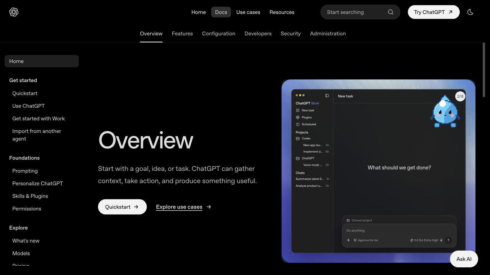
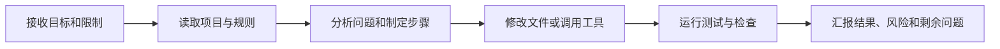

# Codex 是什么：能力、工作方式与使用边界

> 难度：基础
>
> 类型：概念与入门

## 这篇文章适合谁

如果你刚接触 Codex，还不确定它和普通 AI 对话有什么区别，可以从这里开始。

这篇文章不讲安装和复杂配置，只回答几个最先遇到的问题：Codex 是什么，它怎样完成任务，哪些事情适合交给它，以及为什么它修改了文件之后仍然需要人工检查。

## 先说结论

Codex 是面向软件开发任务的 AI 编程助手。它可以在你提供的项目和权限范围内读取文件、理解代码、修改内容、执行命令，并通过测试或其他检查验证结果。

把它理解成“可以在项目里动手的编程助手”，比把它理解成“更会写代码的聊天机器人”准确。

两者最大的差别不在于回答得多聪明，而在于 Codex 可以围绕一个真实项目采取行动。行动也意味着风险，所以工作目录、沙箱、审批和版本控制都很重要。



> 图片来源：[OpenAI Codex 官方文档](https://developers.openai.com/codex/)。

## Codex 是怎样完成任务的

一次比较完整的 Codex 任务通常会经过下面这些步骤。



这张图是工作方式示意，不代表每个任务都必须严格走完六步。一个只读问题可能在分析后直接回答；一个功能开发任务则可能多次往返于修改和测试之间。

Codex 会同时处理对话和项目材料，包括项目文件、命令行输出、测试结果以及你为仓库设置的规则。

### 1. 接收目标和限制

Codex 首先需要知道你想完成什么。只有一句“帮我优化一下”通常不够，因为“优化”可能指性能、结构、文案或界面。

更清楚的任务会说明目标、允许修改的范围，以及怎样才算完成。例如：只修改登录页面，不改后端接口；完成后运行现有测试，并说明还有哪些情况没有覆盖。

### 2. 读取项目和规则

Codex 可以读取你允许它访问的文件夹。它通常会先查看 README、依赖文件、目录结构、相关源码和测试，判断项目使用什么技术，以及应该从哪里动手。

仓库中的 `AGENTS.md` 也可以保存长期规则，比如常用命令、代码风格、禁止修改的目录和验证要求。

### 3. 修改文件或调用工具

确认方向后，Codex 可以编辑文件、执行终端命令、搜索代码，或者调用已经配置的工具。它能做多少，取决于当前使用入口和权限设置。

本地环境中的 Codex 通常在受控工作区里操作。访问工作区之外的目录、使用网络或执行风险较高的动作时，可能需要额外审批。

### 4. 验证结果

文件发生变化并不代表任务已经完成。可靠的结果还需要测试、构建、类型检查、页面检查或其他与项目匹配的验证方式。

如果项目没有测试，也要让 Codex说明它实际检查了什么。没有验证条件时，结论应当写成“已完成修改，但尚未经过完整验证”，而不是直接说问题已经解决。

## Codex 和普通 AI 对话有什么不同

| 对比项 | 普通 AI 对话 | Codex 任务 |
|---|---|---|
| 主要上下文 | 当前对话和你上传的内容 | 对话、项目文件、仓库规则和工具结果 |
| 常见输出 | 解释、建议、代码片段 | 文件修改、命令结果、测试结果和说明 |
| 是否能直接行动 | 通常以回答为主 | 可以在授权范围内操作项目 |
| 完成标准 | 回答是否有帮助 | 项目是否被正确修改并通过验证 |
| 需要关注的风险 | 信息是否准确 | 信息准确性、文件改动、权限和外部操作 |

这个区别也解释了为什么使用 Codex 时应该保持 Git 工作区清楚。你需要能够查看它改了哪些文件，必要时撤销修改，而不是只看最终回复写得是否顺畅。

## Codex 可以完成哪些任务

Codex 比较适合目标明确、结果可以检查的软件开发任务，例如：

- 阅读陌生项目并整理结构和运行方式。
- 实现一个范围清楚的小功能。
- 根据报错和日志查找 Bug 原因。
- 修改代码后运行测试、构建或类型检查。
- 补充测试、文档、脚本和配置。
- 阅读代码差异，检查明显的错误和风险。
- 协助完成 Git、Issue、Pull Request 等开发流程。

它也可以参与文档、研究和内容工作流，但那类任务更接近 ChatGPT Work 或文件处理场景。本知识库会把软件开发相关内容放在主线，把外部工具和非开发场景放到独立栏目。

## 哪些事情不能直接相信 Codex

Codex 能行动，并不等于它天然知道正确答案。

下面几类任务尤其需要谨慎：

- 需求本身含糊，却要求它自行决定产品逻辑。
- 没有测试和运行环境，却要求确认 Bug 已经修复。
- 直接操作生产环境、线上数据库或重要账号。
- 项目中存在密钥、客户数据或未脱敏文件。
- 大范围重构，但没有版本控制和回滚方案。
- 涉及安全、合规和业务责任的最终判断。

比较稳妥的做法是先限制范围，让 Codex说明计划，再查看差异并运行验证。权限不是开得越大越好，够当前任务使用即可。

## Codex 有哪些使用入口

OpenAI 当前提供桌面 App、CLI、IDE 扩展和云端等入口。它们面对的是不同工作习惯。


> 图片来源：[OpenAI Quickstart](https://learn.chatgpt.com/docs/quickstart)。

- 桌面 App 适合在项目、文件和多个任务之间切换，也方便查看执行过程。
- CLI 适合习惯终端、希望紧贴本地仓库工作的开发者。
- IDE 扩展适合一边阅读和编辑代码，一边让 Codex 处理当前项目。
- 云端任务适合把工作交给托管环境执行，具体能力取决于账号和环境配置。

第一次使用不需要同时掌握所有入口。先选择一个和日常工作最接近的方式，完成一次小任务，再考虑是否切换。

## 第一次可以这样使用

第一次打开项目时，我更建议先让 Codex 做只读理解，不要立刻要求它重构整个仓库。

可以从一个真实而克制的任务开始：

```text
请先阅读这个项目的 README、依赖文件和主要目录，不要修改任何文件。

告诉我：
1. 这个项目解决什么问题；
2. 使用了哪些主要技术；
3. 本地应该怎样启动；
4. 如果我要修改首页，最可能涉及哪些文件；
5. 目前还有哪些信息无法确认。
```

这不是所谓的万能提示词。它只是把第一次进入陌生项目时真正需要弄清楚的事情说完整了。

拿到回答后，可以自己打开 README 和依赖文件核对。确认 Codex 对项目的理解基本正确，再交给它一个小修改，例如改一段文字、修复一个可以复现的样式问题，或者补充一条测试。

## 新手常见误解

### Codex 会自动知道整个项目

不会。它需要读取文件，也会受到上下文、权限和时间限制。大型项目更应该告诉它先看哪些模块。

### Codex 修改了文件，任务就完成了

不一定。至少要查看差异，并运行与任务相关的测试或检查。

### 给足权限，Codex 就会做得更好

权限只决定它能访问和执行什么，不保证判断更正确。过大的权限反而会扩大误操作影响。

### 新手应该先安装很多插件

没有必要。先学会描述任务、检查修改和验证结果。等你发现某个流程反复出现，再学习 Skills、MCP 和插件会更自然。

## 下一步学习

接下来可以进入 [安装与首次使用](../01-安装与首次使用/)，选择适合自己的入口，并完成第一个可验证的小任务。

如果已经安装好 Codex，可以继续阅读本目录后续文章，先弄清楚自己适合怎样使用，再进入项目实战。

## 参考资料

- [Codex Manual](https://developers.openai.com/codex/codex-manual.md)
- [OpenAI Quickstart](https://learn.chatgpt.com/docs/quickstart)
- [OpenAI Prompting](https://learn.chatgpt.com/docs/prompting)
- [Agent approvals and security](https://learn.chatgpt.com/docs/agent-approvals-security)
- [Sandbox](https://learn.chatgpt.com/docs/sandboxing)

Codex 更新较快，界面、入口和权限设置可能随版本调整。
