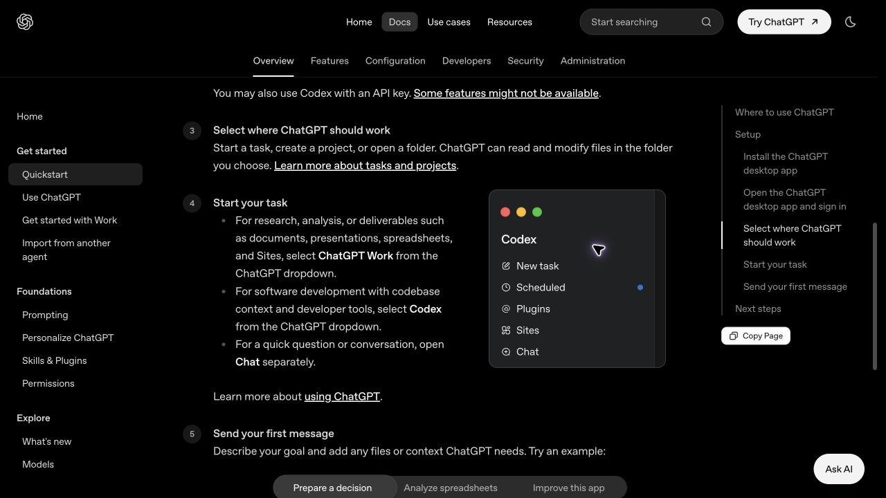

# Codex 适合哪些人：判断标准、典型场景与学习起点

> 难度：基础
>
> 类型：概念与选择
>
> 验证日期：2026-07-12

## 这篇文章适合谁

这篇文章写给正在判断“我有没有必要学 Codex”的读者。

你可能是一名开发者，也可能只写过一点代码；还可能平时主要维护网站、GitHub 仓库、Markdown 文档或自动化脚本。职业名称不能直接决定你是否适合使用 Codex，日常任务的形态更有参考价值。

## 先说结论

Codex 最适合这类任务：有明确的项目或文件作为上下文，需要实际修改或执行操作，并且结果能够被检查。

判断自己是否适合使用 Codex，可以先看三个条件：

1. 任务是否依赖代码、文件、配置或仓库。
2. 是否希望 AI 采取行动，而不只是给出建议。
3. 是否有办法检查修改是否正确。

三个条件都满足，Codex 通常是合适的工具。只需要聊天、查一个概念，或者完成纯研究和文档交付时，Chat 或 ChatGPT Work 可能更直接。

> 图片来源：[OpenAI Quickstart](https://learn.chatgpt.com/docs/quickstart)，截图日期：2026-07-12。

OpenAI 当前在 Quickstart 中给出的分工很清楚：研究、分析以及文档、演示文稿、电子表格等交付物可以选择 ChatGPT Work；需要代码库上下文和开发工具的软件开发任务选择 Codex；快速问题或普通对话使用 Chat。

这个分法比“程序员用 Codex，其他人不用”更实用。有人虽然不是职业开发者，但每天都在维护网站、脚本和 GitHub 仓库；也有开发者只是想问一个语法问题，没有必要为此启动完整的 Codex 任务。

## 先看任务，再看身份

下面这张表可以帮助你快速判断。

| 任务特征 | 更适合的入口 | 原因 |
|---|---|---|
| 需要阅读和修改代码仓库 | Codex | 需要项目上下文、文件操作和开发工具 |
| 需要修 Bug、写测试或检查代码差异 | Codex | 结果可以通过测试、构建或 Review 验证 |
| 需要整理资料并生成报告、表格或演示文稿 | ChatGPT Work | 重点是研究、分析和交付物 |
| 只是询问一个概念或讨论想法 | Chat | 不需要访问项目或执行工具 |
| 任务既有文档又有代码 | 根据主要产物选择 | 主要交付物是代码就优先 Codex，主要交付物是报告就优先 Work |

工具选错后，任务仍可能完成，只是沟通和检查成本会更高。把主要交付物想清楚，通常就能做出选择。

## 专业开发者

专业开发者是 Codex 最直接的用户群体，因为日常工作天然具备项目、工具和验证条件。

适合交给 Codex 的任务包括：

- 阅读陌生仓库并定位功能入口。
- 实现范围清楚的小功能。
- 根据报错、日志和测试定位问题。
- 修改代码后运行测试、Lint、类型检查和构建。
- 补充测试、文档和开发脚本。
- 阅读分支差异，检查明显的错误和风险。

开发者使用 Codex 的实际收益，常常来自连续完成搜索、修改、执行和初步验证。人负责需求判断、架构选择和最终审查。

这类读者可以从 [项目理解与上下文](../03-项目理解与上下文/) 开始，再进入 [代码修改与开发实战](../04-代码修改与开发实战/)、[Git协作与代码审查](../05-Git协作与代码审查/) 和 [测试调试与质量保障](../06-测试调试与质量保障/)。

## 正在学习编程的人

编程初学者也可以使用 Codex，但要避免把“任务完成”误当成“自己已经理解”。

比较适合的用法是：

- 让 Codex 解释项目入口和文件之间的关系。
- 对照一段真实代码说明语法和运行过程。
- 完成一个很小的修改，再查看具体差异。
- 为现有函数补一条测试，并解释测试验证了什么。
- 根据报错整理排查顺序，而不是直接索要最终答案。

初学者最容易遇到的问题是，代码看起来能运行，但自己说不清它为什么这样写。遇到这种情况，应该继续追问修改原因、替代方案和验证方法，而不是马上进入下一个功能。

第一次任务可以只让 Codex 阅读项目，不修改文件。确认它对项目的解释与 README、代码和运行结果一致后，再交给它一个可以在十几分钟内核对的小改动。

## 独立开发者和个人创作者

独立开发者往往同时负责产品、设计、代码、部署和文档。Codex 适合帮助处理那些边界清楚、但会打断工作节奏的任务。

例如：

- 给现有页面增加一个表单或响应式布局。
- 修复一个已经能够复现的问题。
- 为项目补充部署说明和环境变量示例。
- 把重复的手工步骤改成脚本。
- 检查上线前的代码差异和测试结果。

它不适合替你决定产品是否值得做，也不能代替真实用户反馈。需求优先级、产品取舍和发布责任仍然在人。

这类读者可以先完成 [代码修改与开发实战](../04-代码修改与开发实战/) 中的小任务，再学习 [自动化与高级工作流](../11-自动化与高级工作流/)。

## 技术负责人和团队管理者

技术负责人不一定需要让 Codex 亲自写完每一段代码。它在团队中的价值更多体现在规则、审查和重复流程上。

适合的场景包括：

- 根据仓库规则检查 Pull Request。
- 让 Codex 汇总修改范围、测试结果和剩余风险。
- 把常用命令和验证要求写入 `AGENTS.md`。
- 把重复的代码审查、发布检查或安全检查做成 Skill。
- 为新成员整理项目结构和本地运行方式。

团队使用时还要考虑权限、凭据、审计和数据边界。个人电脑上能运行的配置，不应该未经检查直接复制到团队环境。

这类读者可以重点阅读 [配置模型与权限安全](../10-配置模型与权限安全/) 和 [自动化与高级工作流](../11-自动化与高级工作流/)。

## 不以编程为主的读者

即使不长期写业务代码，只要工作围绕可操作的数字文件展开，也可以考虑使用 Codex。

下面这些场景可以考虑 Codex：

- 维护一个使用 Markdown 的 GitHub 知识库。
- 修改静态网站、博客主题或简单前端页面。
- 批量整理文件名、文本格式或目录结构。
- 编写和维护小型自动化脚本。
- 阅读开源项目，理解安装步骤和配置文件。
- 让 Codex 检查文档链接、文件结构和发布前状态。

这类任务通常仍然涉及文件、脚本或版本控制，所以 Codex 能发挥作用。如果主要工作是搜集资料、分析一批文档并生成报告，ChatGPT Work 往往更顺手。

非开发者使用 Codex 时，建议从只读任务开始，并保持 Git 版本记录。不要在看不懂修改内容的情况下，直接执行涉及账号、网络、数据库或系统权限的操作。

可以先阅读 [核心概念与任务方法](../02-核心概念与任务方法/) 和 [官方工具与集成](../12-官方工具与集成/)，再从 [真实案例复盘](../14-真实案例复盘/) 中选择和自己工作接近的案例。

## 哪些人暂时不适合直接使用 Codex

下面这些情况不代表永远不能用，但不适合一开始就让 Codex 大范围执行任务。

### 没有明确任务，只想看看 AI 能做什么

可以先用 Chat 讨论想法，或者阅读案例。没有目标时直接开放整个项目，通常只会得到泛泛的建议或不必要的修改。

### 完全无法检查结果

如果你既不能运行项目，也无法请其他人审查，就不适合让 Codex直接修改高风险代码。可以先用它解释项目和整理问题，不要直接发布结果。

### 任务涉及生产环境和重要数据

线上数据库、支付、客户数据、服务器权限和密钥都需要更严格的审批与备份。第一次使用 Codex 不应该从这些任务开始。

### 期待一句话完成一个大型项目

复杂项目需要需求拆分、阶段验证和持续决策。Codex 可以参与这些步骤，但不会因为输入一句“帮我做一个完整平台”就自动补齐所有产品和技术判断。

## 一个简单的自测方法

下面的问题不是 OpenAI 官方评分，只是帮助你判断起点。

1. 我的工作中是否经常出现代码、配置、Markdown 或 GitHub 仓库？
2. 我是否有一些重复的文件修改、检查或脚本任务？
3. 我能否说明任务完成后应该看到什么结果？
4. 我能否查看 Git diff、运行测试，或者用其他方式核对结果？
5. 我愿意先从小任务开始，而不是立刻开放全部权限吗？
6. 出现不确定结果时，我是否愿意暂停并人工判断？

如果大部分答案是“是”，可以开始学习 Codex。如果只有两三个“是”，先选择低风险、可撤销的小任务。如果几乎都是“否”，Chat 或 ChatGPT Work 可能更符合当前需求。

## 不同读者从哪里开始

| 读者 | 推荐起点 | 第一个任务 |
|---|---|---|
| 编程初学者 | [安装与首次使用](../01-安装与首次使用/) | 只读分析一个小项目的结构和运行方式 |
| 专业开发者 | [项目理解与上下文](../03-项目理解与上下文/) | 定位一个小功能或可复现 Bug 的相关文件 |
| 独立开发者 | [代码修改与开发实战](../04-代码修改与开发实战/) | 完成一个范围清楚的页面或脚本修改 |
| 技术负责人 | [Git协作与代码审查](../05-Git协作与代码审查/) | 审查一个小型 PR，并核对测试与风险 |
| 非开发者 | [核心概念与任务方法](../02-核心概念与任务方法/) | 检查一个 Markdown 仓库的结构和失效链接 |

选择起点时，不需要追求最复杂的任务。第一次使用的目标是建立一套可靠过程：说明任务、限制范围、查看修改、验证结果。

## 下一步学习

下一篇会讨论 Codex 能做什么和不能做什么，进一步划清能力边界。

准备开始操作的读者，可以直接进入 [安装与首次使用](../01-安装与首次使用/)；已经有项目的开发者，可以进入 [项目理解与上下文](../03-项目理解与上下文/)。

## 参考资料

- [OpenAI Quickstart](https://learn.chatgpt.com/docs/quickstart)
- [Codex Manual](https://developers.openai.com/codex/codex-manual.md)
- [OpenAI Prompting](https://learn.chatgpt.com/docs/prompting)
- [Agent approvals and security](https://learn.chatgpt.com/docs/agent-approvals-security)

本文最后验证日期：2026-07-12。文中的人群分类和学习建议由本知识库根据任务特征整理，不是 OpenAI 官方用户分级。
