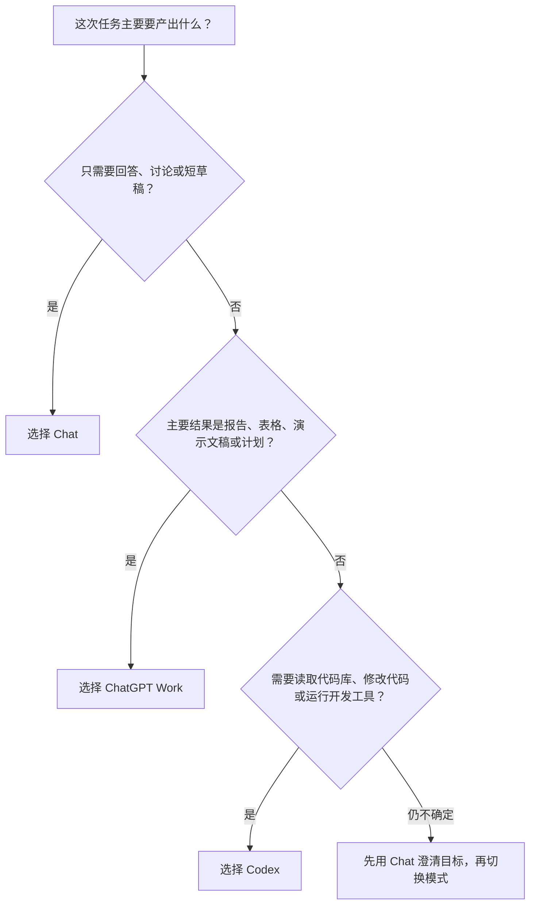

# Chat、ChatGPT Work 和 Codex 怎么选：按任务与交付物判断

> 难度：基础
>
> 类型：使用入口选择

## 这篇文章适合谁

这篇文章写给已经打开 ChatGPT 或 Codex，却不确定应该选择 Chat、ChatGPT Work 还是 Codex 的读者。

三个入口都能接收自然语言任务，也都可以使用一定的上下文和工具。真正需要判断的是：这次任务要产出什么，以及结果应该怎样检查。

## 先说结论

选择模式时，先看主要交付物。

- 想获得回答、解释、讨论或短草稿，选择 Chat。
- 想完成一份可以审阅和继续使用的报告、演示文稿、表格、计划或持续任务，选择 ChatGPT Work。
- 想修改软件项目、运行开发工具、调试代码、补测试或审查 Pull Request，选择 Codex。

不要先问“我是什么职业”，先问“这次任务最终要交付什么”。

> 图片来源：[OpenAI Quickstart](https://learn.chatgpt.com/docs/quickstart)。本图与上一篇文章共用，因为它直接展示了三种模式的官方分工。

## 三种模式的核心区别

OpenAI 当前在 Use ChatGPT 文档中给出的定位可以概括成下面这张表。

| 模式 | 主要目的 | 常见结果 | 典型任务 |
|---|---|---|---|
| Chat | 和 ChatGPT 一起思考问题 | 回答、解释、讨论、短草稿 | 问概念、搜索资料、头脑风暴、改写一段话 |
| ChatGPT Work | 定义一个结果，让 ChatGPT 完成较完整的工作 | 报告、演示文稿、电子表格、计划、可重复工作流 | 分析多份资料、制作汇报、整理决策、定期更新 |
| Codex | 完成软件和技术任务 | 代码差异、测试结果、构建结果、PR 审查 | 修 Bug、实现功能、运行测试、审查代码 |

这个表描述的是主要用途，不是绝对限制。Chat 可以读取文件，Work 也能使用工具，Codex 也能写文档。选择的关键是哪个入口更贴近主要工作过程和最终结果。

## 一个简单的选择流程

这条流程只看主要交付物。一个任务同时包含资料研究和代码修改时，可以拆成两个阶段，不需要强行从头到尾只用一个模式。

## 什么时候选择 Chat

Chat 适合快速进入一个问题，并通过对话逐步想清楚。

常见场景包括：

- 解释一个不熟悉的概念。
- 搜索并比较几个公开选项。
- 讨论文章角度、产品想法或会议议题。
- 改写一段消息、简介或说明。
- 总结一小段文本或一份文件。
- 在开始大型任务前梳理目标和约束。

Chat 的优势是轻。你不需要先建立完整任务，也不必要求它生成一个正式交付物。

例如，你只是想弄清楚“单元测试和集成测试有什么区别”，直接使用 Chat 更快。为了这个问题打开整个代码仓库并启动 Codex，没有增加多少价值。

### Chat 不太适合什么

如果任务需要处理很多来源、持续运行较长时间，或者最终要交付一份结构完整的文件，普通对话会逐渐变得难以管理。此时更适合切换到 Work。

如果任务需要真正修改项目、执行命令和验证代码，应该切换到 Codex。

## 什么时候选择 ChatGPT Work

Work 适合结果明确、步骤较多，并且最终产物需要审阅、编辑或反复使用的任务。

OpenAI 官方文档给出的典型产物包括 brief、演示文稿、分析结果、电子表格、项目计划、持续更新和工作流。

适合使用 Work 的场景有：

- 阅读多份研究资料并形成决策报告。
- 把采访笔记和调查数据整理成演示文稿。
- 比较多个方案并生成电子表格。
- 根据文件和插件中的信息更新项目周报。
- 制作活动计划、预算和邀请页面。
- 建立需要定期执行或更新的工作任务。

Work 可以使用文件、插件和经过批准的工具获取信息、生成交付物并运行工作流。你可以查看进度、中途补充信息，并在重要操作前审批。

### Work 不太适合什么

只想问一句话时，Work 会显得过重。主要任务是修改代码、调试和测试时，Codex 的代码库上下文和开发工具更匹配。

Work 可以处理技术资料，也可以生成与技术有关的文档。但如果最终验收标准是“代码通过测试并形成可审查的修改”，应该把实现阶段交给 Codex。

## 什么时候选择 Codex

Codex 适合软件开发和技术任务，尤其是需要读取代码库、修改文件、运行命令并验证结果的工作。

常见场景包括：

- 阅读陌生项目，说明结构和启动方式。
- 实现一个范围清楚的功能。
- 根据报错和日志修复 Bug。
- 运行测试、类型检查、Lint 和构建。
- 补充测试、文档、脚本和配置。
- 阅读 Git diff 或 Pull Request，检查错误和风险。
- 处理依赖升级、重构和开发环境问题。

Codex 的最终结果通常不是一段回答，而是一组可以检查的项目变化。检查方法包括 Git diff、测试输出、构建结果、页面效果和代码审查。

### Codex 不太适合什么

如果你只需要讨论想法，没有代码、文件或技术操作，Chat 更直接。

如果主要结果是研究报告、演示文稿或电子表格，Work 的交付物工作流更合适。Codex 可以协助处理 Markdown、脚本和仓库文件，但不需要为了“显得专业”把所有任务都放进 Codex。

## 混合任务应该怎样拆分

真实工作经常跨越三个模式。可以按阶段拆开。

### 从市场研究到功能上线

1. 用 Chat 讨论要解决的问题和初步方向。
2. 用 Work 收集资料、比较方案并形成需求说明。
3. 用 Codex 在项目中实现功能、补测试并检查代码差异。
4. 回到 Work 整理发布说明、培训材料或对外汇报。

### 从知识库选题到 GitHub 发布

1. 用 Chat 讨论读者问题和文章角度。
2. 用 Work 整理官方资料、来源表和文章计划。
3. 用 Codex 创建 Markdown 文件、维护目录、检查链接并提交到 GitHub。

### 从线上报错到复盘报告

1. 用 Codex 读取日志和代码，复现并修复问题。
2. 用 Work 汇总影响范围、处理过程和改进计划。
3. 用 Chat 讨论一个具体技术概念或措辞。

拆分的好处是每个阶段都有清楚的结果。切换模式时，把上一阶段的结论、文件和未解决问题带到下一阶段。

## 常见任务应该选哪个

| 任务 | 推荐模式 | 原因 |
|---|---|---|
| “解释一下 MCP 是什么” | Chat | 主要需要概念解释 |
| “比较三款项目管理工具并给出建议” | Chat 或 Work | 简单讨论用 Chat，需要正式报告用 Work |
| “读取十份访谈记录并制作汇报” | Work | 多来源分析并生成可审阅交付物 |
| “每周整理 Slack 和 Drive 中的项目更新” | Work | 需要插件、持续执行和固定产物 |
| “帮我看懂这个 GitHub 项目的结构” | Codex | 需要代码库上下文 |
| “修复登录页面报错并补测试” | Codex | 需要修改代码和运行验证 |
| “审查当前 PR 是否有明显风险” | Codex | 需要 diff、项目规则和测试上下文 |
| “给产品名称想十个备选” | Chat | 适合快速讨论和迭代 |
| “把项目数据整理成电子表格” | Work | 最终产物是可复用表格 |
| “修改知识库目录并检查 Markdown 链接” | Codex | 需要操作仓库文件并运行检查 |

## 容易选错的几个地方

### 任务很长，所以一定要用 Work

时长不是唯一判断标准。一个持续数小时的大型代码重构仍然属于 Codex；一个十分钟完成的正式决策表也可能更适合 Work。

### 任务包含文件，所以一定要用 Codex

文件类型和最终结果更重要。分析 PDF 并生成报告通常适合 Work；修改项目中的源代码和测试适合 Codex。

### Codex 更强，所以所有任务都用 Codex

工具入口不是能力排名。Chat 更轻，Work 更适合交付物，Codex 更适合软件项目。选择贴近任务的入口，通常更省沟通成本。

### 选对模式后就不需要检查

三个模式的结果都需要检查。Chat 的事实和引用要核对，Work 生成的文件需要逐页查看，Codex 的代码需要看差异并运行测试。

## 不确定时怎么开始

不确定时可以先用 Chat，用几轮对话把目标说清楚。

可以先回答下面四个问题：

1. 最终要得到回答、文件，还是项目修改？
2. 任务主要依赖公开信息、业务资料，还是代码仓库？
3. 结果由什么方式验收？
4. 是否需要长期运行、外部工具或开发命令？

答案逐渐清楚后，再决定留在 Chat、进入 Work，还是打开 Codex。

## 下一步学习

下一篇会比较 Codex App、CLI、IDE 和 Cloud，解决“已经决定使用 Codex，但应该从哪个入口开始”的问题。

准备开始安装的读者，可以进入 [安装与首次使用](../01-安装与首次使用/)；希望进一步学习任务写法，可以进入 [核心概念与任务方法](../02-核心概念与任务方法/)。

## 参考资料

- [OpenAI Quickstart](https://learn.chatgpt.com/docs/quickstart)
- [Use ChatGPT](https://learn.chatgpt.com/docs/use-chatgpt)
- [Get started with Work](https://learn.chatgpt.com/docs/get-started-with-work)
- [Codex Manual](https://developers.openai.com/codex/codex-manual.md)
- [OpenAI Prompting](https://learn.chatgpt.com/docs/prompting)

ChatGPT 和 Codex 的界面、模式名称与可用功能可能随版本、账号和工作区设置变化。
