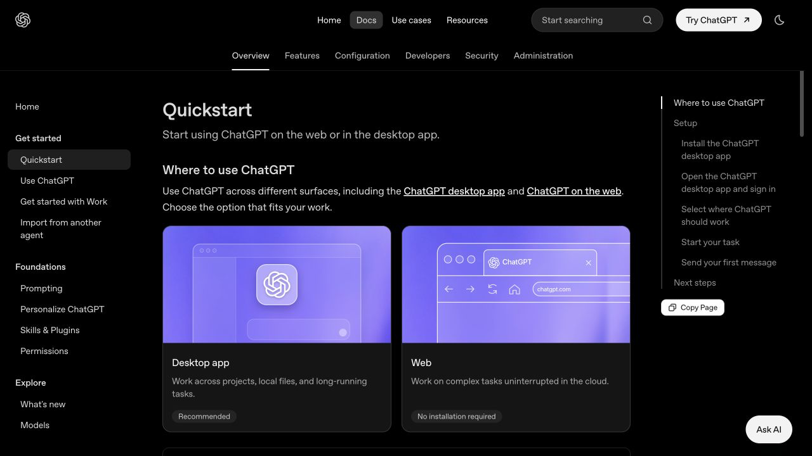
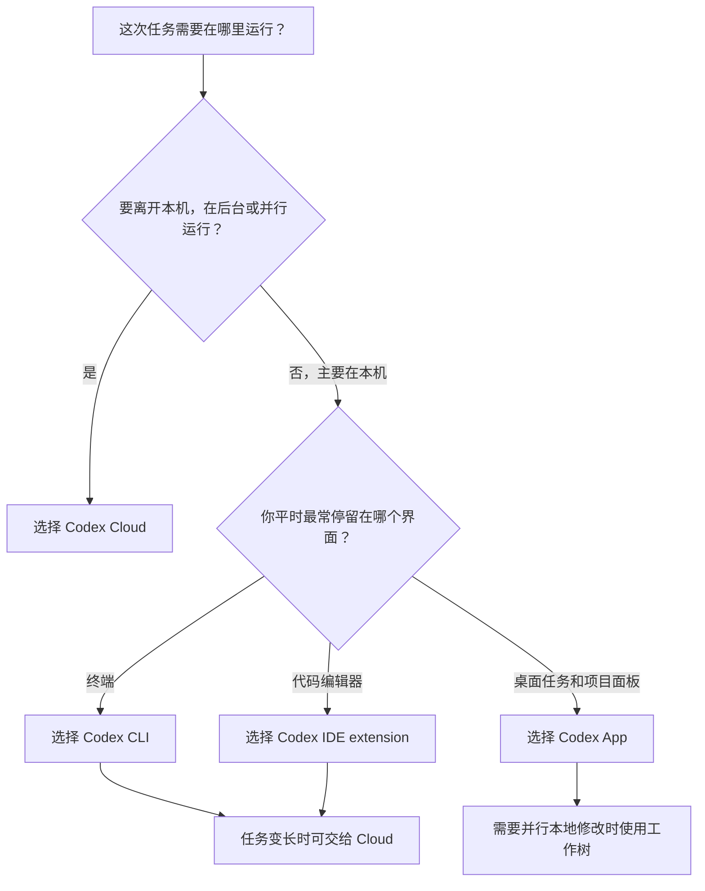
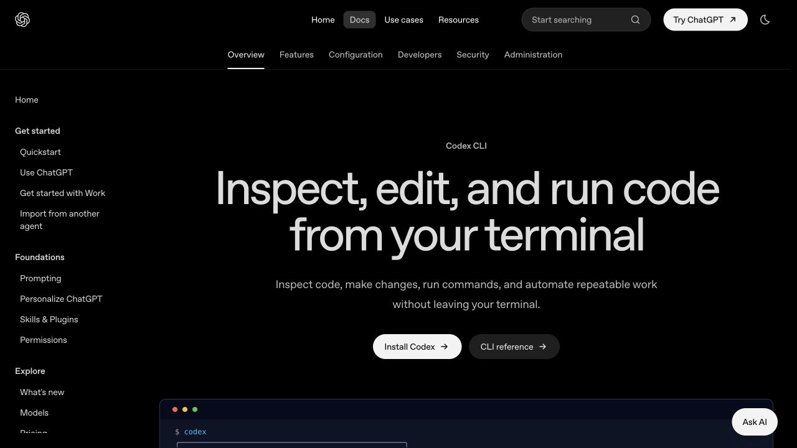

# Codex App、CLI、IDE 和 Cloud 怎么选：按工作环境与任务方式判断

> 难度：基础
>
> 类型：使用入口选择

## 这篇文章适合谁

这篇文章写给已经决定使用 Codex，却被 App、CLI、IDE extension 和 Cloud 几个入口弄糊涂的读者。

你可能会遇到这些问题：第一次应该安装哪个？本地任务和云端任务有什么区别？已经在 VS Code 里用了 Codex，还需要 App 或 CLI 吗？

## 你会学到什么

读完后，你应该能够：

- 判断一次任务适合在本机还是云端运行。
- 根据自己的主要工作界面选择 App、CLI 或 IDE。
- 知道什么时候需要切换入口，而不是一次安装所有工具。
- 理解四个入口可以组合，但不应该同时修改同一份代码。

## 先说结论

如果只记住一件事，请记住下面这组判断：

- **Codex App**：适合在桌面上管理项目、任务、工作树、代码差异和 Git 操作。
- **Codex CLI**：适合习惯终端、需要运行命令、编写脚本或接入 CI 的开发者。
- **Codex IDE extension**：适合边看代码边提问、做局部修改和原地审查差异。
- **Codex Cloud**：适合把任务交给隔离的云端环境，在后台或并行运行，稍后回来审查结果。

它们不是从弱到强的四个等级。前三个首先回答“你想在哪里和 Codex 交互”，Cloud 主要回答“任务要在哪里运行”。

## 先分清 App、CLI、IDE 和 Cloud

本文中的 App，指 ChatGPT 桌面应用里的 Codex 工作方式，不是手机 App。

App、CLI 和 IDE 都可以成为你在本机发起技术任务的入口，但界面和工作习惯不同。Cloud 则会为任务创建隔离的云端环境，检出仓库、执行配置脚本，让 Codex 在那里修改代码和运行检查。

> 图片来源：[OpenAI Quickstart](https://learn.chatgpt.com/docs/quickstart)。本图与第 01 篇共用，用来说明 Codex 可以从不同工作界面进入。

## 四种入口对照表

| 入口 | 主要工作位置 | 最适合的任务 | 你会直接看到什么 | 需要注意什么 |
|---|---|---|---|---|
| App | ChatGPT 桌面应用、本地项目或工作树 | 多任务管理、本地项目修改、查看 diff、Git 操作 | 任务列表、项目文件、工作树、差异和终端 | 桌面任务仍会占用本机环境；不要把 App 自动等同于 Cloud |
| CLI | 本地终端 | 命令密集型开发、调试、代码审查、脚本和 CI | 命令、输出、权限请求、代码差异 | 需要熟悉目录、命令行和 Git 的基本操作 |
| IDE | VS Code、Cursor、Windsurf、Xcode 或 JetBrains 等编辑器 | 阅读当前文件、局部修改、边写边问、原地审查 | 打开的文件、选中代码、Codex 对话和 diff | 长任务会占用编辑器注意力，任务变大时可交给 Cloud |
| Cloud | Codex 的隔离云端环境 | 后台任务、并行任务、远程任务、团队协作 | 任务日志、结果摘要、diff 和 Pull Request 入口 | 需要连接 GitHub 并正确配置依赖、变量、权限和网络访问 |

表中说的是最典型的工作方式，不是硬性限制。例如，CLI 和 IDE 都可以把较长任务交给 Cloud；App 也有本地终端、工作树和 Git 控件。

## 一个简单的选择流程

这条流程没有要求你永久选定一个入口。它只是在帮你决定：当前这次任务从哪里开始最顺手。

## 什么时候选择 Codex App

Codex App 适合希望把项目、任务、文件、终端和 Git 变化集中在一个桌面工作台中的读者。

比较合适的场景有：

- 同时跟进几个项目或几个持续时间较长的任务。
- 不想一直在多个终端窗口之间切换。
- 希望直接查看文件变化，并对 diff 留下修改意见。
- 需要使用工作树隔离并行修改。
- 想在界面中完成暂存、提交、推送和创建 Pull Request 等常见 Git 操作。

OpenAI 的本地环境文档说明，Codex App 可以为项目配置 setup scripts 和常用 actions。新工作树创建时可以自动安装依赖或执行构建，常用的启动、测试命令也可以放到顶部操作区。

### App 的限制

App 不是“所有任务自动放到云端”。你打开本地文件夹、在本地工作树中运行任务时，代码、依赖和开发工具仍来自自己的电脑。

如果你喜欢通过管道、脚本和大量命令组织工作，CLI 往往更直接。如果你一整天都在编辑器里逐行阅读代码，IDE extension 的上下文切换更少。

## 什么时候选择 Codex CLI

Codex CLI 适合终端优先的工作方式。它可以在当前仓库中读取文件、修改代码、运行本机已经安装的工具，并把交互式任务和现有命令行流程放在一起。

> 图片来源：[Codex CLI 官方文档](https://learn.chatgpt.com/docs/codex/cli)。页面将 CLI 定位为在终端中检查、编辑、运行代码并自动化重复工作。

CLI 比较适合：

- 在终端中阅读项目、执行测试、查看日志和处理 Git。
- 调试必须连续运行多条命令的问题。
- 使用 `codex exec` 建立非交互式流程。
- 把 Codex 放入脚本、自动化任务或 CI 管道。
- 在提交前审查未提交修改、某个提交或相对基础分支的变化。
- 从终端发起或查看 Cloud 任务。

### CLI 的限制

CLI 会把很多信息放进文本界面。刚接触命令行的读者可能不容易看出当前目录、分支、权限和命令影响范围。

这不代表新手不能使用 CLI，但开始前至少要会进入项目目录、查看 Git 状态、运行项目测试，并能读懂最常见的报错。涉及页面布局和逐行修改时，IDE 或 App 的可视化差异会更省力。

## 什么时候选择 Codex IDE extension

IDE extension 适合“代码就在眼前”的任务。

官方文档强调，它可以使用已经打开的文件、选中的代码和近期任务作为上下文。你可以在编辑器旁边提问，让 Codex 修改相关文件，再在原位置查看摘要和差异。

比较合适的场景有：

- 解释当前文件、函数或一段选中代码。
- 修复范围明确的小问题。
- 边写代码边补测试、类型或文档。
- 学习陌生项目时围绕当前符号连续提问。
- 不离开编辑器就审查和接受修改。

当前官方页面列出的入口包括 VS Code 及兼容编辑器、Xcode 和 JetBrains IDE。不同编辑器的安装方式与界面可能不同，应以对应平台的官方说明为准。

### IDE 的限制

IDE extension 最舒服的范围通常是当前正在阅读和修改的部分。需要跨很多模块调查、运行较长测试或并行比较多种方案时，把任务一直留在侧边栏里未必轻松。

官方 IDE 工作流支持把较大的任务交给 Codex Cloud。这样可以在编辑器里发起任务，继续处理手头代码，稍后回来审查云端结果。

## 什么时候选择 Codex Cloud

Codex Cloud 适合不需要持续盯着、可以交给独立环境完成的任务。

提交任务后，Codex 会在云端创建容器，检出指定仓库和分支，执行环境设置，然后在其中编辑代码、运行命令和尝试验证结果。完成后，你会看到摘要和文件差异，可以继续追问或创建 Pull Request。

比较合适的场景有：

- 一个任务需要运行较长时间，你还要继续做别的工作。
- 想同时尝试几种修复方案或并行处理多个独立任务。
- 当前不在开发电脑旁，但需要从网页或 CLI 发起、查看任务。
- 工作从 GitHub Pull Request、Issue、Linear 或 Slack 中开始。
- 团队希望通过统一环境减少“我的电脑可以运行”的差异。

### Cloud 的限制

Cloud 不是把本机环境原样搬过去。它只能使用云端环境中已经检出的仓库、安装的依赖、配置的变量和允许访问的网络。

因此，Cloud 的使用质量很依赖环境配置。项目如果缺少安装说明、锁文件、测试命令或 `AGENTS.md`，Codex 可能无法稳定复现你的本地开发流程。

还要注意权限边界。官方文档说明，Cloud setup script 阶段可以联网安装依赖；agent 阶段的互联网访问默认关闭，需要按任务配置有限或不受限访问。安装阶段需要的敏感值可以放入环境设置提供的 secrets，而不是写进仓库或任务提示中。Secrets 会在 agent 阶段开始前被移除，不能把它当成 Codex 全程可读取的环境变量。

## 本地和 Cloud 到底怎样区分

判断本地还是 Cloud，可以问自己四个问题：

1. 任务是否依赖本机尚未提交的文件、数据库或专用工具？
2. 我是否需要实时观察命令并频繁改变方向？
3. 任务运行时，我是否还要继续使用这台电脑和这个仓库？
4. 其他人是否需要在一致的环境里复现和审查结果？

依赖本机状态、需要高频互动时，先选择 App、CLI 或 IDE 的本地工作方式。任务边界清楚、环境能够复现、适合后台运行时，再选择 Cloud。

本地任务的优势是上下文贴近当前电脑，反馈快；Cloud 的优势是隔离、并行和可离开。两者解决的问题不同。

## 四种入口怎样组合使用

### IDE + Cloud

在 IDE 中选中代码、澄清问题并完成小修改。遇到跨模块调查或长时间测试时，把任务交给 Cloud，回来后在编辑器中审查结果。

### CLI + Cloud

在终端中复现问题、整理命令和验收标准，再通过 CLI 发起 Cloud 任务。完成后把结果应用到本地仓库，继续运行本机检查。

### App + 工作树

在 App 中为几个互不依赖的本地任务创建不同工作树。每个任务有独立目录和分支，完成后分别检查差异，避免多个任务直接争用同一份文件。

### App + IDE 或 CLI

可以用 App 管理任务和查看整体变化，再用 IDE 阅读代码，或用 CLI 执行特殊命令。不过，同一个工作目录不要同时交给多个 Codex 任务修改。切换入口前先看 `git status`，确认当前变化来自哪里。

## 容易选错的几个地方

### 第一次使用就把四个入口全部装好

入口越多，初学阶段越难判断任务和上下文在哪里。先选择最贴近日常工作习惯的一个本地入口，真正遇到后台或并行任务后再配置 Cloud。

### Cloud 一定比本地更强

Cloud 的主要价值是隔离和并行，不是自动提高任务质量。环境缺少依赖、权限或验收命令时，云端任务反而更容易卡住。

### CLI 只适合命令行高手

CLI 确实要求基本终端知识，但很多日常任务只需要进入正确目录、启动 `codex` 并审查命令。它是否合适，主要取决于你是否愿意在文本界面中工作。

### IDE 只能做简单补全

Codex IDE extension 不是传统的单行补全工具。它可以理解文件上下文、修改代码、审查差异，并把更大的任务交给 Cloud。只是对于命令密集型工作，CLI 的信息流通常更清楚。

### 同时打开多个入口会更快

并行任务只有在目录或环境隔离时才安全。几个入口同时修改同一个工作目录，很容易出现内容覆盖、测试结果失效和 Git 状态混乱。

## 不同读者从哪里开始

| 你的情况 | 建议的第一个入口 | 原因 |
|---|---|---|
| 第一次接触 Codex，喜欢图形界面 | App | 项目、任务、差异和 Git 状态更直观 |
| 每天主要使用 VS Code、Cursor、Xcode 或 JetBrains | IDE extension | 可以直接利用当前打开的代码上下文 |
| 熟悉终端、Git、测试和脚本 | CLI | 与已有开发流程结合最自然 |
| 需要同时处理多个仓库任务 | Cloud | 适合隔离、后台和并行运行 |
| 暂时没有稳定开发环境 | App 或 IDE 先学习，Cloud 后配置 | 先掌握任务和审查方法，再处理云端环境问题 |
| 维护 Markdown 知识库或文档仓库 | App、IDE 或 CLI | 按自己的编辑习惯选择；需要批量检查链接时 CLI 很方便 |

如果仍然拿不准，可以从 App 或 IDE 开始。完成一个小任务后，再尝试用 CLI 运行同样的检查，最后把一个边界清楚的任务交给 Cloud。亲自比较一次，比记住产品介绍更有用。

## 下一步学习

选定入口后，下一篇会整理第一次使用 Codex 前需要准备的账号、项目、Git、权限和验证条件。

准备安装的读者可以进入 [安装与首次使用](../01-安装与首次使用/)。已经有项目并想改善任务写法，可以进入 [核心概念与任务方法](../02-核心概念与任务方法/)。

## 参考资料

- [OpenAI Quickstart](https://learn.chatgpt.com/docs/quickstart)
- [ChatGPT desktop app](https://learn.chatgpt.com/docs/app)
- [Codex CLI](https://learn.chatgpt.com/docs/codex/cli)
- [Codex IDE extension](https://learn.chatgpt.com/docs/codex/ide)
- [Codex cloud](https://learn.chatgpt.com/docs/cloud)
- [Local environments](https://learn.chatgpt.com/docs/environments/local-environment)
- [Cloud environments](https://learn.chatgpt.com/docs/environments/cloud-environment)
- [Codex Manual](https://developers.openai.com/codex/codex-manual.md)

Codex 的入口、支持的编辑器、安装方式和账号可用功能可能随版本、地区与工作区设置变化。
