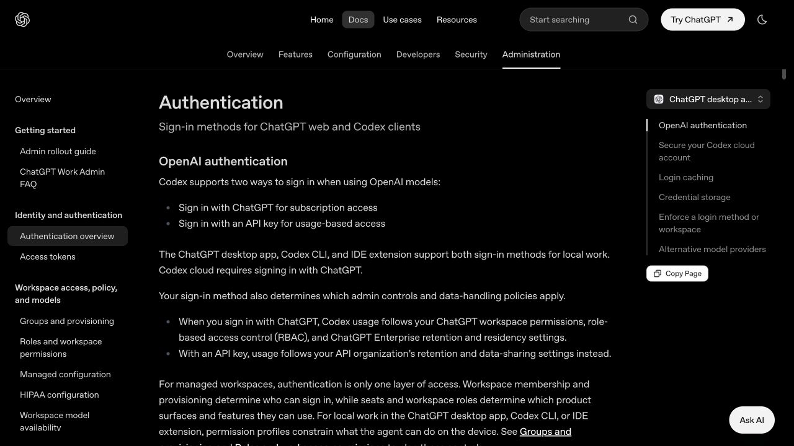
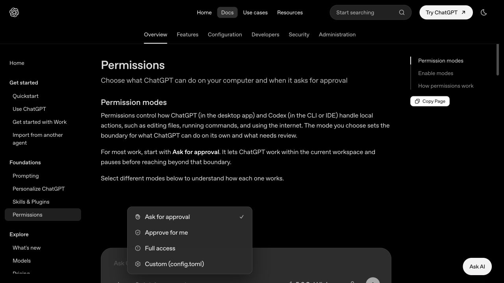

# 第一次使用 Codex 前要准备什么：账号、项目、Git、权限和验收清单

> 难度：基础
>
> 类型：首次使用准备

## 这篇文章适合谁

这篇文章写给准备第一次打开 Codex，却不知道应该先准备账号、代码仓库还是开发环境的读者。

你不需要在开始前学会所有开发工具，也不需要先安装一堆插件。真正值得提前准备的是一个边界清楚的工作目录、一种可用的登录方式、一条能够回退的路径，以及判断任务是否完成的方法。

## 你会学到什么

读完后，你应该能够：

- 选择 ChatGPT 登录或 API Key 登录。
- 为第一次任务准备一个风险较低的项目。
- 用 Git 或备份保留任务开始前的状态。
- 选择适合新手的权限模式。
- 写出包含目标、上下文、限制和验收条件的第一条任务。

## 先说结论

第一次使用 Codex 前，至少准备下面五项：

1. 一个能够登录 Codex 的账号或 API Key。
2. 一个你有权读取和修改的文件夹或代码仓库。
3. 一份任务开始前的 Git 提交或可靠备份。
4. 一个范围较小、可以验证结果的真实任务。
5. 清楚哪些文件、命令和网络操作需要你审批。

Git、测试命令和项目说明非常值得准备，但不是每位读者都必须先成为开发者。维护 Markdown 知识库、整理脚本或修改静态网页，也可以成为第一次任务。

## 一张表看懂要准备到什么程度

| 层级 | 准备内容 | 为什么 |
|---|---|---|
| 必须 | 登录方式、工作目录、明确任务、结果检查方法 | 没有这些，Codex 不知道在哪里工作，也无法判断任务是否完成 |
| 强烈建议 | Git 或备份、干净的起始状态、项目运行方法、默认权限 | 方便比较修改、排查问题和撤销错误 |
| 可以以后再配 | `AGENTS.md`、MCP、Skills、插件、Cloud 环境、自定义配置 | 这些能改善长期工作流，但不应该挡住第一次使用 |

如果你发现自己还在研究十几个插件，却没有选好第一个练习项目，准备方向已经偏了。

## 第一步：确认登录方式和账号可用性

Codex 当前支持两种 OpenAI 登录方式：

- 使用 ChatGPT 账号登录，使用订阅或工作区提供的 Codex 权益。
- 使用 OpenAI API Key 登录，按照 API 使用量计费。



> 图片来源：[OpenAI Authentication](https://learn.chatgpt.com/docs/auth)。官方页面说明，本地 App、CLI 和 IDE 支持 ChatGPT 与 API Key 两种登录方式，Codex Cloud 必须使用 ChatGPT 登录。

### ChatGPT 登录和 API Key 怎么选

| 情况 | 建议 |
|---|---|
| 已经在使用 ChatGPT，想体验 App、CLI、IDE 或 Cloud | 先使用 ChatGPT 登录 |
| 需要在可信的私有 CI 或脚本中运行 Codex CLI | 研究 API Key 或企业 Access Token |
| 只想完成第一次本地任务 | 不必为了开始而单独创建 API Key |
| 计划使用 Codex Cloud | 使用 ChatGPT 登录，并检查账号和工作区是否允许使用 Cloud |

API Key 不是免费的订阅替代品。使用 API Key 时会按照 OpenAI Platform 的 API 价格单独计费，而且部分依赖 ChatGPT 工作区或 Cloud 的功能不可用。

Codex 的套餐、额度和功能会变化。开始前查看一次 [Pricing](https://learn.chatgpt.com/docs/pricing) 和账号中的用量页面，比照着旧教程购买套餐更可靠。

### 使用 Cloud 前检查 MFA

Codex Cloud 会直接访问代码仓库，官方要求部分账号先启用多因素认证。

如果你使用邮箱和密码登录 ChatGPT，需要在访问 Cloud 前配置 MFA。使用 Google、Microsoft 或 Apple 登录时，官方不要求在 ChatGPT 账号中重复启用 MFA，但可以在对应身份提供方中设置。使用组织 SSO 时，应由组织管理员统一执行 MFA 策略。

### 不要泄露登录凭据

API Key、Access Token 和登录缓存都应该按密码处理。

官方认证文档说明，Codex 可能把本地登录信息存放在操作系统凭据存储中，也可能存放在 `~/.codex/auth.json`。不要把这个文件提交到 Git、粘贴到 Issue、发进聊天记录或放入教程截图。

## 第二步：先选一个入口，不要全部安装

上一篇已经比较了 [App、CLI、IDE 和 Cloud 的选择](./05-App-CLI-IDE和Cloud怎么选.md)。第一次使用时，只选一个最贴近日常习惯的入口即可。

- 喜欢图形界面和任务面板，可以从 App 开始。
- 长时间待在 VS Code、Cursor、Xcode 或 JetBrains，可以从 IDE extension 开始。
- 熟悉终端、Git 和命令行，可以从 CLI 开始。
- 已经有 GitHub 仓库和可复现环境，并且需要后台任务，再考虑 Cloud。

还要确认基础环境是否满足所选入口：操作系统受支持、你有软件安装权限、项目需要的 Git 和语言运行时可以正常使用。这里不要求提前安装项目用不到的工具。

## 第三步：准备一个适合第一次使用的项目

第一个项目不应该是公司生产系统，也不适合选一个你完全无法运行的大型仓库。

比较合适的练习项目有四个特点：

- **范围小**：十几分钟到一小时可以检查结果。
- **内容真实**：确实有一个需要完成的问题，不是为了测试而随便生成代码。
- **可以回退**：修改前有 Git 提交、分支或完整备份。
- **容易验证**：能通过测试、页面效果、命令输出或链接检查判断结果。

### 开发者可以选择

- 修复一个能够稳定复现的小 Bug。
- 为现有函数补一组测试。
- 修改一个范围明确的页面样式。
- 更新一个已经过时的配置或依赖说明。
- 阅读一个小仓库并补充启动文档。

### 非开发者可以选择

- 修复 Markdown 文档中的失效链接。
- 统一一批文件的标题或目录格式。
- 给静态网站补充一段已有内容。
- 整理一个不包含敏感信息的 CSV 或文本文件。
- 为知识库新增一篇结构明确的文章，并更新目录。

第一次任务最好来自你真正关心的工作。这样你知道什么结果算对，也更愿意认真审查修改。

## 第四步：用 Git 或备份保留起始状态

Codex 会修改真实文件。开始前留下可恢复的状态，不是多余流程。

如果项目已经使用 Git，可以先运行：

```bash
git status
git branch --show-current
git log -1 --oneline
```

你需要确认三件事：

1. 当前所在目录和分支是否正确。
2. 工作区中是否已经有尚未提交的修改。
3. 最近一次提交是否能够作为回退点。

如果 `git status` 显示已有修改，不要直接让 Codex 开始，也不要为了得到“干净状态”盲目删除或覆盖文件。先弄清楚这些修改是谁做的、是否需要提交，以及它们是否会和本次任务冲突。

如果项目没有使用 Git，可以选择下面一种做法：

- 新建一个练习仓库，并在确认文件内容后创建首次提交。
- 复制一份项目目录作为只读备份。
- 对重要文档使用具备版本历史的存储工具。

不要未经检查直接执行 `git add .`。项目中可能存在 `.env`、密钥、本地数据库、大文件或不应公开的数据。

## 第五步：确认项目在 Codex 修改前能够运行

很多人第一次使用时会忽略基线状态。Codex 修改后测试报错，不一定是它造成的，项目可能在开始前就无法运行。

根据项目类型，先做一次最小检查：

| 项目类型 | 开始前可以检查什么 |
|---|---|
| Web 项目 | 能否安装依赖、启动开发服务器并打开主要页面 |
| Python 项目 | Python 版本、虚拟环境、依赖安装和现有测试 |
| Node.js 项目 | Node.js 版本、包管理器、安装命令、测试或构建命令 |
| 移动端或桌面项目 | 对应 SDK、模拟器或构建工具是否可用 |
| Markdown 知识库 | 目录链接、图片路径、Markdown 检查命令或人工检查方法 |
| 数据与脚本项目 | 输入文件是否完整、输出目录是否安全、脚本能否在样例数据上运行 |

把实际可用的启动、测试、Lint、格式化或构建命令记下来。后面可以把它们写进任务说明，成熟后再放入 `AGENTS.md`。

如果基线检查本来就失败，记录原始错误。你可以让 Codex 先调查这个错误，但不要把它和另一个功能任务混在一起。

## 第六步：准备一条能验收的任务

OpenAI 的 Codex Best Practices 建议，一条任务至少说明四类信息：

| 内容 | 要回答的问题 |
|---|---|
| Goal | 你希望修改或完成什么？ |
| Context | 哪些文件、目录、文档、错误或示例与任务有关？ |
| Constraints | 哪些行为、架构、风格和安全边界不能破坏？ |
| Done when | 满足哪些条件才算完成？ |

### 一个开发任务示例

```text
目标：修复登录表单在邮箱为空时仍然提交的问题。

上下文：表单代码在 src/pages/login，相关测试在 tests/login。

限制：不要修改后端 API，不要重做整个表单组件，保持现有中文提示风格。

完成条件：空邮箱无法提交；页面显示现有格式的错误提示；相关测试通过；说明修改了哪些文件。
```

### 一个知识库任务示例

```text
目标：修复“00-从这里开始”目录中的失效相对链接。

上下文：只检查该目录下的 Markdown 文件及其引用的图片。

限制：不要改写文章正文，不要移动或重命名现有文件。

完成条件：列出发现的失效链接；修复确认有正确目标的链接；运行链接检查；汇总修改文件。
```

任务不需要写得像合同，但一定要让你自己知道怎样检查结果。只写“帮我优化一下项目”，Codex 很难判断应该改多少、哪些内容不能碰。

## 第七步：第一次从 Ask for approval 开始

Codex 的权限由沙箱范围和审批策略共同决定。第一次使用时，OpenAI 官方建议从 `Ask for approval` 开始。



> 图片来源：[OpenAI Permissions](https://learn.chatgpt.com/docs/permission-modes)。本图与第 03 篇共用，因为它直接展示了第一次使用建议选择的权限模式。

在这个模式下，Codex 可以在当前工作区读取和编辑文件、运行常规本地命令；需要访问网络或越过工作区边界时，会先请求批准。

第一次任务不建议直接开启 Full access。Full access 可以修改电脑上的其他文件并运行联网命令，错误操作和数据泄露的影响范围更大。

看到审批请求时，不要只看按钮。至少确认：

- 它准备运行什么命令。
- 命令会读取、修改或删除哪些文件。
- 是否需要访问网络，目标网站是什么。
- 操作是否仍在本次任务范围内。

权限应该随着明确需求逐步放开，而不是为了减少弹窗一次性全部开放。

## 第八步：清理敏感信息和不相关数据

打开项目文件夹前，先检查里面是否包含不应该交给当前任务处理的数据。

常见敏感内容包括：

- `.env` 中的 Token、密码和数据库连接信息。
- 云服务密钥、SSH 私钥和签名证书。
- 客户资料、真实用户数据和内部财务文件。
- 个人聊天记录、浏览器导出数据和身份信息。
- 私有仓库地址、内部域名与尚未公开的业务资料。

项目确实需要环境变量时，可以保留不含真实值的 `.env.example`，并确认 `.gitignore` 已经排除真实配置文件。不要把密钥直接写进任务提示，让 Codex“先用一下”。

还要注意截图。首次使用、登录和报错截图很容易带出邮箱、本地用户名、私有目录、仓库名称和 Token。发布到知识库前需要逐张检查。

## 第九步：这些内容可以以后再准备

下面这些工具有价值，但第一次任务没有必要全部配置：

### AGENTS.md

适合记录仓库结构、运行命令、代码规范、禁止事项和验收要求。先完成一两个任务，知道 Codex 经常缺少什么信息后再写，内容会更真实。

### MCP

当任务需要访问仓库外部且经常变化的数据，例如 Notion、数据库或团队系统时再配置。第一次本地文件任务通常不需要 MCP。

### Skills 和插件

当一套流程已经重复出现，并且输入、步骤和输出相对稳定时，再把它整理成 Skill 或插件。不要先收集几十个工具，再寻找使用理由。

### Cloud 环境

Cloud 需要连接 GitHub，并配置依赖、环境变量、setup script 和网络权限。先在本地弄清楚项目如何运行，再配置 Cloud 会省很多排查时间。

### 自定义 config.toml

模型、推理强度、审批策略、沙箱和 MCP 都可以通过配置文件调整。第一次先使用默认配置，遇到具体问题后再修改对应项目。

## 十分钟开工前检查清单

开始第一个任务前，可以逐项确认：

- [ ] 我已经选好 App、CLI、IDE 或 Cloud 中的一个入口。
- [ ] 我知道当前使用 ChatGPT 登录还是 API Key 登录。
- [ ] 我没有把 Token、密码或 `auth.json` 放进仓库和提示中。
- [ ] 我打开的是正确项目和正确目录。
- [ ] 我知道当前 Git 分支和未提交修改情况。
- [ ] 我有一个可以恢复的 Git 提交或备份。
- [ ] 项目在修改前能够运行，或者我记录了已有错误。
- [ ] 第一次任务范围较小，并且有明确完成条件。
- [ ] 我知道要运行哪些测试、构建或人工检查。
- [ ] 权限从 Ask for approval 开始，没有直接开启 Full access。

十项里如果缺的是 MCP、插件或 Skill，可以继续开始；如果缺的是备份、工作目录和验收方法，先补齐再动手。

## 不同读者需要准备什么

### 非程序员

准备一个不含敏感信息的文档目录或知识库仓库，先学会查看文件变化。不会 Git 时至少保留完整副本，并从修链接、改目录、整理格式这类可人工检查的任务开始。

### 有开发经验的读者

准备一个能够本地运行的小项目，确认分支、依赖和测试命令。从一个可复现的问题开始，让 Codex 完成修改、测试和差异说明的完整循环。

### 准备使用 Cloud 的团队

除了 GitHub 仓库，还要准备 MFA、仓库授权、可复现的安装流程、环境变量、secrets、网络策略和团队审查规则。Cloud 环境配置应该单独测试，不要和第一个功能任务一起摸索。

## 常见准备误区

### 还没开始就先购买 API 额度

先检查 ChatGPT 账号和工作区是否已经提供 Codex 使用权限。只有确实需要 API Key 工作流时，再开通 API 计费。

### 第一次就接入所有 MCP 和插件

工具越多，权限、上下文和故障来源越多。先完成一个只依赖本地项目的任务，更容易理解 Codex 的基本工作方式。

### 直接在生产项目上试

第一次使用时，你还不熟悉权限提示、差异审查和回退流程。生产仓库、真实客户数据和自动部署环境都不适合作为练习场。

### 有 Git 就不用看 diff

Git 能帮你回退，不能替你判断修改是否合理。接受结果前仍然要看文件差异，并运行对应验证。

### 项目原本跑不起来也不记录

没有基线状态，就很难判断新的报错来自 Codex 修改还是原有环境。开始前的一次运行和一条错误记录会省下很多来回排查。

## 下一步学习

准备完成后，下一篇会用一个范围小、可回退、能验证的真实任务，完整演示怎样把目标交给 Codex、观察过程、审查修改并确认结果。

需要先安装工具的读者，可以进入 [安装与首次使用](../01-安装与首次使用/)。想进一步学习任务写法，可以进入 [核心概念与任务方法](../02-核心概念与任务方法/)。

## 参考资料

- [OpenAI Quickstart](https://learn.chatgpt.com/docs/quickstart)
- [OpenAI Authentication](https://learn.chatgpt.com/docs/auth)
- [OpenAI Pricing](https://learn.chatgpt.com/docs/pricing)
- [OpenAI Permissions](https://learn.chatgpt.com/docs/permission-modes)
- [Codex Best Practices](https://learn.chatgpt.com/guides/best-practices)
- [Codex CLI](https://learn.chatgpt.com/docs/codex/cli)
- [Cloud environments](https://learn.chatgpt.com/docs/environments/cloud-environment)
- [Codex Manual](https://developers.openai.com/codex/codex-manual.md)

Codex 的套餐、登录方式、权限界面和可用功能可能随版本、地区与工作区策略变化。
