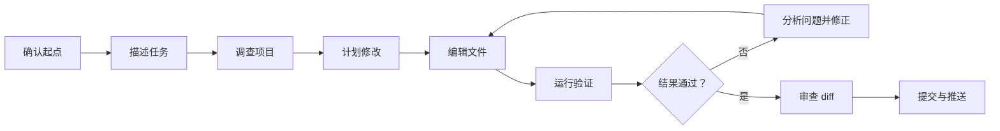
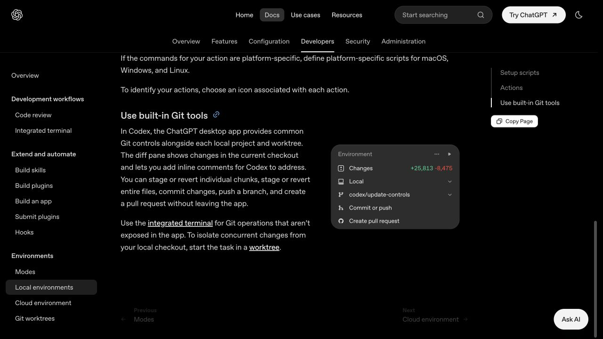

# 第 4 课：完成第一次网页修改

本课负责执行修改。你会继续使用第 3 课已经打开的同一个 `codex-first-task-test/` 目录，只改 `index.html` 的两处文字；完整验收留到第 5 课。

<a id="guide-heading-0"></a>
## 本课练习材料

使用一个简单的本地网页，练习修改标题与简介，并检查原有链接和样式是否保留。

[下载练习包（ZIP）](../练习材料/Codex首次任务-本地网页练习包.zip)

文件名：`Codex首次任务-本地网页练习包.zip`，大小：3,435 字节。包内包含未修改的 HTML/CSS、任务说明、检查清单和独立的参考差异，不需要安装 Node、数据库或插件。

解压后的目录如下：

```text
首次任务-本地网页/
├── README.md
├── 任务说明.md
├── 检查清单.md
├── 起始文件/
│   ├── index.html
│   └── styles.css
└── 参考差异/
    └── 参考差异.md
```

手机上可以阅读教程和找到下载入口；实际练习需要在能够操作项目目录、已安装并登录 Codex App 或 CLI 的电脑上完成。手机浏览器不能直接执行本课的本地 Codex 任务。

只在练习副本中操作，不要打开真实业务项目、生产网站或含凭据的私人目录。参考差异用于完成后的比较，不是起始文件。


已经完成第 3 课的读者继续使用原副本；搜索直达读者先按[第 3 课](../01-安装与首次使用/08-打开第一个本地项目.md)准备，再回来发出修改。

<a id="guide-heading-1"></a>
## 本课任务

把页面改成你的第一个 Codex 练习：

- 主标题改为“我的第一个 Codex 练习”；
- 简介改为“先看清修改，再确认页面结果。”；
- 按钮文字、`https://example.com` 链接、其他 HTML 和全部 CSS 保持不变。

如果你还没有复制练习目录，请先回到[第 3 课：打开练习目录](../01-安装与首次使用/08-打开第一个本地项目.md)。不要在这一课重新准备另一份项目。

<a id="guide-heading-2"></a>
## 发给 Codex 的提示词

把下面内容作为提示词发送给当前会话：

```text
请先阅读 index.html 和 styles.css，不要修改文件。
然后只做这两处文字修改：
1. 将主标题改为“我的第一个 Codex 练习”；
2. 将简介改为“先看清修改，再确认页面结果。”。
请保留按钮文字、https://example.com 链接、其他 HTML 内容和全部 CSS 样式。
完成后告诉我修改了哪些行，并不要运行部署或安装命令。
```

这是提示词，不是终端命令。看到 Codex 请求访问其他目录或运行安装、部署命令时，先拒绝并回到本课范围。

<a id="guide-heading-3"></a>
## 应该得到什么

任务完成后，Codex 应该说明只改了 `index.html` 中的标题和简介。文件此时已经完成修改，但还没有完成浏览器验收；不要把“模型说改好了”当成最终结果。

可以先在编辑器中确认：

```text
index.html   已修改：标题、简介
styles.css   未修改
```

这段是预期结果示例，不是需要复制到终端的命令。

<a id="guide-heading-4"></a>
## 如果修改范围不对

- 找不到 `index.html`：回到第 3 课确认当前目录，不要让 Codex 创建新文件。
- `styles.css`、按钮或链接发生变化：保留当前改动记录，重新从原始 starter 复制一份再做练习。
- Codex 要求安装依赖、构建或部署：停止该请求，本练习不需要这些动作。
- 登录或权限异常：先看[第 2 课：登录 Codex](../01-安装与首次使用/07-登录Codex.md)和[故障排查目录](../15-故障排查与常见问题/README.md#auth)。

不要对真实业务仓库执行 `git reset --hard`，也不要为了得到 diff 临时初始化或推送仓库。

<a id="guide-heading-5"></a>
## 本课完成检查

- [ ] `index.html` 已经完成两处文字修改。
- [ ] `styles.css`、按钮文字和 `https://example.com` 没有被要求修改。
- [ ] 没有安装依赖、部署或创建额外文件。
- [ ] 我知道下一课会检查文件内容和浏览器页面。

进入[第 5 课：检查结果并安全重来](../01-安装与首次使用/09-完成第一次修改并检查结果.md)。

<a id="guide-heading-6"></a>
## 来源与验证边界

安装、登录和首次任务的官方参考：[OpenAI Codex Quickstart](https://learn.chatgpt.com/docs/quickstart)、[Codex CLI](https://learn.chatgpt.com/docs/codex/cli) 和[Authentication](https://learn.chatgpt.com/docs/auth)。本练习材料和本文是本仓库维护者编写的教学内容。2026-09-20 已在 macOS 15.6、Codex CLI 0.154.0 的现有认证环境中，用本课原始提示词通过 `codex exec` 完成一次练习副本修改。独立文件比对确认只有主标题与简介改变，CSS、按钮文字和链接未变；通过本机临时 HTTP 预览检查了真实生成的页面。此记录只覆盖 CLI 非交互执行、文件比对和页面检查，不覆盖 App、交互式 CLI 界面、直接双击 HTML 或其他系统；安装与登录过程没有在本次重新测试。


<a id="原文章中的历史案例保留原文"></a>
<a id="guide-heading-7"></a>
## 选读附录：原文章中的历史案例（保留原文）

下面的内容是此前发布的知识库维护案例。来源为 codex-handbook 原文，署名沿用网站的 codx编辑组；原始发表信息保持不变。也可在[现有独立案例页](https://codexguide.io/cases/wan-cheng-di-yi-ge-zhen-shi-ren-wu)选读同一段内容。它保留原作者、环境、日期和原有锚点，供已经完成五课、需要把方法迁移到真实 Markdown 仓库的读者选读。它不是本地网页练习的完成标准，也不属于本课必做步骤。


以下内容来自本仓库此前发布版本，记录维护者当时的真实知识库维护案例。它不是上面统一练习的实测记录，也不要求首期读者操作该仓库。

<a id="guide-heading-8"></a>
### 完成第一个真实任务：从任务描述到验证提交的完整闭环

> 难度：基础
>
> 类型：首次实操

<a id="guide-heading-9"></a>
### 这篇文章适合谁

这篇文章写给已经打开 Codex，也准备好一个安全项目，却还没有独立完成过真实任务的读者。

这里的“完成”，指一个真实项目产生了可检查的变化，并且这些变化经过验证、审查和提交。只得到一段看起来合理的回答，还没有走完任务。

<a id="guide-heading-10"></a>
### 你会学到什么

本文会完整走一遍下面的过程：

1. 选择一个适合第一次完成的真实任务。
2. 检查项目和 Git 起始状态。
3. 写清目标、上下文、限制和完成条件。
4. 观察 Codex 调查、编辑和运行命令。
5. 在权限请求和中途偏离时做判断。
6. 查看文件差异并独立验证结果。
7. 提交和推送确认通过的修改。

示例使用 Markdown 知识库，读者不需要编程基础。开发者可以把同一套流程换成修 Bug、补测试或修改页面。

<a id="guide-heading-11"></a>
### 本文使用的真实任务

本文没有临时创建一个“Hello World”项目。案例来自维护这个 Codex 中文知识库时真实发生的一次任务：

> 在 `00-从这里开始` 栏目中新增第 07 篇文章《完成第一个真实任务》，更新栏目目录和更新日志，加入必要的官方配图，并在发布前检查链接、图片、敏感信息和 Git 差异。

这个任务会修改四类内容：

| 文件 | 作用 |
|---|---|
| `00-从这里开始/07-完成第一个真实任务.md` | 新增正文 |
| `00-从这里开始/README.md` | 把第 07 篇加入阅读顺序 |
| `更新日志.md` | 记录本次内容发布 |
| `图片素材/00-从这里开始/07-完成第一个真实任务/` | 存放与正文直接相关的图片 |

它的范围不大，但包含真实项目里常见的多个步骤：读现有规范、研究资料、创建文件、维护导航、处理图片、运行检查和提交 Git。

<a id="guide-heading-12"></a>
### 先理解完整闭环

一次 Codex 任务可以拆成下面八个环节：



很多第一次使用的问题，都源于流程只走到了“编辑文件”，后面的验证、diff 和提交没有完成。

<a id="guide-heading-13"></a>
### 第一步：确认任务开始前的状态

打开项目后，不要马上发出修改请求。先确认 Codex 进入了正确的文件夹。

如果项目使用 Git，可以检查：

```bash
git status --short --branch
git log -1 --oneline
```

第一条命令用来查看当前分支和未提交修改，第二条命令确认最近的回退点。

在本案例开始时，需要确认：

- 当前仓库是 `codex-handbook`。
- 当前分支是准备发布内容的分支。
- 前六篇文章已经提交。
- 工作区没有来源不明的未提交修改。
- 目标目录和图片规范文件能够正常读取。

如果工作区已经有修改，不要默认它们可以覆盖。先让 Codex 列出状态，说明哪些文件与本次任务相关，哪些是任务开始前就存在的内容。

<a id="guide-heading-14"></a>
#### 可以怎样对 Codex 说

```text
先不要修改文件。请检查当前项目、Git 分支和未提交变化，阅读仓库根目录的 AGENTS.md 以及“00-从这里开始/README.md”，然后告诉我这次任务应该修改哪些文件。
```

这一步只需要确认双方正在同一个项目、同一个范围里工作，不需要让 Codex 写一份长报告。

<a id="guide-heading-15"></a>
### 第二步：把一句话需求补成可执行任务

用户最初可能只会说：

```text
《07-完成第一个真实任务》接下来写这一篇。
```

如果同一个任务里已经有前文、仓库规则和连续的文章上下文，Codex 可以据此继续工作。但读者第一次独立使用时，不应该假设它已经知道你的全部要求。

按照上一篇介绍的 Goal、Context、Constraints 和 Done when，可以把任务补充成下面这样：

```text
请在 codex-handbook 的“00-从这里开始”栏目新增第 07 篇文章。

目标：写一篇《完成第一个真实任务》，用一个真实的 Markdown 知识库维护案例，讲清从任务描述、执行、验证到 Git 提交的完整流程。

上下文：先阅读 AGENTS.md、图片素材/README.md、栏目 README，以及第 05、06 篇文章，保持现有知识库风格。

限制：
1. 不要写成公众号文章。
2. 不要编造实操截图、测试结果或用户反馈。
3. 官方结论必须引用 OpenAI 官方资料。
4. 实操截图由维护者亲自操作后补充；没有截图时使用官方图或流程图解释。
5. 不修改与本篇无关的目录和文章。

完成条件：
1. 新建文章并更新栏目目录和更新日志。
2. 图片路径、相对链接和官方链接可以访问。
3. 检查敏感信息、Markdown 基础格式和 Git diff。
4. 完成后先汇总修改和验证结果，不要在我审查前提交。
```

这段任务说明并不追求所谓“完美提示词”。它只是把容易产生分歧的地方提前说清楚。

<a id="guide-heading-16"></a>
### 第三步：让 Codex 先调查，再开始修改

一个项目通常已经有自己的结构和规则。Codex 在修改前应该先阅读与任务直接相关的文件，而不是凭空创建一套新格式。

本案例需要调查：

- `AGENTS.md` 中的内容和图片规则。
- `00-从这里开始/README.md` 的编号和标题风格。
- 第 05、06 篇的文章结构和引用方式。
- `图片素材/README.md` 中的命名、脱敏和来源要求。
- 当前 Git 状态和最近提交。

你不需要要求 Codex 阅读整个仓库。范围越准确，调查速度越快，也越不容易把无关内容带进任务。

<a id="guide-heading-17"></a>
#### 怎样判断它是否读对了

开始写之前，Codex 至少应该说清楚：

- 准备新增什么文件。
- 需要更新哪些导航或索引。
- 本篇使用哪类图片，来源是什么。
- 哪些事实需要查官方资料。
- 打算如何验证文章和仓库变化。

如果它准备修改大量无关文件，应该在编辑前缩小范围。

<a id="guide-heading-18"></a>
### 第四步：观察过程，但不要逐行遥控

Codex 开始执行后，通常会经历搜索文件、读取规则、查资料、编辑和验证几个阶段。

你需要关注的是方向和边界：

- 它是否仍在处理同一个目标。
- 新发现是否改变了原来的计划。
- 是否要访问新的目录、网络或外部服务。
- 是否出现无法验证的事实或截图。
- 是否准备执行不可逆操作。

不需要对每一次文件读取都下指令。过度干预会打断连续调查，也会让任务记录充满重复确认。

<a id="guide-heading-19"></a>
#### 什么时候应该马上纠偏

出现下面情况时，直接告诉 Codex 停下并重新确认：

- 开始重写已经完成的前六篇文章。
- 为了“内容丰富”准备添加无关 AI 图片。
- 把尚未实操的过程写成已经成功完成。
- 使用没有来源的套餐、功能或性能结论。
- 准备删除、移动或重命名现有文件。
- 发现工作区中存在用户原有修改，却打算直接覆盖。

纠偏时说明哪里偏了、正确边界是什么，不必从头重发整个任务。

例如：

```text
先停一下。前六篇文章不要改，本次只新增第 07 篇，并更新栏目 README 和更新日志。实操图片还没有由我亲自截图，不要创建或描述不存在的实操结果。
```

<a id="guide-heading-20"></a>
### 第五步：认真处理权限请求

Codex 可能请求编辑文件、运行命令、访问网络或执行 Git 操作。第一次任务继续使用 `Ask for approval` 更容易看清每个动作的边界。


> 图片来源：[OpenAI Permissions](https://learn.chatgpt.com/docs/permission-modes)。本图与第 03、06 篇共用，用来说明首次实操中的审批边界。

看到权限请求时，可以按下面的顺序判断：

1. 这个动作是否服务于当前任务？
2. 它会影响哪个目录和哪些文件？
3. 命令是读取、创建、覆盖还是删除？
4. 网络访问的目标是否是已知官方来源？
5. 执行失败后是否容易恢复？

读取仓库文件、检查 Git 状态和访问 OpenAI 官方文档，通常容易判断。删除文件、安装系统软件、修改仓库权限、推送远端和使用 Full access，需要更谨慎。

批准命令不是在确认“Codex 一定做得对”，只是允许它执行这一个动作。结果仍然需要后续检查。

<a id="guide-heading-21"></a>
### 第六步：让 Codex 提供验证证据

编辑完成后，不要只接受“文章已经写好”这样的总结。要求它运行与完成条件对应的检查。

本案例需要验证：

| 检查项 | 证据 |
|---|---|
| 文章文件已创建 | 文件存在，标题和编号正确 |
| 栏目目录已更新 | README 中第 07 项链接指向新文章 |
| 更新日志已更新 | 当天记录包含本篇发布内容 |
| 图片有效 | 文件存在、格式与扩展名一致、正文路径正确 |
| 相对链接有效 | 链接目标文件或目录实际存在 |
| 官方链接有效 | 请求返回成功状态，并落在 OpenAI 官方域名 |
| Markdown 无明显格式问题 | `git diff --check` 没有空白错误，表格和代码块闭合 |
| 没有敏感信息 | Token、私钥和常见凭据模式扫描无结果 |
| 修改范围正确 | Git 状态中只有本篇相关文件 |

<a id="guide-heading-22"></a>
#### 一组基础 Git 检查

```bash
git status --short
git diff --stat
git diff --check
```

- `git status --short` 显示哪些文件发生变化。
- `git diff --stat` 显示修改规模。
- `git diff --check` 检查多余空格和部分基础格式问题。

这些命令不能证明文章内容一定正确，但能快速发现文件遗漏、意外修改和格式问题。

<a id="guide-heading-23"></a>
#### 验证失败时怎么办

验证失败不是任务结束，而是下一轮输入。

不要只说“再检查一下”，应该把失败证据交给 Codex：

```text
相对链接检查显示图片路径不存在：
图片素材/00-从这里开始/07-完成第一个真实任务/01-官方App内置Git工具.png

请先确认真实文件位置，只修复这个路径，然后重新运行链接和图片检查。不要改写正文其他内容。
```

错误信息、失败命令和预期结果比“好像不对”更容易让 Codex 准确修复。

<a id="guide-heading-24"></a>
### 第七步：自己审查 diff

Codex 运行完检查后，轮到你查看它到底改了什么。

OpenAI 的本地环境文档说明，ChatGPT 桌面 App 的 diff 面板可以查看当前修改、对具体行留下反馈、暂存或恢复单个区块，也可以提交、推送和创建 Pull Request。



> 图片来源：[OpenAI Local environments](https://learn.chatgpt.com/docs/environments/local-environment#use-built-in-git-tools)。页面展示了 App 中查看 Changes、分支、提交、推送和创建 Pull Request 的入口。

<a id="guide-heading-25"></a>
#### 审查新文章

重点看：

- 标题是否和目录一致。
- 内容是否真的回答了文章主题。
- 官方事实是否有来源。
- 示例是否能让读者照着操作。
- 有没有把建议写成官方硬性要求。
- 有没有编造截图、测试和用户体验。

<a id="guide-heading-26"></a>
#### 审查目录和更新日志

重点看：

- 编号是否连续。
- 链接路径和文件名是否完全一致。
- 是否误改其他文章标题。
- 更新日志是否只记录已经完成的内容。

<a id="guide-heading-27"></a>
#### 审查图片

重点看：

- 图片能否解释正文中的具体信息。
- 官方图是否标明来源页面和链接。
- 文件格式和扩展名是否一致。
- 是否出现账号、邮箱、私有路径或 Token。

如果发现问题，可以直接在 diff 中指出具体行，也可以在任务中引用文件路径和段落标题让 Codex 修正。

<a id="guide-heading-28"></a>
### 第八步：提交前再做一次独立确认

Codex 的完成说明是线索，不是最终验收结论。

在本案例中，维护者至少要亲自完成下面几项：

- 打开新文章，快速通读一次。
- 点击栏目 README 中的新链接。
- 确认两张图片能够显示。
- 查看 Git diff 中是否有无关文件。
- 核对官方来源和引用说明。
- 确认没有私密计划、聊天记录或凭据进入公开仓库。

代码项目还要增加人工页面检查、关键功能复现或测试结果复核。不要因为命令显示绿色，就跳过用户真正会看到的效果。

<a id="guide-heading-29"></a>
### 第九步：提交和推送

只有在内容和验证都通过后，才进入提交阶段。

可以让 Codex 先给出提交范围和建议的提交信息：

```text
请再次确认 Git 状态，只暂存本次第 07 篇文章、栏目 README、更新日志和对应官方图片。提交前运行 git diff --cached --check，并把暂存文件列表给我确认。
```

确认无误后再提交，例如：

```text
docs: add first real task walkthrough
```

推送完成后，还要比较本地和远端分支的最新提交。看到 GitHub 页面中出现新文章，并不一定代表所有文件都上传正确；提交哈希一致才是更直接的证据。

<a id="guide-heading-30"></a>
#### 推送后检查什么

- 本地工作区是否干净。
- 本地 `HEAD` 与远端目标分支哈希是否一致。
- GitHub 中的文章链接是否可以打开。
- 图片在 GitHub 页面中是否正常显示。
- 目录链接是否跳转到正确文章。

<a id="guide-heading-31"></a>
### 一份合格的任务结束报告

Codex 最后的报告应该短，但需要包含证据。

例如：

```text
已完成第 07 篇文章，并更新栏目 README 和更新日志。

新增：
- 00-从这里开始/07-完成第一个真实任务.md
- 图片素材/00-从这里开始/07-完成第一个真实任务/01-官方App内置Git工具.png

更新：
- 00-从这里开始/README.md
- 更新日志.md

已检查：相对链接、官方链接、图片格式、敏感信息和 Git diff。
提交推送后，本地与远端 main 提交一致。
```

“完成了”这三个字没有多少信息。文件、检查命令和远端状态才方便读者判断任务是否真的结束。

<a id="guide-heading-32"></a>
### 任务中途发现需求没说清怎么办

真实任务很少从第一句话开始就完全明确。发现缺口时，可以让 Codex 暂停编辑并列出需要决策的地方。

例如：

```text
先暂停修改。请列出目前仍然不确定的内容、每个选择会影响哪些文件，以及你的建议。等我确认后再继续。
```

如果只是局部问题，直接补充约束即可；如果目标本身发生变化，最好结束当前任务或建立新的分支，不要让一个任务不断扩张。

<a id="guide-heading-33"></a>
### 任务做坏了怎样处理

先停止继续修改，再根据 Git 状态判断影响范围。

- 只有少量错误时，在 diff 中逐行指出并让 Codex 修正。
- 某个文件整体方向错误时，确认没有用户原有修改后，再使用 App 的恢复功能或 Git 恢复该文件。
- 已经提交但还没有推送时，可以在保留历史的前提下继续提交修正。
- 已经推送并被他人使用时，不要擅自重写共享历史，优先创建修复提交或 Pull Request。

不要在不清楚后果时执行 `git reset --hard`、批量删除或覆盖目录。回退动作同样需要审查。

<a id="guide-heading-34"></a>
### 把这套流程迁移到代码任务

知识库案例和代码任务的文件不同，闭环并没有变化。

| 知识库任务 | 代码任务 |
|---|---|
| 新增文章 | 实现功能或修复 Bug |
| 阅读栏目规则 | 阅读项目架构和编码规范 |
| 检查链接和图片 | 运行测试、Lint、类型检查和构建 |
| 人工通读文章 | 手动复现功能或查看页面 |
| 审查 Markdown diff | 审查源代码和测试 diff |
| 更新目录和日志 | 更新文档、变更记录或迁移说明 |
| 推送文章提交 | 推送分支并创建 Pull Request |

第一次代码任务也应该范围小、结果可见、容易回退。修复一个能稳定复现的问题，通常比“帮我重构整个项目”更适合建立正确习惯。

<a id="guide-heading-35"></a>
### 第一次真实任务自查表

- [ ] 我确认了正确项目、目录和 Git 分支。
- [ ] 我知道任务开始前有哪些未提交修改。
- [ ] 任务包含目标、上下文、限制和完成条件。
- [ ] Codex 修改前读了相关项目规则。
- [ ] 权限请求都在本次任务范围内。
- [ ] 我在方向偏离时及时补充了约束。
- [ ] Codex 运行了与完成条件对应的验证。
- [ ] 我亲自查看了所有相关文件的 diff。
- [ ] 提交中没有无关文件、敏感信息或虚构结果。
- [ ] 推送后本地和远端提交一致。

十项都能回答清楚，这次任务才形成了真正可复用的经验。

<a id="guide-heading-36"></a>
### 下一步学习

完成第一次真实任务后，下一篇会总结 Codex 新手最常见的误区，包括任务范围过大、上下文堆得太多、盲目开放权限、只看回答不看 diff，以及把插件数量当成能力水平。

想练习不同入口的安装和首次运行，可以进入 [安装与首次使用](../01-安装与首次使用/)。需要系统学习任务拆分、计划和纠偏，可以进入 [核心概念与任务方法](../02-核心概念与任务方法/)。

<a id="guide-heading-37"></a>
<a id="guide-heading-38"></a>
### 参考资料

- [Codex Best Practices](https://learn.chatgpt.com/guides/best-practices)
- [OpenAI Permissions](https://learn.chatgpt.com/docs/permission-modes)
- [OpenAI Local environments](https://learn.chatgpt.com/docs/environments/local-environment)
- [Codex CLI](https://learn.chatgpt.com/docs/codex/cli)
- [Codex Code Review](https://learn.chatgpt.com/docs/code-review)
- [Git worktrees](https://learn.chatgpt.com/docs/environments/git-worktrees)
- [Codex Manual](https://developers.openai.com/codex/codex-manual.md)

Codex 的界面、权限名称、Git 工具和可用入口可能随版本与工作区设置变化。
