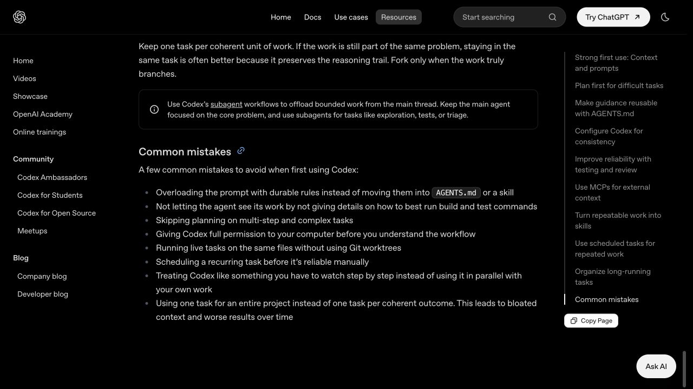
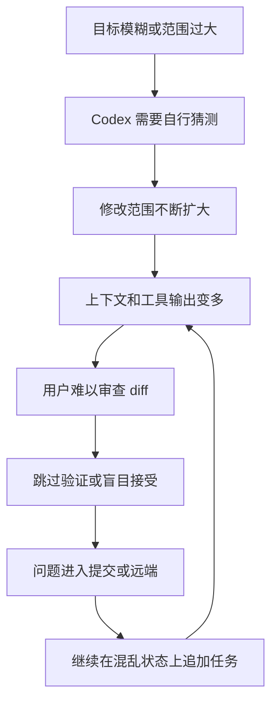

# Codex 新手常见误区：哪些做法最容易让任务失控

> 难度：基础
>
> 类型：使用误区与纠正方法

## 这篇文章适合谁

这篇文章写给已经开始使用 Codex，却经常遇到下面情况的读者：

- Codex 改了很多文件，但真正的问题没有解决。
- 提示写得越来越长，结果反而越来越不稳定。
- 任务显示完成，打开页面或运行项目后仍然有问题。
- 同一个仓库同时开几个任务，最后不知道修改来自哪里。
- 安装了很多 MCP、Skills 和插件，却没有形成稳定工作流。

这些问题不一定说明 Codex 没有能力完成任务。很多时候，真正需要调整的是任务范围、上下文、权限和验证方式。

## 先说结论

新手最容易犯的错误，可以归成五组：

1. 任务目标模糊，或者一次塞进太多工作。
2. 上下文给错位置，任务越聊越长。
3. 为了省事过早开放权限，忽略敏感数据。
4. 把 Codex 的完成说明当成验证结果，不看 Git diff。
5. 先追求插件、Cloud 和自动化数量，再寻找真实问题。

改进方法并不复杂：一个任务只对应一个清楚结果；长期规则放进 `AGENTS.md`；高风险动作保留审批；所有修改都经过验证和 diff；扩展工具只在真实流程需要时加入。

## 官方怎样提醒新手

OpenAI 的 Codex Best Practices 已经列出一组常见错误，包括：

- 把长期规则全部塞进提示词，而不是放入 `AGENTS.md` 或 Skill。
- 不告诉 Codex 怎样构建和测试，导致它无法检查自己的工作。
- 多步骤复杂任务跳过计划。
- 尚未理解工作流就开放完整电脑权限。
- 多个实时任务修改同一批文件，却不使用 Git worktree 隔离。
- 手动流程还不稳定就创建定时任务。
- 把 Codex 当成必须逐步盯着的工具。
- 用一个任务承载整个项目，造成上下文膨胀和结果变差。



> 图片来源：[Codex Best Practices](https://learn.chatgpt.com/guides/best-practices#common-mistakes)。本文以官方列表为基础，并结合前七篇中的任务、权限、Git 和验证方法进一步展开。

下面有些内容是 OpenAI 官方直接给出的建议，有些是本知识库根据这些原则做的编辑归纳。涉及产品行为和权限边界时，以文末官方资料为准。

## 误区是怎样让任务失控的

很多问题来自一连串叠在一起的小决定。



打断这条链条最便宜的位置，通常是任务开始前：把目标和完成条件说清楚，限制修改范围，并准备能够验证结果的方法。

## 一、任务设计上的误区

### 误区 1：只说“帮我优化一下”

“优化”“完善”“处理一下”听起来像目标，实际上没有告诉 Codex 哪个结果更重要。

对于“优化登录页面”，Codex 可能理解为改布局、提高性能、重构组件、补测试或调整文案。每个方向都合理，但未必是你要的。

**更好的做法：**至少写出目标、相关范围、不能破坏的内容和完成条件。

```text
目标：减少登录页面首次加载时的 JavaScript 体积。
范围：只检查登录路由和它直接引入的模块。
限制：不改变页面样式和登录 API。
完成条件：说明主要体积来源；完成范围明确的修改；构建通过；给出修改前后的构建数据。
```

清楚不等于写得长。一句“把按钮改成蓝色”已经足够明确，不需要强行补成几百字的提示。

### 误区 2：第一次就让 Codex 重构整个项目

大任务看起来能充分发挥 Codex 的能力，但它会同时放大上下文、依赖、验证和审查成本。

“重构整个项目”通常没有统一的完成标准。任务进行几小时后，用户很难判断哪些变化必要，哪些只是顺手修改。

**更好的做法：**把大目标拆成能够独立验收的结果。例如先梳理依赖关系，再迁移一个模块，补齐对应测试，最后处理剩余模块。

每个子任务都应该能单独提交或放弃。拆分的重点不在句子数量，而在于每一步都有明确边界和证据。

### 误区 3：复杂任务也要求立刻写代码

涉及多个模块、数据库迁移、权限模型或外部系统的任务，如果目标还没说清就开始编辑，后面往往需要大面积返工。

OpenAI Best Practices 建议复杂、含糊或难以描述的任务先进入计划阶段。Codex 可以先调查仓库、提出问题和列出修改顺序，再等待确认。

**更好的做法：**先要求计划，不修改文件。

```text
先调查相关代码和现有测试，不要编辑。请给出问题原因、可能受影响的模块、两种处理方案、推荐方案和验证计划。列出仍需我决定的问题。
```

计划不是每个小任务的必经仪式。修一个明确错别字不需要单独写计划；跨模块变更值得先停下来想清楚。

### 误区 4：把实现细节全部替 Codex 决定好

有些提示会精确指定函数名、变量名、文件位置和每一步命令，却没有说明业务目标。这会把用户尚未验证的技术猜测变成硬约束。

如果你已经确定实现方案，当然可以直接要求执行；如果只是怀疑某个文件有问题，应该把它写成调查线索，不要写成结论。

**更好的做法：**明确不可改变的约束，把可讨论的实现留给调查和计划。

```text
报错似乎与 retry.ts 有关，这是调查线索，不代表必须只改这个文件。请先确认根因，再给出最小修改方案。
```

## 二、上下文和任务管理上的误区

### 误区 5：上下文越多越好

一次把整个仓库、几十份文档和长篇聊天记录都塞进任务，看起来很全面，但重要信息会被大量无关内容淹没。

上下文也有成本。文件、工具结果、MCP 数据和历史对话都会占用任务可以处理的信息空间。

**更好的做法：**先提供最相关的文件、错误、示例和规范。让 Codex 根据调查结果继续读取，而不是一开始就把所有内容推过去。

可以先说：

```text
问题出现在结算页面。先阅读 checkout 路由、最近一次报错和对应测试；需要其他文件时说明原因后再继续查找。
```

### 误区 6：每次提示都重复整套长期规则

代码风格、测试命令、目录结构和禁止事项如果每次都重复，提示会越来越长，也容易出现版本不一致。

OpenAI 建议把稳定、长期生效的项目规则放进 `AGENTS.md`。重复工作形成固定方法后，可以再整理成 Skill。

**更好的做法：**

- 当前任务特有的目标和限制写在提示中。
- 仓库结构、运行命令和团队规范写进 `AGENTS.md`。
- 重复出现的完整工作流整理成 Skill。
- 只在外部实时数据确实需要时使用 MCP。

不要把临时决定写进全局规则。一次活动的发布日期不应该永久进入所有项目上下文。

### 误区 7：一个任务从项目开始聊到项目结束

同一个任务持续几周，里面混着需求讨论、Bug 修复、文档更新和新功能，早期上下文会逐渐失去价值。

官方建议一个任务对应一个连贯的工作结果。如果工作仍是同一个问题，可以留在原任务；目标真正分叉时再新建或 fork。

**更好的做法：**用“能否独立验收和提交”判断是否拆任务。

- “调查支付失败并修复根因”可以是一个任务。
- “修支付 Bug、重做结算页面、更新营销文案”应该拆开。
- 同一个 Bug 的复现、修复和测试通常不必分成三个孤立任务。

### 误区 8：Codex 每一步都必须等我指挥

新手担心失控，容易让 Codex 每读一个文件、每运行一条测试都停下来确认。任务会被切得很碎，调查思路也难以连续。

另一种极端是完全不看过程，直到任务结束才发现方向早已偏离。

**更好的做法：**让 Codex 连续完成低风险调查和验证，同时要求它在范围变化、高风险操作、关键假设不确定时暂停。

你需要看方向、边界和证据，不需要遥控每一次普通文件读取。

## 三、权限和数据安全上的误区

### 误区 9：为了少弹窗，第一次就开启 Full access

Full access 可以让 Codex 修改工作区外的文件并运行联网命令。它减少审批，也扩大了错误、数据泄露和意外操作的影响范围。

OpenAI 的权限文档建议多数工作从 `Ask for approval` 开始。权限不足时，再针对清楚的需求逐步开放。

**更好的做法：**先保持工作区边界。只有当任务确实需要访问外部目录或网络，而且你理解将执行的动作时，才批准对应请求。

权限高低不会自动提高推理质量。Full access 只解决“能不能执行”，无法保证判断正确。

### 误区 10：权限请求只看“允许”按钮

批准权限前没有查看命令、目标目录和网络地址，等于放弃了重要的安全检查。

**更好的做法：**看到请求时快速确认四件事：

1. 动作是否服务于当前任务。
2. 会读取、创建、覆盖还是删除什么。
3. 是否越过当前工作区或访问网络。
4. 失败后能否恢复。

安装系统软件、删除目录、上传文件、修改 GitHub 权限和推送远端，都应该比普通读取命令更谨慎。

### 误区 11：把 Token 和真实数据直接放进提示

为了让任务尽快跑通，有人会把 API Key、数据库密码、客户数据或私有配置粘贴给 Codex。

这会让敏感内容进入任务记录、终端输出、截图或错误日志。后面即使删除文件，也不代表其他副本已经消失。

**更好的做法：**

- 使用环境变量、凭据存储或平台提供的 secrets。
- 仓库只保留不含真实值的 `.env.example`。
- 用脱敏样例替代真实客户数据。
- 发布截图前检查邮箱、本地用户名、私有路径和 Token。
- 把 `~/.codex/auth.json` 按密码文件处理。

敏感信息不应该成为提示写得更“完整”的代价。

## 四、验证和 Git 上的误区

### 误区 12：开始前不检查 Git 和项目基线

项目原本就有未提交修改或失败测试，Codex 工作后再出现问题，很难判断是谁造成的。

**更好的做法：**任务开始前至少确认：

```bash
git status --short --branch
git log -1 --oneline
```

能够运行项目时，再记录最小构建、测试或人工检查结果。基线失败也没关系，关键是把已有问题和本次任务分开。

### 误区 13：Codex 说“完成了”，任务就完成了

完成说明只是 Codex 对执行过程的总结。测试可能没有覆盖真实问题，命令也可能没有成功运行。

**更好的做法：**完成条件必须对应证据。

| 完成条件 | 可以接受的证据 |
|---|---|
| Bug 已修复 | 原问题无法复现，并有针对性测试 |
| 页面已完成 | 页面在目标尺寸下可用，交互和控制台正常 |
| 构建正常 | 实际构建命令退出成功 |
| 文档链接有效 | 相对链接和外部链接检查通过 |
| Cloud 任务可合并 | 环境成功运行检查，diff 经过审查 |

看不到证据时，直接要求 Codex 说明哪些检查已运行、哪些无法运行以及原因。

### 误区 14：测试通过，所以不用看 diff

测试只能覆盖它实际检查的行为。代码可能顺手改了无关文件、删除注释、改变配置或引入维护成本，而测试仍然通过。

**更好的做法：**在接受结果前查看：

```bash
git status --short
git diff --stat
git diff
```

重点检查修改范围、删除内容、依赖和配置变化，以及是否出现任务没有要求的重构。

测试回答“部分行为是否仍然正确”，diff 回答“项目到底发生了什么”。两者不能互相替代。

### 误区 15：多个任务同时修改同一个工作目录

并行看起来更快，但几个任务写同一批文件时，容易互相覆盖、误读 Git 状态和让验证结果失效。

OpenAI 官方建议并行本地任务使用 Git worktree 隔离。每个任务拥有独立目录和分支，完成后再分别审查和合并。

**更好的做法：**

- 独立任务使用不同 worktree 或 Cloud 环境。
- 有先后依赖的任务按顺序执行。
- 同一工作目录只保留一个主要写入者。
- 切换 App、CLI 和 IDE 前先检查 `git status`。

多个窗口不等于安全并行，隔离才是关键。

### 误区 16：提交时把所有变化一次打包

使用 `git add .` 暂存整个仓库，可能把任务前的修改、缓存、密钥、截图和无关文件一起提交。

**更好的做法：**先查看状态，只暂存本次任务相关文件，再检查暂存区：

```bash
git diff --cached --stat
git diff --cached --check
```

提交应该对应一个能够说清楚的结果。提交信息再漂亮，也无法弥补内容范围混乱。

## 五、扩展工具和 Cloud 上的误区

### 误区 17：插件、MCP 和 Skills 装得越多，Codex 越强

扩展确实能增加工具和上下文，但每个扩展也会带来认证、权限、配置、工具选择和上下文成本。

OpenAI Best Practices 建议只在工具能够解除真实工作中的手动环节时再添加，先从一两个明确需求开始。

**更好的做法：**

- 数据在仓库外、经常变化时考虑 MCP。
- 同一套方法重复出现时考虑 Skill。
- 需要把 Skills、MCP 和工具打包分发时考虑插件。
- 第一次本地文件任务先使用 Codex 自带能力。

“先安装，再找场景”很容易把学习时间花在配置而不是解决问题上。

### 误区 18：手动任务没跑通，就先做自动化和定时任务

一个流程每次都需要大量纠偏时，定时执行只会稳定地产生不稳定结果。

官方建议先让流程手动可靠，再把重复方法整理成 Skill，最后考虑定时任务。

**更好的做法：**自动化前确认输入来源、权限、失败处理、验收标准和输出位置都已经稳定。至少连续手动成功几次，并知道失败时怎样恢复。

### 误区 19：Cloud 一定比本地更强

Cloud 的优势是隔离、并行、后台运行和团队复现。它不会自动补齐缺失的依赖、测试命令和项目文档。

项目只在某台电脑上能运行，或者依赖尚未提交的文件时，本地 App、CLI 或 IDE 反而更容易获得正确上下文。

**更好的做法：**按任务环境选择入口。需要后台和并行时用 Cloud；依赖本机状态、需要高频互动时先在本地完成。具体判断可以参考 [App、CLI、IDE 和 Cloud 怎么选](./05-App-CLI-IDE和Cloud怎么选.md)。

### 误区 20：找到一条万能提示词，以后就不用调整

提示词模板能提醒你填写目标和限制，但项目、任务风险和验收方式每次都不同。

同一句“请先思考、逐步执行、确保正确”不会自动告诉 Codex 使用哪个测试命令，也不会发现仓库中的真实规则。

**更好的做法：**保留稳定的任务骨架，把具体目标、上下文和完成条件按当前工作填写。重复规则进入 `AGENTS.md`，重复流程进入 Skill。

比起收集一百条提示词，更值得积累的是：什么任务适合拆分、什么证据可以验收、哪些错误应该写进项目规则。

### 误区 21：生成代码越多、速度越快，结果越好

Codex 可以在短时间内修改很多文件，但代码量不是价值指标。一个正确的两行修复，可能比新增几百行抽象更好。

速度也要结合审查成本。五分钟生成、两小时排错的修改，并不比四十分钟完成且容易验证的方案高效。

**更好的做法：**关注结果是否解决问题、修改是否足够小、验证是否可信、后续是否容易维护。

## 快速判断自己卡在哪个误区

| 现象 | 可能的问题 | 先做什么 |
|---|---|---|
| Codex 改了大量无关文件 | 目标或范围不清 | 停止编辑，重新限定文件和完成条件 |
| 提示越来越长 | 长期规则和任务信息混在一起 | 把稳定规则移入 `AGENTS.md` |
| 对话越长结果越差 | 一个任务承载了多个结果 | 按可独立验收的结果拆任务 |
| 测试通过但页面有问题 | 验证方式不完整 | 增加人工页面和交互检查 |
| 不知道该不该批准命令 | 权限边界没有建立 | 回到 Ask for approval，查看命令和影响范围 |
| 多个任务互相覆盖 | 没有隔离工作目录 | 使用 worktree、独立分支或 Cloud 环境 |
| MCP 经常报错但任务根本用不到 | 扩展安装过多 | 禁用与当前任务无关的工具 |
| Cloud 任务无法运行 | 环境不可复现 | 先补安装、依赖和测试说明 |
| 每次都重复纠正同一问题 | 项目规则没有沉淀 | 更新 `AGENTS.md` 或形成 Skill |
| 提交后才发现混入私密文件 | 没有审查暂存区 | 提交前检查状态、暂存 diff 和敏感信息 |

## 一套更稳的默认工作方式

不想逐条记住二十一个误区，可以先坚持下面八步：

1. 一个任务只对应一个连贯结果。
2. 写清 Goal、Context、Constraints 和 Done when。
3. 复杂任务先调查和计划，小任务直接执行。
4. 默认使用 Ask for approval，逐项理解高风险请求。
5. 开始前记录 Git 和项目基线。
6. 修改后运行与完成条件对应的验证。
7. 接受结果前查看完整 diff 和暂存区。
8. 流程稳定后再增加 AGENTS.md、Skill、MCP、插件和自动化。

这套方法不会让每个任务一次成功，但能让失败更容易发现、定位和恢复。

## 自查清单

- [ ] 任务是否只有一个清楚的主要结果？
- [ ] 是否写明了完成条件，而不是只写“优化”或“完善”？
- [ ] 长期规则是否放在合适的 `AGENTS.md` 或 Skill 中？
- [ ] 当前任务是否已经因为对话过长而需要拆分？
- [ ] 权限是否与当前任务风险相匹配？
- [ ] 提示、仓库和截图中是否包含敏感信息？
- [ ] 是否记录了任务开始前的 Git 和测试状态？
- [ ] Codex 是否运行了能够证明结果的检查？
- [ ] 是否亲自查看了 diff、实际页面或运行结果？
- [ ] MCP、插件、Cloud 和自动化是否解决了真实需求？

## 下一步学习

完成这一篇后，`00-从这里开始` 的八篇内容已经覆盖 Codex 的定位、适用人群、能力边界、模式与入口选择、首次准备、真实任务和常见误区。

接下来可以进入 [安装与首次使用](../01-安装与首次使用/)，根据自己的系统安装 App、CLI 或 IDE extension。已经完成安装的读者，可以进入 [核心概念与任务方法](../02-核心概念与任务方法/)，系统学习上下文、计划、任务拆分、权限和验证。

## 参考资料

- [Codex Best Practices](https://learn.chatgpt.com/guides/best-practices)
- [OpenAI Prompting](https://learn.chatgpt.com/docs/prompting)
- [AGENTS.md](https://learn.chatgpt.com/docs/agent-configuration/agents-md)
- [OpenAI Permissions](https://learn.chatgpt.com/docs/permission-modes)
- [Codex Code Review](https://learn.chatgpt.com/docs/code-review)
- [Git worktrees](https://learn.chatgpt.com/docs/environments/git-worktrees)
- [Model Context Protocol](https://learn.chatgpt.com/docs/extend/mcp)
- [Build skills](https://learn.chatgpt.com/docs/build-skills)
- [Build plugins](https://learn.chatgpt.com/docs/build-plugins)
- [Scheduled tasks](https://learn.chatgpt.com/docs/automations)
- [Cloud environments](https://learn.chatgpt.com/docs/environments/cloud-environment)
- [Codex Manual](https://developers.openai.com/codex/codex-manual.md)

Codex 的权限、配置、工具和任务管理方式可能随版本与工作区设置变化。
