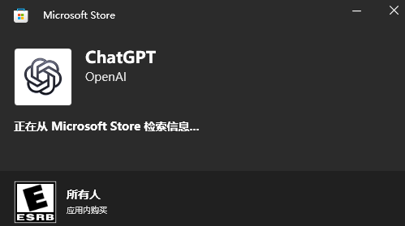
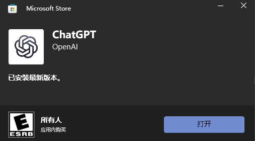
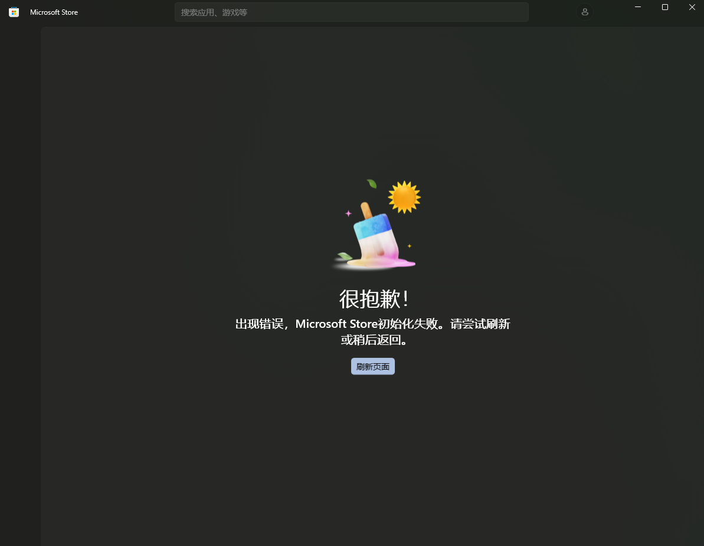
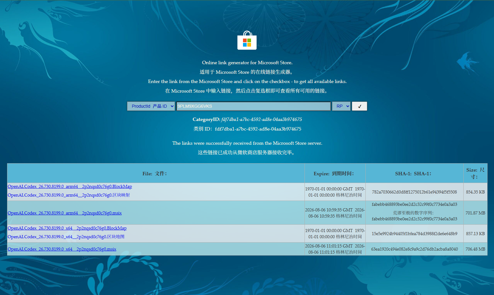
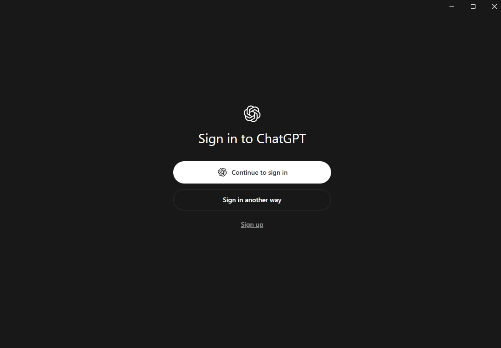

# Windows 安装 Codex App：从下载到确认可用

> 本文记录在 Windows 上安装 ChatGPT 桌面应用并进入 Codex 的过程。当前版本里，Codex 已经整合到 ChatGPT 桌面应用中，不再是一个单独下载的 Windows 安装包。

## 你能完成什么

读完并照着操作后，你应该可以：

- 从官方页面找到 Windows 安装入口；
- 避坑安装并启动 ChatGPT Windows 桌面应用；

## 安装前准备

准备一台可以'正常'联网的 Windows 电脑即可

## 第一步：打开官方 Windows 下载入口

在浏览器中打开 [ChatGPT Windows 下载页](https://chatgpt.com/zh-Hans-CN/download)。先检查地址栏，确认自己进入的是 ChatGPT 官方域名，再点击 **Windows** 下载按钮。

图 1：官方下载页同时提供 macOS 和 Windows 入口。本文使用 Windows 路线。

点击 Windows 后，页面会进入 Windows 应用的安装流程。不同时期的页面文字可能略有变化，但只要能走官方域名，就不需要从第三方软件下载安装包，避免其他不必要的版本配置问题。

## 第二步：安装 ChatGPT Windows 应用

### 推荐路线：通过 Microsoft Store 安装

官方 Windows 下载入口通常会打开 Microsoft Store。进入商店页面后，先确认应用名称是 **ChatGPT**、发布者是 **OpenAI**，再点击安装。

图 2：Microsoft Store 已自动识别到 ChatGPT 应用，要是报错见下方。

等待安装完成。页面出现“已安装最新版本”和“打开”按钮后，说明应用已经安装成功。

图 3：安装完成后可以直接点击“打开”启动应用。

## Microsoft Store 打不开怎么办

实操时可能遇到 Store 白屏、初始化失败，或者一直停在“获取”“正在安装”。这类问题通常是 Store 客户端或网络问题。

可以按下面的顺序处理：

1. 点击 Store 页面上的“刷新页面”，等待几十秒；
2. 关闭 Microsoft Store 后重新打开；
3. 换一个网络或代理节点(尝试关闭代理)，再重新进入官方下载页；
4. 键盘上同时点击“Win + I” -> 打开“设置” -> 点击“时间和语言” -> 进入“语言和区域” -> 找到“国家或地区” -> 将原来的“中国”临时调整为其他可用地区,再关闭重新打开Microsoft Store尝试搜索下载；
5. 仍然失败时，改用下面的离线安装包安装路线。

图 4：常见 Microsoft Store 初始化失败的提示。

还有一种绕过 Store 客户端的做法，是使用第三方页面解析 Microsoft Store 安装包。手动下载离线安装包（终极方案）：

1. 打开浏览器，访问 store.rg-adguard.net。
2. 左侧检索框点击下拉选择产品 ID(ProductId), 在输入框中粘贴 Codex 的产品 ID：9PLM9XGG6VKS，,然后点击搜索。
3. 页面会显示几个下载链接，找到后缀为 .msix 且文件名包含 x64的那一个（大多数 Windows 选x64,除非你是arm架构）。
4. 点击下载，如果浏览器提示不安全，选择“保留”即可。
5. 下载完成后双击文件，按提示完成安装。
这样就成功啦

## 第三步：首次启动应用

安装完成后，双击运行进入登录界面

## 下一步

- [登录 Codex](./07-登录Codex.md)
- [打开第一个本地项目](./08-打开第一个本地项目.md)
