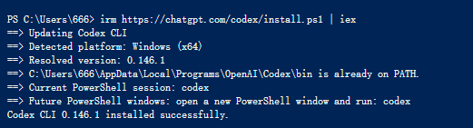
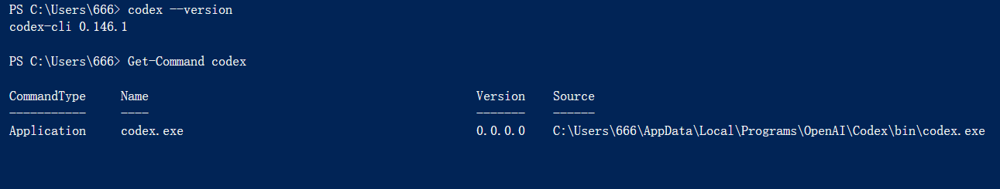
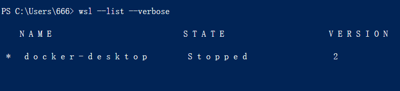

# Windows 和 WSL 安装 Codex CLI

Windows 上有两种安装方式：直接使用 Windows，或在 WSL（Windows Subsystem for Linux）中使用。

- 项目和工具主要在 `C:\`、`D:\`，平时使用 PowerShell：选 **Windows 原生**。
- 项目依赖 Linux 命令，或你一直在 Ubuntu/WSL 中开发：选 **WSL**。

两套环境彼此独立。在哪套环境里安装，就在哪套环境里运行 `codex`。

## Windows 原生安装

### 1. 打开 PowerShell

请使用 Windows Terminal 或 PowerShell，不要使用 CMD。提示符通常以 `PS` 开头：

```text
PS C:\Users\你的用户名>
```

### 2. 安装 Codex

执行官方安装命令：

```powershell
irm https://chatgpt.com/codex/install.ps1 | iex
```

这条命令会下载并执行官方安装脚本。如果是公司电脑，或你对远程脚本比较敏感，请先打开[官方文档](https://developers.openai.com/codex/cli/)查看安装说明，再决定是否执行。

也可以使用 npm 安装。电脑需要先安装 [Node.js LTS](https://nodejs.org/)，安装后重新打开终端：

```powershell
npm install --global @openai/codex
```

两种方式选一种，不要重复安装。



图一：Windows PowerShell 执行官方安装命令并显示安装成功
### 3. 验证安装

```powershell
codex --version
Get-Command codex
```

能看到版本号，就说明安装成功。



图二：使用 `codex --version` 和 `Get-Command codex` 验证命令可用

## WSL 安装

### 1. 安装 WSL

如果还没有 WSL，请用**管理员身份**打开 PowerShell：

```powershell
wsl --install
```

按提示重启，然后打开 Ubuntu，创建 Linux 用户名和密码。检查 WSL 版本：

```powershell
wsl --list --verbose
```

`VERSION` 一栏应为 `2`。



图三：使用 `wsl --list --verbose` 检查 WSL 版本

### 2. 在 Ubuntu 中安装 Codex

打开 Ubuntu，执行：

```bash
curl -fsSL https://chatgpt.com/codex/install.sh | sh
```

如果提示找不到 `curl`，先安装它：

```bash
sudo apt update && sudo apt install curl
```

这条命令会下载并执行官方安装脚本。如果你对远程脚本比较敏感，请先查看[官方文档](https://developers.openai.com/codex/cli/)中的安装说明。

如果已经在 WSL 中安装 Node.js，也可以改用 npm：

```bash
npm install --global @openai/codex
```

验证安装：

```bash
codex --version
command -v codex
```

## 第一次启动和登录

进入一个项目目录后运行 Codex。

Windows PowerShell：

```powershell
Set-Location D:\path\to\your-project
codex
```

WSL：

```bash
cd ~/projects/your-project
codex
```

如果项目位于 Windows 的 `D:\work\demo`，在 WSL 中对应路径是 `/mnt/d/work/demo`。需要频繁编译的 Linux 项目通常放在 `~/projects` 下更合适。

第一次启动时，点击 **Continue to sign in**，然后按提示在浏览器中完成 ChatGPT 授权。也可以主动运行：

```text
codex login
```

如果当前版本支持设备码登录，在没有图形界面的环境中可使用：

```text
codex login --device-auth
```


## 安装后检查

在项目目录中运行：

```text
codex
```

然后发送一条只读指令，确认 Codex 能识别项目：

```text
请阅读这个项目的目录结构和 README，不要修改文件。告诉我项目用途、主要技术，以及如何安装依赖和运行测试。
```

能正常回答即可。

## 常见问题

### 找不到 `codex` 命令

关闭当前终端，重新打开后再试：

```text
codex --version
```

Windows 检查：

```powershell
Get-Command codex -All
```

WSL 检查：

```bash
which -a codex
```

### `irm` 不是内部或外部命令

可能是在 CMD 中执行了 PowerShell 命令。打开 PowerShell，再重新执行安装命令试试。

### 安装或登录超时

先确认浏览器能打开 ChatGPT 和 OpenAI 页面，再检查代理、防火墙或公司网络。网络未连通时，重复安装通常没有用。

## 参考资料

- [OpenAI Codex CLI 官方文档](https://developers.openai.com/codex/cli/)
- [Microsoft WSL 安装指南](https://learn.microsoft.com/windows/wsl/install)
