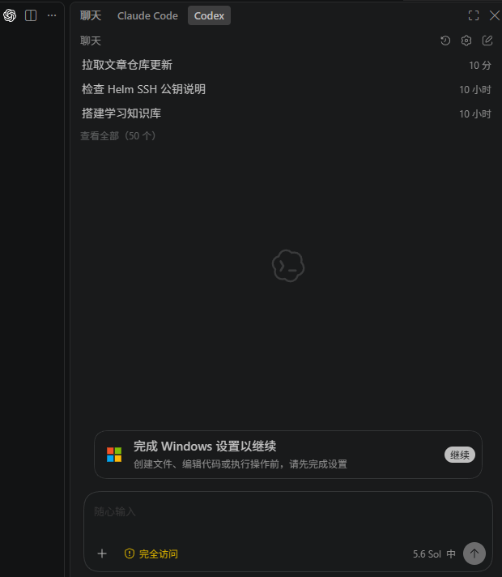
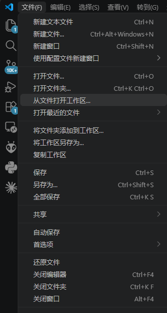
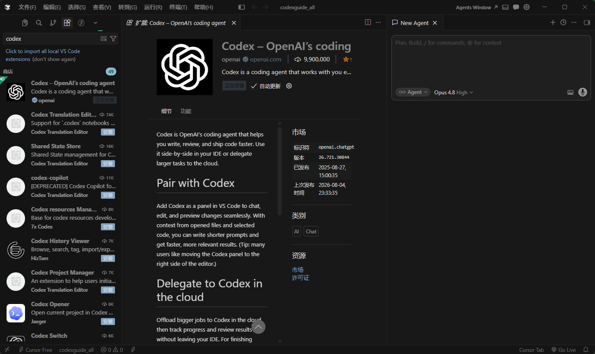
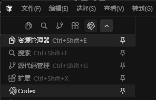
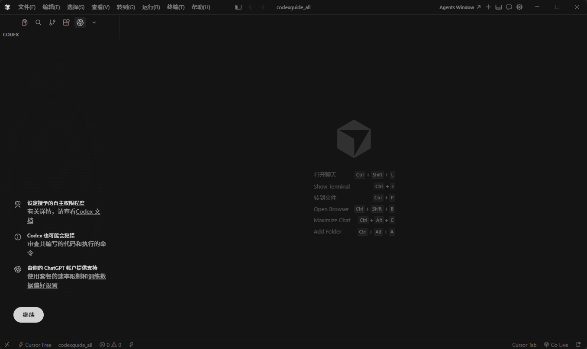
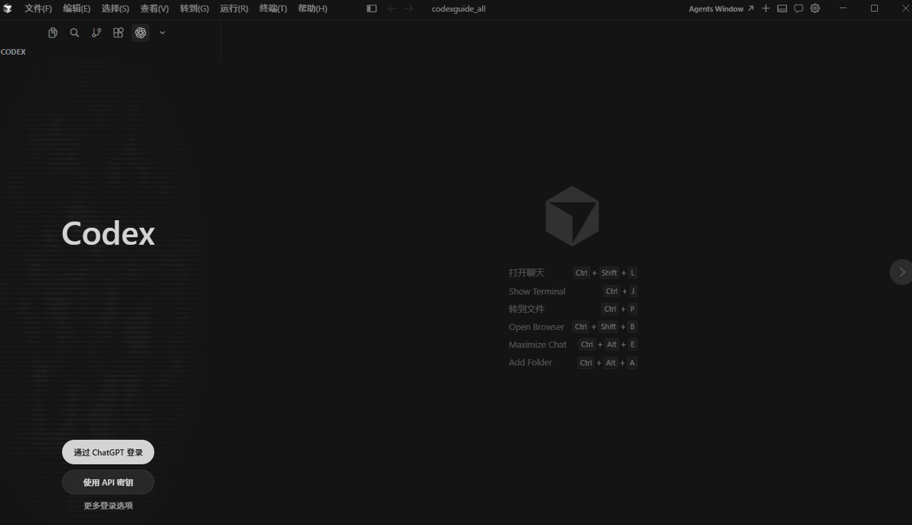

# VS Code 和兼容编辑器安装 Codex

> 已完成基础安装与首次登录步骤，界面名称可能会随编辑器版本更新

Codex 可以作为编辑器扩展使用。本文先介绍 VS Code 及兼容编辑器中的安装和登录，再补充 Cursor 的操作路径。不同版本的按钮位置可能略有差异，整体流程都是找到扩展、完成安装、打开 Codex 侧栏、登录账号，然后在项目文件中开始使用。

## 在 VS Code 中安装

打开 VS Code 的扩展市场，搜索 Codex，确认扩展来自官方发布者后再点击安装。建议不要只根据图标或名称判断，安装前先核对发布者信息，避免误装相似扩展。

安装完成后，侧栏会出现 Codex 的入口。点击入口即可打开 Codex 侧栏；首次打开通常会先要求登录。

如果侧栏没有出现登录入口，通常与网络连接有关。先确认当前网络可以正常访问登录页面，必要时更换网络节点，再重新打开侧栏或重启编辑器。扩展安装成功并不代表登录服务一定可达，这两件事需要分别排查。

网络正常时，会看到登录界面，如下图所示。

点击“通过 ChatGPT 登录”后，浏览器会打开网页端登录页面。输入账号和密码完成登录，并按页面提示授权编辑器访问 Codex。登录成功后回到 VS Code，侧栏会自动刷新为已登录状态。

如果浏览器没有自动切回编辑器，可以手动返回 VS Code，再观察侧栏状态。首次登录时，浏览器和编辑器都保持打开，回调流程通常更顺利。

按照引导提示点击“下一步”即可完成首次设置。完成后就可以在当前编辑器中使用 Codex 了。

## 打开项目并提供上下文

登录后，先在 VS Code 中打开一个项目文件夹，而不是只打开单个文件。这样 Codex 才能根据项目目录读取必要的文件上下文。使用前仍要注意文件权限和敏感信息，不要把密钥、令牌等内容主动加入上下文。

可以从左上角的文件菜单打开项目中的文件。

打开文件后，在 Codex 侧栏中选择当前文件或添加需要参考的文件，再描述要完成的任务。先用一个范围明确的小任务验证扩展是否正常工作，例如让 Codex 解释当前函数或提出一处局部修改；确认响应正常后，再处理更大的改动。

## 在 Cursor 中安装

Cursor 基于 VS Code 的编辑器框架，安装 Codex 的思路与 VS Code 基本一致，但扩展市场的入口会因版本和布局不同而变化。它可能位于左侧边栏，也可能位于左侧上方的活动栏，下面截图展示的是后一种位置。

打开扩展市场后搜索 Codex，点击安装。安装完成后，如果侧栏或活动栏没有立即显示 Codex，可以先切换到其他面板再切回，或重启 Cursor，让扩展重新加载。

点击“通过 ChatGPT 登录”，按浏览器页面完成登录，再回到 Cursor。登录方式与 VS Code 相同，使用哪个编辑器并不会改变 ChatGPT 账号本身。

## 常见问题

- **安装后找不到入口。** 先确认扩展确实安装完成，再检查活动栏是否被隐藏；重启编辑器通常可以触发重新加载。
- **没有显示登录页面。** 优先检查网络连接和当前节点。登录页面无法访问时，反复点击登录不会解决问题。
- **浏览器登录后编辑器仍未登录。** 回到原先打开扩展的编辑器窗口，等待几秒后重新打开 Codex 侧栏；必要时重启编辑器。
- **Codex 看不到项目文件。** 确认打开的是项目文件夹，并在请求中明确添加需要参考的文件或当前文件上下文。

## 配图对应关系

- `image-7.png`、`image-8.png` 展示官方扩展入口和扩展详情页。
- `image-9.png`、`image-10.png`、`image-11.png`、`image-12.png` 展示 Codex 侧栏、登录和首次设置。
- `image-13.png`、`image-14.png` 展示打开项目、文件和上下文的操作。
- `image-20.png`、`image-16.png`、`image-17.png`、`image-19.png` 展示 Cursor 的扩展入口、安装和登录。
