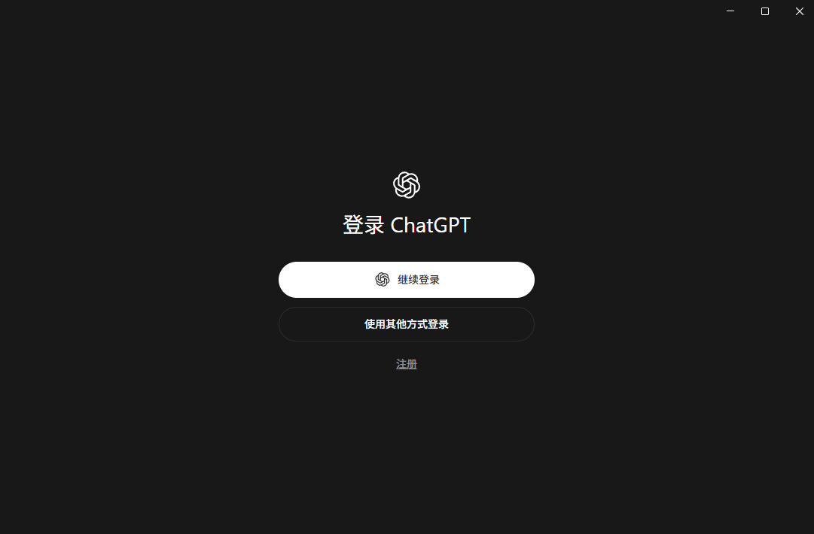
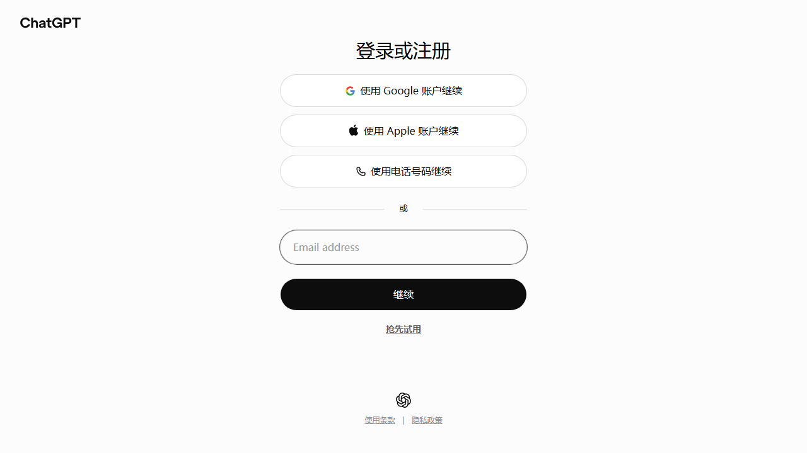
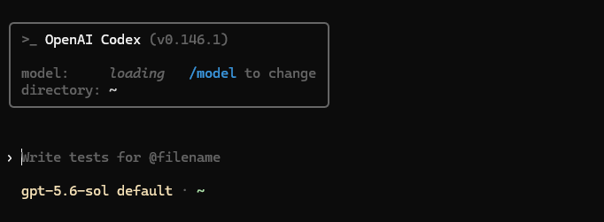
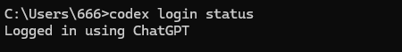
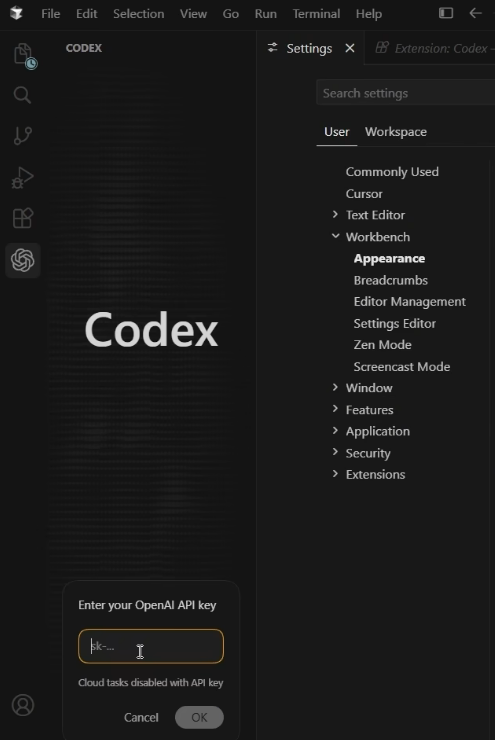
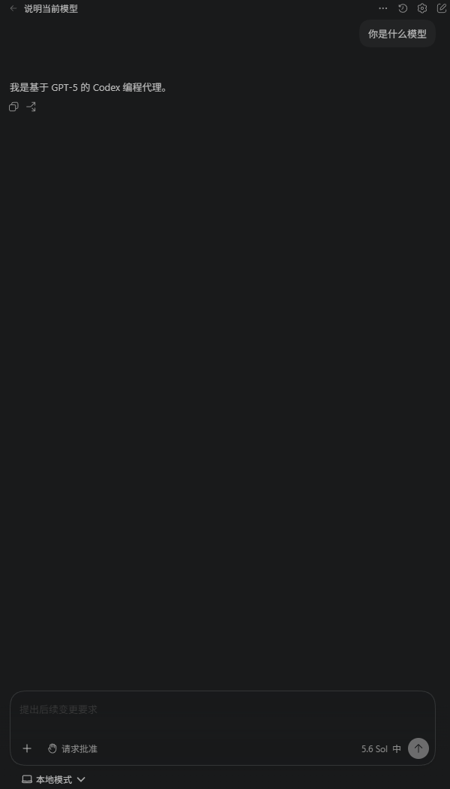

# 登录 Codex

> 验证环境：Codex CLI 0.146.1
>
> 最后验证：2026-08-12

安装好 Codex App、CLI 或编辑器扩展后，下一步就是登录。三种入口的操作略有不同，都支持 ChatGPT 账号；本地使用也能改用 API Key。下面按 App、CLI 和 IDE 分别说明。

## 先选登录方式

第一次使用时，直接选择 ChatGPT 登录就够了。客户端会打开浏览器完成授权，再返回 App、CLI 或 IDE。只有按 API 调用量计费，或需要在脚本、自动化环境中运行时，才需要考虑 API Key。Codex Cloud 只能使用 ChatGPT 登录，API Key 不能替代它。

开始前只需准备一个可用账号。操作过程中不要把邮箱、验证码、API Key 或 `auth.json` 放进截图、仓库和任务提示。

## ChatGPT 登录和 API Key 怎么选

OpenAI 的 Authentication 文档列出了两种本地登录方式。ChatGPT 登录使用订阅或工作区权益，API Key 按 API 用量计费。ChatGPT 桌面应用、Codex CLI 和 IDE 扩展都支持这两种方式。


图 1：官方 Authentication 页面。

| 你的情况 | 建议 |
| --- | --- |
| 第一次使用 Codex，已经有 ChatGPT 账号 | 先用 ChatGPT 登录 |
| 想使用 Codex Cloud | 用 ChatGPT 登录，并确认账号或工作区已开通 Cloud |
| 在脚本、CI 或可信的自动化环境中按量调用 | 使用 API Key 或组织提供的 Access Token |
| 只是想完成一次本地任务 | 不要为了开始而单独创建 API Key |

API Key 和 ChatGPT 订阅使用不同的计费与权限体系。API Key 在 OpenAI Platform 中管理；一旦泄露，应立即撤销并重新生成。

## App：从登录按钮到返回应用

### 1. 打开登录入口

启动 ChatGPT 桌面应用。未登录时会看到登录页，英文界面有 **Continue to sign in** 和 **Sign in another way** 两个按钮。

### 2. 用 ChatGPT 账号登录

点击 **Continue to sign in**，中文界面对应“继续登录”。应用会打开浏览器，接下来在 ChatGPT 网页完成身份验证。



图 2：中文登录界面，“使用其他方式登录”可切换登录方式。

网页会提供 Google、Apple、手机号或邮箱等入口，具体选项因账号和地区而异。输入账号信息前，先确认地址栏是官方 `chatgpt.com` 域名。



图 3：ChatGPT 官方网页登录页。

完成登录和授权后，回到刚才的应用窗口。浏览器没有自动切回时，手动打开 App，等页面刷新即可。授权完成前不要关闭浏览器或应用。

### 3. 确认 App 已经登录

出现下面几种情况，就说明 App 已经登录：

- 应用不再停留在登录页；
- 账号菜单可以正常打开；
- Codex 入口已经可用。

账号菜单的位置可能随版本调整。应用不再要求登录、Codex 入口也能打开，就可以继续下一步。

## CLI：浏览器登录、设备码和 API Key

### 1. 用 ChatGPT 登录

在 PowerShell、Terminal 或 WSL 中进入项目目录，启动 Codex：

```powershell
codex
```

第一次启动时选择 **Continue to sign in**，再在浏览器中完成授权。也可以直接执行：

```text
codex login
```



图 4：Codex CLI 启动后的界面。输入提示词前，先确认顶部显示的模型和目录符合预期。

没有图形界面的机器，可以使用设备码登录：

```text
codex login --device-auth
```

设备码只对当前登录流程有效，不要把它写进脚本或截图。如果命令无法使用，先运行 `codex login --help` 查看当前版本支持的选项。

### 2. 用 API Key 登录

不要把 Key 直接写进命令行参数或 Shell 历史。先把它放进当前会话的环境变量，再通过标准输入交给 Codex。

PowerShell：

```powershell
$env:OPENAI_API_KEY | codex login --with-api-key
```

macOS、Linux 或 WSL：

```bash
printf '%s' "$OPENAI_API_KEY" | codex login --with-api-key
```

如果组织提供的是 Access Token，可以使用：

```bash
printf '%s' "$CODEX_ACCESS_TOKEN" | codex login --with-access-token
```

其他客户端未必提供相同入口。命令执行后，不要把环境变量值或认证文件提交到 Git。

### 3. 检查登录状态

CLI 可以直接报告当前认证状态：

```text
codex login status
```



图 5：`codex login status` 返回 `Logged in using ChatGPT`，表示当前 CLI 已完成 ChatGPT 登录。

如果输出显示已经通过 ChatGPT 或 API Key 登录，再运行一次 `codex`，发送一条只读请求，例如“请读取当前目录的 README，不要修改文件”。能正常读取文件，说明登录、项目路径和基础权限都没有问题。

## IDE：登录入口和返回编辑器

VS Code、Cursor 等兼容编辑器会在 Codex 侧栏中显示登录按钮。打开侧栏，选择 **通过 ChatGPT 登录**，然后回到原来的编辑器窗口完成授权。


图 6：VS Code 中的 Codex 登录入口，也可以在这里选择 API Key。



图 7：选择 API Key 后，在输入框中粘贴 Key。使用这种方式时，Cloud 任务不可用。

浏览器没有自动返回时，手动切回编辑器并重新打开 Codex 侧栏。登录成功后，登录按钮会变成对话输入框，就能在当前项目中发起任务。



图 8：登录成功后的对话界面，底部显示当前处于本地模式。

## 切换账号和退出登录

App 和 IDE 都能从账号菜单退出，再用目标账号重新登录。菜单名称和位置可能随版本变化，但不要通过删除配置目录来“强制切换”，否则其他本地设置也可能一起丢失。

CLI 可以使用：

```text
codex logout
codex login
```

退出后先用 `codex login status` 确认状态，再登录另一个账号。Windows 和 WSL 是两套独立环境，需要分别检查；一边退出不会自动让另一边退出。

## 凭据存储和安全边界

本地登录信息可能保存在操作系统的凭据存储中，也可能写入 `~/.codex/auth.json`。这些信息等同于密码，需要妥善保管：

- 不提交到 Git，不上传到 Issue、网盘或聊天记录；
- 截图前遮住邮箱、头像、工作区、令牌和本地用户名；
- 怀疑泄露 API Key 时，立即到 OpenAI Platform 撤销并重新生成；
- 共享电脑完成任务后退出登录，并检查浏览器是否仍保留账号会话。

登录成功不等于 Codex 能访问所有文件。项目目录、网络和命令权限仍由 App、CLI 或 IDE 的权限设置决定。第一次使用时，建议保留 **Ask for approval**，执行敏感操作前先确认。

## 登录失败时怎么排查

先看登录卡在哪一步：

| 现象 | 先检查什么 |
| --- | --- |
| 点击登录没有浏览器 | 默认浏览器、弹窗拦截、网络和代理 |
| 浏览器登录成功，客户端仍未登录 | 回到原来的 App/IDE 窗口，重新打开登录面板；必要时重启客户端 |
| CLI 找不到登录状态 | 在同一套环境中运行 `codex login status`；Windows 和 WSL 的认证状态彼此独立 |
| API Key 登录失败 | 环境变量是否存在、Key 是否有效、组织和计费是否允许调用 |
| Cloud 无法使用 | 确认使用的是 ChatGPT 登录，而不是 API Key；再检查账号、工作区和 MFA 要求 |

仍然无法登录时，记录客户端名称、版本、操作系统、登录方式、完整错误文字和发生时间。需要发送截图时，记得遮住账号和凭据。

## 完成检查

- [ ] 我知道当前入口使用的是 ChatGPT 还是 API Key。
- [ ] 浏览器授权后，我回到了原来的 App、CLI 或 IDE。
- [ ] App 或 IDE 不再显示登录按钮，CLI 的 `codex login status` 状态正常。
- [ ] 我没有在截图、仓库或终端记录中暴露凭据。
- [ ] 如果要使用 Cloud，我确认账号使用 ChatGPT 登录并满足工作区要求。

## 下一步

- [打开第一个本地项目](./08-打开第一个本地项目.md)
- [完成第一次修改并检查结果](./09-完成第一次修改并检查结果.md)
- [安装登录常见问题](./13-安装登录常见问题.md)

## 参考资料

- [OpenAI Authentication](https://learn.chatgpt.com/docs/auth)
- [OpenAI Codex CLI](https://developers.openai.com/codex/cli/)
- [第一次使用 Codex 前要准备什么](../00-从这里开始/06-第一次使用前要准备什么.md)
- [Windows 安装 Codex App](./03-Windows安装Codex-App.md)
- [Windows 和 WSL 安装 Codex CLI](./05-Windows和WSL安装Codex-CLI.md)
- [VS Code 和兼容编辑器安装 Codex](./06-VS-Code和兼容编辑器安装Codex.md)

> 登录按钮、账号菜单、Cloud 权限和 CLI 选项可能随客户端版本、地区及工作区策略变化。实际操作以当前界面和官方文档为准。
