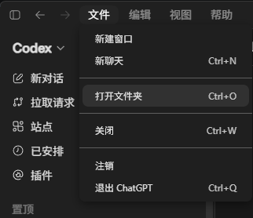

# 打开第一个本地项目，让 Codex 看懂目录

登录后，先别让 Codex 改代码。第一次使用，可以准备一个随时能恢复的练习项目，或者先复制一份项目再操作。本文以 VS Code 为主，也会介绍 Codex 桌面端和 CLI 的入口。

## 先选对目录

打开项目根目录，不要选桌面、仓库的上一级目录，也不要只选包含某个源文件的子目录。根目录通常能看到 `README.md`、`package.json`、`pyproject.toml`、`.git` 或其他项目入口文件。

第一次练习可以准备一个单独的测试目录，例如

```text
codex-demo/
├─ README.md
├─ src/
└─ tests/
```

不要把密码、API Key、生产配置和个人数据放进这个练习目录。Codex 能否访问文件，取决于当前客户端的权限设置。登录状态不代表它可以读取电脑上的所有内容。

## 在 VS Code 中打开

1. 在 VS Code 中选择“文件 > 打开文件夹…”，选中项目根目录。
2. 等待左侧资源管理器显示项目树，再点开一个你准备阅读的文件。
3. 打开 Codex 面板，把任务需要的文件加入上下文。


<p align="center">图 1  从“文件”菜单打开项目文件夹</p>

如果项目已经在另一个 VS Code 窗口中打开，也可以用 Codex 的“Add Folder”入口添加目录。先只添加当前任务需要的目录，需要扩大范围时再添加，定位问题会更方便。

## 先做一次只读检查

在 Codex 输入框先发送一条只读请求

```text
请只读取当前项目，不要修改文件。请说明下面几项
1. 项目使用的语言和主要入口；
2. 如何安装依赖和运行测试；
3. 当前 Git 分支、工作区是否有未提交修改；
4. 你准备读取或运行哪些路径和命令。
```

看到它列出准备执行的命令后，先确认路径和命令符合预期。第一次使用时，可以保持“Ask for approval”或同等的逐次确认模式。


<p align="center">图 2  Codex 桌面端读取工作区，并说明准备检查的内容</p>

## 在 Codex 桌面端和 CLI 中打开项目

在 Codex 桌面端打开左上角的“文件”菜单，选择“打开文件夹”，然后选中项目根目录。


<p align="center">图 3  在 Codex 桌面端打开项目文件夹</p>

CLI 则在项目根目录启动

```powershell
cd C:\path\to\codex-demo
codex
```

启动后先发送同样的只读检查。Windows PowerShell 与 WSL 的路径和 Git 环境彼此独立，在哪个环境启动，就在哪个环境里检查和修改。

## 打开后的检查清单

- [ ] 当前工作目录是项目根目录。
- [ ] 没有把密钥、令牌或个人资料加入上下文。
- [ ] 已确认当前分支和未提交修改。
- [ ] 已让 Codex 先完成一次只读理解。
- [ ] 需要写入文件或运行命令时，知道如何逐项批准或拒绝。

完成这一步后，再进入下一篇的“小改动 + diff + 检查”练习。结果不符合预期时，先看 diff，再决定是否撤回改动。

---

想系统学习 Codex，可以看看 CodexGuide 教程网站：

👉 CodexGuide：<https://codexguide.io>

遇到 Codex 使用问题，也可以加我 vx：257735 聊。
