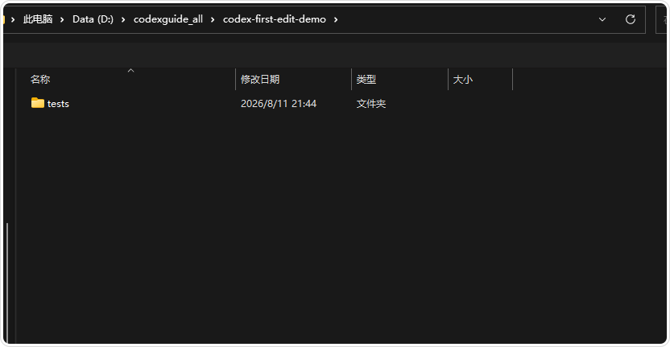
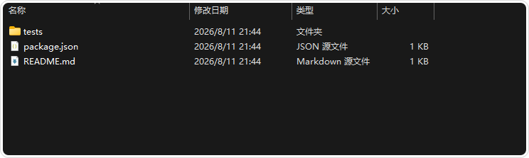
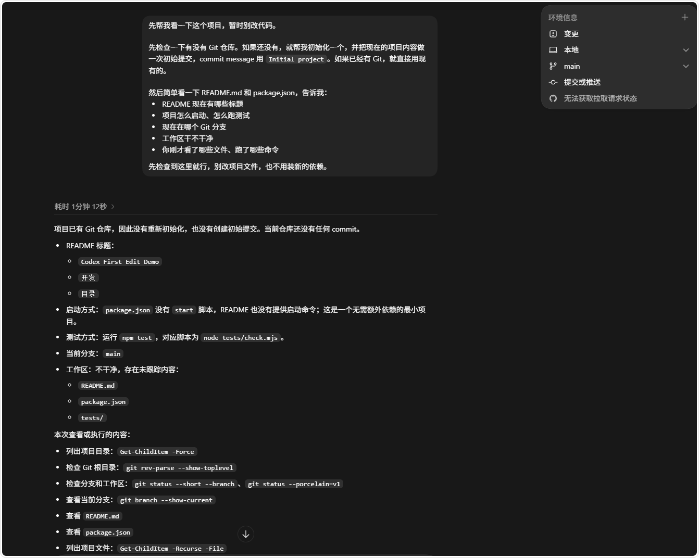
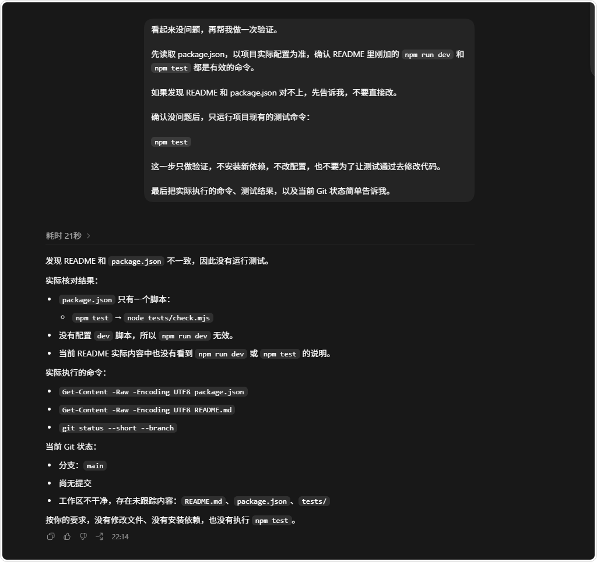
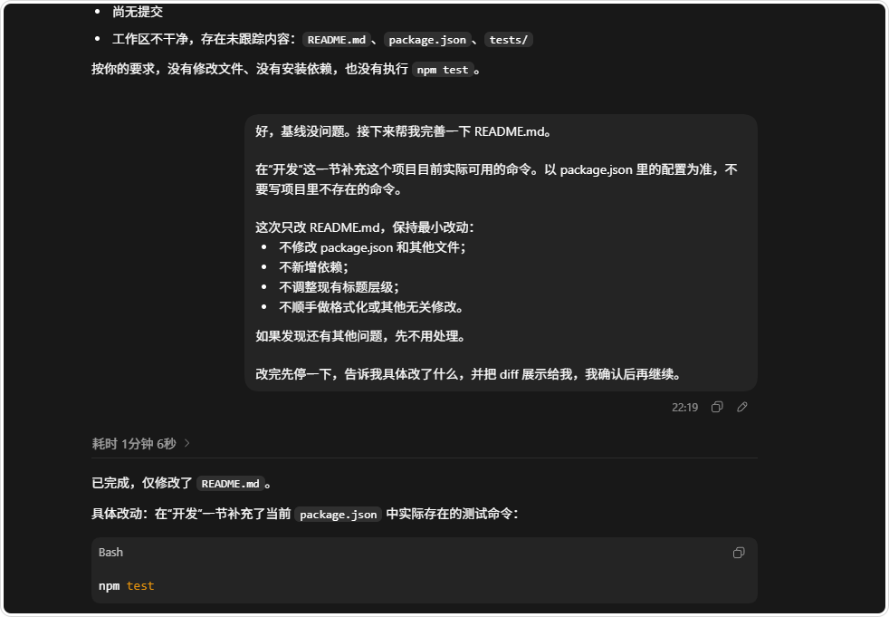
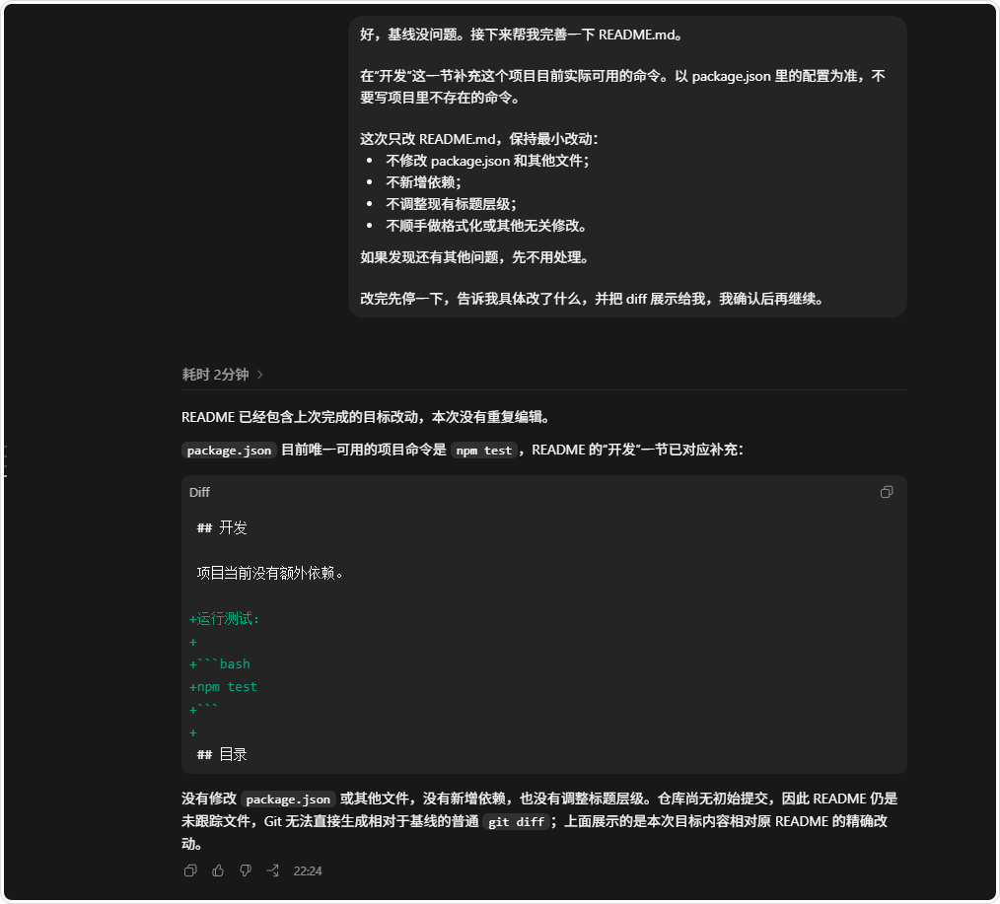
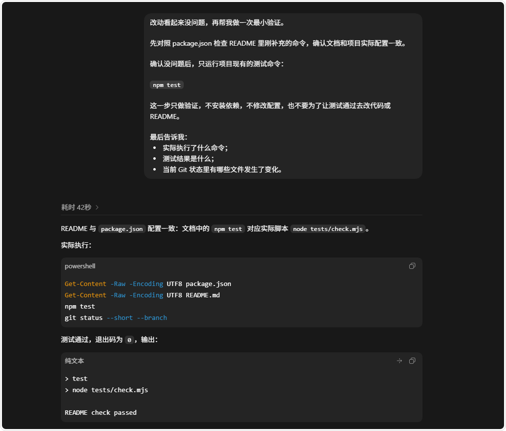

# 第 5 课：检查结果并安全重来

本课负责验收第 4 课已经完成的修改。继续使用同一个 `codex-first-task-test/` 目录，不重新布置任务，也不重新准备另一份项目。

<a id="guide-heading-0"></a>
## 1. 先确认你检查的是哪一个目录

当前目录应直接包含：

```text
codex-first-task-test/
├── index.html
└── styles.css
```

如果目录里没有这两个文件，先回到[第 3 课：打开练习目录](./08-打开第一个本地项目.md)。如果你想重新开始，请从原始练习包重新复制一份新目录，不要清空真实项目或执行 `git reset --hard`。

<a id="guide-heading-1"></a>
## 2. 检查文件内容

在文件管理器中右键修改后的 `index.html`，用文本编辑器打开（例如系统文本编辑器的纯文本模式）；同时打开保留的 `起始文件/index.html`，逐项和原始 starter 或下表比较：

| 检查项 | 应该看到 |
| --- | --- |
| 主标题 | `我的第一个 Codex 练习` |
| 简介 | `先看清修改，再确认页面结果。` |
| 按钮文字 | `查看阅读清单`，保持不变 |
| 按钮链接 | `https://example.com`，保持不变 |
| 其他 HTML | 保持不变 |
| `styles.css` | 文件内容和起点一致 |

<a id="guide-heading-2"></a>
### 没有 Git 时怎么比较

本练习不要求 Git。把两个文本窗口并排，或使用已有编辑器的文件比较功能。打开原始 `起始文件/index.html` 与当前 `index.html`，确认差异只有标题和简介两处。不要为了看到 diff 临时创建仓库、提交或推送。

再分别以文本方式打开两份 `styles.css`，确认全文相同。包内的 `参考差异/参考差异.md` 给出了唯一允许的两行变化，可在比较后核对。主标题是 `<h1>`，浏览器标签页的 `<title>晨间读书角</title>` 应保持不变。

<a id="guide-heading-3"></a>
### 有 Git 时怎么比较

如果你的复制目录本来就是 Git 仓库，可以使用编辑器的 Changes 面板或：

```bash
git diff -- index.html styles.css
```

这是可选命令。只有在当前目录确实是 Git 仓库并且你知道起点时才运行；命令输出必须由你自己核对。

<a id="guide-heading-4"></a>
## 3. 在浏览器检查实际页面

在文件管理器中找到当前测试目录的 `index.html`，右键选择“打开方式”并选择浏览器，或把文件拖入浏览器窗口。检查地址栏路径属于 `codex-first-task-test/`，刷新页面后分别确认：

1. 页面正文的大标题（h1）显示“我的第一个 Codex 练习”；
2. 简介显示“先看清修改，再确认页面结果。”；
3. 按钮仍显示“查看阅读清单”；
4. 点击前可以看到按钮仍指向 `https://example.com`；
5. 页面布局、颜色和字体与原始页面一致。

文件内容正确和浏览器显示正确是两项检查。浏览器能打开文件，不等于修改范围正确；反过来，文本看起来正确，也不替代页面检查。

<a id="guide-heading-5"></a>
## 4. 不一致时如何处理

- **标题或简介不对**：回到第 4 课，确认提示词和当前目录，再只修正目标文字。
- **按钮、链接或样式变了**：不要继续在当前目录猜测，保留证据并从原始 starter 重新复制一份。
- **页面打不开**：确认浏览器打开的是当前 `index.html`，不是原始 starter 或另一个目录。
- **Codex 要求安装、构建或部署**：拒绝这些与静态练习无关的动作。

如果你在真实项目中遇到问题，先保留错误文字、当前路径和修改记录，再进入[故障排查目录](../15-故障排查与常见问题/README.md)。

<a id="guide-heading-6"></a>
## 课程完成

满足下面条件，就完成了这条五课短课程：

- [ ] 选定并准备好一个 Codex 入口；
- [ ] 完成认证，并知道凭据和文件权限是两件事；
- [ ] 在正确目录中只读确认 `index.html` 和 `styles.css`；
- [ ] 修改了标题和简介，没有混入其他文件或依赖；
- [ ] 通过文件对照和浏览器页面两层检查；
- [ ] 知道需要重来时应重新复制练习目录。

[返回快速上手：课程完成](../快速上手/README.md)。接下来可以按需要选择：

- [项目理解与上下文](../03-项目理解与上下文/README.md)：把只读调查迁移到真实仓库；
- [代码修改与开发实战](../04-代码修改与开发实战/README.md)：练习范围明确的代码任务；
- [完整教程目录](../学习路线.md)：按读者目标选择其他主题；
- [故障排查 FAQ](https://codexguide.io/guides/faq)：遇到登录、权限、Git 或验证问题时使用。

本课不自动跳转到其他专题，也不把历史案例当作课程必修。

<a id="历史案例README文档修改"></a>
<a id="guide-heading-7"></a>
## 选读附录：历史案例：README 文档修改

下面保留 codex-handbook 此前发布的 Node.js/README 文档案例，署名沿用网站的 codx编辑组，保留原始发表信息。它保留原有来源、截图和锚点，用来说明真实项目中的命令核对、diff 审查和测试验证；它需要另行准备项目，不是本课程的静态网页练习。


<a id="guide-heading-8"></a>
### 开始前确认

准备一个可以随时恢复的练习项目，并确认：

- 当前目录是项目根目录；
- 项目中没有密码、Token、客户资料或生产配置；
- 你知道当前 Git 分支和工作区状态；
- 第一次练习只改一个文件。

本次示例项目的目录如下：

```text
codex-first-edit-demo/
├─ README.md
├─ package.json
└─ tests/
   └─ check.mjs
```


图一：打开练习项目，确认 README、配置文件和测试目录

<a id="guide-heading-9"></a>
### 先做只读检查

先让 Codex 读取项目，不要修改文件。可以直接发送：

```text
请先只读取项目配置和 Git 状态，不要修改文件。

请告诉我：
1. README.md 当前有哪些标题；
2. 项目的启动命令和测试命令；
3. 当前 Git 分支和工作区是否有未提交修改；
4. 完成下一步任务前，你准备读取哪些文件、运行哪些命令。
```


图二：先确认项目结构、脚本和 Git 状态

这一步的价值在于先看事实，再写任务。示例项目的 `package.json` 只有 `npm test`，没有 `npm run dev`。如果 README 写入不存在的启动命令，文档就会误导读者。


图三：项目配置没有 dev 脚本，不能把 npm run dev 当成可用命令

<a id="guide-heading-10"></a>
### 发送范围明确的修改请求

确认项目现状后，再发送修改请求。下面的写法同时限定了目标文件、禁止事项和验收方式：

```text
请只修改 README.md。

在“开发”这一节补充项目当前实际可用的命令，以 package.json 的配置为准。

限制：
- 不修改 package.json 和其他文件；
- 不新增依赖；
- 不调整现有标题层级；
- 不运行会修改数据或删除文件的命令。

如果发现我要求的命令不存在，请先说明，不要自行修改配置。
修改完成后先告诉我改了什么，并展示 diff，等我确认后再验证。
```

看到 Codex 请求写入文件或执行命令时，只批准与这次任务直接相关的操作。如果请求扩大到删除目录、覆盖大量文件或安装依赖，先停止并重新确认范围。


图四：再次强调只修改 README，避免任务范围扩大

<a id="guide-heading-11"></a>
### 查看修改摘要和 diff

Codex 完成编辑后，先看它的摘要，再打开编辑器的 Changes 面板。示例中最终只增加了 `npm test`，没有修改 `package.json` 或其他文件。


图五：修改摘要应说明文件、内容和依据

还可以让 Codex 只审查本次修改：

```text
请只审查刚才的改动：列出修改文件、每处修改的目的，以及是否违反了“只改 README.md”的限制。不要继续编辑。
```

重点检查三件事：

1. 修改文件是否只有预期文件；
2. 命令是否来自项目实际配置；
3. 是否混入格式化、重命名或无关内容。


图六：通过 diff 确认新增内容和未改动内容

如果项目已经有其他未提交修改，不要直接恢复整个文件。先区分哪些内容属于本次任务，再决定是否撤销。

<a id="guide-heading-12"></a>
### 做最小验证

diff 看起来正确后，再验证命令确实存在并运行项目已有的测试：

```text
请读取 package.json，确认 README.md 中写入的命令与项目配置一致。

确认没有问题后，只运行项目已有的测试命令 npm test。
不要安装依赖，不要修改配置，不要清理缓存。

请报告实际执行的命令、测试结果和当前 Git 状态。
```

示例项目的测试输出为 `README check passed`，退出码为 `0`。这说明本次 README 修改没有破坏已有检查。


图七：运行项目已有测试，确认结果可复现

如果项目没有自动化测试，就做 Markdown、命令名称和 diff 的人工检查，并在记录中说明“未运行自动化测试”。不要为了验证一个小改动擅自升级依赖、清理缓存或修改项目配置。

<a id="guide-heading-13"></a>
### 最后检查 Git 状态

在终端中执行：

```powershell
git diff --check
git status --short
git diff -- README.md
```

`git diff --check` 用来发现多余空格等基础问题；`git status --short` 确认没有意外改动；最后一条只查看目标文件的完整差异。

<a id="guide-heading-14"></a>
### 不符合预期时如何回退

发现修改超出范围或内容不对时，优先使用编辑器撤销，或者在确认目标文件没有其他人的改动后，精确恢复这次修改。不要删除整个项目目录，也不要把 `git reset --hard` 当作第一次练习的默认操作。

<a id="guide-heading-15"></a>
### 完成标准

- [ ] 目标文件和修改范围与任务描述一致；
- [ ] 已查看完整 diff，没有无关格式化或敏感信息；
- [ ] 已运行项目提供的最小检查，或记录了未运行原因；
- [ ] `git diff --check` 通过，工作区状态符合预期；
- [ ] 知道如何只撤销本次修改。

第一次修改的重点不是让 Codex 一次做很多事，而是建立一套可重复的节奏：描述目标，批准操作，检查 diff，运行验证，确认状态。后面的开发、修 Bug 和文档更新，都可以沿用这套流程。

接下来可以进入 [核心概念与任务方法](../02-核心概念与任务方法/) 和 [项目理解与上下文](../03-项目理解与上下文/)，继续学习任务拆分与项目规则。
