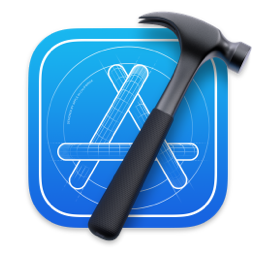

# Xcode 中使用 Codex

Codex 在 Xcode 中通过 Coding Assistant 集成。准备好一个可以回退的 Xcode 项目后，先确认登录状态，再从当前文件或选中代码发起小任务。


<p align="center">图 1：Xcode 官方图标。来源：<a href="https://developer.apple.com/xcode/">Apple Developer：Xcode</a>。</p>


<p align="center">图 2：Codex 官方图标。来源：<a href="https://marketplace.visualstudio.com/items?itemName=OpenAI.chatgpt">Visual Studio Marketplace 的 Codex 扩展页面</a>。</p>

## 开始前

- 使用支持 Coding Assistant 的 Xcode 版本，并完成 Apple 账号或团队要求的开发环境配置。
- 打开项目根目录，确认工程能正常编译或至少能打开目标文件。
- 不要把签名证书、私钥、配置文件中的令牌加入对话上下文。

## 在 Coding Assistant 中选择 Codex

打开 Xcode 的 Coding Assistant 面板，在模型或提供商选择处选 Codex。首次使用时按界面提示完成 ChatGPT 登录或授权；按钮名称和位置可能随 Xcode 版本变化，优先以当前界面为准。

## 从小任务开始

先选中一个函数，发送只读请求：

```text
请解释当前选中函数的输入、输出和副作用，不要修改文件。
```

确认解释符合代码后，再提出范围明确的修改，例如“只为这个函数补一个失败分支测试，不改生产代码”。修改完成后查看 diff，再运行项目已有的单元测试或构建目标。

## 参考资料

- [Codex IDE extension](https://developers.openai.com/codex/ide)
- [Apple Developer：Xcode](https://developer.apple.com/xcode/)


<p align="center">图 3：B 站“Vibe Coding 04：使用 Prompt 实现潮汐 App（上）”视频封面，作者：Winter喵。<a href="https://www.bilibili.com/video/BV1wSfTBuE7V/">查看原视频</a>。封面仅作延伸观看入口，不代表官方界面。</p>

## 计划覆盖

- 使用前的 Xcode、项目和账号准备。
- 在 Coding Assistant 中选择 Codex。
- 围绕当前文件或选中代码发起任务。
- 查看修改、运行项目并验证结果。

## 配图要求

- 官方 Xcode 集成入口。
- Coding Assistant、Codex 选择和登录状态。
- 项目上下文、修改内容和验证结果。
