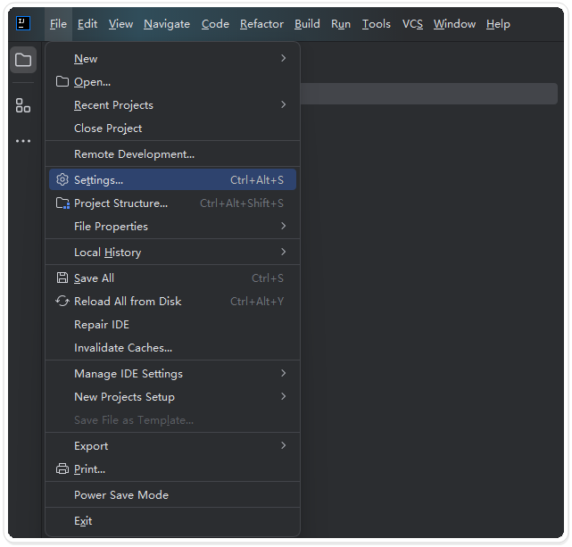
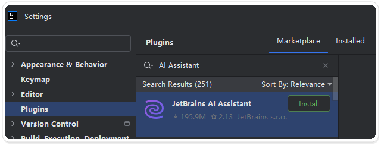
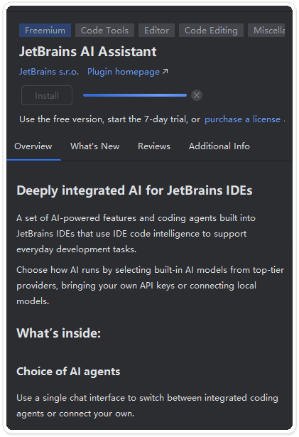
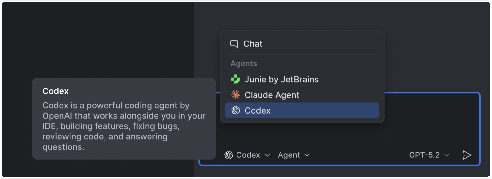
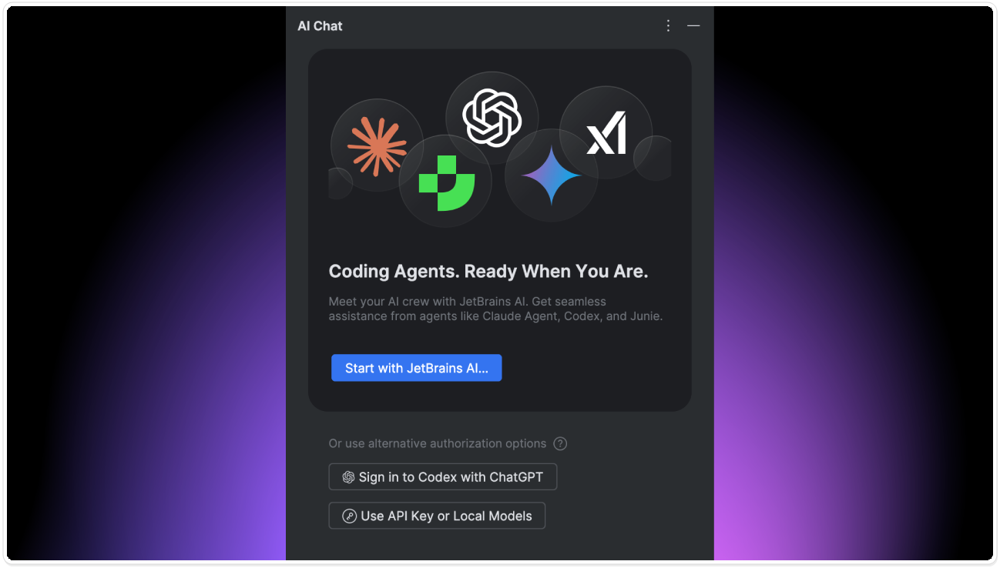
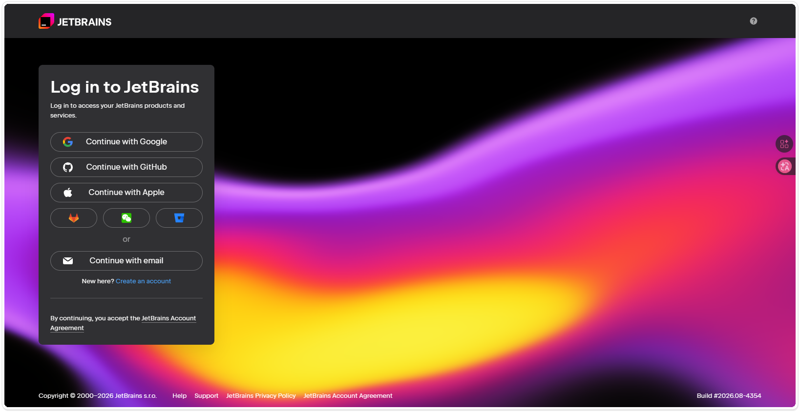
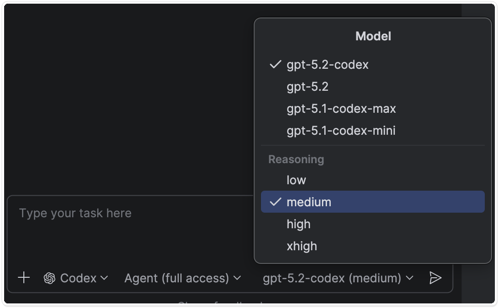
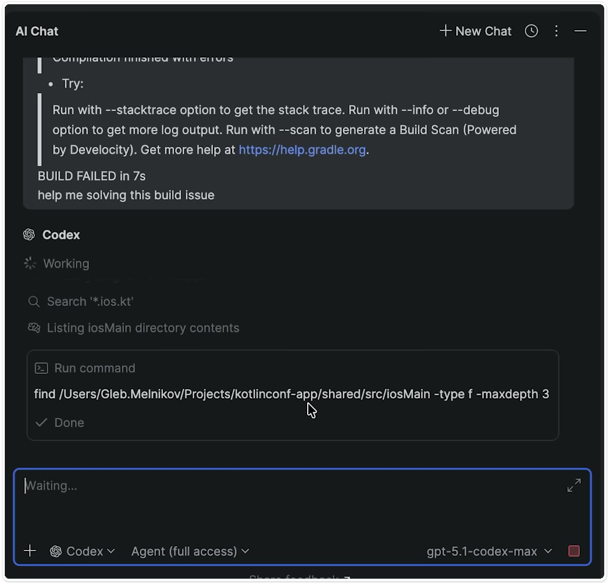
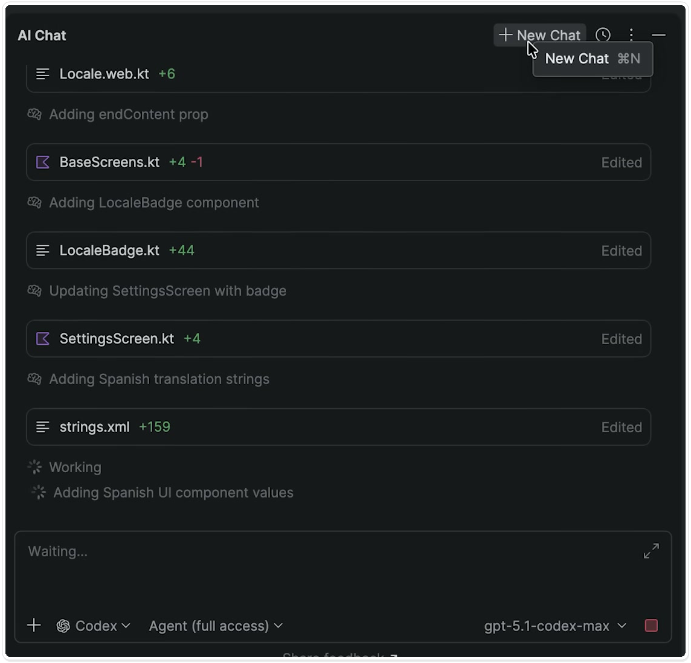

# JetBrains 中使用 Codex

从 2025.3 开始，IntelliJ IDEA、PyCharm、WebStorm 等 JetBrains IDE 可以在 AI Chat 中直接调用 Codex。需要安装并启用 JetBrains AI Assistant，不需要另装 Codex 插件。

本文以 Windows 版 IntelliJ IDEA 为例。其他 JetBrains IDE 的入口大致相同，菜单名称可能因版本略有不同。


## 操作路线

先准备项目和运行环境，再启用 AI Assistant、切换 Codex、完成认证，最后用只读任务试跑，并检查 diff 和验证结果。


<p align="center">图一 JetBrains 官方品牌图，来源于 <a href="https://www.jetbrains.com/company/brand/">JetBrains Brand Guidelines</a></p>


<p align="center">图二 Codex 官方图标，来源于 <a href="https://marketplace.visualstudio.com/items?itemName=OpenAI.chatgpt">Visual Studio Marketplace 的 Codex 扩展页面</a></p>

## 开始前的准备

把项目作为完整目录打开。只打开单个文件时，Codex 看不到项目结构，分析和修改容易缺少上下文。

项目需要的 JDK、Python、Node.js 或其他运行时也应提前安装。至少确认目标文件能正常打开，最好先在本机完成一次构建或测试。

工作区已有改动时，先提交或暂存。之后查看 diff，会更容易分辨哪些内容来自 Codex。


<p align="center">图三 从 JetBrains 菜单打开 Settings</p>

## 第一步：启用 JetBrains AI

第一次打开 AI Chat，面板会显示 `Let's Go`。点击它，按提示安装并启用 AI Assistant。


<p align="center">图四 首次打开 JetBrains AI 时的 Let's Go 入口，来源于 <a href="https://blog.jetbrains.com/ai/2026/01/codex-in-jetbrains-ides/">JetBrains 官方博客</a></p>

如果 AI Chat 里没有 Codex，打开 `Settings → Plugins`，把 JetBrains AI Assistant 更新到最新版本并重启 IDE。仍然看不到时，确认 IDE 已升级到 2025.3 或更高版本。


<p align="center">图五 在 Plugins 页面搜索 JetBrains AI Assistant</p>


<p align="center">图六 JetBrains AI Assistant 插件详情页</p>

## 第二步：切换到 Codex

打开 AI Chat，点击输入框附近的 Agent 选择器。列表里可能同时有 Junie、Claude Agent 和 Codex，选择 Codex 即可。


<p align="center">图七 AI Chat 的 Agent 选择器中出现 Codex，来源于 <a href="https://blog.jetbrains.com/ai/2026/01/codex-in-jetbrains-ides/">JetBrains 官方博客</a></p>

## 第三步：完成登录

第一次切换到 Codex 时，AI Chat 会要求选择认证方式。JetBrains 提供三种入口：JetBrains AI 订阅、ChatGPT 账号，或 OpenAI API Key。


<p align="center">图八 JetBrains AI、ChatGPT 和 API Key 三种认证入口，来源于 <a href="https://blog.jetbrains.com/ai/2026/01/codex-in-jetbrains-ides/">JetBrains 官方博客</a></p>

没有 JetBrains 账号时，可在登录页使用 Google、GitHub、Apple 或邮箱注册/登录。


<p align="center">图九 JetBrains 账号登录页面</p>

已有 ChatGPT 账号的读者可直接选择 ChatGPT 登录；按实际用量计费则选择 API Key。密钥只填在 IDE 的认证窗口中，不要发到聊天框，也不要写入项目文件。

JetBrains 曾在 2026 年 1 月推出限时免费活动。活动、额度和计费方式可能已经变化，以 IDE 和账号页面的当前说明为准。


<p align="center">图十 JetBrains AI 中的 Codex 限时活动提示，截图信息可能已经过期，来源于 <a href="https://blog.jetbrains.com/ai/2026/01/codex-in-jetbrains-ides/">JetBrains 官方博客</a></p>

## 第四步：选择模型和推理强度

认证完成后，在输入框下方选择 Codex 模型和 Reasoning Effort。模型列表会随产品更新，截图中的名称只用于辨认入口。

解释代码、修改一处逻辑或补一个小测试时，先使用默认推理强度。涉及多个文件、构建错误或复杂排查时，再提高档位。档位越高，等待时间通常越长。


<p align="center">图十一 Codex 的模型和 Reasoning Effort 选择界面，来源于 <a href="https://blog.jetbrains.com/ai/2026/01/codex-in-jetbrains-ides/">JetBrains 官方博客</a></p>

## 第五步：先发一个只读任务

打开目标文件，选中一小段代码，先让 Codex 解释和检查，不要马上修改。可以直接发送：

```text
请只解释这段代码的执行路径，并指出一个可能的边界条件，不要修改文件。
```

先确认它读对了文件、理解了上下文，再给一个范围明确的小任务，例如只补某个失败分支的单元测试，不改生产代码。

执行过程中，AI Chat 会列出 Codex 读取的文件、运行的命令和当前进度。OpenAI 的官方演示中，Codex 收到 Gradle 构建错误后，会继续搜索项目文件并运行命令定位问题。


<p align="center">图十二 AI Chat 中显示 Codex 读取 Gradle 构建错误并搜索项目文件</p>

第一次让 Codex 修改项目时，不要同时放开网络访问和过大的文件范围。任务越具体，越容易判断结果是否符合预期。

## 第六步：审查修改并运行验证

任务完成后，AI Chat 会列出改过的文件。逐个打开 IDE 的 diff 视图：先确认文件范围，再检查具体代码。


<p align="center">图十三 AI Chat 中列出本次任务修改过的文件</p>

接着运行项目已有的最小验证。改了测试就运行对应测试，动了构建脚本就重新构建一次；同时检查是否生成临时文件，以及 `.idea` 目录是否混入无关配置。

## 完成前再检查一次

- [ ] 项目以完整目录打开，本机运行时可用。
- [ ] 已通过 JetBrains AI、ChatGPT 或 API Key 完成认证。
- [ ] 第一项任务先验证了文件和上下文，没有直接放开大范围修改。
- [ ] 已逐个查看修改文件和 diff。
- [ ] 已运行对应测试或最小构建。
- [ ] 聊天记录和项目文件中没有 API Key、证书或令牌。

完成这些检查后，JetBrains 里的第一项 Codex 任务就结束了。后续可以逐步扩大任务范围，但提交代码前仍应看完 diff 并确认验证结果。

## 参考资料

- [OpenAI Codex IDE 文档](https://developers.openai.com/codex/ide)
- [JetBrains Codex 文档](https://www.jetbrains.com/help/ai-assistant/codex-agent.html)
- [JetBrains 官方博客](https://blog.jetbrains.com/ai/2026/01/codex-in-jetbrains-ides/)
- [JetBrains Brand Guidelines](https://www.jetbrains.com/company/brand/)
