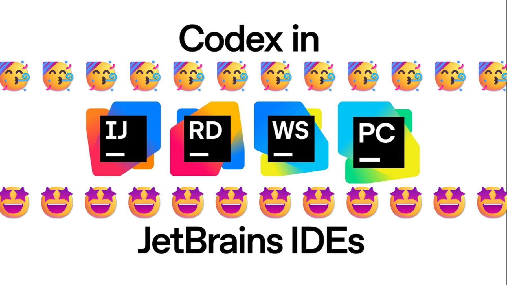

# JetBrains 中使用 Codex

JetBrains IDE 通过 AI Chat 提供 Codex 入口。下面的流程适用于 IntelliJ IDEA、PyCharm、WebStorm 等支持该集成的 IDE；不同产品版本的菜单名称可能略有差异。


<p align="center">图 1：JetBrains 官方品牌图。来源：<a href="https://www.jetbrains.com/company/brand/">JetBrains Brand Guidelines</a>。</p>


<p align="center">图 2：Codex 官方图标。来源：<a href="https://marketplace.visualstudio.com/items?itemName=OpenAI.chatgpt">Visual Studio Marketplace 的 Codex 扩展页面</a>。</p>

## 准备工作

- 将项目作为完整目录打开，而不是只打开单个文件。
- 确认项目使用的 JDK、Python、Node.js 或其他运行时已经可用。
- 先提交或保存已有改动，避免把无关 diff 混进第一次任务。

## 打开 AI Chat 并选择 Codex

打开 AI Chat，在代理或模型选择器中选 Codex。第一次使用按提示完成 ChatGPT 登录；如果看不到 Codex，先更新 AI Assistant/相关插件，再重启 IDE 检查。

## 添加上下文并执行小任务

打开目标文件，选中需要解释的代码，先发送：

```text
请只解释这段代码的执行路径，并指出一个可能的边界条件，不要修改文件。
```

确认上下文无误后，再提出只涉及一个文件或一个测试的修改。完成后检查 IDE 的 diff，运行项目已有的最小测试，并确认没有生成临时文件或修改 IDE 配置。

## 参考资料

- [Codex IDE extension](https://developers.openai.com/codex/ide)
- [JetBrains Brand Guidelines](https://www.jetbrains.com/company/brand/)


<p align="center">图 3：B 站“Codex in JetBrains IDEs | OpenAI”视频封面，原作者标注为 OpenAI，B 站搬运作者：伸手不见五趾。<a href="https://www.bilibili.com/video/BV1Z6zrBCE8U/">查看原视频</a>。封面仅作延伸观看入口，不代表官方界面。</p>

## 计划覆盖

- 支持的 JetBrains 环境和准备条件。
- 打开 AI Chat 并选择 Codex。
- 使用当前文件和项目上下文发起任务。
- 审查修改并运行项目验证。

## 配图要求

- 官方 JetBrains 集成入口。
- AI Chat、Codex 选择和登录状态。
- 文件上下文、修改内容和验证结果。
