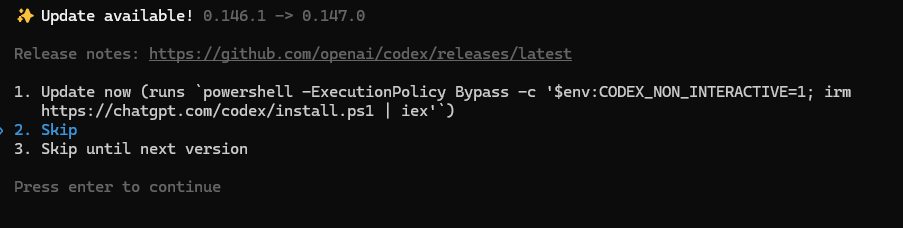

# Codex 更新与卸载

> 验证环境：Codex CLI 0.146.1
>
> 最后验证：2026-08-12

更新前先记录当前安装方式和版本；卸载时把“删除程序”和“删除本地登录、配置、会话”分开处理。两者不是同一件事。


<p align="center">图 1：Codex 官方图标。来源：<a href="https://marketplace.visualstudio.com/items?itemName=OpenAI.chatgpt">Visual Studio Marketplace 的 Codex 扩展页面</a>。</p>

## 更新前检查

先保存或提交项目改动，并记录版本：

```powershell
codex --version
```

如果使用的是 App 或 IDE 扩展，从产品内的更新入口检查；如果使用 CLI，官方命令参考中提供了 `codex update`，但并非所有安装方式都支持自更新。

## CLI 更新

```text
codex update
```

若命令提示当前安装方式不支持自更新，就回到原来的安装渠道更新，例如 npm 全局安装：

```powershell
npm install -g @openai/codex@latest
```

更新后重新运行 `codex --version`，再做一次只读请求确认登录和工作目录没有变化。

## 卸载时保留数据

先退出登录：

```text
codex logout
```

然后按照原安装方式移除程序或扩展。不要直接删除整个 `~/.codex` 或 `%USERPROFILE%\.codex`，除非你已经确认不再需要其中的配置、会话、技能和认证数据。需要清理本地数据时，应先备份并逐项删除。

## 结果确认

- App：应用不再出现在系统应用列表或启动入口中。
- CLI：`Get-Command codex` 找不到命令，或返回的路径已不是旧安装位置。
- IDE：扩展管理器中 Codex 状态为已卸载；重启 IDE 后侧栏入口消失。
- 项目：项目文件、Git 分支和未提交改动没有被更新或卸载流程修改。

## 参考资料

- [Codex CLI 命令参考](https://developers.openai.com/codex/cli/reference)
- [Codex IDE extension](https://developers.openai.com/codex/ide)
- [Codex Changelog](https://developers.openai.com/codex/changelog)


<p align="center">图 2：B 站“Codex 和 ChatGPT 合并后无法更新/无法使用 GPT-5.6 模型解决方法”视频封面，作者：小标学 AI。<a href="https://www.bilibili.com/video/BV1yBNb6qE6G/">查看原视频</a>。封面仅作延伸观看入口，不代表官方界面。</p>
