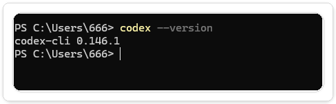
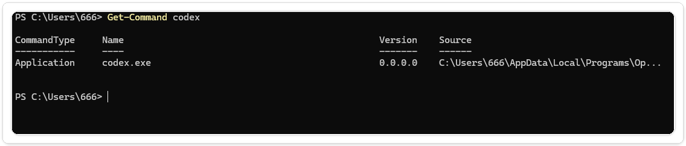
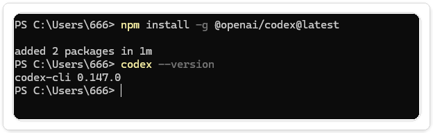
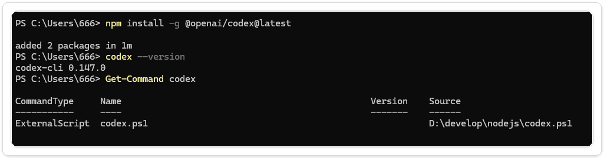
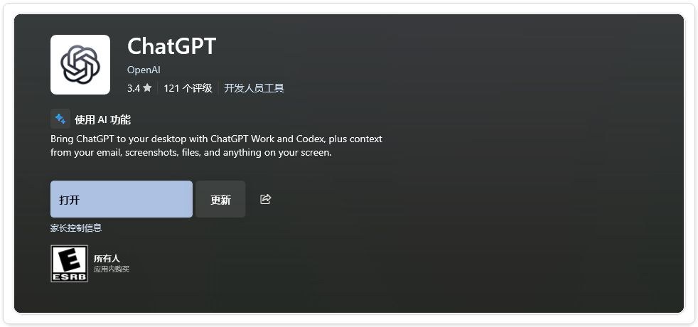
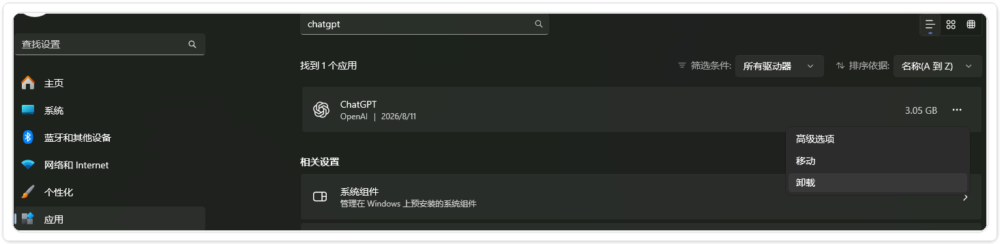
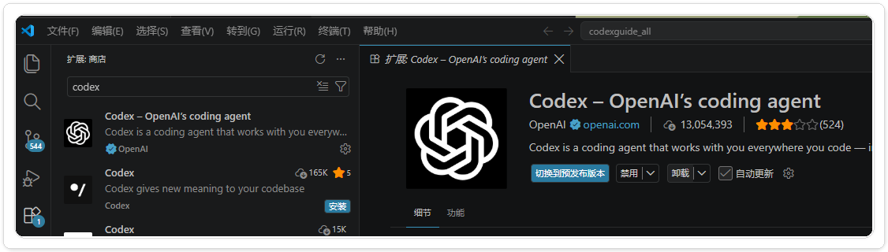
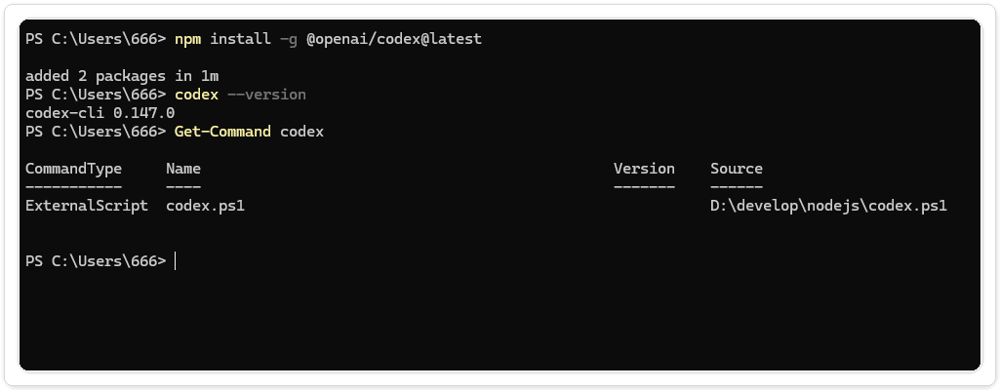

# Codex 更新与卸载

更新前先记下当前安装方式和版本。卸载时，再把“删除程序”和“删除本地登录、配置、会话”分开处理；前者不等于后者。

本文章覆盖 Windows 上的 Codex CLI、ChatGPT 桌面 App 和 VS Code 扩展。先确认自己用的是哪一种，再沿着原来的渠道更新或卸载，能少走很多弯路。

## 先判断你安装的是哪一种

更新和卸载必须沿用原来的渠道。先在 PowerShell 中执行：

```powershell
codex --version
Get-Command codex -All | Select-Object CommandType,Name,Source
npm list --global @openai/codex --depth=0
```

按结果判断：

| 看到的结果 | 安装来源 | 更新方式 |
|---|---|---|
| 路径包含 `node_modules`，或 npm 列出 `@openai/codex` | npm 全局安装 | 使用 npm 更新 |
| 路径类似 `%LOCALAPPDATA%\Programs\OpenAI\Codex\bin\codex.exe`，npm 没有列出包 | 官方安装脚本 | 重新运行官方安装脚本；不要用 npm“覆盖安装” |
| 在 Ubuntu/WSL 终端执行命令 | WSL 独立环境 | 在 WSL 内重新检查并更新，Windows 的结果不适用 |

同一台电脑同时存在两份 CLI 时，`Get-Command codex -All` 会列出多个路径。更新后仍显示旧版本，通常就是 PATH 顺序仍指向另一份安装。

## 更新前检查

先保存或提交项目改动，并记录版本：

```powershell
codex --version
```

如果使用的是 App 或 IDE 扩展，从产品内的更新入口检查。CLI 则先按上一节判断来源，不要把 npm、官方安装脚本和 WSL 混在一起。

## CLI 更新

### npm 全局安装

先确认当前 CLI 版本和命令路径：

```powershell
codex --version
Get-Command codex
```


<p align="center">图 1：更新前在 PowerShell 中核对 Codex CLI 版本。核验日期：2026-08-14。</p>


<p align="center">图 2：使用 `Get-Command codex` 核对当前命令路径。核验日期：2026-08-14。</p>

确认项目改动已经保存或提交后，直接执行 npm 全局更新：

```powershell
npm install -g @openai/codex@latest
```

安装完成后重新打开一个 PowerShell 窗口，再检查版本和命令路径：

```powershell
codex --version
Get-Command codex
```


<p align="center">图 3：执行 npm 全局更新后重新核对 Codex CLI 版本。核验日期：2026-08-14。</p>


<p align="center">图 4：更新完成后重新核对 Codex CLI 版本和实际命令路径。核验日期：2026-08-14。</p>

如果版本没有变化，先确认 `Get-Command codex` 返回的路径是否仍指向旧安装位置，再检查 npm 的全局安装目录和终端环境变量。不要在项目目录里直接删除旧文件。

### 官方安装脚本安装

如果命令路径位于 `OpenAI\Codex\bin`，重新执行官方安装脚本即可覆盖到同一安装位置：

```powershell
irm https://chatgpt.com/codex/install.ps1 | iex
```

安装完成后关闭旧终端，重新打开 PowerShell，再运行 `codex --version` 和 `Get-Command codex`。如果你想确认当前版本是否提供内置更新命令，可以先查看帮助：

```powershell
codex --help | Select-String -Pattern 'update'
```

只有帮助中明确出现 `update` 子命令时才使用它；不同安装方式和版本的命令集合可能不同。

### 固定版本或回退

需要暂时避开某个版本时，npm 安装可以指定已知版本：

```powershell
npm install -g @openai/codex@0.146.1
```

回退前先记下 `codex --version` 和 `Get-Command codex` 的输出。官方安装脚本通常只提供最新版；要回退，应改用 npm 管理版本，或从官方发布记录取得对应安装方式，不要从第三方下载不明二进制文件。

## App 更新与卸载入口

如果安装的是 ChatGPT 桌面 App，更新和卸载由 Microsoft Store 或 Windows 设置管理，不走 npm。打开 Microsoft Store 搜索 ChatGPT，应用详情页会显示“更新”按钮；如果应用已经安装，搜索结果会显示“已安装”状态。


<p align="center">图 5：Microsoft Store 搜索 ChatGPT 的结果页，截图用于确认应用安装状态。核验日期：2026-08-13。</p>

需要更新时，在应用详情页点击“更新”，等待商店完成安装，再重新打开 App。


<p align="center">图 6：ChatGPT 桌面 App 的 Microsoft Store 详情页，显示“更新”按钮。核验日期：2026-08-13。</p>

需要卸载时，打开 `设置 → 应用 → 已安装的应用`，搜索 ChatGPT，展开右侧菜单并选择“卸载”。停在确认按钮之前，避免误删本地数据。


<p align="center">图 7：Windows 设置中的 ChatGPT 应用菜单，已展开“卸载”入口。核验日期：2026-08-13。</p>

如果使用的是 VS Code 扩展，在扩展市场中搜索 Codex，打开 **Codex – OpenAI’s coding agent** 的详情页，点击“卸载”。卸载扩展后重启 IDE，再确认侧栏入口已经消失。


<p align="center">图 8：VS Code 扩展详情页中的 Codex“卸载”入口。核验日期：2026-08-13。</p>

## 卸载时保留数据

先退出登录：

```text
codex logout
```

然后按照原安装方式移除程序或扩展。不要直接删除整个 `~/.codex` 或 `%USERPROFILE%\.codex`，除非你已经确认不再需要其中的配置、会话、技能和认证数据。需要清理本地数据时，应先备份并逐项删除。

### 按安装来源卸载 CLI

npm 安装的 CLI 可以这样移除：

```powershell
npm uninstall -g @openai/codex
```

官方安装脚本安装的 CLI 没有 npm 包可卸载。先关闭正在运行的 Codex 和 PowerShell 窗口，再用 `Get-Command codex` 确认实际路径；如果系统的“已安装的应用”中没有卸载入口，只删除该安装目录，不要按猜测删除整个 `AppData` 或用户目录。删除后重新打开终端，用 `Get-Command codex -All` 确认没有残留的第二份 CLI。

### 是否清理本地数据

`codex logout` 只处理登录状态，不等于删除配置和会话。需要彻底清理时，先备份有用的配置，再逐项检查以下位置：

```powershell
Test-Path "$HOME\.codex"
Get-ChildItem "$HOME\.codex" -Force -ErrorAction SilentlyContinue
```

不要把包含令牌、Cookie、项目路径或会话内容的文件上传到工单、仓库或截图中。Windows 和 WSL 的 `~/.codex` 彼此独立，清理一边不会影响另一边。

## 更新失败时的排查顺序

1. 重新打开终端，确认是否仍有旧的 `codex` 进程占用文件。
2. 运行 `Get-Command codex -All`，确认实际执行的路径。
3. 对 npm 安装运行 `npm prefix --global`，检查全局目录是否在 PATH 中。
4. 对官方安装脚本安装，重新执行安装脚本，并检查网络、代理和执行策略错误。
5. 仍无法判断时，保留完整错误文字、版本号、操作系统和安装路径，再查阅[官方 CLI 文档](https://developers.openai.com/codex/cli/)。

## 最后check

- App：应用不再出现在系统应用列表或启动入口中。
- CLI：`Get-Command codex` 找不到命令，或返回的路径已不是旧安装位置。
- IDE：扩展管理器中 Codex 状态为已卸载；重启 IDE 后侧栏入口消失。
- 项目：项目文件、Git 分支和未提交改动没有被更新或卸载流程修改。


更多 Codex 安装、登录和日常使用教程，可以访问我的免费教程网站 https://codexguide.io，上面会同步更新codex系列完整教程，方便系统学习。

教程开源仓库也欢迎大家贡献支持 https://github.com/awefoundry/codex-handbook.git

## 参考资料

- [Codex CLI 命令参考](https://developers.openai.com/codex/cli/reference)
- [Codex IDE extension](https://developers.openai.com/codex/ide)
- [Codex Changelog](https://developers.openai.com/codex/changelog)
