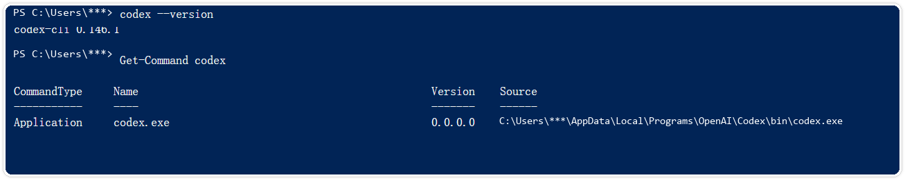
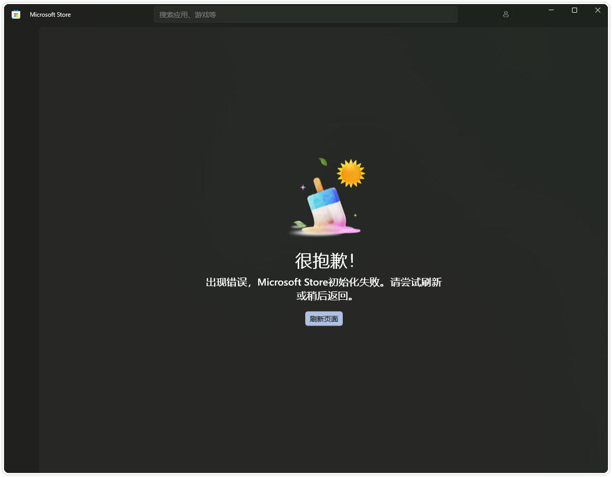
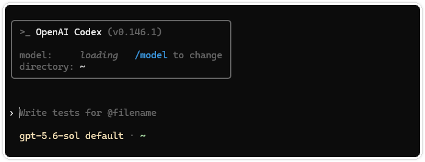
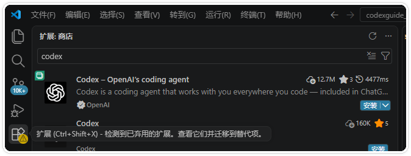
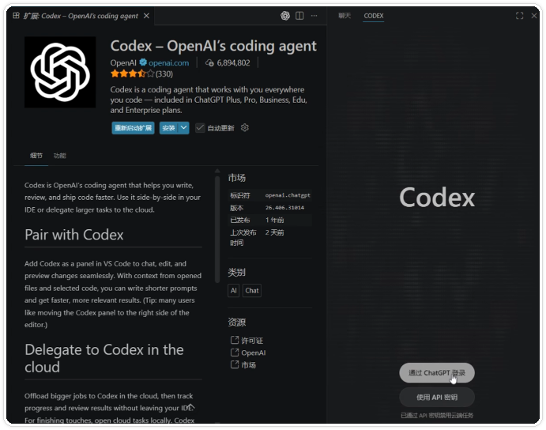
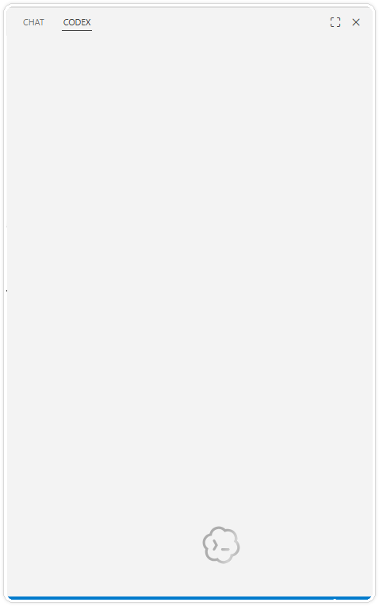
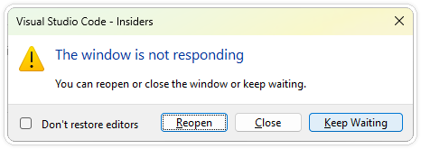
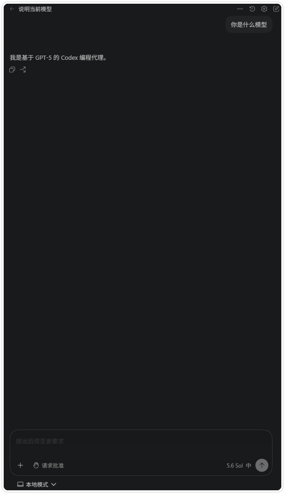

# Codex 装不上、登不进、一直 loading，怎么解决？

> 随实操持续补充。

> 测试环境为 Windows 11 24H2（26100）、Codex Desktop 26.810.7004.0、Codex CLI 0.147.0 和 Node.js 22.22.3，2026-08-17 核验。

安装或登录卡住时，很多人会先卸载重装。这个办法经常白忙一遍。命令可能装在另一套环境里，浏览器已经授权，客户端却没有刷新；也可能是代理只配给了 npm，Codex 本身仍然无法联网。

这篇文章把前面几篇安装教程中已经出现过的问题集中到一起，并补上 OpenAI 官方文档里的 Windows 排障项。没有真实证据支持的报错，不写“亲测解决”。

## 先确认你用的是哪一个 Codex

Codex 目前常见的入口有四个，ChatGPT 桌面 App、Codex CLI、VS Code/Cursor 扩展，以及 JetBrains AI Assistant 里的 Codex。先确认问题发生在哪个入口，再继续排查。

CLI 还要区分 Windows PowerShell 和 WSL。它们是两套独立环境，安装路径、PATH、登录缓存和 `~/.codex` 默认互不相通。

在 PowerShell 中运行，

```powershell
codex --version
Get-Command codex -All | Select-Object CommandType, Name, Source
codex login status
```

在 WSL 中运行，

```bash
codex --version
which -a codex
codex login status
```



图一  `codex --version` 用来确认版本，`Get-Command codex` 会列出当前执行的程序路径。截图采集时为 CLI 0.146.1，用户名已脱敏；当前测试版本见文首。

## Microsoft Store 初始化失败，App 装不上

下面这个报错来自前面的 Windows 安装实操。Microsoft Store 打开后没有进入应用详情页，页面直接提示“Microsoft Store 初始化失败”。



图二  Microsoft Store 初始化失败时的实际画面。

先点击“刷新页面”，再完全退出 Microsoft Store 后重开。如果仍然失败，检查系统时间、地区和当前网络，尤其是代理是否让 Store 处于半连接状态。

OpenAI 当前的 Windows App 文档还提供了 `winget` 安装入口。用普通 PowerShell 执行，

```powershell
winget install --id 9PLM9XGG6VKS -s msstore
```

如果连 `winget` 也找不到，先更新 Windows 或安装 Windows Package Manager。不要急着从第三方下载站找 `.exe` 或 `.msix`，也不要关闭系统安全检查来强行安装。

## 安装完成，但提示找不到 `codex`

先关闭原来的终端，重新打开一个 PowerShell 窗口。安装程序已经把目录写进 PATH 时，旧终端通常不会自动刷新。

```powershell
codex --version
Get-Command codex -All
```

仍然找不到时，回忆自己使用的是哪种安装方式，

| 安装方式 | 检查方法 |
| --- | --- |
| 官方 PowerShell 安装脚本 | `Get-Command codex -All`，路径通常位于用户目录下的 `OpenAI\Codex\bin` |
| npm 全局安装 | `npm list --global @openai/codex --depth=0` 和 `npm prefix --global` |
| WSL 内安装 | 进入同一个 WSL 发行版，运行 `which -a codex` |

不要在 Windows 装完以后，转到 WSL 里验证；反过来也一样。两边都要使用，就分别安装并分别检查。

## `irm` 无法识别，或者 PowerShell 阻止脚本执行

`irm` 是 PowerShell 的 `Invoke-RestMethod` 别名。把下面的安装命令粘到 CMD，会得到“不是内部或外部命令”一类提示，

```powershell
irm https://chatgpt.com/codex/install.ps1 | iex
```

请改用 Windows Terminal 或 PowerShell，安装包本身不用更换。PowerShell 的命令提示符通常以 `PS` 开头。

如果确认使用的是 PowerShell，但错误里明确出现 execution policy，OpenAI 的 Windows 文档给出的常见处理是 `RemoteSigned`。个人电脑可以只修改当前用户范围，

```powershell
Set-ExecutionPolicy -Scope CurrentUser -ExecutionPolicy RemoteSigned
```

公司电脑如果被组策略管理，不要绕过策略或改 `LocalMachine`。把完整错误交给 IT，确认是否允许执行官方安装脚本。

## Windows 能运行，WSL 却提示未安装或未登录

这是环境混用，不一定是安装失败。Windows App 和 Windows 原生 CLI 默认使用，

```text
%USERPROFILE%\.codex
```

WSL 中的 CLI 默认使用 Linux 用户目录下的，

```text
~/.codex
```

所以 Windows 已登录，不代表 WSL 也会显示相同状态。先在发生问题的那一边运行 `codex login status`。

OpenAI 文档允许通过 `CODEX_HOME` 让 WSL 指向 Windows 的 Codex 目录，但这会共享配置、认证和会话。第一次使用更建议保持两边独立，避免还没搞清路径就把配置混在一起。

## 浏览器登录成功，App、CLI 或 IDE 仍未登录

正常流程是，客户端打开浏览器，浏览器完成 ChatGPT 登录，再把凭据返回原客户端。这里不放普通登录页截图，因为它只能说明入口存在，不能证明“浏览器已经完成，但客户端仍在等待”这个问题。

浏览器显示完成后，先手动切回原来的 App 或 IDE，不要反复打开新的登录页面。CLI 用户可以在原终端等待几秒，再开一个新终端检查，

```text
codex login status
```


图三  `Logged in using ChatGPT` 是修复后的核对结果，表示当前这套 CLI 已经取得 ChatGPT 登录状态。终端用户名已隐藏。

还没有登录时，按这个顺序处理，

1. 确认检查状态的终端与发起登录的是同一套环境，不要把 Windows 和 WSL 混在一起。
2. 完全退出 App、IDE 或 CLI，再重新打开。
3. 运行 `codex login --help`，确认当前版本是否支持 `--device-auth`。
4. 回调经常卡住的远程或无图形环境，可以使用 `codex login --device-auth`。

不要复制浏览器地址栏里的回调参数，也不要把设备码发进聊天或截图。

## CLI 启动后一直显示 `loading`

CLI 能打开，只能说明程序本体可执行。模型一直停在 `loading`，通常还要继续检查登录状态和网络。



图四  CLI 0.146.1 已经启动，模型仍停在加载状态。先检查认证和联网，不必马上重装。

先运行，

```text
codex login status
codex doctor
```

如果登录正常，再查看“网络、代理或公司证书”一节。`codex doctor` 会检查安装、配置、认证、运行时、Git 和终端等信息。输出可能包含本机路径，分享前先逐行检查。

## API Key 登录成功，但 Cloud 功能不可用

这通常不是故障。OpenAI Authentication 文档明确区分了两种本地登录方式，

- ChatGPT 登录使用订阅或工作区权益；
- API Key 按 API 用量计费，部分依赖 ChatGPT 工作区或 Cloud 的功能不可用。

Codex Cloud 必须使用 ChatGPT 登录。需要 Cloud 时，退出当前认证，再用 ChatGPT 账号登录，

```text
codex logout
codex login
```

不要为了“解锁 Cloud”反复更换 API Key。API Key、ChatGPT 订阅和工作区权限不是同一套体系。

## 账号能登录，但工作区或功能不可用

先看提示属于哪一种，

- 要求 MFA，按 ChatGPT 账号或组织 SSO 的要求完成多因素认证。
- 工作区无权限，确认登录的是正确工作区，并由管理员检查 Codex Local、Cloud 或相关席位权限。
- 登录方式被限制，托管环境可以强制只允许 ChatGPT 或 API 登录，也可以把用户限制在指定工作区。
- API Key 能用但工作区功能缺失，切回 ChatGPT 登录后再检查。

这类问题通常无法靠重装客户端解决。记录提示原文，但截图时隐藏邮箱、组织名和工作区 ID。

## VS Code 已安装扩展，却找不到入口或无法登录

先在扩展市场搜索 `Codex`，确认扩展名称包含 `Codex`、发布者为 OpenAI，并检查认证标志。



图五  VS Code 扩展市场中的官方 Codex 扩展。。

安装后找不到侧栏入口，可以依次尝试，

1. 确认扩展处于启用状态，活动栏没有被隐藏。
2. 执行 `Developer: Reload Window`，或者完全退出 VS Code 后重开。
3. 打开 Codex 侧栏，等待登录按钮出现。



图六  扩展安装并正常加载后，右侧会显示 ChatGPT 和 API Key 两种登录入口。这是正常状态参考。

Codex 面板完全无响应时，常见画面是空白区域或加载图标。下面两张图来自 OpenAI Codex 仓库的公开 Issue #28280。作者在 Windows 11 的 VS Code Insiders 中打开 Codex 面板，先看到空白面板，随后 VS Code 弹出“窗口没有响应”。



图七  Codex 面板没有加载出登录入口，只显示空白区域和加载图标。来源为 [OpenAI Codex Issue #28280](https://github.com/openai/codex/issues/28280)。



图八  等待一段时间后，VS Code Insiders 弹出“The window is not responding”。来源与图七相同。

如果扩展已安装但完全无响应，OpenAI 的 Windows 排障文档指出，系统可能缺少 C++ 开发工具或 Microsoft Visual C++ Redistributable（x64）。可以安装 Visual Studio Build Tools，

```powershell
winget install --id Microsoft.VisualStudio.2022.BuildTools -e
```

安装器打开后选择 C++ workload，完成后彻底重启 VS Code。公司电脑仍要遵守本机软件安装策略。

登录成功后，侧栏会显示输入框，不再停在登录按钮。



图九  VS Code 登录成功后的 Codex 对话界面。这张图用于确认恢复结果。

## 安装、登录超时，或提示网络错误

反复重装通常没有帮助。先确认浏览器能打开官方文档，再检查当前终端是否真的拿到了代理设置。

PowerShell，

```powershell
Get-ChildItem Env:HTTP_PROXY, Env:HTTPS_PROXY
curl.exe -I https://developers.openai.com/codex/cli/
```

如果需要临时代理，只对当前 PowerShell 窗口设置，

```powershell
$proxyUrl = Read-Host "请输入代理地址，例如 http://主机地址:端口"
$env:HTTP_PROXY = $proxyUrl
$env:HTTPS_PROXY = $proxyUrl
```

`npm config set proxy` 只影响 npm 下载，不等于 Codex CLI 已经使用代理。WSL 也要单独设置，WSL 里的 `127.0.0.1` 不一定能访问 Windows 上只监听本机的代理端口。

公司网络如果进行了 TLS 检查，普通代理设置可能仍然报证书错误。OpenAI 官方环境变量文档提供了，

- `CODEX_CA_CERTIFICATE`，指定公司或私有根 CA 的 PEM 文件；
- `SSL_CERT_FILE`，前者未设置时的备用 CA 文件。

证书应由公司 IT 提供。不要从论坛下载陌生证书，也不要用“关闭证书校验”来掩盖问题。

## Windows 沙箱初始化失败或出现错误 1385

错误 1385 来自 Windows 沙箱层面，和普通 IDE 插件故障的处理方法不同。OpenAI Windows 文档列出了 `elevated` 和 `unelevated` 两种模式。前者隔离更完整；管理员批准或企业策略阻止完整设置时，可以临时改用后者。

错误 1385 表示 Windows 拒绝了沙箱用户启动命令所需的登录类型。处理顺序是，

1. 重启 Codex，再尝试管理员批准的沙箱设置。
2. 公司电脑请 IT 检查本地用户/组创建、登录权限、Firewall 规则和组策略。
3. 需要继续工作时，临时使用 `unelevated`，同时保留问题记录。
4. 收集 `CODEX_HOME/.sandbox/sandbox.log` 和 Windows 版本。

不要发送 `CODEX_HOME/.sandbox-secrets/` 的内容。日志也要先检查 Token、用户名、项目路径和源代码片段。

## 更新后仍然显示旧版本

先看机器上是不是同时存在多份 CLI，

```powershell
Get-Command codex -All | Select-Object Name, Source
codex --version
```

如果结果里有多个路径，更新成功但 PATH 仍指向旧版本，就会出现“明明更新了，版本却没变”。沿原安装渠道更新，不要让 npm 安装覆盖官方脚本安装，

```powershell
# 当前 CLI 提供内置更新命令时
codex update

# npm 全局安装
npm install --global @openai/codex@latest
```

更新后关闭旧终端，重新打开再检查。Windows 与 WSL 需要分别更新。

## 提交问题前，收集这些信息

先保留原始错误文字，不要只写“登录失败”或“不能用”。最小信息包括，

```powershell
codex --version
Get-Command codex -All | Select-Object Name, Source
codex login status
codex doctor
```

另外记录，

- Windows 版本，或 WSL 发行版与版本；
- 使用 App、CLI、VS Code、Cursor 还是 JetBrains；
- 安装方式和问题发生时间；
- 登录方式是 ChatGPT、API Key 还是 Access Token；
- 完整错误文字，以及问题发生前的最后一步操作。

需要临时调试日志时，可以按官方文档显式指定日志目录，

```powershell
$env:RUST_LOG = "debug"
codex -c 'log_dir="./.codex-log"'
```

复现后先退出 Codex，再检查 `.codex-log/codex-tui.log`。不要直接上传整个 `.codex` 目录，更不要分享 `auth.json`、Cookie、Token、回调地址、`.sandbox-secrets` 或包含私人源码的日志。

## 快速检查表

- [ ] 我确认了问题发生在 App、CLI、IDE 还是 JetBrains。
- [ ] 我没有混用 Windows 与 WSL 的安装路径和登录状态。
- [ ] 我检查了实际执行的 `codex` 路径，没有只看安装提示。
- [ ] 浏览器授权后，我回到了原客户端并检查登录状态。
- [ ] 我区分了 ChatGPT 登录、API Key 和 Cloud 权限。
- [ ] 网络问题先检查代理、证书和终端环境，没有盲目重装。
- [ ] 分享日志和截图前，已经隐藏账号、Token、用户名和项目路径。

## 相关教程

- Windows 和 WSL 安装 Codex CLI
- VS Code 和兼容编辑器安装 Codex
- 登录 Codex
- JetBrains 中使用 Codex
- Codex 更新与卸载

更多 Codex 安装、登录和日常使用教程，可以访问 [CodexGuide 免费教程网站](https://codexguide.io)。如果排查后仍然卡住，可以加微信 `257735`，备注“Codex 安装登录”。
