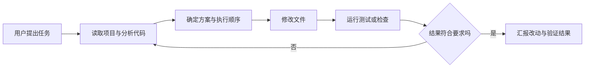
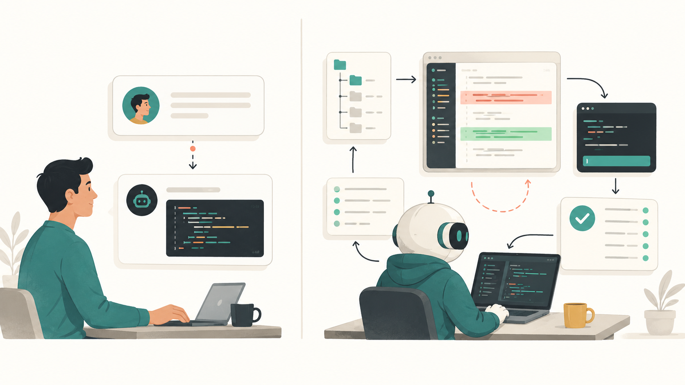

# Codex 是如何工作的：从一句任务到可验证的代码改动

> 难度　基础
>
> 类型　核心概念

## 这篇文章适合谁

第一次看 Codex 工作，很容易觉得它只是“会写代码的 ChatGPT”：你输入一句话，它过一会儿就改好了几个文件。

真正决定使用方法的区别藏在中间。Codex 不只生成一段回答，它会进入项目、查看代码、调用工具、修改文件，再用测试或构建结果检查改动。理解这套过程以后，你会更清楚任务该怎样描述，也知道什么时候应该让它停下来解释，什么时候可以直接执行。


<p align="center">图一　Codex 把任务、代码修改和验证连接成一套完整工作流</p>

## 先记住这个工作模型

可以先把 Codex 理解成一个能使用开发工具的编码 Agent。模型负责判断下一步该做什么，工具负责把动作落到真实环境中。

一次典型任务大致经过下面几个阶段：



这不是一条只能走一遍的流水线。测试失败后，Codex 可能重新读代码、调整判断、再次修改和验证。小任务也可能省略单独展示计划，分析和计划仍然存在，只是没有专门写成一份清单。

## 第一步：用户提出任务

Agent 首先要把自然语言转成可执行目标。

例如你说：

> 修复登录页面中“发送验证码”按钮点击后没有反应的问题，不要改变登录接口，并补一个相关测试。

这句话给出了三类信息：要修复的现象、不能越过的边界、怎样判断完成。Codex 接下来不是立刻猜一段代码，而是先寻找登录页面、按钮事件、验证码请求和现有测试。

如果任务只有“登录坏了，修一下”，Codex 也可以开始调查，但需要探索的范围更大。它可能先检查浏览器报错、最近改动或相关接口。目标越具体，Agent 越容易把时间花在真正的问题上。

## 第二步：分析代码和项目上下文

Codex 并不会在开始任务时把整个仓库一次性塞进模型。真实项目可能有几万甚至几十万个文件，这样做既慢，也会带来大量无关信息。

它通常先查看项目结构和规则，再通过文件名、代码搜索、依赖关系逐步缩小范围。对于刚才的例子，它可能会：

- 读取项目根目录的 `AGENTS.md`、`package.json` 和测试配置；
- 搜索“发送验证码”对应的组件与点击处理函数；
- 查看请求函数、状态管理和相邻测试的写法；
- 用 `git status` 判断工作区是否已有未提交改动。

这个过程叫收集上下文。上下文不等于“读得越多越好”，而是拿到足够证据来回答几个问题：问题发生在哪里，现有项目采用什么写法，本次修改会影响谁，用什么命令可以验证。

Codex 还会受到项目指令和权限限制。比如 `AGENTS.md` 要求使用 `pnpm`、禁止修改生成文件，Agent 应把这些规则带入后续判断。当前工作区里如果已经有你的改动，它也不应随意覆盖。

## 第三步：制定计划

计划的作用是安排动作，不是为了多写一段好看的待办清单。

修复一个拼写错误时，Codex 可能读完文件就直接修改并检查差异。涉及多个模块、数据库迁移或行为不明确时，它通常需要先确定修改范围和验证顺序。一个合理的内部思路可能是：

1. 复现或定位按钮事件没有触发的原因。
2. 用项目现有模式修复组件，不改接口契约。
3. 增加一个能覆盖故障场景的测试。
4. 运行聚焦测试，再检查代码差异。

执行中发现原判断不成立，计划也会变化。例如按钮事件其实触发了，问题出在表单校验提前返回，那么 Codex 应回到代码证据重新判断，而不是硬照着第一版计划改下去。

这也是 Agent 和一次性代码生成的区别之一：它可以根据工具返回的新信息继续决策。

## 第四步：修改文件

找到原因后，Codex 会通过文件编辑工具把改动写入项目。它可能修改组件、测试或配置，也可能新建文件。模型并不是隔空“碰到”硬盘，而是在发起明确的工具调用，例如读取某个路径、应用补丁或运行格式化命令。

好的修改一般有三个特点：

- 范围和任务一致，不顺手重构无关代码；
- 遵循仓库已有的命名、组件和测试模式；
- 保留用户现有改动，不把脏工作区恢复成自己的理想状态。

你仍然应该查看最终差异。Codex 能操作文件，不代表每次判断都正确。尤其是公共接口、依赖升级、权限配置和数据迁移，改动本身比聊天中的解释更值得审查。

## 第五步：验证结果

“文件已经改了”不是完成标准。Codex 需要寻找可以观察的证据。

根据项目类型，验证可能包括：

- 运行与改动相关的单元测试或集成测试；
- 执行类型检查、lint 或构建；
- 启动应用，实际点击页面并查看浏览器状态；
- 检查 `git diff`，确认没有混入无关文件；
- 对照任务要求，检查接口和行为是否保持不变。

如果测试失败，Agent 要先分辨失败是否由本次修改引起。相关失败通常需要继续修复；无关的既有失败应该如实报告，不能为了让输出变绿而随便改测试。

验证也有成本。改一个文案没有必要默认跑十几分钟的全量测试，修改共享认证逻辑却不能只看格式检查。合适的做法是先运行最贴近改动的检查，再根据影响范围决定是否扩大验证。

## Codex Agent 实际上在反复做什么

从内部行为看，一次任务可以简化成一个循环：观察当前状态，选择下一步动作，读取动作结果，再决定后续动作。

```text
目标
  ↓
观察：任务、项目规则、文件内容、命令输出
  ↓
判断：现在缺什么信息，下一步风险是什么
  ↓
行动：搜索、读取、编辑、运行命令或请求确认
  ↓
新结果回到“观察”，直到达到完成标准
```


<p align="center">图二　Agent 根据新结果反复观察、行动和验证，而不是一次性生成答案</p>

因此，同一句提示词在两个项目中可能产生不同步骤。React 项目和 Django 项目的目录、命令、测试方式不同；即使技术栈一样，仓库规则和当前代码状态也会改变 Agent 的选择。

## Codex 和普通 ChatGPT 对话有什么区别

这里说的“普通 ChatGPT 对话”，指主要通过文字问答来获得解释、建议或代码片段的使用方式。ChatGPT 的具体产品能力会继续扩展，某些模式同样可以处理文件或使用工具，所以两者的边界不是“一个能读文件，一个绝对不能”。更实用的区别是工作对象和交付方式。

| 对比项 | 普通 ChatGPT 对话 | Codex 任务 |
|---|---|---|
| 主要对象 | 你在对话中提供的文字、图片或附件 | 选定的项目、代码、配置和开发工具 |
| 常见输出 | 解释、建议、示例代码 | 项目中的实际改动和验证记录 |
| 获取上下文 | 主要依赖你主动提供 | 可以按需搜索和读取工作区 |
| 执行方式 | 通常由你把答案复制到项目并运行 | Agent 可以编辑文件、运行命令，再根据结果继续处理 |
| 完成判断 | 回答是否解决了问题 | 代码是否改对、检查是否通过、边界是否遵守 |



<p align="center">图三　普通对话通常交付回答，Codex 会进入项目并沿着工具反馈继续工作</p>

举个简单例子。你问普通对话“React 按钮为什么点了没反应”，它可以列出常见原因并给出示例。你把一个项目交给 Codex 并要求修复，它可以找到真实组件，检查事件绑定，修改对应文件，运行项目里的测试，最后告诉你改了什么。

普通对话更适合学习概念、比较方案或讨论尚未落地的想法。目标已经位于某个项目中，并且希望得到可审查的文件改动时，Codex 更合适。

## 为什么 Codex 能操作项目文件

答案不是“因为模型知道你的电脑”，而是你把一个运行环境和一组受控工具交给了它。

在本地模式中，Codex 运行在你的电脑上，并以你选择的项目目录作为工作区。官方文档说明，Codex CLI 可以直接针对本地仓库检查文件、编辑代码，并调用机器上已经安装的工具。在桌面 App 中，本地任务也直接作用于当前项目目录；Worktree 模式仍在本机运行，只是把改动隔离到 Git worktree。Cloud 模式则在配置好的远程环境中执行。

文件访问仍有边界，常见控制来自下面几层：

1. **工作区范围**：任务关联到哪个目录，Codex 就从哪里获取项目上下文。
2. **工具能力**：读取、搜索、编辑和命令执行由具体工具完成，模型只能通过这些入口行动。
3. **沙箱**：沙箱决定哪些路径可读、哪些路径可写，以及网络是否可用。
4. **审批策略**：超出当前权限的操作可以要求用户确认，也可以被配置为直接拒绝。
5. **项目规则**：`AGENTS.md` 等指令告诉 Codex 在技术权限允许的范围内，哪些操作仍然不该做。


<p align="center">图四　项目文件位于受控工作区内，工具和外部访问需要经过沙箱与审批边界</p>

权限不是装饰。只读模式下，Codex 可以分析代码但不能落盘修改；工作区写入模式通常允许编辑项目文件，访问工作区外路径或网络时可能需要批准。给出更高权限会减少中途确认，也会扩大错误操作的影响范围。

所以，第一次把项目交给 Codex 时，不要用“它能不能操作电脑”来笼统判断风险。应该具体看三件事：任务在哪个环境运行、当前允许访问哪些路径、什么动作需要审批。

## 一次任务怎样才算真正完成

可以用下面四个问题检查 Codex 的交付：

- 它是否找到了真实原因，而不是只改了表面现象？
- 修改是否只覆盖任务需要的范围？
- 是否运行了与风险相称的验证，并报告实际结果？
- 有没有说明未完成、无法验证或需要人工决定的部分？

Codex 的最后一条消息只是摘要。真正的结果在文件差异、测试输出和运行行为里。把这三样看明白，比研究它用了多少步更重要。

## 参考资料

- [OpenAI 官方文档：Codex CLI](https://learn.chatgpt.com/docs/codex/cli)
- [OpenAI 官方文档：Codex environments](https://learn.chatgpt.com/docs/environments/modes)
- [OpenAI 官方文档：Agent approvals & security](https://learn.chatgpt.com/docs/agent-approvals-security)
- [OpenAI 官方文档：Sandbox](https://learn.chatgpt.com/docs/sandboxing)
