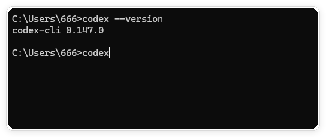
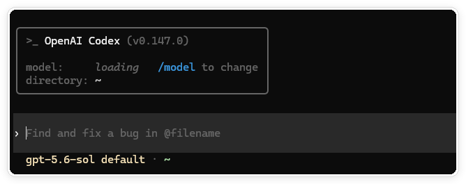
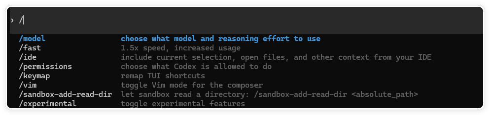
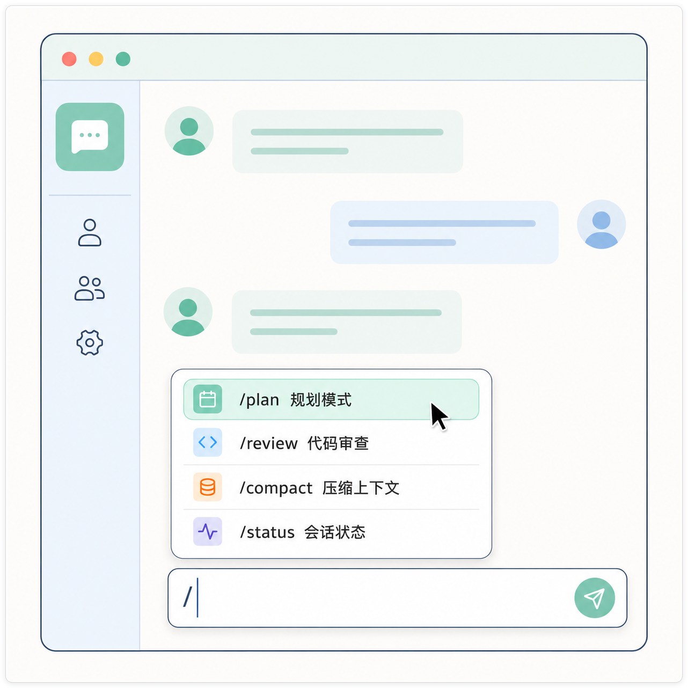
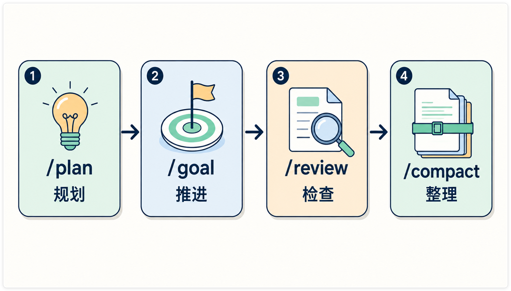
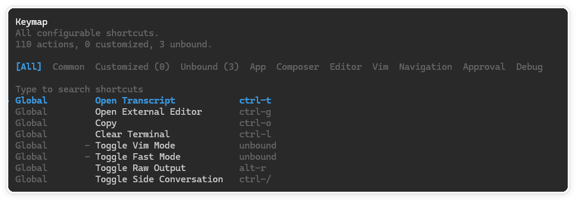

# Codex 斜杠命令与快捷键：先学会控制会话，再让它干活

> 测试环境：Windows 11 24H2；Codex CLI 0.147.0；Codex Desktop 26.810.7004.0；2026-08-18 核验。

在 Codex 里，输入 `/` 打开的是“会话控制面板”：切模型、看状态、压缩上下文、审查改动，都从这里进入。快捷键解决的是另一类问题：打开命令面板、切换会话、复制输出、清理终端。

这两个入口看起来相似，实际并不共用一张清单。CLI、桌面 App 和 IDE 扩展会根据版本、操作系统、账号权限、项目状态和已启用功能显示不同命令。本文把稳定、常用的部分整理出来；完整列表以你当前输入框中按下 `/` 后看到的菜单为准。

## 先分清三个入口

| 入口 | 斜杠命令在哪里输入 | 快捷键在哪里确认 |
| --- | --- | --- |
| CLI | 终端里的 Codex composer，输入 `/` | 官方 CLI 文档、`/keymap` 和当前终端 |
| Desktop App | 对话输入框，输入 `/` | `Settings > Keyboard Shortcuts` |
| IDE 扩展 | Codex 面板的 composer，输入 `/` | IDE 的 Command Palette 与 Keyboard Shortcuts |

斜杠命令是 Codex 的程序动作，不是写给模型的自然语言提示。`/review` 会进入审查流程，但“重点检查登录态是否泄漏”仍然应该作为普通要求写出来。

## 斜杠命令的基本用法

1. 把光标放进 Codex 输入框，输入 `/`。
2. 继续输入几个字母筛选，例如 `/status`。
3. 按 `Enter` 执行；按 `Esc` 关闭菜单。

CLI 正在执行任务时，可以先输入下一条斜杠命令，按 `Tab` 排队。当前回合结束后，Codex 才会解析并执行它。按 `Enter` 则会把新指令注入正在运行的回合。



图一：在临时目录中用真实终端核对 Codex CLI 版本。



图二：启动 Codex CLI 后显示当前版本、模型和工作目录。



图三：在真实 Codex CLI 输入 `/` 后出现的命令菜单。

## Desktop App：先掌握六个高频入口

在最新版 ChatGPT Codex 的输入框里输入一个 `/`，就能打开快捷控制面板。这里的斜杠命令不是传统终端命令，主要控制当前会话的模式、模型、上下文和执行环境。



图四：输入 `/` 打开的不是终端，而是当前会话的快捷控制面板。

如果不想一次记住全部命令，先掌握这六个：

| 命令 | 先用来做什么 |
| --- | --- |
| `/plan` | 复杂任务先规划，再开始执行 |
| `/goal` | 让 Codex 围绕一个目标持续推进 |
| `/review` | 审查未提交修改或对比基础分支 |
| `/compact` | 压缩过长的对话上下文 |
| `/side` | 开启临时支线对话，不打断主任务 |
| `/status` | 查看上下文、Chat ID 和使用额度 |

## Desktop App：按用途查看当前命令

下面按使用目的整理当前文档列出的常见命令。实际菜单会因设备、环境、项目状态、模型和账号权限变化，以输入框中输入 `/` 后出现的列表为准。

### 任务与对话

| 命令 | 作用 |
| --- | --- |
| `/plan` | 规划模式 |
| `/goal` | 设置持续目标 |
| `/review` | 启动代码审查 |
| `/side` | 打开临时支线对话 |
| `/fork` | 复制当前对话 |
| `/compact` | 压缩当前上下文 |
| `/status` | 查看会话状态 |
| `/task` | 开始一个不绑定项目的会话 |

### 模型与环境

| 命令 | 作用 |
| --- | --- |
| `/model` | 选择模型 |
| `/reasoning` | 调整推理强度 |
| `/fast` | 切换 Fast 模式（可用时） |
| `/personality` | 选择回答风格 |
| `/memories` | 管理记忆（可用时） |
| `/project` | 选择项目 |
| `/local` | 在本地工作区运行 |
| `/cloud` | 在云端运行（可用时） |

### 环境与工具

| 命令 | 作用 |
| --- | --- |
| `/cloud-environment` | 选择云环境 |
| `/worktree` | 新建 Git 工作树 |
| `/ide-context` | 开关共享 IDE 上下文 |
| `/init` | 生成 `AGENTS.md` 起始文件 |
| `/mcp` | 查看 MCP 状态 |
| `/approve` | 批准一次自动审查拒绝后的重试 |
| `/feedback` | 提交反馈 |
| `/pet` | 显示或收起桌面宠物（可用时） |

这张表不用背下数量，关键是知道“遇到哪类问题该找哪组入口”。当前文档列出 24 个常见命令，但列表会随版本和权限变化，不应把 24 当成固定产品承诺。

## 复杂任务可以这样串起来

这是一条可选的工作顺序，不是必须执行的脚本：



图五：复杂任务可以按“规划、持续推进、检查、整理上下文”逐步完成。

```text
/plan
  ↓ 梳理方案
/goal
  ↓ 让 Codex 围绕目标持续推进
/review
  ↓ 检查修改
/compact
  ↓ 整理上下文，进入下一阶段
```

任务很短时，不必为了形式强行使用四个命令。`/plan` 适合先调查和拆解，`/goal` 适合持续目标，`/review` 适合检查改动；只有上下文变长时才需要 `/compact`。

## `/`、`$` 和普通文字不是一回事


图六：程序控制、Skill 调用和任务描述分属不同输入层，作用不能互相替代。

| 输入形式 | 负责什么 | 示例 |
| --- | --- | --- |
| `/` | 控制 Codex 的模式、会话和环境 | `/plan`、`/status` |
| `$` | 明确调用某项 Skill | `$plan` |
| 普通文字 | 描述你要 Codex 完成的具体任务 | `请只检查登录页，不要修改文件` |

例如，`/review` 只负责进入审查入口；要审查什么、重点看哪些风险，仍然要用普通文字说明。输入 `$` 也只是选择 Skill，不会自动补齐任务目标、文件范围和验收条件。

## CLI：按任务阶段记常用命令

CLI 的官方清单很长，而且仍在增加。下面按实际工作阶段分组，不把实验功能和低频管理项混在一起。

### 查看和调整当前会话

| 命令 | 作用 | 典型用法 |
| --- | --- | --- |
| `/status` | 查看模型、审批策略、可写目录、上下文和用量 | 怀疑当前设置不对时先看它 |
| `/model` | 选择模型，也可调整可用的推理强度 | 在速度和能力之间切换 |
| `/reasoning` | 调整当前模型的推理强度（入口提供时） | 简单改字与复杂排错之间切换 |
| `/permissions` | 选择 Codex 的审批/权限预设 | 需要收紧或放宽操作权限时 |
| `/ide` | 把 IDE 当前选区、打开文件等上下文带入下一条消息 | CLI 与 IDE 联动时 |
| `/mcp` | 查看已连接的 MCP 工具；`/mcp verbose` 查看详情 | 外部工具没有出现时排查 |
| `/skills` | 浏览并选择可用 Skill | 让下一轮遵循专项工作流 |

### 管理上下文和会话

| 命令 | 作用 | 容易混淆的地方 |
| --- | --- | --- |
| `/compact` | 总结当前对话，释放上下文空间 | 继续同一个任务时用 |
| `/clear` | 清空终端可见内容，并开始新对话 | 同时重置画面和上下文 |
| `/new` | 在同一个 CLI 进程里开始新对话，但不清终端画面 | 只想换上下文、保留滚屏时用 |
| `/resume` | 从已保存会话列表恢复对话 | 不必重新启动 CLI |
| `/fork` | 从当前会话复制出新会话 | 想尝试另一条方案而保留主线时 |
| `/side`（别名 `/btw`） | 打开临时侧聊 | 做短暂的旁支核对，不污染主线 |
| `/rename` | 给当前会话改名 | 便于之后搜索 |

`Ctrl+L` 只清理终端视图，不会开始新对话；它和 `/clear` 不是一回事。`/compact` 也不是删除历史，而是把早期内容压成摘要继续工作。

### 修改前后检查

| 命令 | 作用 |
| --- | --- |
| `/diff` | 查看已暂存、未暂存和未跟踪文件的 Git 差异 |
| `/review` | 让 Codex 审查工作区改动，或与基线分支比较 |
| `/copy` | 复制最近一条已完成输出；等同于 `Ctrl+O` |
| `/ps` | 查看后台终端及最近输出 |
| `/stop`（别名 `/clean`） | 停止当前会话启动的后台终端 |

`/review` 是审查入口，不是“自动通过”按钮。审查后仍要看 diff，并运行和改动范围对应的测试。

### 其他会遇到的命令

`/init` 会生成 `AGENTS.md` 起始文件；`/mention <path>` 把文件加入上下文；`/keymap` 修改 TUI 快捷键；`/theme` 修改语法高亮主题；`/raw` 切换原始滚屏；`/feedback` 提交反馈；`/quit` 和 `/exit` 退出 CLI。`/apps`、`/plugins`、`/hooks`、`/agent` 等命令是否出现，取决于当前安装和配置。



图七：执行 `/keymap` 打开的真实快捷键面板；具体绑定以当前版本为准。

## CLI 最值得记的快捷键

| 操作 | 默认按键或写法 |
| --- | --- |
| 搜索工作区文件并附加 | `@` |
| 搜索提示词历史 | `Ctrl+R` |
| 复制最近一条完成输出 | `Ctrl+O` |
| 执行本地 Shell 命令 | 行首输入 `!` |
| 任务运行时排队下一条消息/命令 | `Tab` |
| 向当前运行回合注入指令 | `Enter` |
| 编辑上一条消息并从那里分叉 | 空输入框连续按两次 `Esc` |
| 退出 CLI | `Ctrl+C`，或 `/exit` |

不要把 `!` 当成普通提示词。它会在当前审批策略和沙箱限制下执行本地命令，仍然需要检查命令内容和作用范围。

## Desktop App：斜杠命令和快捷键

桌面 App 的斜杠菜单同样是动态的。官方参考页当前列出的常见命令包括：

| 命令 | 作用 |
| --- | --- |
| `/status` | 显示聊天 ID、上下文使用量和限额 |
| `/model` | 选择当前聊天的模型 |
| `/reasoning` | 调整推理强度（可用时） |
| `/plan` | 切换多步骤计划模式 |
| `/review` | 审查未提交改动或与基线比较 |
| `/compact` | 压缩当前聊天上下文 |
| `/goal` | 设置持续目标；通常先用 `/plan` 梳理目标 |
| `/local`、`/cloud` | 选择本地或云端执行（能力可用时） |
| `/worktree`、`/fork` | 在隔离 worktree 中运行，或复制本地聊天 |
| `/mcp`、`/feedback` | 查看 MCP 状态，或提交反馈 |

`/init`、`/fast`、`/ide-context`、`/memories`、`/personality` 等也可能出现。启用的 Skills 会出现在斜杠菜单中；输入 `$` 可以显式选择 Skill。不要按旧截图里的条目数量判断安装是否正常。

### Windows Desktop App 快捷键

以下是官方命令页列出的 Windows 绑定。macOS 通常将 `Ctrl` 换成 `Cmd`，但涉及 `Alt` 的组合键要以 macOS 页面为准。

| 操作 | Windows 默认快捷键 |
| --- | --- |
| 命令菜单 | `Ctrl+Shift+P` 或 `Ctrl+K` |
| 设置 | `Ctrl+,` |
| 键盘快捷键设置 | `Ctrl+Shift+/` |
| 打开文件夹 | `Ctrl+O` |
| 返回/前进 | `Ctrl+[` / `Ctrl+]` |
| 放大/缩小字体 | `Ctrl++` / `Ctrl+-` |
| 显示或隐藏侧边栏 | `Ctrl+B` |
| 打开 Review 标签页 | `Ctrl+Shift+G` |
| 显示或隐藏 Review 面板 | `Ctrl+Alt+B` |
| 显示或隐藏底部面板 | `Ctrl+J` |
| 显示或隐藏终端 | ``Ctrl+` `` |
| 清空终端视图 | `Ctrl+L` |
| 快速聊天 | `Ctrl+Alt+N` |
| 新建聊天 | `Ctrl+N` 或 `Ctrl+Shift+O` |
| 搜索历史聊天 | `Ctrl+G` |
| 查找当前聊天内容 | `Ctrl+F` |

`Ctrl+G` 搜索历史聊天，`Ctrl+F` 只查当前聊天。到 `Settings > Keyboard Shortcuts` 可以按命令名搜索，也可以切换到按键搜索后直接按下组合键，查看冲突并修改绑定。

## IDE 扩展：聊天命令和编辑器命令是两套东西

IDE 中既有 Codex composer 的 `/` 菜单，也有 VS Code 等编辑器自己的 Command Palette。前者控制会话，后者把选中的代码或文件交给会话。

### IDE composer 中的常见命令

当前官方 IDE 页面列出的命令包括 `/status`、`/review`、`/plan`、`/goal`、`/local`、`/cloud`、`/cloud-environment`、`/ide-context`、`/compact`、`/model`、`/reasoning`、`/feedback` 等。云端命令只在账号和项目支持云端执行时出现。

### Command Palette 中的 Codex 动作

在 Windows/Linux 按 `Ctrl+Shift+P`，搜索 `Codex` 或命令 ID。官方扩展命令包括：

| 命令 ID | 作用 | 默认键位 |
| --- | --- | --- |
| `chatgpt.newChat` | 新建聊天 | `Ctrl+N` |
| `chatgpt.addToThread` | 把选中的文本加入当前聊天上下文 | 无 |
| `chatgpt.addFileToThread` | 把整个文件加入当前聊天上下文 | 无 |
| `chatgpt.newCodexPanel` | 新建 Codex 面板 | 无 |
| `chatgpt.openCommandMenu` | 打开 Codex 命令菜单 | 无 |
| `chatgpt.openSidebar` | 打开 Codex 侧边栏 | 无 |

自定义步骤：打开命令面板，运行 `Preferences: Open Keyboard Shortcuts`，搜索 `Codex` 或具体命令 ID，点击铅笔图标后输入新组合键。IDE 已经占用的键位会产生冲突提示，先看冲突再保存。

## 一个最小验证流程

在没有敏感文件的临时目录中验证，避免把真实项目内容放进截图或日志：

```powershell
mkdir $env:TEMP\codex-slash-demo
cd $env:TEMP\codex-slash-demo
codex --version
codex
```

进入 CLI 后依次验证：

```text
/
/status
/model
/diff
/compact
```

不要执行 `/delete`、`/logout` 或会修改项目的命令来“证明它存在”。菜单能显示、命令说明与当前入口匹配，就足够完成入口核验。

## 命令找不到时，按这个顺序排查

1. 确认你在 CLI、Desktop App 还是 IDE 扩展中；三者不是同一份菜单。
2. 输入单独的 `/`，再用命令名筛选，不要照抄旧截图。
3. 检查 Codex 版本、账号权限、项目是否支持云端或 worktree。
4. 检查 Skill、插件、MCP 和实验功能是否已启用。
5. 回到官方文档核对命令是否改名、迁移或暂时不可用。

## 参考资料与核验说明

- [OpenAI Codex CLI 斜杠命令](https://developers.openai.com/codex/cli/slash-commands)
- [OpenAI Codex Desktop 斜杠命令](https://developers.openai.com/codex/reference/slash-commands)
- [OpenAI Codex Desktop 命令与快捷键](https://developers.openai.com/codex/app/commands)
- [OpenAI Codex IDE 斜杠命令](https://developers.openai.com/codex/ide/slash-commands)
本文只依据 OpenAI 官方文档，并在 2026-08-18 用 `codex 0.147.0` 在临时目录核验了 CLI 菜单。用户提供的第三方文章仅用于排重，没有引用、改写或列入参考资料。X/Twitter 当前没有可用的 agent-reach 后端，因此没有把不可核验的 X 帖子当作事实来源。Codex 更新很快，命令和默认键位以本机菜单与官方文档为准。

## 继续学习 Codex

更多中文教程、任务方法和实战案例，可以访问 [CodexGuide](https://codexguide.io)。

## 关注公众号

扫描下方二维码，获取后续教程更新。斜杠命令或快捷键在实际使用中遇到问题，也欢迎扫码交流。


