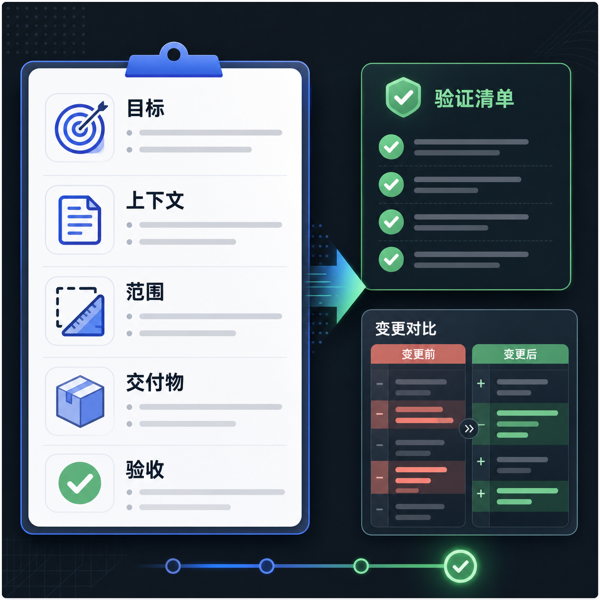
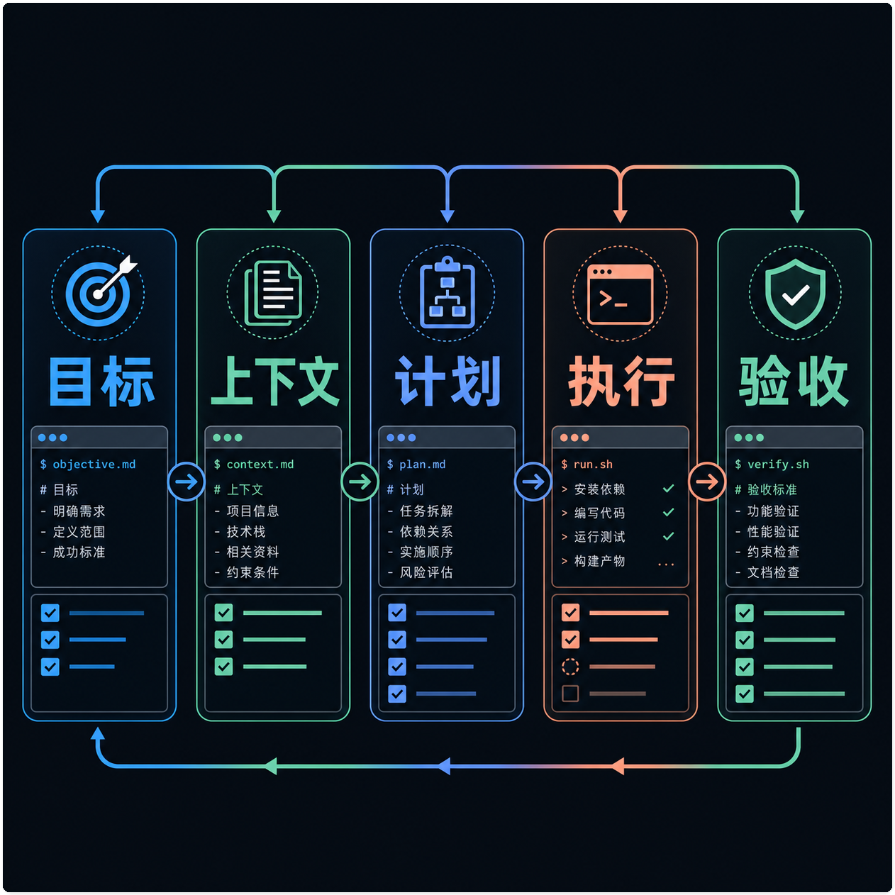
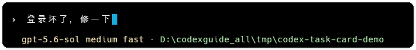
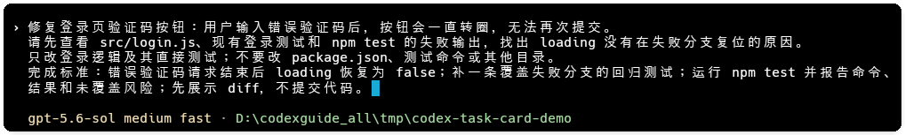
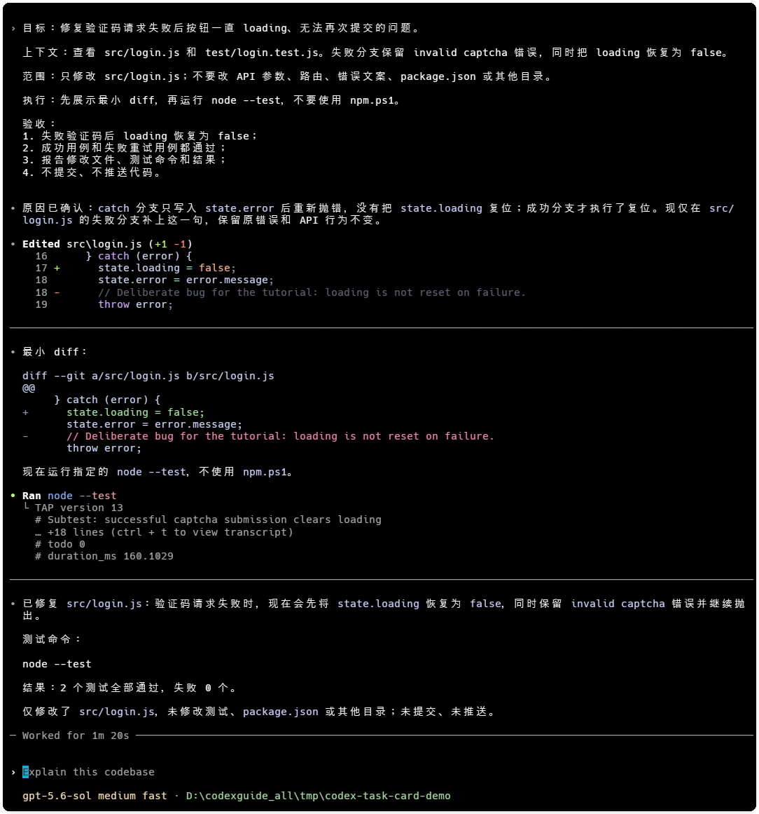

# 别再对 Codex 许愿：一张任务单让它少走弯路

## 先说问题

任务交给 Codex 后，返工通常来自信息缺口。你以为已经说清楚了，它却不知道目标、入口、边界或怎样才算完成。

Codex 会读文件、搜代码、运行命令和修改项目，但它不知道你的业务目标，也不会自动知道哪些目录不能碰。任务说明要解决的，就是这些判断信息。

如果你还不熟悉 Codex 的工作方式，可以先读《别再把 Codex 当成“会写代码的 ChatGPT”：一文看懂它到底怎么工作》，再回到本文写任务。



> 图一：任务说明书把目标、范围、交付物和验收证据放在一起。

## 一张任务卡要写什么

任务卡只需要回答四个问题：

- **目标**：最终要改变什么行为或结果。
- **上下文**：入口、现象、报错、相关文件和必要参考资料。
- **边界**：允许修改哪里，哪些接口和行为必须保持不变。
- **验收**：用什么测试、页面行为、日志或 diff 判断完成。

信息不会改变判断时就删掉。任务卡不是背景百科，写得越长不等于越清楚。

## 五步闭环

1. **目标**：说“错误验证码后按钮恢复可点击”，不要只说“修一下按钮”。
2. **上下文**：给出页面、调用点、报错和复现步骤。
3. **计划**：原因不明或跨文件时，先让 Codex 只读调查，必要时使用 `/plan`。
4. **执行**：确认范围后一次处理一个结果，每轮留下清晰 diff。
5. **验收**：运行约定检查，报告通过项和未核验项。



> 图二：一次任务可以循环多轮，但不能跳过验收。

第一次处理陌生仓库时，先读文件和给计划，再开放限定修改权限。删除、发布、改生产配置等动作，应停在 diff 或预览，等人确认。

如果你经常重复提醒 Codex 先读哪些规则，可以参考《别再重复提醒 Codex：用 AGENTS.md 让它读项目先读规则》。

## 同一个任务，逐轮补清楚

下面四版提示词只增加会改变判断的信息。

### 第 1 版：只有愿望

```text
登录坏了，修一下。
```

它不知道入口、现象、范围和验收方式，第一步不可预测。



> 图三：只有愿望时，Codex 需要自行猜测问题入口。

### 第 2 版：补上现象

```text
修复登录页验证码按钮：输入错误验证码后，按钮一直转圈，无法再次提交。
先定位请求和 loading 状态，说明原因和复现方式，暂时不要改文件。
```

这版给了可复现现象，也规定先调查。

### 第 3 版：补上范围和边界

```text
请先查看 src/pages/login/、验证码请求封装和现有登录测试。
只改登录页及直接测试；不要改 API 参数、路由、错误文案和全局请求封装。
先给调查结论和最小改动计划，等待确认后再编辑。
```

现在 Codex 知道先看哪里、能改哪里，以及什么时候停手。

### 第 4 版：补上完成标准

```text
完成标准：
1. 错误验证码请求结束后按钮恢复可点击，不重复发送请求；
2. 补一条失败分支回归测试；
3. 报告测试命令、结果和未覆盖风险；
4. 先展示 diff，不提交代码。
```

完成标准要能被复现或检查。若某项无法执行，就标记“未核验”，不要用猜测填空。

准备第一次改项目时，可以先看《第一次让 Codex 改项目，我建议你先从这个小任务开始》，从一个十几分钟内能验收的小任务起步。



> 图四：第四版把行为、测试、报告和停手点写成完成标准。

## 可以直接复制的最小任务卡

```text
目标：希望最终出现什么行为或结果？
上下文：入口、现象、报错、相关文件或参考资料。
工作方式：原因不明时先只读调查并给计划。
范围：允许修改哪些文件或目录？
约束：哪些接口、文案和行为必须保持不变？
交付物：修改文件、测试结果、必要的 diff 和未核验风险。
验收：目标行为可复现，检查命令已运行，变更没有越界。
```

发出任务前，用 30 秒检查四件事：结果是否说清楚，入口是否明确，边界是否够用，完成后能否找到证据。



> 图五：执行阶段只修改目标文件，并用测试结果验证成功和失败分支。

## 继续学习

更多 Codex 教程和实操案例，可访问 [CodexGuide](https://codexguide.io/?utm_source=wechat&utm_medium=article&utm_campaign=codex-task-card&utm_content=closing-website-01)。

如果你在任务拆分、权限边界或验收设计上遇到具体问题，可以扫码添加微信，带着脱敏后的任务卡继续交流。也欢迎在评论区回复“任务卡”。


