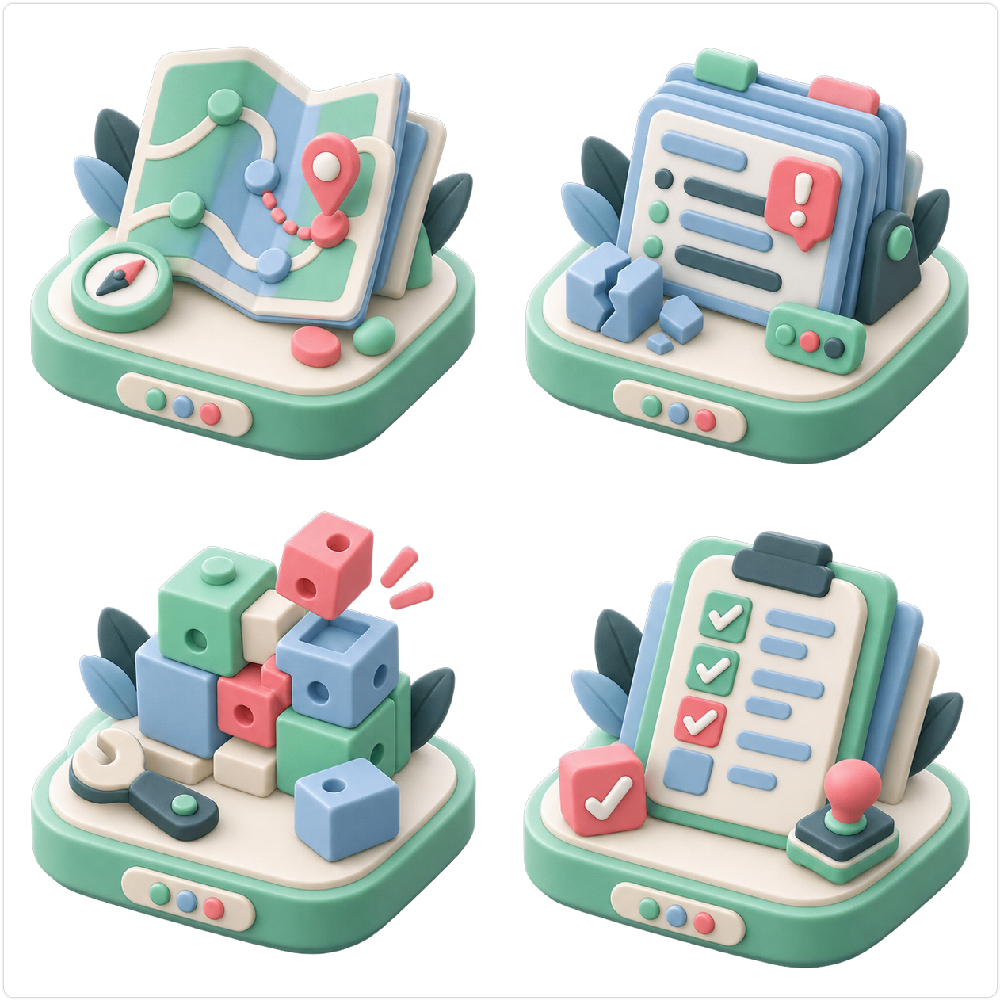
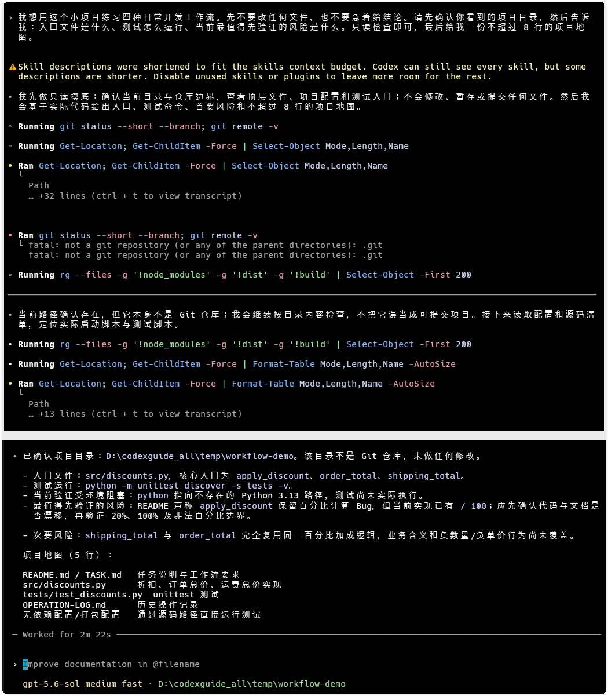
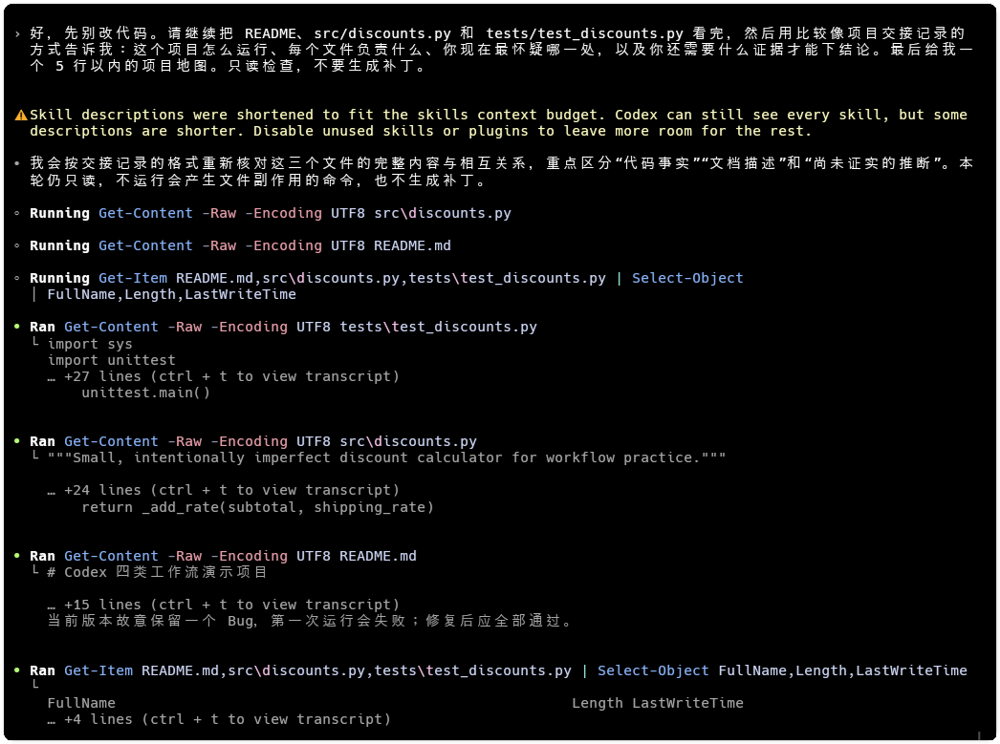
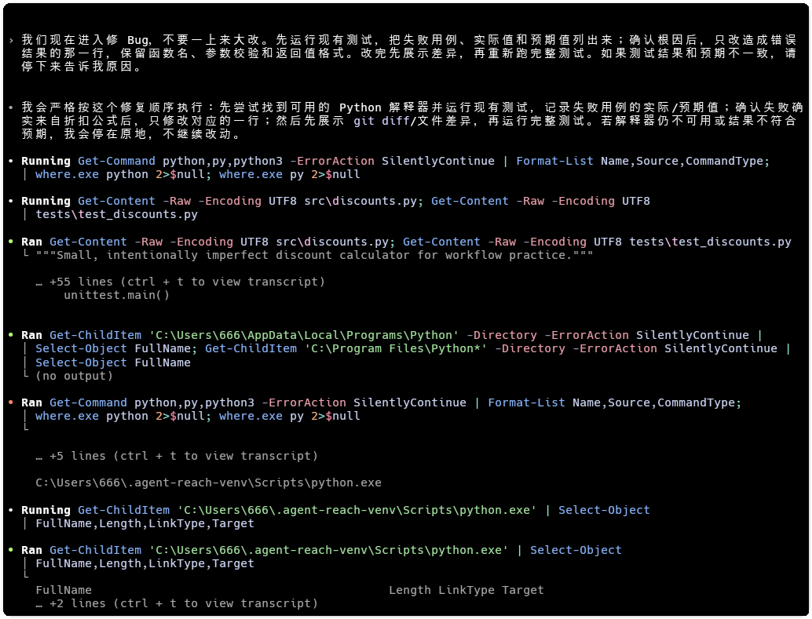
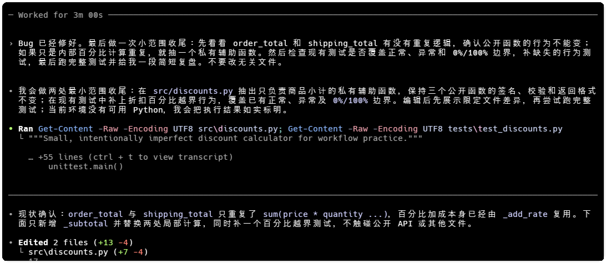

# 四类日常工作流：探索、修 Bug、重构与写测试

> 测试环境：Windows 11（OS Build 26100）；Codex Desktop 26.814.5517.0；Codex CLI 0.147.0；Python 3.13.5；2026-08-21 核验。

> 状态　测试已核验
>
> 当前进度　四类流程、演示项目和 5 张正文图（1 张 HIAPI 总览图、4 张操作截图）已整理；已在 `temp/workflow-demo` 中完成 6 项 `unittest` 测试核验，全部通过。
>
> 难度　基础到进阶
>
> 类型　工作流

## 写作定位

同一句“先看看项目再修改”，放在不同任务里，下一步可能完全不同。探索陌生项目先建立地图，修 Bug 先复现，重构先守住原有行为，写测试先说清楚要防什么风险。

我用 `temp/workflow-demo` 做了一个小演示。它有折扣计算、订单总价和一组 `unittest` 测试，README 里保留了一个待核对的百分比风险。下面按一次真实任务的顺序走一遍，重点看每一步需要什么证据，以及什么时候应该停下来。

> 图一　项目地图、错误日志、重构积木和测试清单，分别对应四类任务的起点。

如果你还不熟悉 Codex 的工作方式，可以先看《别再把 Codex 当成“会写代码的 ChatGPT”：一文看懂它到底怎么工作》，再回到本文看具体任务。

### 1. 探索陌生项目

- 先读项目规则、README、依赖和目录入口。
- 从真实问题出发缩小阅读范围，不要求一次解释整个仓库。
- 产出项目地图、关键文件和仍未确认的问题。
- 在没有修改请求时保持只读。

我先让 Codex 只读检查 README、源码和测试文件，并要求它用项目交接记录的方式回答。它给出的入口文件是 `src/discounts.py`，测试命令是 `python -m unittest discover -s tests -v`，同时指出折扣百分比和订单金额计算值得优先核对。

> 图二　第一轮只读检查确认了项目边界、入口文件和测试入口。

随后我继续追问文件职责和未确认的问题。这个阶段不生成补丁，也不替我决定需求。这样做的好处很直接，后面的修改有明确范围，出现误判时也能回到证据上。

> 图三　探索结论把文件职责、测试命令和待核对风险放在了一起。

如果你经常需要提醒 Codex 先读哪些规则，可以继续看《别再重复提醒 Codex：用 AGENTS.md 让它读项目先读规则》。

### 2. 修 Bug

- 收集报错、日志、复现步骤和预期行为。
- 先证明故障在哪里，再修改代码。
- 补能稳定复现问题的测试或检查。
- 区分本次修改造成的失败和已有失败。

修 Bug 的第一步是证明问题存在。我的 Prompt 要求 Codex 先检查 `python` 和 `python3` 是否可用，再运行现有测试；如果运行时不存在，就把环境阻塞写清楚，也不把“应该通过”当成实际结果。

这张截图记录的是当时工作区没有可直接调用 Python 的状态，不能代表最终测试结果。随后启用 Python 3.13 后重新运行了原命令，把实际回归结果补进了本文和处理报告。

> 图四　测试命令未执行时，先记录环境阻塞，不能把预期结果写成通过。

### 3. 重构

- 写清楚要改善的结构问题和不能变化的外部行为。
- 先建立测试或基线，再分小步修改。
- 每一步检查差异，避免顺手扩大范围。
- 性能重构需要前后数据，不能只凭代码看起来更整洁。

重构前先写下不能变化的行为。这个演示里，`order_total` 和 `shipping_total` 的公开函数名、参数和结果格式都要保留，只抽出内部重复的百分比计算。每一步都看差异，发现改动越过范围就停下来。

### 4. 写测试

- 先找现有测试框架、命名和夹具用法。
- 说明要覆盖的风险，避免追求行数或数量。
- 同时安排成功、失败和边界场景。
- 让测试对行为负责，少绑定内部实现。

测试设计要先列出会造成损失的场景，再决定断言对象。折扣函数至少要考虑正常折扣、负价格异常和 0%/100% 边界；订单总价和运费则要保留各自的行为断言。

这次操作完成了有限范围的代码编辑。随后在可用的 Python 3.13 环境中运行 `python -m unittest discover -s tests -v`，共运行 6 项测试，全部通过，退出码为 0。

> 图五　重构范围已经收窄到内部辅助函数，测试未执行的原因也被明确记录。

### 5. 四类任务放在一起比较

把四类任务放在一起看，差别主要出现在起点、第一份证据和人工检查点。

### 6. 混合任务怎样拆

以“接手陌生项目并修复一个问题”为例，展示探索如何结束、Bug 调查何时开始，以及什么时候才适合顺带补测试。避免四条流程互相套娃。

## 四类任务放在一起比较

| 任务 | 第一份证据 | 先做什么 | 需要停下来的地方 |
|---|---|---|---|
| 探索 | 项目规则、README、目录和入口文件 | 画出最小项目地图 | 还没有修改请求时保持只读 |
| 修 Bug | 报错、日志、复现输入和预期行为 | 先确认故障能稳定重现 | 根因不清楚时不扩大修改范围 |
| 重构 | 行为基线、性能数据或现有测试 | 先写清不能变化的行为 | 每个小步都检查差异 |
| 写测试 | 风险场景和公开行为 | 先决定断言对象 | 测试未运行时明确标成未核验 |

这张表的作用是帮你选起点。接手陌生项目并不等于立刻进入 Bug 调查，重构也不该替代测试设计。

## 混合任务怎么拆

“接手一个陌生项目，顺便修个问题”通常包含四段动作。先用探索确认入口和规则；出现稳定复现后，才进入 Bug 调查；修复通过原有检查后，再考虑是否有必要重构；最后补测试，覆盖这次改动真正可能破坏的行为。

每次切换都要留下一个人工确认点。探索结束时确认阅读范围，修复前确认复现证据，重构前确认外部行为，测试结束时确认命令确实执行过。这样即使环境缺工具，也能准确说出卡在哪里。

## 发布前核验结果

已在 `temp/workflow-demo` 中完成发布前核验：`python -m unittest discover -s tests -v`，运行 6 项、通过 6 项、失败 0 项，退出码 0。当前 4 张操作截图仍保留此前的操作过程，其中图四和图五展示的是当时的环境阻塞/未执行证据；最终结论以本次实际命令输出为准。

如果你准备把这套流程迁移到自己的项目，可以到 [CodexGuide](https://codexguide.io/?utm_source=wechat&utm_medium=article&utm_campaign=codex-four-workflows-20260820&utm_content=closing-website-01) 继续查阅相关教程。

如果你的项目也遇到“环境不完整、测试跑不起来或改动范围拿不准”的情况，可以扫码添加微信，带着脱敏后的报错、目录和测试命令一起交流。

