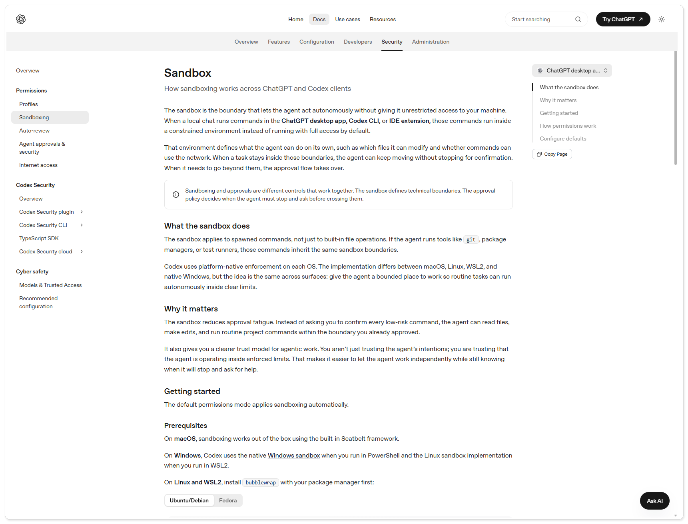
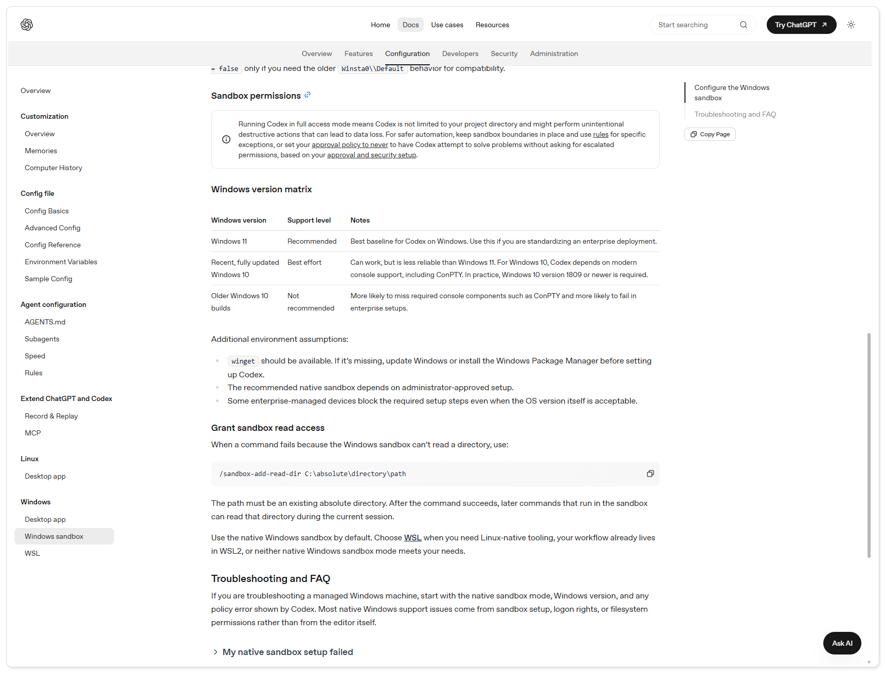

# 安全与风险边界：到底该不该放手让它碰你的代码

> 状态　正文待发布
>
> 当前进度　已完成风险案例整理、官方资料核对、正文润色、四张正文配图和历史文章埋点；本机操作截图仍待作者按脱敏测试环境补拍，三条历史文章标题待公众号后台绑定。
>
> 难度　基础
>
> 类型　风险判断

> 测试环境：Windows 11 24H2（build 26100）；Codex CLI 0.147.0；2026-08-20 核验。

如果你还不熟悉 Codex 接收任务和执行命令的方式，可以先读《别再把 Codex 当成“会写代码的 ChatGPT”：一文看懂它到底怎么工作》；已经上手的读者直接进入下面的止损步骤即可。

## 先处理警告，不要和它赌一把

Codex 出现“提示词可能违反使用政策”的错误，或者突然连续弹出异常提醒时，第一反应不该是换一种说法继续轰炸。也不要在警告窗口里急着补充身份证明、公司资料、密钥或完整项目压缩包。警告的成因可能是提示内容、上下文、网络或服务端误判，单凭一条错误信息无法判断是哪一种。

我建议按这个顺序止损：

1. 停止当前会话，不要反复提交同一段被拦截的提示。
2. 如果会话已经混入敏感信息，先记录发生时间和错误原文，再按产品提供的删除入口清理会话；不要为了“证明自己没问题”继续上传更多资料。
3. 检查网络是否稳定，确认没有频繁切换出口、异常代理或共享 IP 的情况。网络检查只能排除一类因素，不能保证解除限制。
4. 重启 Codex，先开一个全新的、内容最小的测试会话。若新会话仍然出现同样的政策错误，停下来走官方支持渠道，不要继续试探边界。

这套处理方法是降低损失的建议，不是“删掉对话就一定解封”的承诺。账号状态、内容审核和风控决定权仍在服务提供方。

## 两种警告不要混为一谈

“Invalid prompt: your prompt was flagged as potentially violating our usage policy”属于内容或风控层面的拒绝。它不等于 Codex 已经执行了危险命令，也不等于账号一定会被封。新开会话有时能绕开异常上下文，但如果提示本身确实触及限制内容，换会话不能替代修改任务目标。

另一类是执行层警告：Codex 要访问工作区外的文件、联网、删除目录，或者需要提高权限。它关注的是“这一步能不能执行”，不是“这段文字是否违规”。这时要看命令、目标路径和影响范围，不能只看一个醒目的“允许”按钮。

图一　OpenAI 官方文档将沙箱描述为技术边界，将审批描述为越界前的停顿机制。来源：OpenAI Developers，2026-08-21 核验。

### 新开会话能解决什么

新开会话的价值，是把可能已经污染的上下文清掉。长对话里如果出现了大量网页内容、代码片段、系统错误或被拦截的提示，后续每次重试都可能继续带上同一段上下文。换到一个空会话，用最小化的非敏感任务验证服务是否恢复，这是合理的排查动作。

但新会话不是“绕过审核”的技巧。下面三种情况不能靠换会话解决：

- 原始任务本身就涉及受限制的内容。
- 任务需要上传密钥、身份证明、客户数据等敏感资料。
- 账号或网络出口已经触发服务端风控。

遇到这些情况，继续换标题、拆分提示、反复提交，只会让排查变得更混乱。保留错误原文和时间，停止试探，转到官方支持流程更稳妥。

## 误删文件的复盘：问题不在临时目录四个字

2026 年 7 月，OpenAI 工程负责人 Thibault Sottiaux 公开回应了少量 GPT-5.6 在 Codex 中意外删除文件的报告。公开转述中反复出现的条件是：运行在 Full access、没有沙箱边界，并且关闭了 Auto-review。最严重的路径错误与 `$HOME` 有关：模型本想把它改成临时工作目录，却在清理时把真正的 home 目录当成了删除目标。

Codex 创建临时文件夹本身并不能解释这起事故。真正需要追问的是两个失败点：删除前没有再次核对目标；临时路径的变量复用让一个本应短命的目录指向了真实用户目录。只要执行器允许无审批地运行破坏性命令，模型一次路径判断错误就有机会变成真实损失。

OpenAI 后续公开提到的改进方向包括：在删除前核验目标、创建新的临时目录、避免复用系统环境变量、加强对高风险删除命令的审核、让 Full access 更难被误开，并用事故回放和专项评测继续检查。公开表述只到“在回放评测中显著减少”，没有承诺以后绝不发生。写作时需要保留这个限定。

图二　OpenAI Windows Sandbox 文档明确提醒，Full access 可能导致非预期的破坏性操作和数据损失。来源：OpenAI Developers，2026-08-21 核验。

这次修复值得关注的地方，是它没有只给模型补一句“请小心删除”。防线被拆到了几个位置：模型收到的开发者指令、临时目录的创建方式、执行器对删除命令的识别、权限模式的默认入口、Auto-review 的拦截，以及针对真实失败轨迹的回放评测和训练。任何一层都可能失效，所以不能把“模型记住了规则”当成唯一保险。

换句话说，安全边界不只属于模型。执行器要能拒绝越界命令，权限系统要让高风险模式显眼，审核器要能发现破坏性动作，评测要持续复现事故，用户还要保留最后的人工检查点。对 Coding Agent 来说，这些部分合在一起才叫 harness。

图三　Agent harness 将模型指令、执行器、沙箱、审批、自动审核和事故回放等环节串成多层防线。AI 生成/教学示意，不代表 Codex 当前界面。

这次复盘说的是官方层面的事故，日常使用中类似的放手代价我也遇到过，记录在《别一上来就让 Codex 改项目，我已经替你踩过坑了》里，可以对照着看。

## 现在该怎么保护自己的文件

把下面几件事当成最低限度的工作习惯：

- 重要项目先提交或打包一个可恢复的版本，再让 Agent 改动。
- 真实账号、生产数据库、客户资料和密钥不要放进一次性试验目录。
- 任务只需要改项目文件时，就把工作范围留在项目目录；遇到权限错误，先缩小任务或补充明确的只读路径，不要直接把权限拉满。
- 任何包含递归删除、覆盖、迁移、发布或外发数据的命令，都要人工看完整命令和完整目标路径。
- 测试通过后仍然查看 `git diff --stat`、`git diff` 和实际运行过的测试。通过只说明某些检查通过，不说明未覆盖的行为没有变化。

### 按四个问题判断风险

图四　判断任务前，先看资产、回退能力、验证方式和影响范围。AI 生成/教学示意，不代表 Codex 当前界面。

1. 它会接触什么：示例代码、个人文件、凭据、客户数据，还是生产资源？
2. 能不能回退：有 Git、备份、事务或可丢弃环境吗？
3. 怎么验证：有聚焦测试、构建、预览和人工复核吗？
4. 出错会怎样：影响一个分支，还是会删除、发送、发布或改变云资源？

四个问题里只要有一个答不上来，就把任务降级为只读分析，或先建立隔离环境。风险要结合资产、回退能力和影响范围来判断，红黄绿标签只能做提示。

## 适合交给 Codex 的任务，也要有边界

代码搜索、只读解释、隔离分支里的小范围修改，以及能运行聚焦测试的修复，通常适合交给 Codex。前提是目标文件明确、变更可回退、结果有人检查。

认证、支付、加密、权限、依赖升级、公共接口、大范围重构、生产 DDL、批量删除和对外发布，都应该保留人工检查点。检查时要看实际差异、命令和目标资源，不能只扫一眼摘要。

如果你还没让 Codex 改过真实项目，可以先从《第一次让 Codex 改项目，我建议你先从这个小任务开始》里的低风险任务练手，再回到上面的边界清单逐条对照。

## Mac 内存问题要单独看

不少用户还会遇到另一种烦恼：Codex Desktop 在 Mac 上运行一段时间后占用越来越高。长会话历史、图片附件、本地工具和子进程都可能增加客户端负担，但这和“误删文件”不是同一个安全事件，也不能用一次安全更新推断内存问题已经解决或必然存在。

目前能确认的是，Codex 会在本地保存会话历史，并提供关闭历史持久化、限制历史文件大小等设置。至于某个版本到底是哪一部分占内存，需要在目标机器上看 Activity Monitor，记录会话长度、附件数量、子进程和重启前后的内存曲线。没有这组数据时，最好写成“待实测的稳定性问题”，不要写成官方已经承认的缺陷。

实用的处理方式很朴素：长任务拆成短会话，减少不必要的图片和整仓库上下文，完成一个阶段就关闭闲置线程；如果内存持续上涨，先保存工作结果、退出并重启客户端，再决定是否提交反馈。这样做解决的是资源占用，不是权限风险，两个问题要分开处理。

## 和下一篇的分工

这篇只回答“为什么要收紧、出现警告怎么止损、哪些动作不能直接放手”。下一篇《权限、沙箱与审批：什么时候放行，什么时候收紧》再回答“权限、沙箱和审批分别控制什么、审批窗口该看哪些字段、如何在可丢弃仓库里验证读写和联网边界”。具体菜单、CLI 参数和 `config.toml` 不在本篇展开，避免把事故复盘写成配置手册。

## 资料边界

- OpenAI 官方文档用于核对沙箱、权限、审批和 Windows 隔离机制。
- 文件删除案例的 `$HOME` 细节来自负责人公开表述的媒体转述；原始 X 后端本轮无法直接验证，因此正文不把它包装成已读取的官方长文。
- Mac 客户端内存占用属于用户社区和个人观察，不能与文件删除安全事件混为同一项官方修复。Codex 文档只说明本地会保存会话历史，并提供历史持久化和大小上限配置；具体内存曲线仍需在目标版本上实测。

如果你准备把这套判断放进自己的工作流，可以继续看 CodexGuide 的[进阶教程](https://codexguide.io/advanced?utm_source=wechat&utm_medium=article&utm_campaign=codex-safety-risk-boundary&utm_content=closing-website-01)，里面会把权限、沙箱和审批拆成可操作的配置与检查步骤。

如果你的情况涉及账号异常、真实数据或无法回退的操作，可以扫码添加微信，带着错误原文、发生时间和脱敏后的操作上下文一起交流。

---

## 配图素材备用区（暂不计入正文图号）

> 本节是写作阶段的备份材料清单，不计入正文图号。发布前只把经过核验、且确实服务于对应段落的截图移入正文。

### 官方与可核验操作界面

- `图一.png`：适用于“两种警告不要混为一谈”，画面展示 OpenAI 官方 Sandbox 文档对技术边界与审批关系的说明；来源：[Sandbox](https://developers.openai.com/codex/concepts/sandboxing)，OpenAI Developers，2026-08-21 浏览器直接核验。时效提示：文档导航和措辞可能随版本变化。
- `图二.png`：适用于“误删文件的复盘”，画面展示 OpenAI Windows Sandbox 文档对 Full access 可能造成破坏性操作和数据损失的警告；来源：[Windows sandbox](https://developers.openai.com/codex/windows/windows-sandbox)，OpenAI Developers，2026-08-21 浏览器直接核验。时效提示：平台版本矩阵和警告措辞可能随版本变化。

两张图是官方文档证据，不替代作者后续补拍的本机警告、审批和删除目标核验画面。

### 视频教程与其他资料来源（仅作来源，不自动作为配图）

- [Codex Permissions Explained: Sandbox vs Approval Policy](https://www.youtube.com/watch?v=zXTa_7Tc2EY)：Coding With Chuck，YouTube，检索于 2026-08-20；仅作候选观看链接，未提取截帧，不能作为正文配图。
- [OpenAI fixes Codex bug that deleted real user files without permission](https://the-decoder.com/openai-fixes-codex-bug-that-deleted-real-user-files-without-permission/)：Matthias Bastian，The Decoder，2026-08-20；用于核对公开复盘的转述，不作为官方原文或操作截图。
- [OpenAI acknowledges GPT-5.6 may accidentally delete files](https://www.infoworld.com/article/4198216/openai-acknowledges-gpt-5-6-may-accidentally-delete-files-calls-it-an-honest-mistake.html)：Anirban Ghoshal，InfoWorld，2026-07-17；用于交叉核对负责人公开表述，不作为正文配图。

### 需要作者亲自截图

- [ ] `01-permission-mode-selector.png`：打开 Codex 的权限设置或权限选择器，展示当前模式和可选的审批边界；隐藏账号、工作区路径和任何令牌；停在确认/应用按钮之前。
- [ ] `02-approval-prompt-before-command.png`：在隔离测试项目中触发一个需要批准的命令，展示命令、目标目录和批准提示；使用模拟项目，不包含真实密钥或客户数据；停在批准按钮之前。
- [ ] `03-git-diff-review.png`：在测试分支运行 `git diff --stat` 与 `git diff`，展示文件范围和关键差异；隐藏私人路径；停在人工复核阶段。
- [ ] `04-focused-test-result.png`：运行与改动对应的聚焦测试，展示实际命令和结果；使用脱敏测试数据；停在测试结果页，不执行发布或生产操作。
- [ ] `05-risk-checklist.png`：展示文章中的低/中/高风险任务判断表或终端检查清单；不要出现真实项目名、凭据、客户信息或生产地址。
- [ ] `06-policy-warning-new-session.png`：在脱敏测试会话中展示“prompt was flagged”或类似异常提示及新开会话后的空白状态；不要反复提交违规内容，不要显示账号、邮箱、网络地址或支持工单信息；停在新会话可输入的位置。
- [ ] `07-delete-target-review.png`：在可丢弃测试目录中展示删除命令的完整目标路径、删除前核对和 Git/备份状态；只使用模拟目录，停在执行前，不能真的删除用户目录。

### 查找记录

- 官方网页：已通过 Jina Reader 核验 OpenAI Codex 权限/安全导航、Git `git-diff` 文档和 OWASP Top Ten 页面；状态 `verified-direct`，链接与核验信息见工作区 `research-log.md`。
- YouTube：`yt-dlp` 搜索到权限/沙箱教程候选，状态 `verified-index`；未把封面或缩略图当作素材，也未提取未经检查的帧。
- B 站：Agent Reach doctor 显示搜索 API 可用，但本轮没有合格的、可证明具体操作状态的候选，状态 `no-qualified-result`。
- X、小红书、Reddit：没有活动后端，状态 `unavailable`；不声称已直接检索。
