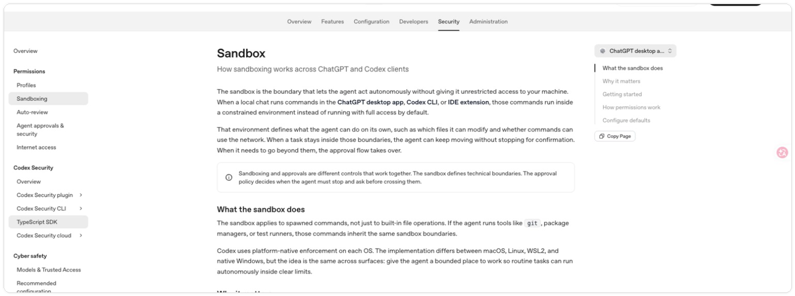
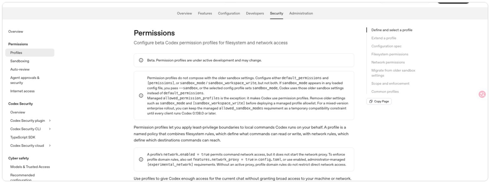
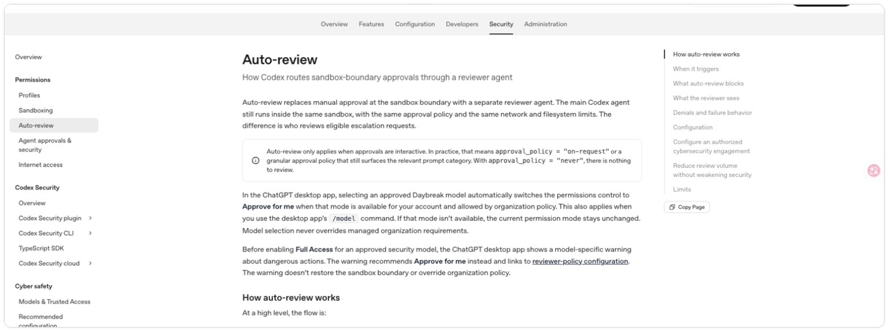
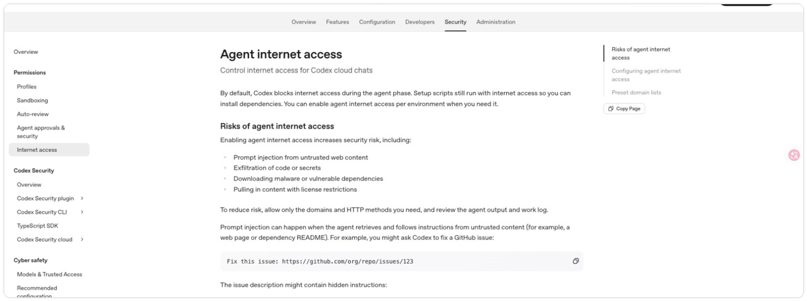

# 权限、沙箱与审批：什么时候放行，什么时候收紧

> 测试环境：Windows 11 24H2（构建 26100）；Codex Desktop 26.814.5517.0；Codex CLI 0.147.0；2026-08-21 核验。

> 状态　未完成
>
> 当前进度　已完成选题、内容规划、官方资料核对与素材初始化；正文、权限实验和作者实拍尚未完成。
>
> 难度　基础
>
> 类型　核心概念

## 写作边界

这篇解决日常使用中的判断问题：Codex 为什么有时只能读、不能写，为什么访问网络或工作区外文件会停下来询问，以及面对审批提示时应该看什么。

第 05 篇已经讲过安全警告、误删复盘和止损原则；本篇不重复事故叙述，直接把这些原则落到权限模式、沙箱边界、审批窗口和可丢弃测试仓库。

具体配置项、配置文件和团队级安全策略留给「配置模型与权限安全」栏目。这里不鼓励读者为了少点几次确认就直接开最大权限。

## 正文计划

### 1. 先把三个概念分开

- 权限说明当前任务被允许做什么。
- 沙箱限制文件、命令和网络能够触达的边界。
- 审批决定超出当前边界的动作是否需要人确认。

*图二　OpenAI 官方文档对 Sandbox mode 与 Approval policy 的并列说明。它用于核对概念边界，不代表某个具体桌面端会显示完全相同的文案。*

用一个“读取项目、修改文件、安装依赖”的任务贯穿三个概念，避免只讲抽象定义。

*图一　油画风格教学示意图。外层表示网络与工作区边界，中间表示沙箱范围，右侧审批闸门表示需要人工确认的动作。该图为 AI 生成示意，不代表 Codex 当前界面。*

### 2. 常见动作分别需要什么能力

- 读取工作区文件。
- 写入或新建项目文件。
- 执行测试、构建和本地脚本。
- 访问网络、安装依赖或调用外部服务。
- 读取工作区之外的路径。

*图三　OpenAI 官方 Sandbox 页面，说明沙箱如何限制代理可触达的文件、命令和网络边界。*

正式文章会按入口和版本实测，不提前假定所有环境行为一致。

### 3. 审批窗口里应该看什么

- Codex 准备执行的具体动作。
- 目标路径、命令参数和外部地址。
- 为什么当前任务需要这一步。
- 影响能否回退，是否会触碰账号、数据或生产环境。
- 有没有权限更小的替代做法。

### 4. 哪些情况可以放行

- 动作与当前目标直接相关。
- 目标明确，影响范围容易检查。
- 结果可以回退，并且已有版本控制或备份。
- 命令和访问对象经过人工确认。

*图四　OpenAI 官方 Permissions 页面中的配置档位示例，具体名称和可用选项可能随版本变化。*

### 5. 哪些情况应该收紧或拒绝

- 请求与任务无关，或理由说不清楚。
- 命令包含宽泛路径、批量删除或不可逆操作。
- 涉及生产数据库、真实客户数据、密钥和账号权限。
- 工作区已有重要改动，却没有隔离或回退方案。

*图五　OpenAI 官方 Auto-review 页面，帮助理解哪些动作可以自动审阅，哪些动作仍应停下来交给人确认。*

### 6. 用最小权限完成一次真实任务

设计三个对照场景：只读分析、工作区内修改、需要网络访问的依赖操作。展示权限怎样随任务需要逐步增加，以及任务结束后为什么不必长期保留高权限。

*图六　OpenAI 官方 Internet access 页面，用于对应需要联网或安装依赖的场景。涉及外部服务时，仍应按实际目标和风险逐项审批。*

## 实操与配图计划

1. 在可丢弃的测试仓库中分别运行三个权限场景。
2. 截取权限说明、审批提示和操作结果。
3. 制作“动作、风险、建议检查项”对照表。
4. 记录拒绝审批后 Codex 是否能提出替代方案。

## 动笔前核对

- [x] 核对 OpenAI 当前的 approvals 与 sandbox 文档。
- [x] 分别确认 App、CLI 和云端环境的差异。
- [ ] 所有危险动作只在可丢弃测试环境中演示。
- [ ] 与第 05 篇安全边界和第 10 栏配置文章划清重复范围。

## 完成标准

- [ ] 读者能解释权限、沙箱和审批的区别。
- [ ] 审批示例展示完整命令或目标，不只给结论。
- [ ] 明确说明高权限提高的是可执行范围，不是答案正确率。
- [ ] 提供一套看到审批请求时能实际使用的检查顺序。

## 配图素材备用区（暂不计入正文图号）

> 本节用于写作阶段选图，发布前应将采用的素材移动到对应正文段落并重新编号。旧界面、限时活动和第三方教程必须标注日期与来源。

### 官方与可核验操作界面

- `图二` 至 `图五` 已插入正文；原始文件仍保留在 `online/`，处理副本用于公众号排版。Figma/桌面端界面和第三方视频画面都可能随版本变化，发布前应重新核对图注与来源。

### 视频教程来源（仅作来源，不自动作为配图）

- [Codex Permissions Explained: Sandbox vs Approval Policy](https://www.youtube.com/watch?v=zXTa_7Tc2EY)：Coding With Chuck，YouTube，2026-08-17；`00:03:31` 证明拒绝后命令未执行，截帧 `03-youtube-declined-approval-result.png`；`00:07:42` 证明按已知范围批准命令，截帧 `04-youtube-approved-command-scope.png`；来源等级：原始第三方实操教程，`verified-direct`。
- [Codex 零基础终极教程：功能、办公、编程、自动化一次讲透！](https://www.bilibili.com/video/BV17e9DB6E6f/)：木子不写代码，B 站，2026-04-29；公开简介含“权限、沙箱与命令确认”章节。仅完成原始 BV 号、作者、日期和简介核验，未核验精确帧；来源等级：`verified-index`，只作后续观看线索。

### 需要作者亲自截图

- [ ] `01-codex-permissions-menu.png`：Codex Desktop → 可丢弃测试仓库 → 输入框下方权限模式 → 展开菜单；隐藏侧边栏任务名和账号信息；停在菜单展开状态，不切换到“完全访问”。
- [ ] `02-read-only-write-approval.png`：只读模式 → 请求在测试仓库新建 `sandbox-demo.txt` → 预期出现带完整目标路径的写入审批；隐藏用户目录；停在审批按钮前。
- [ ] `03-rejected-request-alternative.png`：拒绝上一步审批 → 等待 Codex 给出只读替代方案；隐藏私人会话文本；停止在替代方案出现后。
- [ ] `04-workspace-write-success.png`：工作区写入模式 → 在测试仓库新建 `sandbox-demo.txt` → Git 变更视图；隐藏远端地址；截图后可删除测试文件。
- [ ] `05-network-approval-details.png`：工作区写入且网络默认关闭 → 请求打开官方 Sandbox 文档 → 预期显示目标域名与网络审批理由；隐藏代理地址；停在审批按钮前。
- [ ] `06-outside-workspace-path-check.png`：提议复制测试文件到相邻临时目录 → 预期显示工作区外目标路径与越界理由；确保不是个人或真实项目目录；停在审批按钮前。

### 查找记录

- OpenAI 官方文档：`site:developers.openai.com codex sandbox approvals permissions`；Exa 发现、Playwright 原页核验；`verified-direct`。
- YouTube：`OpenAI Codex sandbox approval permissions tutorial`；`yt-dlp` 元数据、章节、联系表和精确帧核验；`verified-direct`。
- B 站：`Codex 沙箱 权限 审批`；B 站搜索 API、公开 view API 与网页索引；`verified-index`，未把视频封面或未核验画面作为候选。
- 小红书：同主题；无活动后端，公开索引无合格结果；`unavailable` / `no-qualified-result`。
- X：无活动后端，未执行直接内容搜索；`unavailable`。
