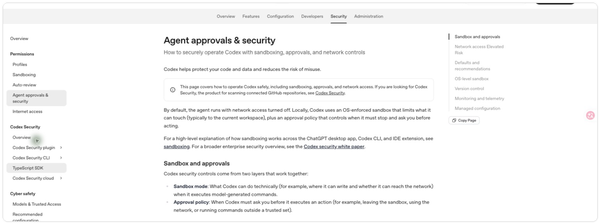
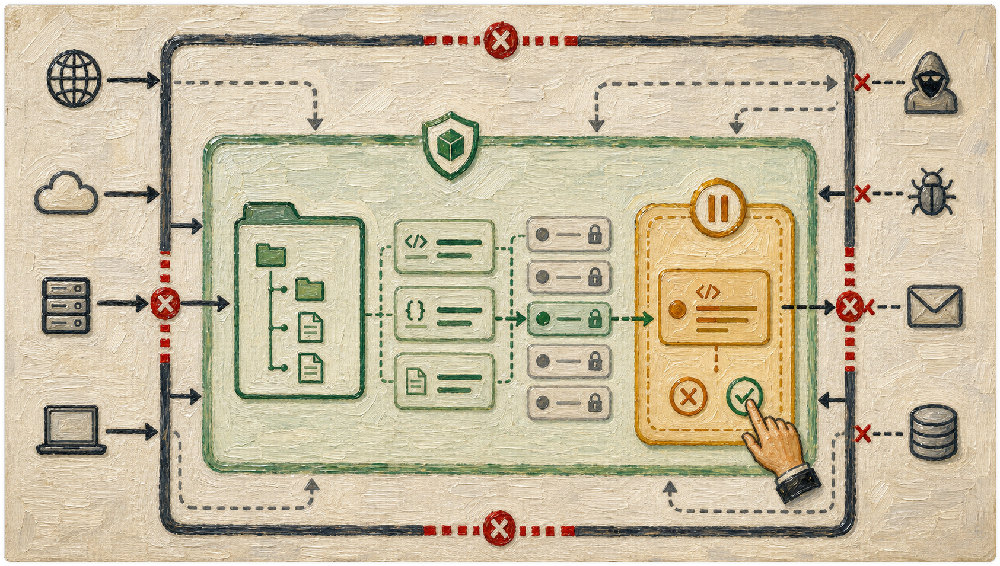
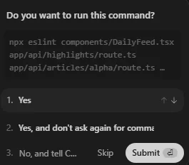
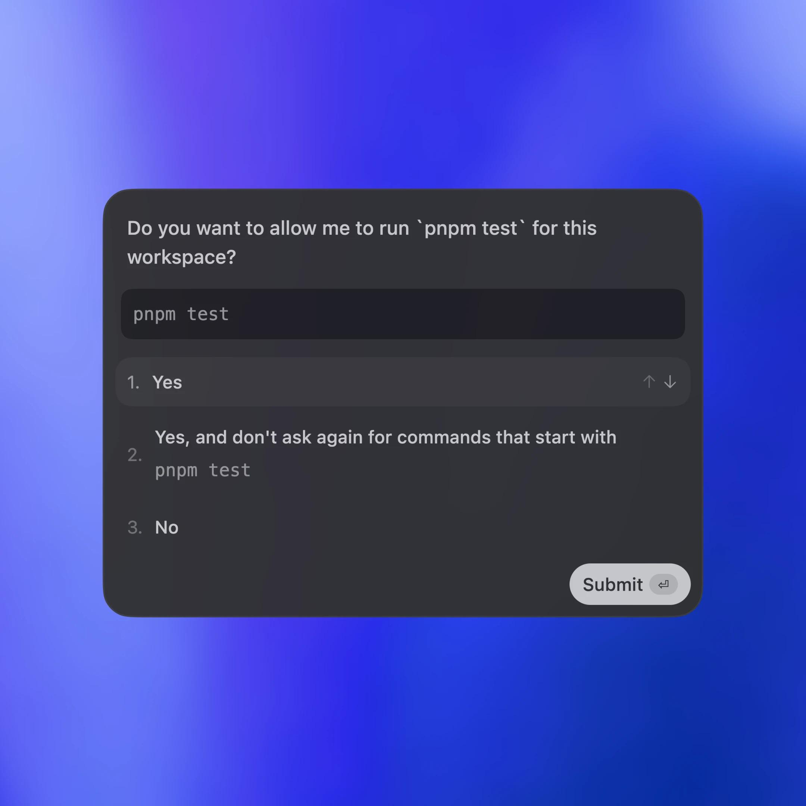
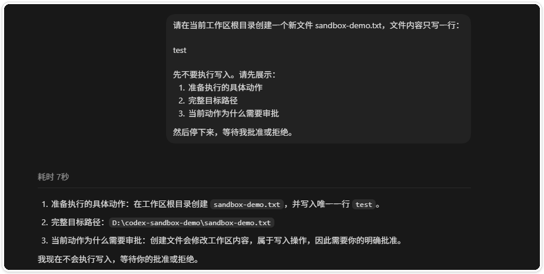

# Codex 权限、沙箱与审批的放行与收紧

> 测试环境：Windows 11 24H2（构建 26100）；Codex Desktop 26.814.5517.0；Codex CLI 0.147.0；2026-08-21 核验。

Codex 有时只能读，不能写；有时访问网络或工作区外的文件会停下来询问。遇到这些提示，先分清权限、沙箱和审批，再决定是否放行。

本文只讨论日常任务中的判断方法。涉及具体配置文件和团队级策略时，应按所在环境的安全要求单独处理。

如果你还不熟悉 Codex 接收任务和执行命令的方式，可以先阅读“Codex 是如何工作的”；已经遇到审批提示的读者可以直接进入正文。

## 正文

### 1. 先把三个概念分开

遇到权限提示时，先别急着点允许。权限、沙箱和审批解决的是三件不同的事。

权限说明当前任务可以做什么。沙箱划出文件、命令和网络能够触达的范围。审批则处理越过当前范围的动作，决定这一步要不要交给人确认。

*图一　OpenAI 官方文档对 Sandbox mode 与 Approval policy 的并列说明。它用于核对概念边界，不代表某个具体桌面端会显示完全相同的文案。*

可以把它们放进同一个任务里理解。读取项目文件通常只需要访问当前工作区。修改文件会改变磁盘内容，安装依赖还可能访问网络。任务越过当前边界时，审批才会出现。

在 Windows 上使用 VS Code 的读者，经常会遇到另一个选择：是否把项目放进 WSL，再用 VS Code 的 Remote - WSL 连接。WSL 能提供更接近 Linux 的工具链，某些 Node、Python 或 shell 项目也会因此少碰到路径和脚本兼容问题。不过，WSL 不是权限开关，更不是把 Windows 文件和网络自动变成安全区。连接到 WSL 后，仍然要确认 Codex 当前看到的工作区、挂载目录和网络边界；不要因为“现在是在 Linux 终端里”就直接给出全盘访问或长期免审批。

*图二　油画风格教学示意图。外层表示网络与工作区边界，中间表示沙箱范围，右侧审批闸门表示需要人工确认的动作。该图为 AI 生成示意，不代表 Codex 当前界面。*

### 2. 常见动作分别需要什么能力

读取工作区文件和在工作区内运行检查，通常属于低风险动作。新建文件、修改代码或执行构建，会改变工作区状态，需要确认目标范围。安装依赖、调用外部服务或读取工作区之外的路径，则多了一层网络或边界风险。

判断时看动作本身，不要只看命令名字。同一个脚本，在测试仓库里运行和在生产目录里运行，风险完全不同。

*图三　OpenAI 官方 Sandbox 页面，说明沙箱如何限制代理可触达的文件、命令和网络边界。*

官方文档说明了沙箱的边界，但桌面端、CLI 和 IDE 扩展的菜单名称可能不同。本文的截图用于解释概念，具体选项仍应以当前客户端显示为准。

除了简单的档位开关，官方还在完善更细的权限档案（permission profiles，目前处于 Beta，可能继续变化）。它把命令能读写哪些文件、能访问哪些网络目标组合成一个命名策略，只给当前任务够用的访问，而不是把整台机器敞开。官方文档自己的定位也是最小权限。具体配置本文不展开，先知道有这条路即可。

*图四　OpenAI 官方 Permissions 文档：权限档案把文件读写规则和网络访问规则组合成命名策略，目前处于 Beta。档位名称和默认值可能随版本调整，以当前客户端显示为准。*

### 3. “允许命令”和“脱离沙箱”不是一回事

Windows Codex App 用户有时会发现，`rg`、只读的 `git status` 也会触发审批；反过来，某些允许规则又可能让命令在沙箱边界之外运行。这两种现象看起来矛盾，其实是在问不同的问题：前者是“这条命令现在能不能执行”，后者是“它执行时是否还受当前沙箱限制”。

所以不建议把所有看起来安全的命令都加入白名单。先看命令的完整参数、当前工作目录和实际访问路径，再确认允许规则是否同时改变了沙箱或网络边界。GitHub Issue [#26108](https://github.com/openai/codex/issues/26108) 记录了 Windows 场景下这类边界混淆，适合作为排查审批异常的背景材料。

如果你的环境支持在 `~/.codex/AGENTS.md` 中声明团队约定，可以把“低影响改动直接执行，高影响改动先审查批准”写成任务规则。例如，读取文件、运行已有的格式检查、查看 `git diff` 可以归入低影响；删除文件、改生产配置、写入真实数据、上传外部服务则归入高影响。这个文件只能表达协作约定，不能替代沙箱、操作系统权限或审批策略，实际生效范围仍以当前客户端和配置为准。

### 4. 不同权限档位，先看它们改变了什么

Codex App 的文案会随版本变化。GitHub Issue [#29452](https://github.com/openai/codex/issues/29452) 讨论过当前界面常见的四种说法，可以先按下面的含义理解。

| 界面文案 | 更接近的含义 | 使用时要问自己 |
| --- | --- | --- |
| Ask for approval | 每次越界动作交给人确认 | 我能否读懂这一次的完整命令和目标？ |
| Approve for me | 由系统按既定规则自动处理审批 | 规则是否足够窄，是否会覆盖后续命令？ |
| Full access | 放开更多文件、命令或网络边界 | 这是不是一次性给了超出任务所需的范围？ |
| Custom (config.toml) | 使用配置文件自定义策略 | 配置是否经过 review，能否回退和审计？ |

这张表是阅读 UI 的辅助，不是官方稳定的等级定义。审批弹窗通常会给出“允许一次”“以后允许以某个前缀开头的命令”“拒绝”等选择。OpenAI 的[审批弹窗示例](https://openai.com/index/unlocking-the-codex-harness/)展示了这种差异。第二个选项不会让所有命令都变得安全，它只是把一个命令前缀加入后续自动处理范围，仍要检查前缀是否过宽。

*图五　用户提供的 Codex 命令审批弹窗。它同时展示了单次允许、按命令前缀长期允许和拒绝，实际文案可能因客户端版本而不同。*

*图六　用户提供的 OpenAI 官方审批示例截图。它适合说明“允许一次”和“以后允许类似命令”的范围差异，不应被理解为 Full access。*

*图七　用户提供的 Codex 权限菜单截图。菜单中的“请求批准”“帮助我批准”和“完全访问”是当前界面文案，阅读时应把它们映射回审批、自动处理和边界范围三个问题。*

### 5. 审批窗口里应该看什么

审批出现时，按下面的顺序读一遍。

先看它准备做什么，是读取、写入、删除、联网，还是调用外部服务。再看完整目标，包括文件路径、命令参数和域名。然后问一句，这一步和当前任务有什么关系。

最后检查回退办法。目标是否在测试仓库里，是否有 Git 或备份，是否会碰到账号、密钥、客户数据或生产环境。如果只是为了完成一个小动作，却要求打开更大的权限，先停下来改写任务范围。

下面是在可丢弃测试仓库里的一次真实审批。任务是新建一个明确命名的文本文件，Codex 在写入前先列出了准备执行的动作、完整目标路径和这一步需要审批的原因，然后停下来等待批准。按上面的顺序读一遍：动作是写入，目标是测试仓库里的单个文件，和当前任务直接相关，写完还能删除。这类请求可以放心放行。

*图八　本机可丢弃测试仓库中的写入审批（Codex Desktop 实测）。画面中 Codex 先列出动作、完整路径和审批原因，再等待人工确认；目标路径只指向测试目录，不含账号或敏感信息。*

### 6. 哪些情况可以放行

可以放行的请求通常有几个共同点。动作直接服务于当前任务，目标路径或域名写得清楚，影响范围容易检查，结果也能通过 Git 或备份回退。

例如，在可丢弃测试仓库里创建一个明确命名的测试文件，审批内容包含完整路径，写入完成后还能删除或回退，这类请求比较容易判断。放行前仍要确认命令没有夹带额外的删除、上传或全盘扫描动作。

如果你还没有在真实项目里放过权，可以先照着《第一次让 Codex 改项目，我建议你先从这个小任务开始》做一次低风险练习，再回来对照上面的放行条件。

### 7. 哪些情况应该收紧或拒绝

理由说不清楚、目标路径过于宽泛、包含批量删除或不可逆操作时，应收紧权限。生产数据库、真实客户数据、密钥和账号权限也不适合在普通任务里直接放行。

工作区已经有重要改动，却没有隔离分支、备份或回退方案时，也应先停下来。拒绝审批不是把任务丢掉。可以让 Codex 先解释方案、列出将要执行的命令，或者给出只读分析，让人确认后再决定下一步。

放手之后收不回来的具体代价，《别一上来就让 Codex 改项目，我已经替你踩过坑了》里有完整记录，可以对照着看。

还有一种风险不在单次审批里。审批连续弹出时，人容易进入机械点允许的状态，不再逐条读内容。发现自己开始不经看就点，先暂停任务。“不再询问”或“始终允许”一类的选项（名称以当前客户端为准），只留给可丢弃环境和明确重复的窄动作，不要在真实项目里图省事常开。

审批太多时，官方提供了自动审阅（Auto-review）。越过沙箱边界的审批可以交给单独的审阅代理处理。主代理仍在同一个沙箱里，受同样的审批策略以及网络、文件限制，变化的只是由谁来审。只有审批处于交互状态时它才介入。自动审阅用于减少重复确认，不会扩大权限。

*图九　OpenAI 官方 Auto-review 文档：自动审阅只改变越界请求的审阅者，沙箱边界、审批策略和网络与文件限制保持不变。*

### 8. 用最小权限完成一次真实任务

一个稳妥的顺序是从只读分析开始。先让 Codex 说明将检查哪些文件，再在确实需要修改时开放工作区内写入。安装依赖或访问外部服务时，只为这一步申请网络权限，并确认域名和命令参数。

任务结束后，把权限收回到日常需要的范围。高权限扩大的是可执行范围，不会让答案自动变得更准确。权限越大，人工检查就越不能省。

## 最后检查这五件事

看到审批请求时，可以按这五个问题快速过一遍。

1. Codex 准备执行什么动作，是读取、写入、删除还是联网。
2. 完整目标在哪里，路径、命令参数和域名是否写清楚。
3. 这一步和当前任务有什么关系，能不能换成只读分析或更窄的权限。
4. 结果是否可回退，是否会碰到生产数据、客户信息、密钥或账号权限。
5. 任务结束后，是否可以把权限收回到日常需要的范围。

只要其中一项说不清楚，就先拒绝或暂停。让 Codex 解释方案、列出命令，再决定下一步，通常比一次性打开最大权限更容易检查。

本文没有展开具体配置文件和团队级策略。涉及生产数据、真实账号或无法回退的操作时，应先让负责人确认权限范围和回滚路径。
