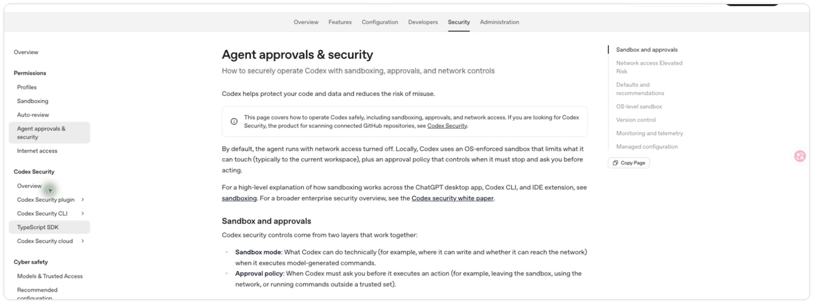
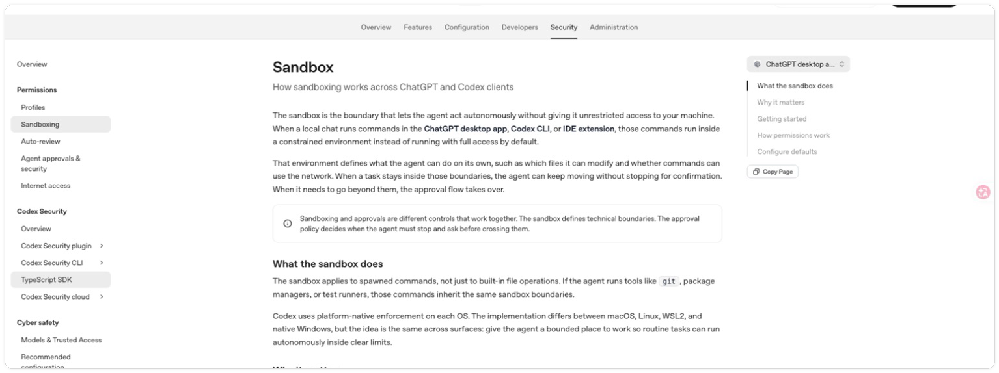
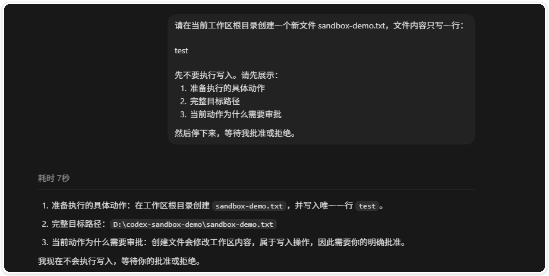
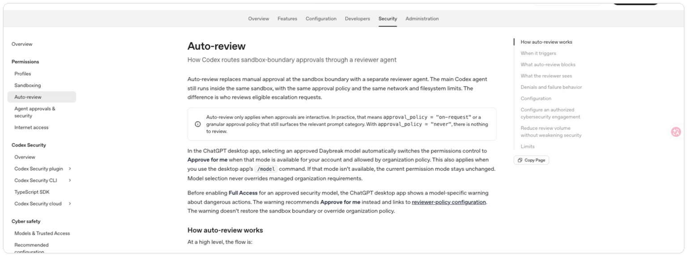
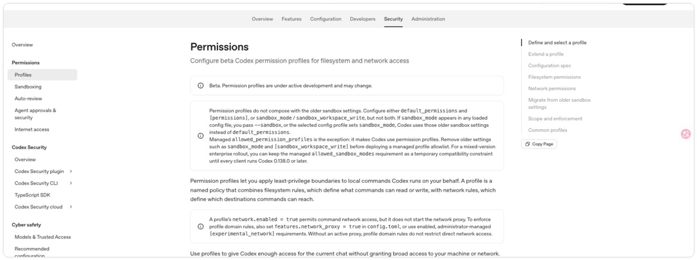

# Codex 权限、沙箱与审批：补上 0.170 里子线程不再丢掉沙箱限制，并对照最新的 permission profiles 文档

> 本文在线版：[codexguide.io/guides/codex-quan-xian-sha-xiang-yu-shen-pi](https://codexguide.io/guides/codex-quan-xian-sha-xiang-yu-shen-pi)

> 核对依据：2026-11-19 打开的 [Permissions](https://learn.chatgpt.com/docs/permissions)（Beta）和 [Agent approvals & security](https://learn.chatgpt.com/docs/agent-approvals-security)。旧地址 `developers.openai.com/codex/agent-approvals-security` 会转到后者。0.170.0 的子线程修复来自 [rust-v0.170.0](https://github.com/openai/codex/releases/tag/rust-v0.170.0) 的 #60936、#61134，文档项 #61133 写的是更新沙箱文档、说明 permission profiles 和文件系统规则。同一天在 Linux 上，`codex-cli 0.170.0` 的 `codex --help` 列出了 `--sandbox` 的 `read-only`、`workspace-write`、`danger-full-access`，以及 `--approve-for-me` 和 `--dangerously-bypass-approvals-and-sandbox`。本文没有执行后两个开关，没有开子线程，没有改 `config.toml`。文中「我的用法」是操作建议，不是官方强制规定。界面文案会随客户端版本变化，以你当前菜单为准。下方截图是本文原先的图，拍摄早于这次核对，没有用新图替换。

Codex 有时只能读，不能写；访问网络或工作区外的文件时，又会停下来问你。看到这些提示，先别急着点允许——先分清它在问哪一层。

**沙箱管「技术上能碰什么」，审批管「越界要不要问」，Auto-review 只换「谁来审」，不会把边界打开。**

本文讲日常任务里怎么判断放行还是收紧。团队托管策略、`requirements.toml`、生产账号，按你们环境的安全要求单独处理；这里不展开企业托管细则。什么该放手，见 [安全与风险边界](./05-安全与风险边界-到底该不该放手让它碰你的代码.md)。主机上已经发生过的权限风险，见 [沙箱与主机权限风险](../10-配置模型与权限安全/05-Codex沙箱与主机权限风险.md)。域名白名单和本地服务怎么配，见 [网络权限](../10-配置模型与权限安全/26-Codex网络权限-network_proxy域名白名单与本地服务访问.md)。这三篇的案例和配置本文不重复。

还不熟悉 Codex 怎么接任务、怎么跑命令，可以先看《Codex 是如何工作的》。已经卡在审批弹窗上的，直接往下读。

## 1. 先把三件事分开

遇到权限提示，先回答三个问题：

1. **沙箱（sandbox）**：当前命令在文件、命令、网络上能到哪里？
2. **审批策略（approval policy）**：越过那条边界时，要不要停下来问人？
3. **审阅者（approvals_reviewer）**：问的时候，是你来批，还是交给 Auto-review？

官方把前两层写成并列控制：沙箱是技术边界；审批策略决定何时必须停下。桌面端、CLI、IDE 扩展共用这套模型，只是菜单位置不同。



*图一　沿用本文原先的官方页截图，内容时间早于 2026-11-19。当天打开的 Agent approvals 页仍把沙箱和审批写成两层：沙箱决定技术上能碰到哪里，审批决定何时必须停下。截图没有换成新图。*

可以把它们放进同一个任务里理解：读项目文件，通常只需要当前工作区；改代码会动磁盘；装依赖还可能要网络。动作还在边界内，代理可以继续跑；要跨出去，审批才出现。

在 Windows 上用 VS Code 时，常会纠结要不要进 WSL2。WSL2 能提供更接近 Linux 的工具链，IDE 扩展也支持把 Codex 放进 WSL2 以继承 Linux 沙箱语义——但 **WSL 不是权限开关**，更不会把 Windows 文件和网络自动变成安全区。连上之后，仍要确认当前工作区、挂载目录和网络边界；不要因为「现在是 Linux 终端」就开 Full access 或长期免审批。

## 2. 桌面端常见三档（加 Custom）

ChatGPT 桌面端 / Codex 的权限控件通常在输入框下方。官方文档里的常见项是：

| 界面常见文案 | 更接近的含义 | 配置上常对应什么 | 使用时要问自己 |
| --- | --- | --- | --- |
| Ask for approval / 请求批准 | 工作区内可读写；越界（外写、联网等）问人 | `sandbox_mode = "workspace-write"` + `approval_policy = "on-request"`，审阅者默认是你 | 我能不能读懂这一次的完整命令和目标？ |
| Approve for me / 帮我批准 | **同一套工作区写入沙箱**；合格的越界审批改由 Auto-review 审 | 同上，但 `approvals_reviewer = "auto_review"` | 我是否接受「审阅代理」代我挡危险动作，而不是放开边界？ |
| Full access / 完全访问 | 去掉本地沙箱限制，且不再为审批停下 | `sandbox_mode = "danger-full-access"` + `approval_policy = "never"`（或等价的危险旁路开关） | 这是不是一次性给了远超任务所需的范围？ |
| Custom (config.toml) | 用配置文件自定义 | 你在 `config.toml` 里写的组合；也可能是命名权限档案 | 配置是否经过 review，能否回退和审计？ |

这张表是读界面的辅助。2026-11-19 的 Agent approvals 页没有再使用 Ask for approval、Approve for me、Full access 这三个菜单名。它的组合表写的是 Auto（`workspace-write` + `on-request`）、Auto-review mode（同一套沙箱，`approvals_reviewer = "auto_review"`）和 Dangerous full access（`--dangerously-bypass-approvals-and-sandbox`，别名 `--yolo`：没有沙箱，也不再审批）。同一页另写 `--sandbox danger-full-access`，可以在不弹审批的情况下读写、跑命令并联网。0.170.0 的 `codex --help` 把 `--approve-for-me` 写成：把审批请求交给自动审阅，并使用 workspace-write 沙箱。中文菜单以你屏幕上的文字为准。上面的截图是更早的菜单，保留下来对照「边界、要不要问、谁来审」，不代表 2026-11-19 的文档用词。


*图二　用户较早提供的权限菜单截图，沿用，没有换图。把菜单项映射回「边界」「要不要问」「谁来审」。截图里若已选中完全访问，只表示当时界面状态。2026-11-19 的文档用词以 Agent approvals 页的组合表为准。*

官方推荐的本地低摩擦预设，是 **workspace-write + on-request**（文档里的 Auto 预设）：工作区内可读可改、可跑常规本地命令；改工作区外文件或需要网络时再问。只想聊天或规划、不动盘，用 `read-only`（CLI 也可用 `/permissions` 切换）。

**Full access 不是「更聪明」**，只是边界没了。高权限放大的是可执行范围，不会让答案自动更准；权限越大，人工检查越不能省。

另外：`approval_policy = "untrusted"` 已退役。2026-11-19 的 Agent approvals 页写，Codex 和 ChatGPT Work 不再支持这个值，留着它可能让客户端起不来。交互、只读的替代示例是 `sandbox_mode = "read-only"` 加上 `approval_policy = "on-request"`。若要保留更严的命令审批，页面要求不要显式写 `approval_policy`，改为在用户级配置里给项目设置 `trust_level = "untrusted"`。

## 0.170.0：子线程和权限更新不再丢掉已有沙箱限制

Release 原文是：

> Fixed permission updates and child threads losing existing sandbox restrictions. (#60936, #61134)

#60936 的标题是 “Preserve legacy sandbox templates in TUI permission conversions”。#61134 的标题是 “Normalize permission updates at session settings admission”。同一版的文档项 #61133 是 “Updated sandbox documentation to explain permission profiles and filesystem rules”。

对日常使用，这句话的方向是：会话里已经有的沙箱限制，在权限更新时还在，子线程也不再把它丢掉。发布说明没有写复现步骤，没有写子线程的配置字段，也没有说子线程可以比当前会话更宽。更宽的访问仍然要你显式放行。

本文没有开子线程，没有在升级前后做对照。主机上真实发生过的越权案例见 [沙箱与主机权限风险](../10-配置模型与权限安全/05-Codex沙箱与主机权限风险.md)，不要把这条修复当成已经在你的机器上验收过。

## 3. 常见动作分别需要什么能力

判断看**动作本身和落点**，不要只看命令名字。同一个脚本，在可丢弃测试仓和生产目录里，风险完全不同。

| 动作类型 | 通常落在哪一层 | 放行前多看一眼 |
| --- | --- | --- |
| 读工作区、列目录、看 diff | 只读 / 工作区内 | 路径是否仍在当前项目 |
| 改代码、加测试、本地构建 | workspace-write | 是否误伤无关目录；有没有 Git 可回退 |
| 装依赖、拉包、调外部 API | 常要网络，默认工作区沙箱往往关掉网络 | 域名、包名、是否会写到工作区外 |
| 改 `~`、系统目录、其他仓库 | 越出 writable roots | 几乎都应停；先收窄任务 |
| 碰密钥、客户数据、生产库 | 超出日常代理范围 | 默认拒绝，换人工流程 |

默认的 `workspace-write` 里，工作区可写，但若干路径仍被保护为只读，例如工作区下的 `.git`、`.agents`、`.codex`、`.aws`（存在时）。所以即使用工作区写入模式，`git commit` 一类碰 `.git` 的操作仍可能要审批或越出沙箱——这是预期，不是故障。



*图三　沿用本文原先的 Sandbox 页截图，内容时间早于 2026-11-19，没有换图。当天的 Agent approvals 页仍写：默认网络关闭，本地用操作系统沙箱限制能碰到的范围，审批决定何时停下。*

「允许这条命令」和「脱离沙箱」也不是一回事。前者问的是现在能不能执行；后者问的是执行时还受不受当前文件／网络限制。不要因为 `rg`、`git status` 看起来无害，就把过宽的前缀写进长期允许规则。官方也建议：需要例外时，用**窄的命令前缀规则**（例如精确到 `pnpm run lint`），而不是把 `python`、`curl` 整类放行。

## 4. 审批弹窗里该看什么

审批出现时，按这个顺序读一遍：

1. **准备做什么**：读、写、删、联网，还是调用带副作用的应用／MCP 工具。
2. **完整目标**：路径、参数、域名是否写清楚，有没有夹带删除、上传、全盘扫描。
3. **和当前任务的关系**：能不能改成只读分析，或收窄到单个文件／单个命令。
4. **能不能回退**：是否在测试仓或功能分支，有没有 Git／备份；会不会碰到密钥、客户数据、生产环境。

弹窗里常见「允许一次」「以后允许某类前缀」「拒绝」。第二个选项不会让所有命令变安全，它只是把一个前缀纳入后续自动处理；前缀过宽，等于悄悄扩大信任面。

可丢弃测试仓里的写入，若动作、完整路径、原因都列清楚，且写完能删掉，通常可以放行：



*图四　可丢弃测试仓中的写入审批示例：先列出动作、完整路径和原因，再等待确认。路径只指向测试目录。*

连续弹窗时，人很容易变成机械点「允许」。发现自己不看就点，先暂停任务。「不再询问／始终允许」一类选项，只留给可丢弃环境和**明确重复的窄动作**，不要在真实项目里图省事常开。

## 5. 什么时候可以放行，什么时候该收紧

**可以放行**的请求，通常同时满足：动作直接服务当前任务；目标路径或域名清楚；影响面容易检查；结果可用 Git 或备份回退。例如在测试仓新建一个命名明确的小文件，审批里带完整路径，写完还能删——这类比较好判断。仍要确认没有夹带额外删除、上传或全盘扫描。

**应该收紧或拒绝**的情况包括：理由说不清；路径过宽；批量删除或不可逆操作；生产库、真实客户数据、密钥和账号权限；工作区已有重要改动却没有隔离分支或回退方案。拒绝不是丢掉任务——可以让 Codex 先解释方案、列出将要执行的命令，或只做只读分析，你确认后再开下一步。

**我的用法**（不是官方规定）：日常改代码默认 Ask for approval；重复、边界清晰的长任务再考虑 Approve for me；Full access 只在你已经用别的方式隔离环境（例如可信 Dev Container 且容器本身就是边界）时偶发使用，用完收回。永远不要把「开最大权限」当成提高正确率的手段。

## 6. Auto-review：换审阅者，不换边界

审批弹太多时，官方提供 Auto-review。桌面端选 **Approve for me**，或在配置里设：

```toml
approval_policy = "on-request"
approvals_reviewer = "auto_review"
```

流程可以概括成：主代理仍在 `read-only` 或 `workspace-write` 里工作 → 需要越界时提出审批 → 若审阅者是 `auto_review`，请求交给独立的审阅代理 → 批准则继续，拒绝则要求主代理找**实质更安全**的路径，或停下问你。

2026-11-19 的 Agent approvals 页把这几条写清楚了：

- 默认审阅者是你：`approvals_reviewer = "user"`。
- Auto-review 用在审批仍然交互的时候，例如 `on-request` 或细粒度审批策略。`approval_policy = "never"` 时没有可审的请求。
- Auto-review mode 的沙箱边界与标准 `on-request` 相同。审的是已经需要批准的动作，例如沙箱升级、需要批准的网络请求、`request_permissions`，以及需要批准的应用和 MCP 工具调用。
- 审阅策略会检查数据外传、凭据探测、持久削弱安全和高破坏性操作。关键风险会被拒绝。构建提示、审阅会话或解析失败时，按页面的说法是失败即关闭。超时会单独显示，动作仍然不会执行。
- 它会额外消耗模型调用，从而计入用量。管理员可以用 `allowed_approvals_reviewers` 限制它。

页面把完整的审阅生命周期指到单独的 Auto-review 文档。本文这次没有打开那一页，所以上面只保留 Agent approvals 页已经写明的句子。早先稿件里「不会扩大 writable_roots」的说法，这次没有在打开的两页里重读到原句，正文改以「同一套 on-request 沙箱边界」为准。



*图五　沿用本文原先的 Auto-review 截图，内容时间早于 2026-11-19，没有换图。当天读到的条文是：审阅者从你换成 Auto-review，沙箱边界仍与标准 on-request 相同。*

如果日常安全动作也频繁触发审阅，先收紧或校正边界（例如补窄的 writable_roots、精确命令前缀），而不是教审阅代理永远放行噪音。

## 7. 权限档案（permission profiles，Beta）

除了「沙箱模式 + 审批策略」这一套，官方还在推进 **permission profiles**（文档标注 Beta，可能继续变）。一个档案是**命名策略**：把文件系统规则（读／写／拒绝哪些路径）和网络规则（能到哪些域名）绑在一起，按最小权限给当前任务够用的访问。

内置三档常见名字：

- `:read-only` — 本地命令只读
- `:workspace` — 可在活动工作区根与系统临时目录写入
- `:danger-full-access` — 去掉本地沙箱限制，仅在你有意要这么宽时使用

自定义档案写在 `[permissions.<名字>]` 下，再用 `default_permissions` 选中。扩展内置 `:workspace` 时，工作区里的 `.git`、`.agents`、`.codex`、`.aws` 等保护会一并带上，除非你显式改掉。

2026-11-19 的 Permissions 页把边界写得更具体，硬规则是这几条：

1. **不要和旧的 `sandbox_mode` / `sandbox_workspace_write` 混用。** 配置 `default_permissions` 与 `[permissions]`，或者配置旧的 `sandbox_mode` / `sandbox_workspace_write`，两边取一边。任一已加载的配置文件里出现 `sandbox_mode`、命令行传了 `--sandbox`，或所选配置档案设置了 `sandbox_mode`，Codex 就使用旧沙箱设置，而不是 `default_permissions`。
2. **托管的 `allowed_permission_profiles` 是例外。** 它会让 Codex 使用权限档案。部署这份允许列表之前，先去掉 `sandbox_mode` 和 `[sandbox_workspace_write]`。页面还写，混合版本的企业铺开可以暂时保留托管的 `allowed_sandbox_modes`，直到每台客户端都是 Codex 0.138.0 或更高。
3. **档案里的域名规则要靠网络代理才能真正拦住。** `network.enabled = true` 允许命令联网，不会启动网络代理。还要在 `config.toml` 里设 `features.network_proxy = true`，或使用已经启用的、管理员托管的 `[experimental_network]` 要求。代理没有运行时，命令可以直接联网，档案里的域名表限制不住。域名怎么填、本地服务怎么放行，见 [网络权限](../10-配置模型与权限安全/26-Codex网络权限-network_proxy域名白名单与本地服务访问.md)，本文不重复那篇的表。

文件系统规则也在同一页。`read` 可以读和列目录，不能改；`write` 可以读和改；`deny` 读写都拒绝。更具体的条目盖过更宽的条目；同一条路径上，`deny` 优先于 `write`，`write` 优先于 `read`。0.170.0 的 #61133 说的就是把 permission profiles 和这些文件系统规则写进沙箱文档。具体的 glob、`glob_scan_max_depth` 和 Windows 限制以 Permissions 页为准，这里不抄整张规格表。



*图六　沿用本文原先的 Permissions 截图，内容时间早于 2026-11-19，没有换图。当天打开的页面仍标 Beta，内置档仍是 `:read-only`、`:workspace`、`:danger-full-access`。*

网络代理也只过滤**沙箱内本地命令**的流量。网页搜索、连接器、MCP、浏览器／Computer Use、云端任务、客户端鉴权请求，各有各的开关——命令域名白名单不是全局网络安全策略。

具体 TOML 示例以官方 Permissions 页为准；本文只要求你知道：有「按任务裁剪文件 + 网络」这条路，而且要和审批策略一起用，而不是互相替代。

## 8. 用最小权限做完一次真实任务

一个稳妥顺序：

1. 先只读分析：让 Codex 说明要看哪些文件。
2. 确认需要改代码时，再用工作区写入（Auto：`workspace-write` + `on-request`）。
3. 装依赖或访问外部服务时，只为这一步打开网络，并核对域名与参数。
4. 任务结束后，把权限收回日常档。不要把 `danger-full-access` 或 `--dangerously-bypass-approvals-and-sandbox` 留到下一个无关会话。

版本控制会让这一切好检查得多：功能分支、干净的 `git status`、小步提交，出了问题才收得回来。官方也建议把 Codex 产出当普通 PR 来审。

## 最后检查这五件事

1. Codex 准备执行什么：读、写、删，还是联网／带副作用的工具调用。
2. 完整目标在哪里：路径、参数、域名是否清楚。
3. 和当前任务的关系：能否改成只读，或更窄的权限。
4. 结果是否可回退：会不会碰到生产数据、客户信息、密钥或账号权限。
5. 任务结束后，能否把权限收回到日常需要的范围。

其中一项说不清，就先拒绝或暂停。让它解释方案、列出命令，再决定下一步，通常比一次性打开最大权限更容易检查。

涉及生产数据、真实账号或无法回退的操作时，先让负责人确认权限范围和回滚路径。配置文件级与团队托管策略，以你们当前的 Managed configuration 为准。

## 参考资料

- [Permissions（Beta）](https://learn.chatgpt.com/docs/permissions)
- [Agent approvals & security](https://learn.chatgpt.com/docs/agent-approvals-security)
- [GitHub Release rust-v0.170.0](https://github.com/openai/codex/releases/tag/rust-v0.170.0)
- [安全与风险边界](./05-安全与风险边界-到底该不该放手让它碰你的代码.md)
- [沙箱与主机权限风险](../10-配置模型与权限安全/05-Codex沙箱与主机权限风险.md)
- [网络权限](../10-配置模型与权限安全/26-Codex网络权限-network_proxy域名白名单与本地服务访问.md)
