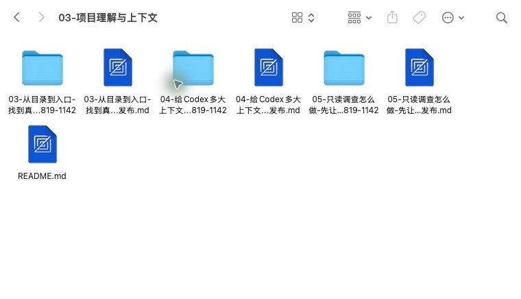
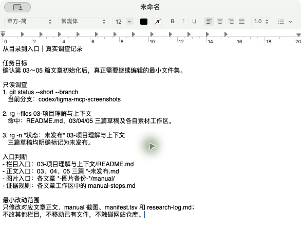

# 从目录到入口：找到真正需要修改的代码

> 配图采集环境：macOS 15.7.5（Build 24G624）；Codex/ChatGPT App 26.721.41059；2026-08-21 核验。Windows 实操仍待补拍。

> 状态：未发布，已完成首批目录与入口调查配图，正文实操仍待编写。

## 这篇文章解决什么问题

拿到需求后，如何从目录、关键词和配置入口逐步缩小范围，找到真正需要阅读和修改的代码。

## 准备覆盖的内容

1. 先确认仓库状态、技术栈和目录边界。
2. 从需求中的页面名、接口名、报错文本和业务词开始搜索。
3. 沿路由、命令、组件、import 和调用方追踪真实入口。
4. 识别生成代码、适配层、旧实现和不可直接修改的文件。
5. 用文件路径、符号引用和测试证据确认入口没有找错。
6. 整理一套适用于 Windows PowerShell 的搜索命令。

## 计划实操

选择一个包含页面、接口和测试的小型示例仓库，从一个需求关键词出发，记录每一步如何排除无关目录，最终圈定最小改动文件集。

## 完成标准

- 给出可复现的入口追踪过程。
- 每个判断都能指向文件、配置或测试证据。
- 明确入口不唯一时应该怎样继续确认。

## 配图素材备用区（暂不计入正文图号）

> 本节用于写作阶段选图，发布前应将采用的素材移动到对应正文段落并重新编号。旧界面、限时活动和第三方教程必须标注日期与来源。

### 官方与可核验操作界面

*图：Finder 中的真实文章工作区，用于说明从栏目目录确认正文与素材入口。*

*图：基于当前仓库只读命令结果整理的脱敏调查记录；不是 Terminal 或 Codex 任务执行画面。*

*图：文章工作区中已落盘的配图文件，便于继续补拍入口调用关系和最小改动范围。*

### 视频教程来源（仅作来源，不自动作为配图）

- 暂无。

### 需要作者亲自截图

- [x] `03-01-项目目录与文章工作区.png`：Finder 展示当前栏目目录、三篇草稿与对应素材工作区。
- [x] `03-02-入口定位与最小文件集.png`：TextEdit 展示基于真实只读命令整理的入口与文件范围。
- [ ] `03-03-入口调用关系.png`：展示路由、组件或命令入口与目标实现的对应关系。
- [ ] `03-04-最小改动文件集.png`：展示最终确认的文件和关联测试，不执行提交。

### 查找记录

- 详见文章同级图片备份目录中的 `research-log.md`。
