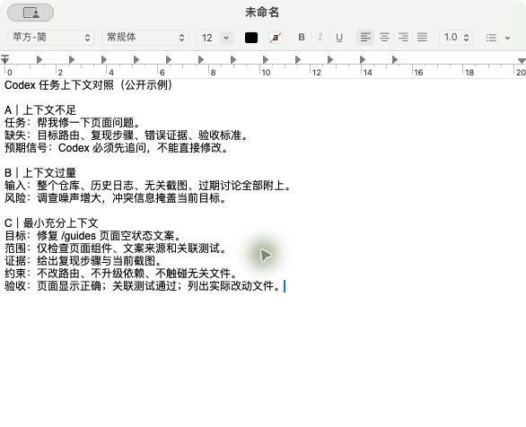
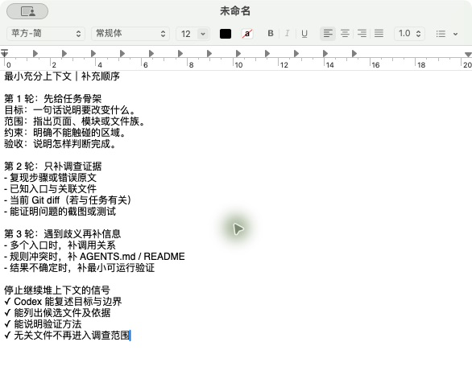

# 给 Codex 多大上下文才够用

> 配图采集环境：macOS 15.7.5（Build 24G624）；Codex/ChatGPT App 26.721.41059；2026-08-21 核验。Codex 三组任务实验仍待执行。

> 状态：未发布，已完成上下文输入与补充顺序配图，三组真实任务实验仍待执行。

## 这篇文章解决什么问题

如何把任务相关信息交给 Codex，同时避免上下文不足、整仓噪声和过期资料干扰判断。

## 准备覆盖的内容

1. 区分必要上下文、背景上下文和无关噪声。
2. 什么时候提供文件路径、代码符号、报错日志、截图和 Git diff。
3. 如何让 Codex 自己查找上下文，而不是一次粘贴整个仓库。
4. 上下文不足、相互冲突和过量时分别会出现什么信号。
5. 如何分轮补充信息并保持任务目标稳定。
6. 上下文窗口、压缩和新开任务之间的实际取舍。

## 计划实操

对同一个任务设计三组输入：信息不足、信息过量和最小充分上下文，对比 Codex 的调查路线、追问次数和最终判断。

## 完成标准

- 给出“最小但够用”的任务模板。
- 用真实任务对照说明哪些信息必须提供。
- 不把模型上下文上限误写成推荐输入量。

## 配图素材备用区（暂不计入正文图号）

> 本节用于写作阶段选图，发布前应将采用的素材移动到对应正文段落并重新编号。旧界面、限时活动和第三方教程必须标注日期与来源。

### 官方与可核验操作界面

*图：在本机 TextEdit 中整理的公开示例任务输入，用于对比不足、过量和最小充分上下文；不代表 Codex 已执行这些任务。*

*图：上下文分轮补充清单，以及停止继续堆叠信息的判断信号。*

*图：文章工作区中已落盘的配图文件，后续可替换为真实 Codex 三组实验结果。*

### 视频教程来源（仅作来源，不自动作为配图）

- 暂无。

### 需要作者亲自截图

- [x] `04-01-三组上下文输入对照.png`：展示三组公开示例输入的结构差异。
- [x] `04-02-最小充分上下文补充顺序.png`：展示分轮补充上下文的方法和停止信号。
- [ ] `04-03-最小充分上下文.png`：展示目标、路径、证据和验收方式齐全的任务。
- [ ] `04-04-三组结果对照.png`：展示调查步骤或结果对比，不包含账号和用量信息。

### 查找记录

- 详见文章同级图片备份目录中的 `research-log.md`。
