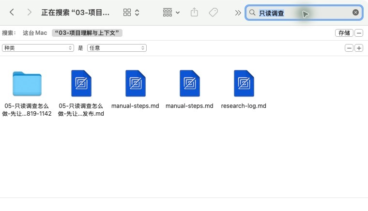
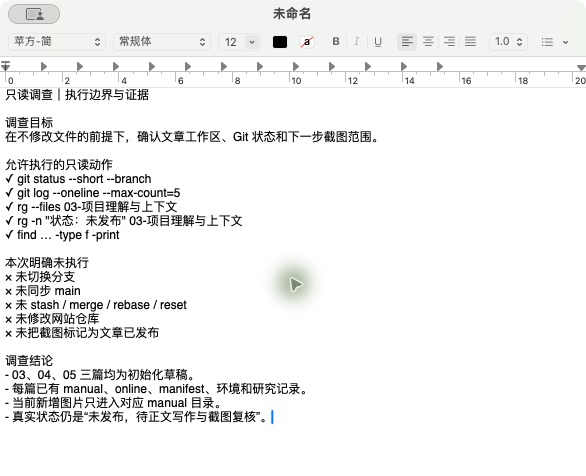
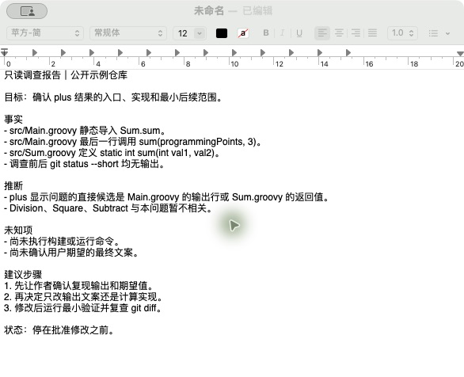
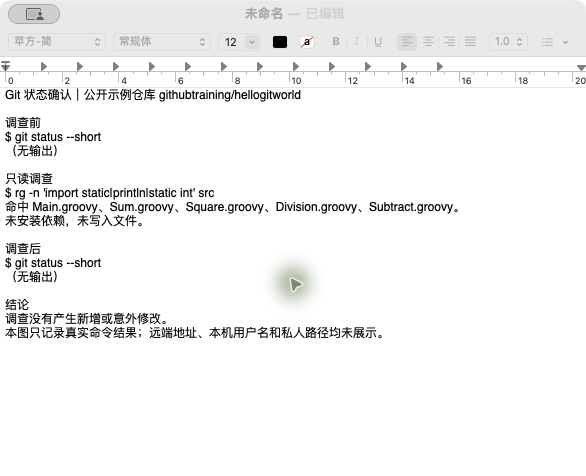

# 只读调查怎么做：先让 Codex 把项目摸清楚

> 配图采集环境：macOS 15.7.5（Build 24G624）；Codex/ChatGPT App 26.721.41059；2026-08-21 核验。完整 Codex 只读任务仍待执行。

> 状态：未发布，已完成目录搜索与只读边界配图，完整调查任务仍待执行。

## 这篇文章解决什么问题

面对复杂或高风险任务，如何先让 Codex 只读调查并提交证据，再决定是否允许修改。

## 准备覆盖的内容

1. 哪些任务适合先调查、后执行。
2. 如何明确“不要修改文件、不要安装依赖、不要运行破坏性命令”。
3. 调查顺序：现状、入口、约束、风险、未知项和建议步骤。
4. 要求 Codex 区分事实、推断和需要人工确认的内容。
5. 如何检查调查期间是否产生了意外改动。
6. 怎样把调查结果转换成下一轮可执行任务。

## 计划实操

使用一个涉及多个目录的需求，先运行只读调查，再通过 Git 状态和报告证据验收，最后生成但不执行修改计划。

## 完成标准

- 提供可直接复制的只读调查提示词。
- 给出调查结果验收表。
- 解释只读调查不能替代人工决策的部分。

## 配图素材备用区（暂不计入正文图号）

> 本节用于写作阶段选图，发布前应将采用的素材移动到对应正文段落并重新编号。旧界面、限时活动和第三方教程必须标注日期与来源。

### 官方与可核验操作界面

*图：Finder 将搜索范围限定在当前栏目，关键词只命中相关草稿与记录文件。*

*图：基于当前仓库真实状态整理的脱敏调查边界；明确记录未执行的写操作。*

*图：文章工作区中已落盘的配图文件，完整 Codex 调查报告仍待补拍。*

*图：公开示例仓库的只读调查报告，按事实、推断、未知项和建议步骤分栏，停在批准修改之前。*

*图：公开示例仓库调查前后 `git status --short` 均无输出，确认没有新增或意外修改。*

### 视频教程来源（仅作来源，不自动作为配图）

- 暂无。

### 需要作者亲自截图

- [x] `05-01-目录内只读搜索结果.png`：Finder 展示限定目录后的关键词搜索结果。
- [x] `05-02-只读调查边界与结论.png`：TextEdit 展示真实只读命令、禁止事项与当前结论。
- [ ] `05-03-调查报告结果.png`：展示事实、推断和未知项的区分。
- [ ] `05-04-Git状态确认.png`：展示调查前后没有新增改动。

### 查找记录

- 详见文章同级图片备份目录中的 `research-log.md`。
