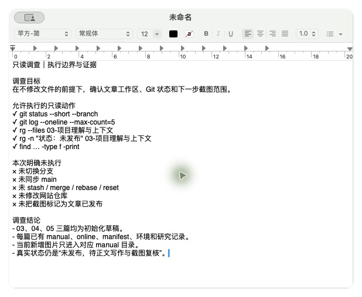
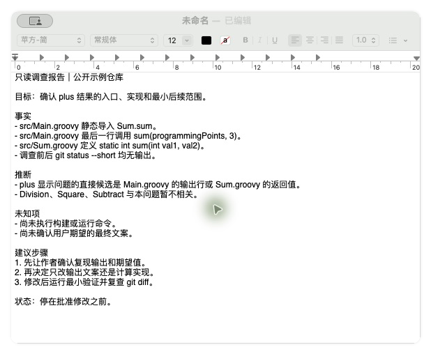
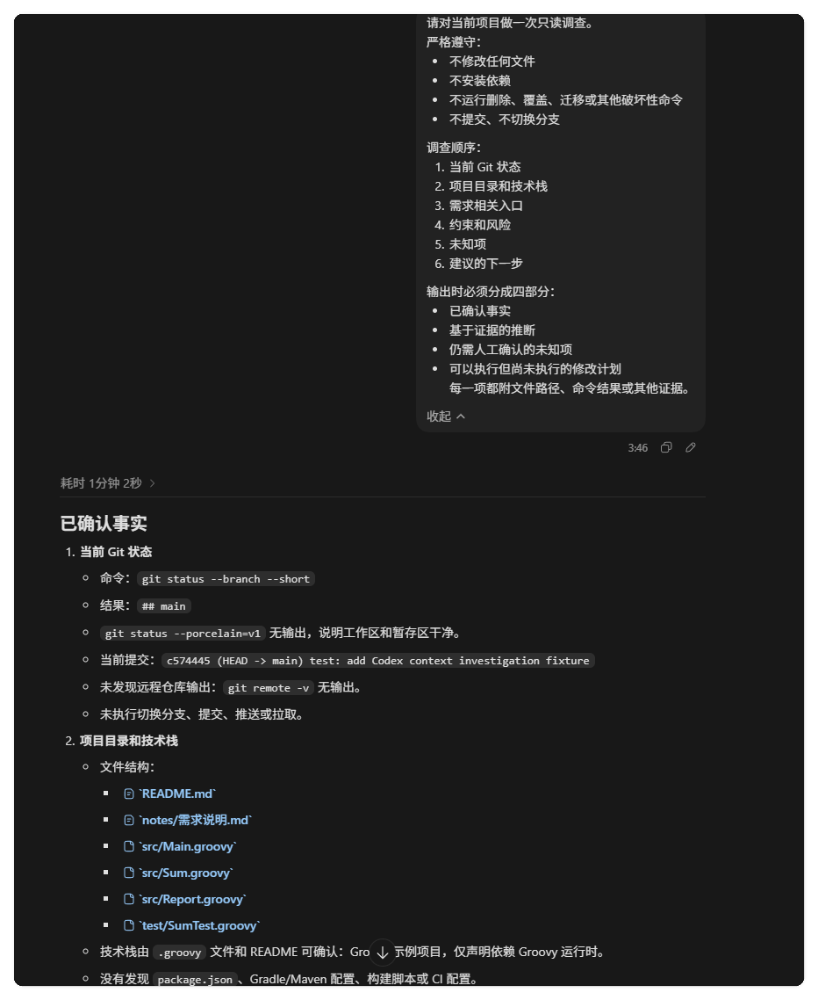
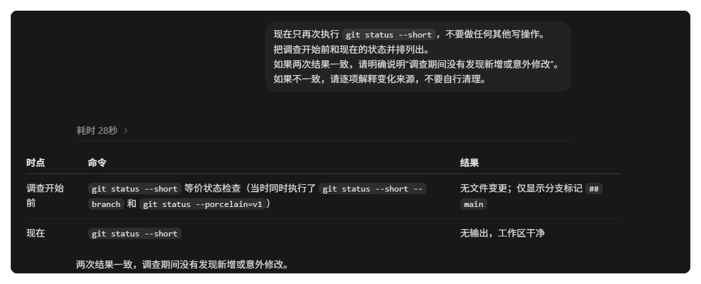

# Codex 只读调查：先把项目摸清楚再改代码

> 配图采集环境：macOS 15.7.5（Build 24G624）；Codex/ChatGPT App 26.721.41059；2026-08-21 核验。Codex 实操部分在 Windows 环境完成，正文会单独说明。

## 先摸清项目，再决定改不改

面对复杂或高风险的任务，直接让 Codex 动手是最贵的做法。改错了要回滚，改多了要排查，而它本来可以先只做一件事：把项目摸清楚，把证据交给你，再由你决定改不改。

这篇文章我把一次完整的只读调查走了两遍：先在本机用只读命令手动做一遍，再把同一个调查框架交给 Codex 执行。两遍都停在批准修改之前，并且用 Git 状态证明调查期间没有产生任何改动。

> 图一　只读调查的核心：先把事实、推断和未知项分开，再决定要不要允许修改。

如果你还没区分过“让 Codex 调查”和“让 Codex 修改”，可以先阅读“Codex 从目录到入口”，再回到本文的调查步骤。

## 哪些任务适合先调查

不是所有任务都需要只读调查。改一行文案、加一个日志，直接做更快。值得先调查的通常是这几类：

- 涉及多个目录或模块，影响范围一眼看不全。
- 仓库里有历史代码、生成代码或你不熟悉的依赖。
- 失败代价高，比如动数据库结构、构建配置或线上脚本。
- 你对需求的理解本身还没被验证，改下去可能方向就是错的。

判断标准很简单：如果“改错了再退回来”的代价比“先花几分钟调查”高，就先调查。

## 先把边界写清楚

只读调查的第一步是把“不许做什么”写明白。我为本机演示整理的边界如下：允许执行的只有 `git status --short --branch`、`git log --oneline --max-count=5`、`rg --files`、`rg -n` 和 `find` 这类只读命令；明确不执行的包括切换分支、同步 main、stash/merge/rebase/reset、修改演示项目以外的目录，以及提交、推送这类状态变更。

> 图二　调查前先把允许执行的动作和明确不执行的动作逐条写下，结论也注明当前真实状态。

注意边界不只在命令层面，也包括不伪造进度。这次调查如实记录了演示项目的订单模块还没有测试覆盖，真实状态是“待补测试”。只读调查要把看到的内容完整写下来，包括那些说明“还没做完”的证据。

## 调查报告要分四栏

调查最大的浪费，是产出一篇读起来很顺、但分不清哪些是事实的总结。我要求的报告格式固定分四栏：事实、推断、未知项、建议步骤。

> 图三　公开示例仓库的只读调查报告：事实都有命令依据，推断标注依据，未知项不猜，建议步骤停在批准修改之前。

这份针对公开示例仓库的报告里，事实栏的每一条都能对上证据：`src/Main.groovy` 静态导入 `Sum.sum`，最后一行调用 `sum(programmingPoints, 3)`，`src/Sum.groovy` 定义 `static int sum(int val1, val2)`，调查前后 `git status --short` 均无输出。推断栏只写“plus 显示问题的直接候选是 Main.groovy 的输出行或 Sum.groovy 的返回值”，并注明 Division、Square、Subtract 暂不相关。未知栏承认两件事：尚未执行构建或运行命令，尚未确认用户期望的最终文案。建议先让需求方确认复现输出和期望值，再安排修改。

这个顺序是有意为之的。只读调查的产出是一份能支持下一位维护者决策的报告，修改补丁要留到后续任务。

## 把调查框架交给 Codex

手动流程验证过之后，我把同一个框架写成指令交给 Codex，调查对象是一个涉及 `src`、`test`、`notes` 多个目录的测试项目。指令里写死四条禁令：不修改任何文件，不安装依赖，不运行删除、覆盖、迁移或其他破坏性命令，不提交、不切换分支。调查顺序固定为六步：当前 Git 状态、项目目录和技术栈、需求相关入口、约束和风险、未知项、建议的下一步。输出必须分成四部分：已确认事实、基于证据的推断、仍需人工确认的未知项、可以执行但尚未执行的修改计划，每一项都附文件路径、命令结果或其他证据。

> 图四　Codex 的只读调查报告开头：Git 状态和项目结构逐条附命令与结果，耗时 1 分 2 秒。

报告的事实栏完全按证据组织。Git 状态部分写明用了 `git status --branch --short`，结果是 `## main`，`git status --porcelain=v1` 无输出，说明工作区和暂存区干净；当前提交是 `c574445`，`git remote -v` 无输出，未执行切换、提交、推送或拉取。项目结构部分列出 `README.md`、`notes/需求说明.md`、`src/Main.groovy`、`src/Sum.groovy`、`src/Report.groovy`、`test/SumTest.groovy`，并根据 `.groovy` 文件和 README 判断这是 Groovy 示例项目，同时注明没有发现 `package.json`、Gradle/Maven 配置、构建脚本或 CI 配置。

每一条事实都自带“怎么知道的”。这样的报告你可以抽查任意一行，而不是只能整体信任或整体怀疑。

如果你希望这类禁令和调查顺序不用每次重写，可以把稳定的部分沉淀成项目规则，具体写法见《别再重复提醒 Codex：用 AGENTS.md 让它读项目先读规则》。

## 调查结束后，先证明它没动过

只读调查最容易被跳过的一步，是验收“只读”本身。报告写得再规矩，也可能有意外改动混在里面。我的做法是让 Codex 在调查结束后再次执行 `git status --short`，和调查开始前的状态并列对比：两次一致就明确说明“调查期间没有发现新增或意外修改”，不一致就逐项解释变化来源，不要自行清理。

> 图五　调查开始前和结束后的 Git 状态对照：两次均无文件变更，确认没有新增或意外修改。

这次验收的结果是两次输出一致，调查期间没有新增或意外修改。指令里特意写了“不要自行清理”。如果发现意外改动，应报告来源并保留现场，才能知道调查过程碰过什么。

这一步成本只有几十秒，但它把“我相信它没改”变成“有证据证明它没改”。高风险任务里，这个区别就是敢不敢授权下一步的区别。

## 从调查报告到下一轮任务

只读调查最终要形成可执行的修改计划。报告第四栏“可以执行但尚未执行的修改计划”就是下一轮的输入，其中列出要改的文件、理由、关联证据和验证方式。你批准之后，Codex 进入修改流程时不需要重新调查。

交接时建议保留三样东西：报告原文、调查前后的 Git 状态对照、你批准或否决的决定。批准了，报告就是修改任务的上下文；否决了，报告是下次讨论的依据。两种情况下调查都不算浪费。

更多关于“批准后怎么把修改范围管住”的做法，可以看《第一次让 Codex 改项目，我建议你先从这个小任务开始》。

## 小结

只读调查的完整动作是：先判断是否值得调查，再写清允许和禁止的边界，然后按现状、入口、约束、风险、未知项、建议步骤的顺序收集证据，输出时把事实、推断、未知项和未执行的修改计划分开，最后用 Git 状态对照证明调查期间没有改动。

它不能替代的部分也要说清楚：调查结论里的推断仍需人来确认，修改计划仍需人来批准。Codex 负责把项目摸清楚，决定权留在你手里。

只读调查结束后，把事实、推断、未知项和未执行的计划分别记录，下一轮任务就能直接从这份报告开始。
