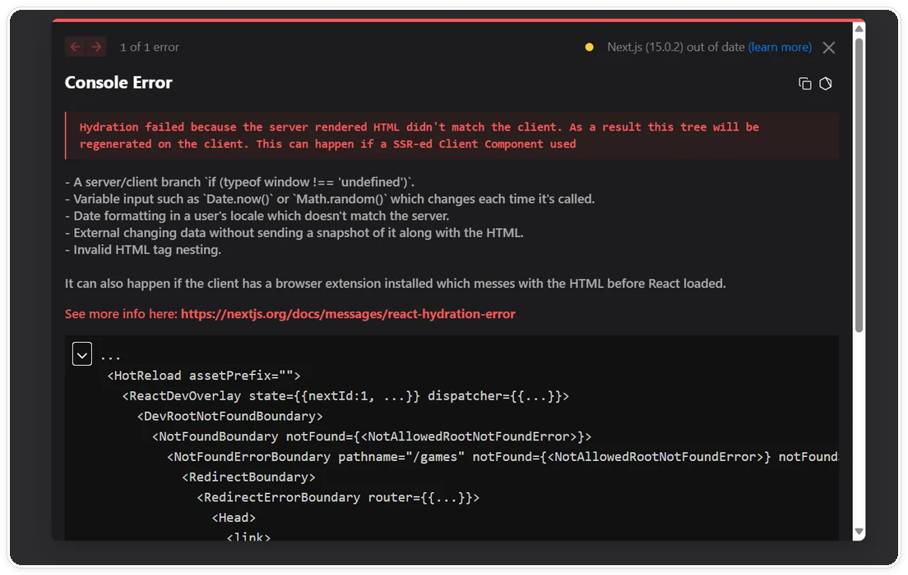
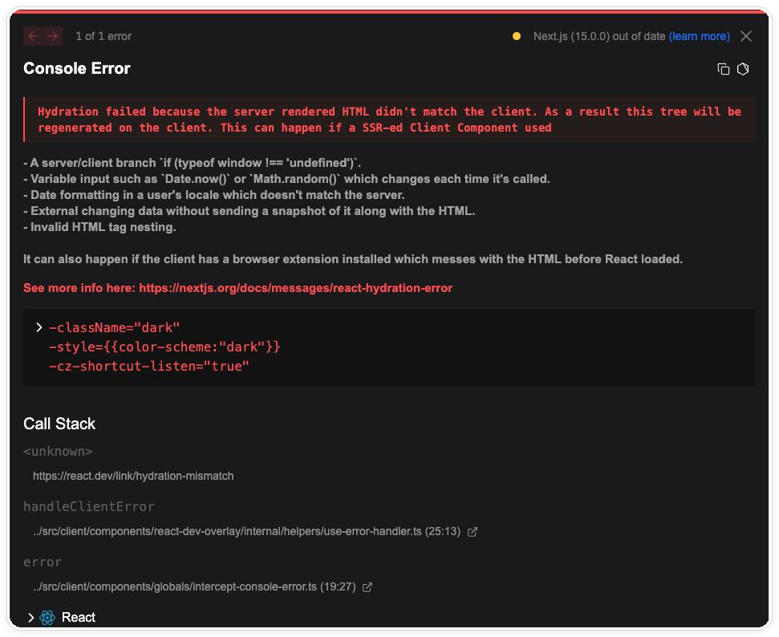

# Codex 如何从报错反推影响范围

> 测试环境：Windows 11 24H2（Build 26100）；Codex Desktop 26.814.5167.0；Codex CLI 0.147.0；2026-08-19 核验。

## 修对地方，只是第一步

拿到一条报错，最直接的反应是找到出错的那一行改掉。很多时候这一改确实能修好。过几天，另一个页面、另一份导出或定时任务可能暴露新的问题，原因仍然是同一个函数。

这篇文章只做一件事，把“改之前先算影响范围”变成固定动作。我用两个案例各走一遍流程，一个从报错出发，一个从需求出发，最后都落到同一张影响范围表上。两个案例的证据起点不同，落点一样。

如果你还没让 Codex 改过项目，可以先阅读“Codex 从目录到入口”，再回来对照这里的范围分析方法。

## 先把现象拆成四格

影响范围分析先从现象开始。报错案例沿用本机练习用的订单管理项目，订单列表页金额偶尔显示为 NaN。动手之前，先把它拆成四格写下来：

- 输入：打开订单列表页，列表中包含特定订单。
- 触发条件：订单金额字段为 null 或字符串，而不是数字。
- 实际结果：金额列显示 NaN。
- 预期结果：显示格式化后的金额，或一个明确的占位。

四格写完，“偶尔”这个词就有了具体含义。它只在特定数据形状下出现。后续应沿数据处理路径排查，先不要把注意力放在渲染层。

## 从堆栈和日志定位直接入口

现象拆完，才轮到代码。报错类案例的证据起点是堆栈、日志和复现步骤。目标很简单，找到直接入口，也就是错误第一次产生的那一行。

本例中沿日志和复现步骤定位到 `src/utils/format.js` 的 `formatAmount`：它直接对金额字段做算术运算，输入不是数字时就产出 NaN。这就是直接入口。

报错证据具体长什么样，可以看另一组真实截图。它来自我机器上另一个 Next.js 练习项目的 hydration 报错，和订单案例无关，但证据的形态是通用的：先是浏览器给出的报错文本，再是控制台里的完整原因和组件树，最后是逐层向下的调用栈。

> 图一　报错提示条：错误类型和排查文档入口（hydration 报错示例）。

> 图二　控制台完整报错：可能原因列表和组件树。

> 图三　调用栈详情：从报错入口逐层向下。

注意“直接入口”不等于“唯一改动点”。它只是故障传播的起点，接下来要查的是这个起点往外连着什么。

## 间接影响查五类

直接入口确定后，沿五个方向查间接影响，每查一处都留下证据：

1. 调用方：`src/pages/OrderList.vue` 调用 `formatAmount` 渲染金额列；其他页面有没有也在调它，逐个搜出来。
2. 共享模块：`format.js` 是工具模块，被共享的面越广，改动传导得越远。
3. 数据结构：`src/api/orders.js` 返回的订单金额字段类型不稳定，这才是 NaN 的数据来源。
4. 配置：没有证据表明构建配置或环境变量参与金额格式化，标记为暂不相关。
5. 缓存：本例中列表页没有金额缓存逻辑，排除。

查完把结果填进影响范围表，分三档：直接影响、间接影响、暂不相关。每一档都要带证据。“没查到”和“查到并排除”是两回事，都要写下来。

| 区域 | 档位 | 证据 | 验证方式 |
| --- | --- | --- | --- |
| `src/utils/format.js` 的 `formatAmount` | 直接影响 | 对非数字输入产出 NaN | 边界值单元测试 |
| `src/pages/OrderList.vue` | 间接影响 | 调用 `formatAmount` 渲染金额列 | 页面人工回归 |
| `src/api/orders.js` | 间接影响 | 金额字段可能返回 null 或字符串 | 接口数据抽查 |
| `tests/orders.spec.js` | 间接影响 | 覆盖订单列表，未覆盖异常金额 | 补充用例 |
| 路由、构建配置 | 暂不相关 | 无金额逻辑引用 | 不动 |

## 用证据给风险分级

影响范围表填完，再给每一档标风险。分级只看证据，不看感觉：

- `formatAmount` 被多个页面共享，改它的行为会传导到所有调用方，定中高风险，需要回归所有调用页面。
- `OrderList.vue` 只是展示调用，定低风险。
- 路由和构建配置没有任何金额相关证据，不定级，不动。

分级的意义是管住手：没有证据的区域一行都不改，哪怕它“看起来也有点可疑”。可疑就继续查，查不到证据就保持原样。

如果你想让“先出影响范围表再动手”成为 Codex 的默认动作，可以把它写进项目规则，具体写法见《别再重复提醒 Codex：用 AGENTS.md 让它读项目先读规则》。

## 需求案例：同一张表，换一个证据起点

再看需求案例。新需求是“订单金额按千分位显示”。没有报错，没有堆栈，证据起点换成需求里的词：金额、显示、格式化。

用这些词搜索，命中的是同一个 `format.js`。这恰恰说明影响范围表的价值：报错从堆栈往里追，需求从关键词往外扩，两条路最后落在同一张表上，表的结构不变。

差别出在间接影响。千分位是展示规则的变化，所有调用 `formatAmount` 的页面都会跟着变样；如果项目里还有导出、打印这类同样展示金额的环节，也要列入检查。而 NaN 修复只影响异常数据的展示。同一张表，填出来的行不一样。

## 把影响范围表交给 Codex

两个案例手动走完，我把同一套方法写成指令交给 Codex。要求是只读调查，不修改文件；先确认仓库状态，再从报错文本或需求关键词出发定位直接入口；沿调用方、共享模块、数据结构、配置、缓存五个方向查间接影响；输出影响范围表，分直接、间接、暂不相关三档，每一行附文件路径和证据；最后由影响范围推导出验证清单。证据不足的行明确标注“待确认”，不猜。

有一类问题不该替业务做决定。比如“金额为 null 时显示占位符还是显示 0”，这是业务取舍，不是技术判断。影响范围表里遇到这种情况，正确的动作是停下来，把选项和各自的影响写给业务方确认，而不是挑一个顺手的实现。

影响范围表也很适合作为第一次真实改动任务的输入：范围小、证据全、验收标准明确。为什么建议从小任务开始，可以看《第一次让 Codex 改项目，我建议你先从这个小任务开始》。

## 小结

完整流程可以这样回顾。先把现象拆成输入、触发条件、实际结果和预期结果四格；再从堆栈、日志或需求关键词出发定位直接入口；沿调用方、共享模块、数据结构、配置、缓存五个方向查间接影响；把结果分成直接影响、间接影响和暂不相关三档，每档附证据；按证据给风险分级，没证据的区域不动；最后把影响范围表转换成验证清单。

报错和需求用的是同一张表，差别只在证据起点。范围算清楚之后，改代码反而成了整个流程里最不紧张的一步。

范围表的价值在于让每个待改区域都有证据和验证动作。没有证据的区域先保持不动。
