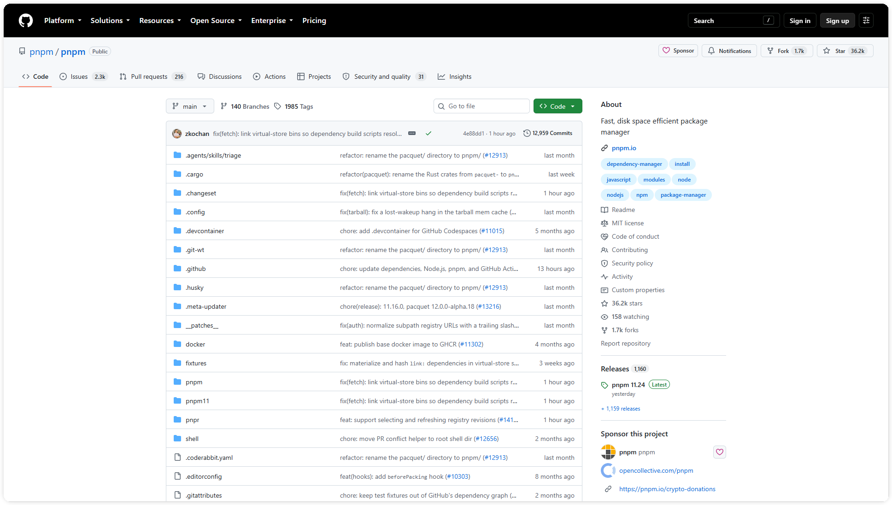
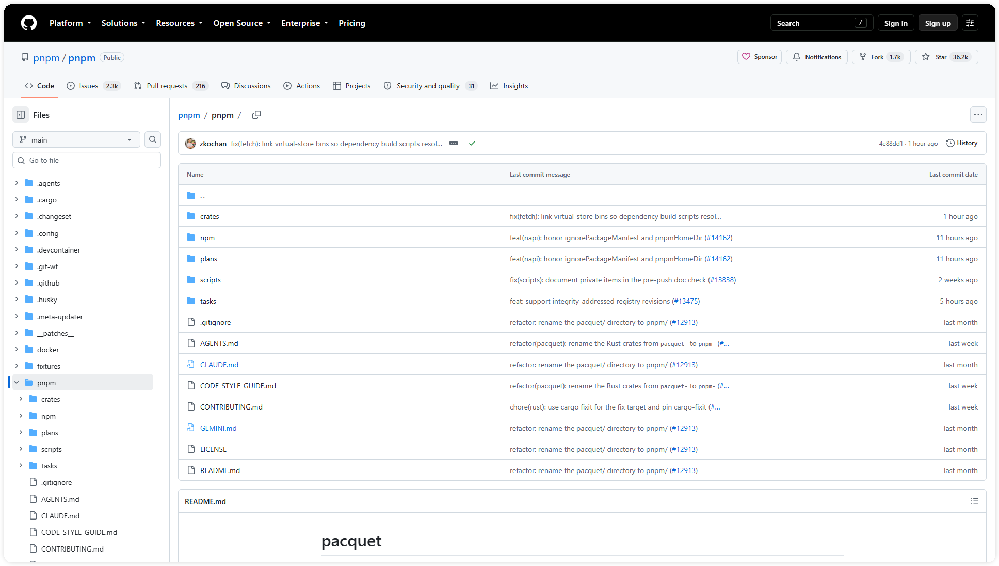
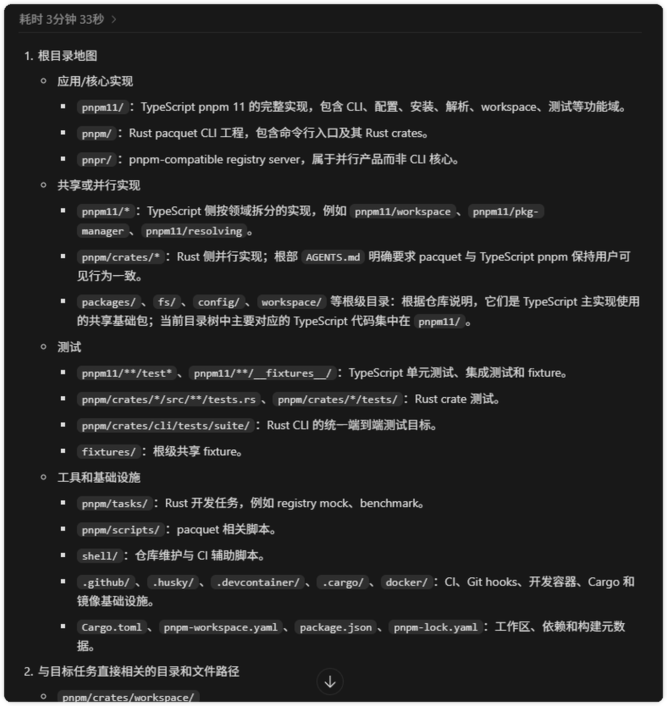
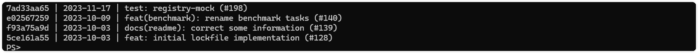
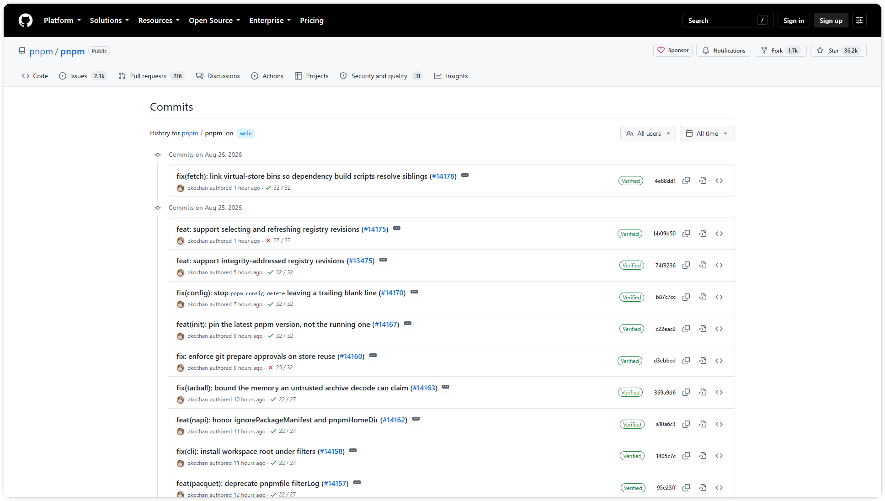
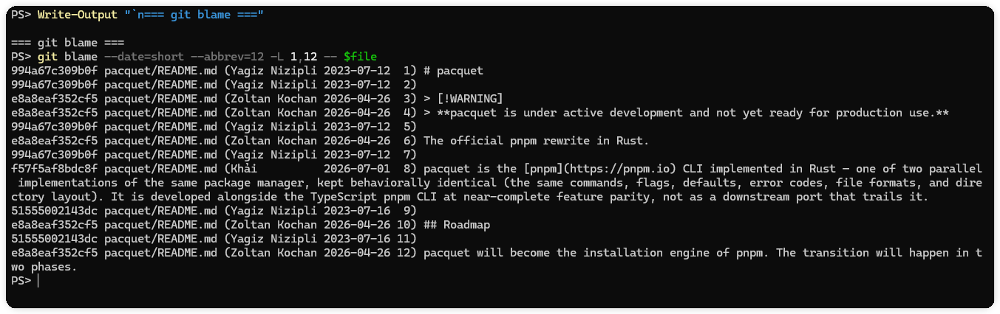
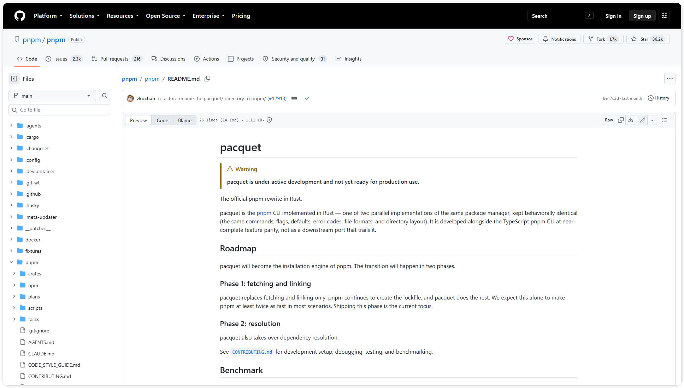

# Codex 阅读大仓库、多模块与历史代码

大仓库最容易把人带偏的地方，是目录很多、同名模块很多、旧实现也一直留在仓库里。让 Codex 直接“把项目看懂”通常只会得到一份泛泛的目录摘要。更稳的做法是把调查拆成几次只读动作，每次都留下路径、证据和仍未确认的边界。

这篇用公开的 `pnpm/pnpm` monorepo 做示例，演示一条可以复用的阅读路线。你不需要先理解整个仓库，也不需要在调查阶段运行安装、构建或写入命令。

如果你还在熟悉 Codex 的工作方式，可以先阅读“Codex 从目录到入口”，再回到本文继续做历史核对。

## 先画顶层地图

第一轮只回答一个问题，仓库里有哪些类型的目录。打开仓库首页，先看根目录的工作区配置、核心实现、测试、工具和基础设施。不要马上点进几十个文件，先记下目录之间的大致关系。



图一展示公开仓库根目录的目录分类。

可以把第一轮结果写成一张小表。

| 类别 | 要找的线索 | 先问的问题 |
| --- | --- | --- |
| 核心实现 | `pnpm/`、`packages/` 等 | 任务最终会落在哪个入口 |
| 共享或并行实现 | `pnpm11/`、`pnpr/` 等 | 是否存在替代实现或迁移分支 |
| 测试 | `tests/`、`__tests__/` | 哪些行为有自动验证 |
| 工具与基础设施 | `scripts/`、`infra/`、CI 配置 | 构建、发布和检查由谁负责 |

这一步的产物应该是“目录地图”，不是“项目总结”。没有证据的推断先放到待核对清单里。

## 再缩小到任务模块

有了顶层地图，再根据任务关键词选择一个局部目录。例如要调查 workspace 解析或 CLI 行为，可以先进入 `pnpm/`，查看它的 `crates`、`npm`、`plans`、`scripts` 和 `tasks`。



图二展示任务模块及其入口、实现和测试范围。

在 Codex Desktop 中可以使用下面的只读提示。

```text
只做只读调查，不要修改文件、安装依赖或运行会写入磁盘的命令。
请先建立根目录地图，再缩小到 pnpm/ 目录中与 workspace 解析或 CLI 任务相关的模块。
请列出目标路径、每个路径的一句话职责，以及已核验事实、推断和待核对边界。
只引用仓库相对路径，不要输出本机绝对路径。
```



图三展示了根目录分类、目标模块和仓库相对路径。

## 用 Git 历史判断代码是否活跃

目录结构只能说明“代码在哪里”，不能说明“代码现在是否仍被使用”。接下来进入公开仓库的本地副本，在 PowerShell 中把提示符临时缩短，避免截图带出本机路径。

```powershell
$repo = Join-Path $env:TEMP 'article08-pnpm'
Set-Location $repo
function prompt { 'PS> ' }
$file = 'pnpm/README.md'
```

先看文件级历史。`--follow` 可以跨越文件重命名，格式化参数只输出短 SHA、日期和摘要。

```powershell
git log --follow -n 8 --date=short --pretty=format:'%h | %ad | %s' -- $file
```



图四展示 git log 的提交摘要、日期和文件历史。

公开提交历史页还能补充按路径分组的时间线，适合确认某个模块是否持续有变更。



图五展示路径、提交摘要和时间线。

接着用 `git blame` 看行级归因。

```powershell
git blame --date=short --abbrev=12 -L 1,12 -- $file
```



图六展示 README 行级 blame 的提交、作者、日期和行号。

命令结束后恢复提示符。

```powershell
Remove-Item Function:\prompt -ErrorAction SilentlyContinue
```

## 把当前、并行和待验证实现分开

历史信息要和当前代码放在一起看。以 `pnpm/README.md` 为例，公开说明同时出现了 active development、Rust 重写和 TypeScript 并行实现的描述。这类信息说明仓库里存在迁移过程，但不能直接推出哪个目录已经替代了哪个目录。



图七展示用于区分实现状态的判断表。

| 判断 | 最少需要的证据 | 结论写法 |
| --- | --- | --- |
| 当前实现 | 当前入口或调用方 + 通过的测试 | “已从入口和测试核验” |
| 并行实现 | README、迁移提交或平行目录 | “存在并行路径，生产状态待核对” |
| 兼容层 | 兼容测试、适配器或发布配置 | “用于兼容，不能当作主实现” |
| 疑似废弃 | 无调用方、旧提交、迁移说明 | “暂不删除，先补一条验证任务” |

## 最后处理边界

当跨仓库依赖、子模块或权限限制让调查无法继续时，记录三件事，已经读到的路径、支撑判断的证据、下一步需要谁补什么。不要把“没有读到”写成“没有使用”，也不要为了让报告完整而猜测调用关系。

一个可复用的调查结果，至少应包含下面五项。

1. 根目录地图和目标模块路径。
2. 入口、内部实现和测试之间的最短阅读链路。
3. `git log` 与 `git blame` 得出的历史线索。
4. 当前、并行、兼容和待验证实现的判断表。
5. 没有证据覆盖的边界和下一步核对动作。

## 结语

读大仓库时，应让每个判断都能沿着路径和提交记录复查。先画地图，再缩小范围，随后用历史和测试交叉核对，最后把不确定的部分单独列出来。这样 Codex 的上下文会更短，调查结果也更容易交给下一位维护者。

目录地图、历史记录和测试结果应保留在项目文档或任务记录中，方便下一次调查复核。


## 参考资料

- [Understand large codebases](https://developers.openai.com/codex/use-cases/codebase-onboarding)
- [Custom instructions with AGENTS.md](https://developers.openai.com/codex/guides/agents-md)
- [git-log Documentation](https://git-scm.com/docs/git-log)
- [git-blame Documentation](https://git-scm.com/docs/git-blame)
- [About code owners](https://docs.github.com/en/repositories/managing-your-repositorys-settings-and-features/customizing-your-repository/about-code-owners)
- [Workspace | pnpm](https://pnpm.io/workspaces)
