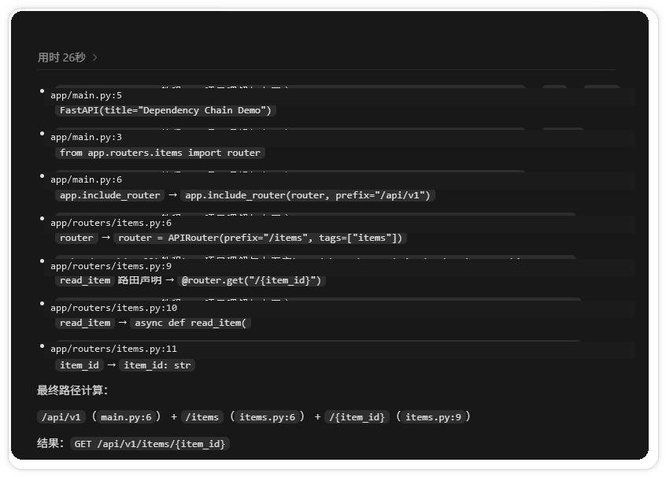
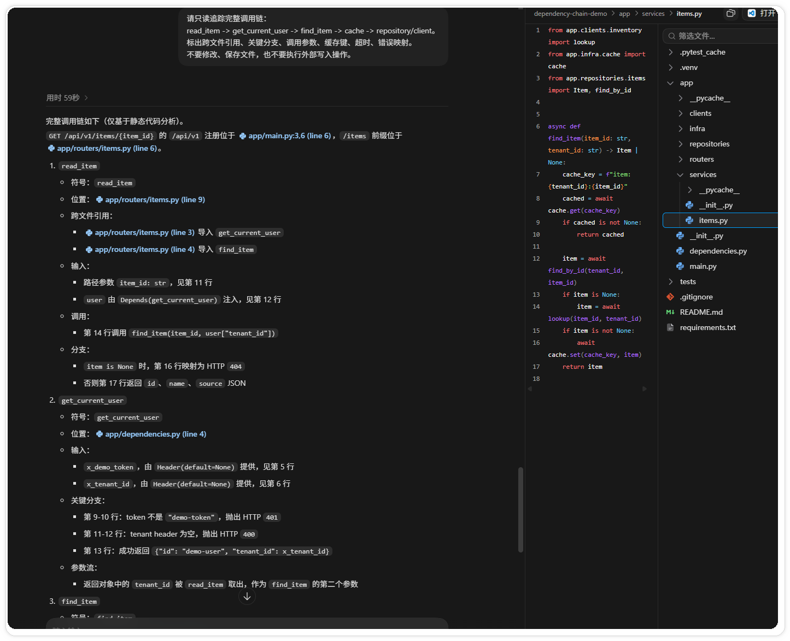
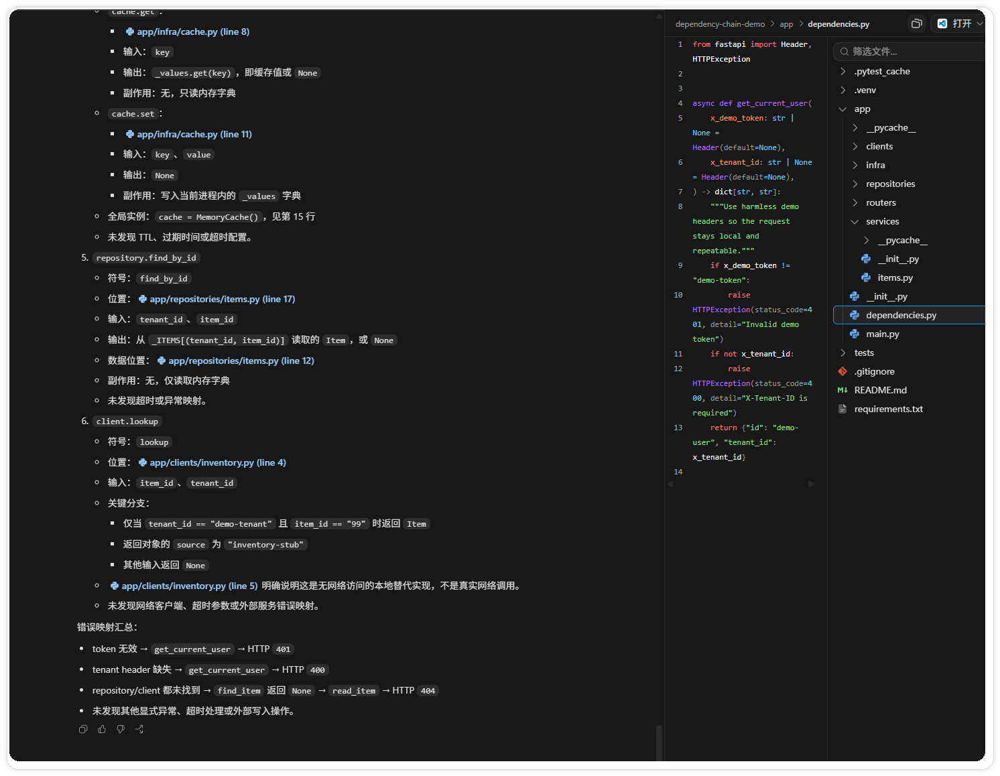
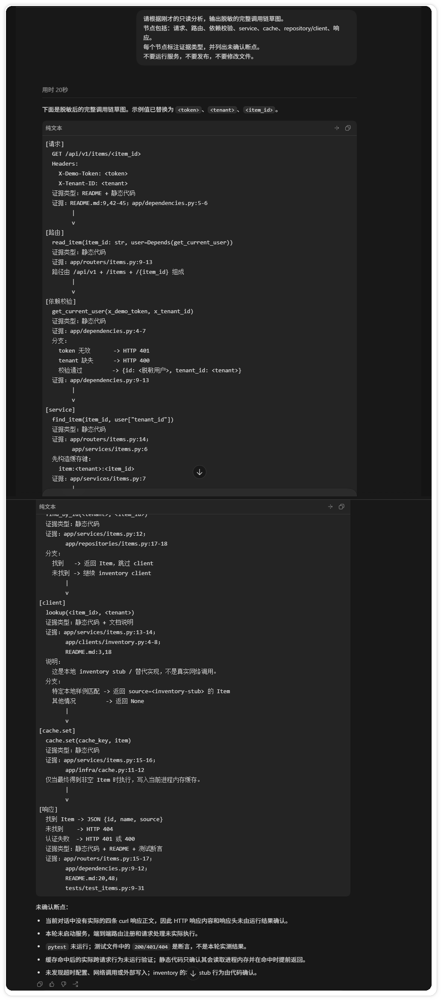

# Codex 追踪依赖调用链与数据流

> 测试环境：Windows 11 24H2；Codex Desktop 26.814.5167.0；Codex CLI 0.147.0；2026-08-26 核验。

改一个接口之前，先回答一个问题。这个请求从哪里进来，经过了哪些判断，最后读了什么数据、调用了什么适配层？只看函数名通常不够，真正影响结果的前缀、依赖注入、缓存和异常处理，往往分散在几个文件里。

下面用一个可以反复打开的 FastAPI 小项目演示。项目目录是 `temp/dependency-chain-demo/`，数据放在内存里，`inventory` 也只是本地 stub，不访问网络，不写数据库。

如果你还没做过只读项目调查，可以先阅读“Codex 只读调查”，再回到本文追具体调用链。

## 先把示例跑起来

在 PowerShell 中进入项目目录。Windows 上如果全局 Python 没有依赖，直接使用虚拟环境解释器最省事。

```powershell
cd .\temp\dependency-chain-demo
python -m venv .venv
.\.venv\Scripts\python.exe -m pip install --index-url https://pypi.org/simple -r requirements.txt
.\.venv\Scripts\python.exe -c "import fastapi, uvicorn, httpx; print('dependencies ok')"
.\.venv\Scripts\python.exe -m uvicorn app.main:app --port 8000
```

看到 `Uvicorn running on http://127.0.0.1:8000` 后保持窗口不动，再打开第二个 PowerShell，发送四个只读请求。

```powershell
cd .\temp\dependency-chain-demo
curl.exe -i http://127.0.0.1:8000/api/v1/items/42 -H "X-Demo-Token: demo-token" -H "X-Tenant-ID: demo-tenant"
curl.exe -i http://127.0.0.1:8000/api/v1/items/99 -H "X-Demo-Token: demo-token" -H "X-Tenant-ID: demo-tenant"
curl.exe -i http://127.0.0.1:8000/api/v1/items/404 -H "X-Demo-Token: demo-token" -H "X-Tenant-ID: demo-tenant"
curl.exe -i http://127.0.0.1:8000/api/v1/items/42 -H "X-Demo-Token: wrong" -H "X-Tenant-ID: demo-tenant"
```

四个结果分别对应 200、200、404 和 401。它们覆盖了仓储命中、inventory stub 命中、未找到和认证失败四条路径。

## 第一步：确认入口和完整路由

在 Codex Desktop 中打开 `dependency-chain-demo` 文件夹，先发送这段保护语句。

```text
你现在只做只读代码调查。禁止创建、修改、重命名、删除或保存任何文件，禁止执行会写入数据库、队列或外部服务的命令。回答中给出文件路径、符号名和行号，不确定的地方标记为“未确认”。
```

按 `Ctrl+P` 打开 `app/main.py`，再打开 `app/routers/items.py`。发送：

```text
只读分析这个示例项目的接口入口。定位 FastAPI 实例、router 导入、include_router 注册、HTTP 方法、路由路径和 item_id 参数。按“文件:行号 -> 符号 -> 证据”列出结果，并计算最终请求路径。不要修改文件。
```

你要拼出的路径是：

```text
/api/v1 + /items + /{item_id}
= GET /api/v1/items/{item_id}
```

这里的 `api/v1` 来自应用注册，`items` 来自 `APIRouter`，`{item_id}` 来自路由装饰器。三段缺一段，请求就不会落到预期函数。



## 第二步：沿着参数进入核心逻辑

从 `read_item` 的定义开始，用编辑器的“跳转到定义”和“查找引用”逐个打开依赖函数。发送：

```text
只读调查 GET /api/v1/items/{item_id}。依次检查 app/routers/items.py、app/dependencies.py、app/services/items.py，追踪 read_item 如何调用 get_current_user 和 find_item。输出每一步的输入、输出、分支、状态码，以及文件:行号。禁止修改或保存文件。
```

记录参数流时，不要只写“调用了 service”。在本例中，路径参数 `item_id` 进入 `read_item`，请求头进入 `get_current_user`，依赖返回的 `tenant_id` 再传给 `find_item`。认证失败会在业务函数执行前短路，仓储和 inventory 都没有机会被调用。



## 第三步：单独检查数据和副作用

继续打开 `app/infra/cache.py`、`app/repositories/items.py` 和 `app/clients/inventory.py`。发送：

```text
只读检查数据流。按执行顺序说明 cache.get、repository.find_by_id、inventory.lookup、cache.set 的输入、输出和副作用。标出缓存键、调用参数、超时和错误映射。明确 inventory.py 是本地 stub，不要描述成真实网络调用。不要执行外部写入操作。
```

本例的执行顺序很清楚。`find_item` 先查内存缓存，未命中后查 repository；repository 没有结果时才调用本地 inventory stub；拿到对象后写回缓存。缓存和仓储都只读当前进程内存，stub 也不会产生网络副作用。



遇到真实项目时，把副作用按数据库、缓存、队列、第三方服务和文件存储分开记录。每一项都要补上失败时的结果，例如超时返回 503、降级为空，还是继续使用旧缓存。没有看到代码或运行证据，就写“未确认”。

## 第四步：把证据画成一条链

最后让 Codex 把静态证据整理成草图：

```text
请根据刚才的只读分析，输出脱敏的完整调用链草图。节点包括请求、路由、依赖校验、service、cache、repository/client 和响应。每个节点标注证据类型，并列出未确认断点。不要运行服务，不要发布，不要修改文件。
```

一张合格的记录至少要写清四件事：节点位置、输入输出、证据类型和当前状态。静态代码能证明符号关系，测试能证明测试替身覆盖的分支，curl 响应才能证明本地运行结果。三者不要混成一句话。



## 什么时候可以说“追完了”

你应该能从入口复述到响应，并且能回答这些问题：全局前缀在哪里，认证何时发生，租户值从哪里来，缓存命中后是否跳过仓储，外部适配层的超时和错误如何返回，成功和失败响应分别被谁消费。

动态分派、工厂注册、异步队列和配置生成是常见断点。静态搜索找不到实际实现时，记录注册表、队列名或配置来源，再用测试日志、调试器或 trace_id 做下一次验证。不要用一个看起来合理的函数名把空白补上。

最后检查截图和调查记录。只保留公开示例或已经遮挡的界面，不要让本机路径、令牌、连接串、真实域名和用户数据进入文章。文章讲清楚调用链就停，不需要把内部处理过程写给读者。

## 继续交流

调用链记录应包含入口、关键判断、外部依赖、数据变化和异常边界。无法确认的实现保留为待验证项。
