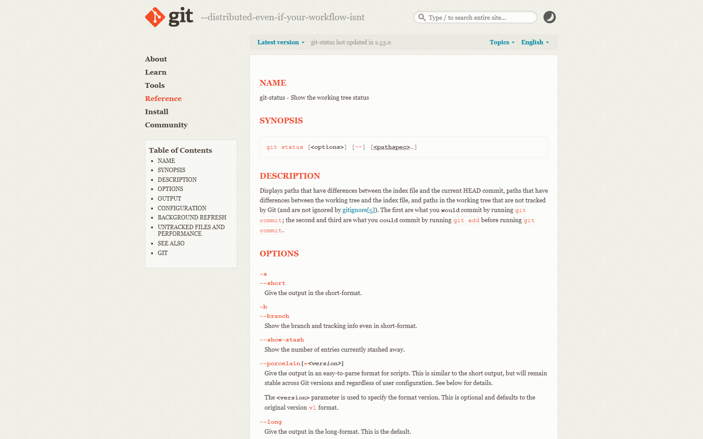

# 把调查结果写成项目理解报告

> 测试环境：Windows 11 24H2（Build 26100）；Codex Desktop 26.820.7780.0；Codex CLI 0.147.0；Git 2.47.0.windows.2；2026-08-27 核验。

只读调查结束后，最容易出现一种假完成：终端里积了一屏命令，聊天里也有很多结论，但换一个人接手，仍然不知道从哪里改、为什么这样判断、还缺什么证据。

项目理解报告要解决的就是这一步。它不是调查记录的长版，也不是 README 的替代品，而是一份让下一位读者可以复核、决定和行动的短文档。


> 图一　把文件发现、命令记录和风险提示收束成一份可交接报告。该图为原创概念图，不代表真实项目界面。

## 先区分两种产物

调查记录回答“我看到了什么”，项目理解报告回答“目前可以据此做什么”。前者允许保留搜索过程，后者只留下影响判断的证据。

| 调查记录 | 项目理解报告 |
|---|---|
| 按时间记录查过哪些文件和命令 | 按问题组织结论和证据 |
| 可以有重复发现和临时猜测 | 事实、推断、假设、未知项分开写 |
| 重点是过程可追溯 | 重点是下一步可执行 |
| 可能很长 | 通常控制在一到两页 |

如果一条信息不能帮助读者复核现状、评估风险或安排下一步，它通常不需要进入报告正文。

## 报告先写结论，再补证据

我会固定使用下面六个区块。顺序不是装饰，它能避免报告变成“看到什么写什么”。

1. **范围与结论**：调查了哪个仓库、哪个分支、截至什么时间；当前最重要的判断是什么。
2. **项目地图**：入口文件、核心模块、测试目录、运行命令，以及模块之间的关系。
3. **已确认事实**：每条都附文件路径、符号、命令或输出。
4. **基于证据的推断**：说明推断链，不能把推断写成代码已经证明的事实。
5. **未知项与风险**：列出缺失的运行证据、未覆盖的分支和可能影响范围。
6. **建议步骤**：把下一轮开发任务写到文件、符号、改动边界和验收方式。

### 一条结论至少要有一个证据锚点

证据锚点可以是四种东西：

- 文件路径和行号，例如 `src/discounts.py:4` 的 `apply_discount`。
- 代码符号之间的调用或导入关系。
- 命令及其关键输出，例如 `python -m unittest discover -s tests -v` 的失败用例。
- Git 状态、提交记录或差异，用来说明调查前后是否发生了改动。

不要把“看起来像入口”“应该是缓存问题”直接放进事实栏。看起来像入口是推断，缓存问题是待验证假设。

## 用一个小项目演示

本文使用 `temp/workflow-demo/`，这是一个不含真实业务数据的 Python 练习项目。README 说明它有四类练习：探索、修复折扣计算、重构重复逻辑和补测试；运行命令是：

```powershell
cd D:\codexguide_all\temp\workflow-demo
python -m unittest discover -s tests -v
```

只读调查时先看目录和入口，再看实现与测试：

```powershell
rg --files
rg -n "apply_discount|order_total|shipping_total|unittest" README.md src tests
git status --short --branch
git log --oneline --max-count=5
```

这几条命令能回答“项目怎么跑、核心函数在哪里、测试覆盖什么、调查期间有没有动过仓库”，但不会自动证明业务行为正确。

### 把发现压缩成项目地图

针对这个项目，报告里的地图可以只保留五行：

```text
README.md                       任务说明、运行命令和当前已知问题
src/discounts.py                折扣、订单总价和运费总价的实现
tests/test_discounts.py         unittest 行为测试，包含成功、异常和边界
python -m unittest ...          唯一记录在 README 中的测试入口
风险                           README 声称保留一个 Bug，需以实际测试输出确认
```

注意最后一行仍然是风险提示。README 的描述是项目文档事实，Bug 是否仍能复现，要靠运行结果确认。

## 事实、推断和未知项怎么写

可以用同一条发现演示三种写法：

| 层级 | 写法 | 证据 |
|---|---|---|
| 事实 | `apply_discount` 在 `src/discounts.py:4` 定义，先检查负价格和折扣范围，再返回四舍五入后的金额 | 文件内容和符号位置 |
| 推断 | 如果失败集中在折扣金额，优先检查 `apply_discount` 的百分比公式；订单总价走的是 `_add_rate`，不是同一条路径 | `src/discounts.py` 中的调用关系 |
| 未知项 | 尚未确认 README 所说的 Bug 在当前工作树是否仍能复现，也未确认生产项目是否使用同名函数 | 还没有运行输出或外部调用证据 |

这张表里的“未知项”不能被省略。读者知道哪里没有证据，才不会把一段合理猜测当成已经验证的结论。


> 图二　从文件、符号、命令到 Git 记录，证据越具体，结论越容易复核。该图为原创概念图。

## 把证据写成可复核引用

正文不需要复制整段源码，引用到能定位的最小单位就够了：

```text
结论：折扣计算入口是 apply_discount。
证据：src/discounts.py:4；函数在 :7 检查 price < 0，在 :9 检查 percent 范围，:10 返回 round(...)。
验证：python -m unittest discover -s tests -v；需记录实际通过/失败数量。
```

命令输出也要保留原貌，至少包括命令、关键行和执行时间。不要只写“测试通过”，更不要在没有运行时把 README 里的预期结果写成实际结果。

Git 证据建议成对记录：

```text
调查开始：git status --short --branch -> [原始输出]
调查结束：git status --short --branch -> [原始输出]
判断：两次输出一致，调查期间未发现新增改动；若不一致，逐项解释来源，不自行清理。
```

## 报告模板

下面的模板可以直接复制到项目文档、任务评论或交接记录中：

```markdown
# 项目理解报告：<主题>

调查范围：<仓库 / 分支 / 时间>
一句话结论：<当前最重要的判断>

## 项目地图
- 入口：<文件:行号 / 符号>
- 核心路径：<入口 -> service -> 数据或适配层>
- 运行命令：`<命令>`
- 测试入口：`<命令>`

## 已确认事实
- [事实] <结论>；证据：<文件:行号、命令或 Git 输出>

## 基于证据的推断
- [推断] <判断>；依据：<两条以内的证据>

## 未知项与风险
- [未确认] <还缺什么证据>；影响：<可能阻塞的决定>

## 下一步计划（尚未执行）
1. <文件:符号>：<最小改动>；原因：<对应证据>
2. 验证：<测试命令 / 手工检查 / 预期结果>
3. 停止条件：<出现什么情况就暂停并回报>
```

模板里的“尚未执行”很重要。它把调查和修改分成两个授权阶段，下一位执行者可以直接接着做，也能清楚知道哪些动作还没有发生。

## 从报告转成开发任务

一份报告合格的标志，是它能在不重新调查的情况下生成下一轮任务。转换时只保留四个要素：

1. **目标文件和符号**：不要只写“修复折扣逻辑”，写成 `src/discounts.py:4 apply_discount`。
2. **允许的范围**：例如只改公式，保留参数校验和返回值格式。
3. **证据和验证**：先复现失败测试，再展示差异，最后运行完整测试集。
4. **停止条件**：如果实际结果与报告不一致，或者发现会影响订单总价的共用逻辑，先停下来确认。

以本例为例，下一轮任务可以这样写：

```text
只处理 src/discounts.py 的 apply_discount。先运行
python -m unittest discover -s tests -v，记录失败用例和实际值。
确认百分比公式后做最小修复，不改函数签名、参数校验和其他公开函数。
展示 git diff，再运行完整测试。若 order_total 或 shipping_total 也受影响，暂停并报告。
```

这段任务没有替读者做决定：它保留了报告里的证据、边界和暂停点。


> 图三　报告把项目地图、证据和停止条件交给下一轮开发任务。该图为原创概念图。

## 常见的四个误区

**把搜索过程当报告。** `rg` 查了几十个文件不等于读者知道哪个入口重要。报告应删掉不影响判断的路径。

**把推断写成事实。** 函数名相似、目录名熟悉，都不能代替调用关系或运行输出。

**把预期结果当验证结果。** README 写“第一次会失败”，只能说明项目作者的意图；当前工作树是否如此，要重新运行。

**为了完整而复制源码。** 引用路径、符号和关键行即可。大段源码会掩盖真正的风险，也让报告很快过期。

## 交付前检查

- 报告开头写了调查范围、分支和核验时间。
- 每条事实都有路径、符号、命令或 Git 证据。
- 推断注明依据，未知项明确写“未确认”。
- 运行命令和实际输出没有互相冒充。
- 下一步任务包含改动边界、验证方式和停止条件。
- 调查前后的 Git 状态已对照；发现变化时没有擅自清理。
- 报告长度能让接手者在几分钟内定位入口，而不是重新读完整个仓库。

项目理解报告的价值不在于写得长，而在于把“现在知道什么、还不知道什么、下一步能安全做什么”写清楚。做到这三点，调查结果才真正能交接给下一次任务。

如果你准备把这套方法放进自己的 Codex 工作流，可以到 [CodexGuide](https://codexguide.io/?utm_source=wechat&utm_medium=article&utm_campaign=project-understanding-report-20260827&utm_content=closing-website-01) 查看配套模板。

## 参考资料

- [OpenAI Codex 文档](https://developers.openai.com/codex/)：Codex 产品与工作流入口，页面于 2026-08-27 通过 Jina Reader 核验。
- [Codex CLI 文档](https://developers.openai.com/codex/cli/)：CLI 使用入口，页面于 2026-08-27 通过 Jina Reader 核验。
- [git-log 官方文档](https://git-scm.com/docs/git-log)：记录提交历史和调查依据。
- [git-diff 官方文档](https://git-scm.com/docs/git-diff)：检查改动范围和差异。



> 图四　Git 官方 `git-status` 文档中对工作树、暂存区和未跟踪文件的说明。截图于 2026-08-27 核验，页面内容可能随 Git 版本更新。

## 配图素材备用区（暂不计入正文图号）

> 本节用于写作阶段选图，发布前应将采用的素材移动到对应正文段落并重新编号。旧界面、限时活动和第三方教程必须标注日期与来源。

### 官方与可核验操作界面

- `图四-Git官方git-status.png`：适用于“把证据写成可复核引用”和“交付前检查”；证明 Git 官方文档说明工作树、暂存区、未跟踪文件以及 `--short`、`--branch`、porcelain 输出；来源：[git-status 官方文档](https://git-scm.com/docs/git-status)，Git project，2026-08-27；浏览器打开原始页面并用 Playwright snapshot 后截图。页面会随 Git 版本更新，截图只代表核验当天的内容。

### 原创概念配图

- `图一-调查结果整理成报告.png`：适用于文章开头，表达从零散调查到项目理解报告；1672×941 PNG；OpenAI 内置 image_gen 生成，2026-08-27；不代表真实产品界面。
- `图二-证据等级.png`：适用于“事实、推断和未知项怎么写”，表达证据由文件、符号、命令到 Git 记录逐级增强；1672×941 PNG；OpenAI 内置 image_gen 生成，2026-08-27；不含文字和个人信息。
- `图三-报告转开发任务.png`：适用于“从报告转成开发任务”，表达项目地图、证据和停止条件进入下一轮任务；1672×941 PNG；OpenAI 内置 image_gen 生成，2026-08-27；不含真实 UI。

### 视频教程来源（仅作来源，不自动作为配图）

- 暂无。未保存视频封面、缩略图或未核验帧。

### 需要作者亲自截图

- [ ] `10-01-原始调查记录.png`：Codex Desktop 或编辑器打开 `temp/workflow-demo/OPERATION-LOG.md`，展示零散发现和命令记录；隐藏本机用户名、私人路径和线程标识；停在只读记录画面。
- [ ] `10-02-证据引用格式.png`：编辑器打开本文报告模板，展示文件路径、符号、命令和关键输出四个字段；使用公开或脱敏项目；不要展示令牌、连接串或个人信息。
- [ ] `10-03-事实与推断分类.png`：编辑器展示“已确认事实 / 推断 / 未知项”三栏；画面只保留示例文本；停止在编辑状态，不执行任何修改命令。
- [ ] `10-04-完整理解报告.png`：Codex Desktop 或编辑器展示一页式报告、Git 前后状态和下一步任务；隐藏线程 ID、本机路径和账号信息；停止在创建开发任务之前。

### 查找记录

- 详见文章同级图片备份目录中的 `research-log.md`。
