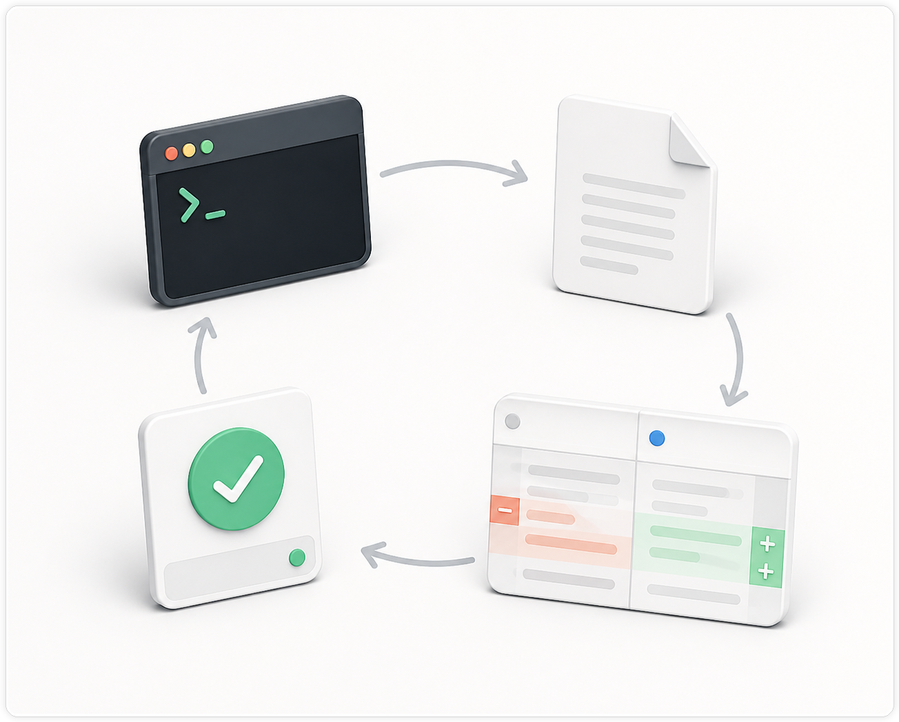
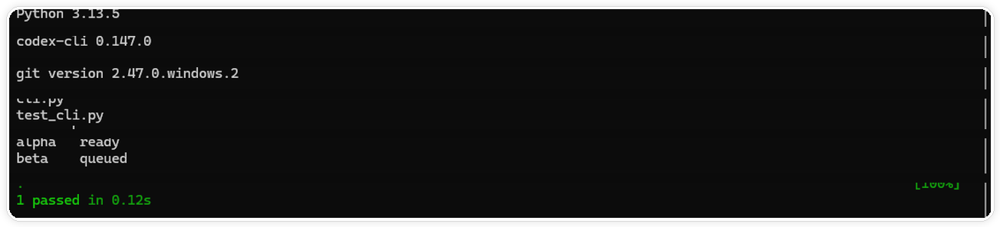
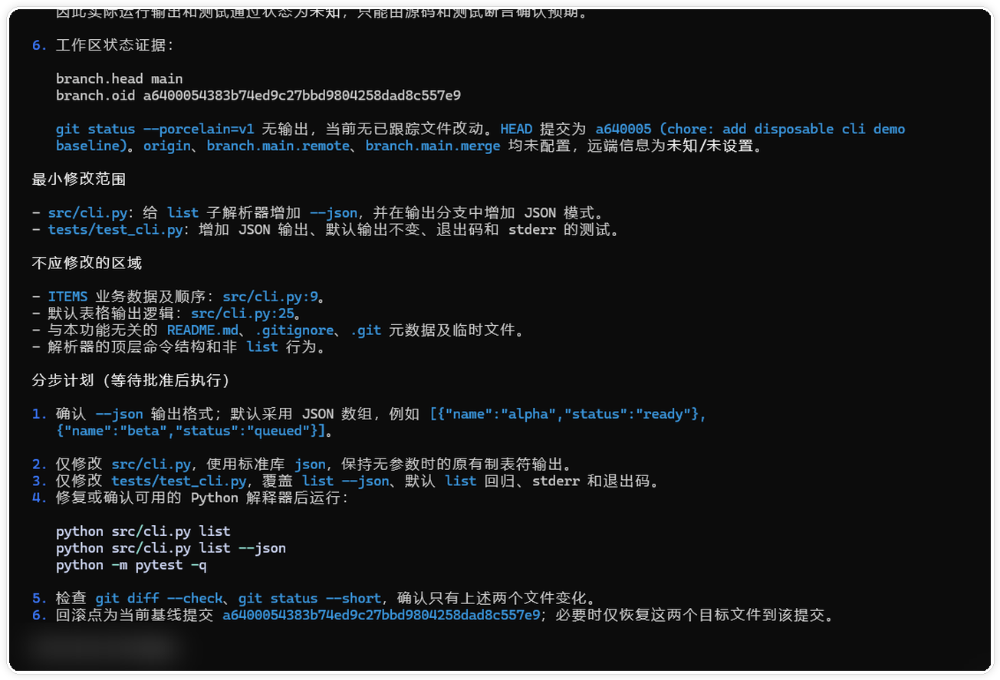
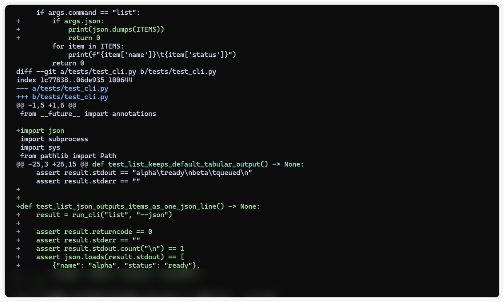

# 第一次让 Codex 改代码，为什么一定要先做这 6 步？

> 测试环境：Windows 11 24H2（Build 26100）；PowerShell 7.6.4；Codex CLI 0.147.0；Git 2.47.0；2026-08-30 核验。

## 这篇文章解决什么问题

第一次让 Codex 改代码，最容易犯的错不是提示词写得不够长，而是没有把“改什么、别改什么、怎么证明改对了”说清楚。模型可以很快翻目录、编辑文件、运行命令，但最后仍要由人判断：它改的是不是目标文件，范围有没有悄悄变大，结果能不能复现。

这篇文章不讲某个框架的 API，而是把一次小改动从头走完。示例任务是给命令行工具增加 `--json` 输出：默认文本输出保持不变，新模式输出一行可被脚本解析的 JSON。整个过程放在可丢弃的 Git 仓库里，不碰生产目录，也不提交或推送。

六步分别是：记录基线、写清验收条件、只读调查、批准计划、按范围编辑并看 diff、覆盖新旧路径做验证。后文把“交付说明”和“该停下来的情况”放在最后一步里讲。



> 图一：从终端检查到测试验证的开发闭环。

## 先记录修改前状态

开始前先保存三类信息：当前分支和未提交改动、项目的运行命令、这次任务明确不做什么。

```powershell
git status --short --branch
Get-ChildItem
Get-Content package.json
```

如果工作区已经有改动，先把它们记录下来，不要让 Codex 把旧改动和新任务混在一起。没有 `package.json` 时，按项目实际情况读取 `pyproject.toml`、`go.mod`、`Cargo.toml` 或其他包管理文件。

接着保存一份默认输出作为基线：

```powershell
python src/cli.py list > before.txt
python src/cli.py list
```

`before.txt` 只是本地比较材料，不要把真实用户数据、令牌或内部地址放进演示仓库。本文假设工具已有 `list` 命令，实际复现时要换成项目自己的命令。



> 图二：先记录版本、文件和默认输出，后面才有可比较的基线。

## 把需求改写成可验收的任务

我会把原始需求写成下面这样：

```text
在现有 CLI 中增加 --json 输出模式。

目标：
- 默认文本输出保持不变。
- 传入 --json 时输出一行合法 JSON，供脚本读取。

范围：
- 只改参数解析、输出适配和直接测试。
- 不改业务计算、默认参数、退出码和其他命令。

工作方式：
- 先只读调查，列出入口、现有输出、最小修改文件和验证命令。
- 等我确认计划后再编辑。
- 每一轮编辑后展示 git diff，不做无关格式化和重构。

交付：
- 报告修改文件、默认模式和 JSON 模式的验证结果。
- 写出未覆盖的风险。
- 不提交、不推送。
```

这份任务有两个好处。第一，旧行为和新行为是两条可以分别检查的路径。第二，范围和排除项都写出来了，Codex 不需要替你决定要不要改共享工具或构建配置。

如果你准备把这套写法迁移到自己的项目，可以继续看 [Codex 工作流：从任务到可回滚结果](https://codexguide.io/codex/workflows?utm_source=wechat&utm_medium=article&utm_campaign=codex-development-loop&utm_content=contextual-workflow-01)，对照目标、约束和验收条件逐项补齐。

## 第一轮只读调查

把任务交给 Codex 时，先锁住编辑权限：

```text
先只读调查，不要改文件、安装依赖或提交。
确认 CLI 的参数解析入口、默认输出函数、结果对象和直接测试。
列出最小修改文件、明确不应修改的区域、验证命令和回滚点。
每个结论都附文件路径或命令证据；证据不足时标记未知。
最后只给出分步计划，等待我批准后再编辑。
```

好的调查结果不应该只有“建议修改 cli.ts”。它至少要说明：参数在哪里解析，输出由哪个函数负责，现有测试覆盖了什么，为什么某个文件被排除，以及第一条验证命令是什么。

如果 Codex 报告某个文件不存在，或者发现项目实际使用另一套入口，先修正任务上下文。不要为了让计划看起来完整而接受猜出来的路径。

## 批准计划，但只批准一轮

以这次 Python 演示仓库为例，Codex 找到了 `src/cli.py` 和 `tests/test_cli.py`，计划是先传递 `json` 开关，再增加序列化分支，最后补测试。批准时可以这样说：

```text
批准第 1～2 步。
只修改 src/cli.py 和 tests/test_cli.py；每一步完成后停下来展示 diff。
不要格式化其他文件，不要改默认输出和退出码。
如果发现必须修改第三个生产文件，先解释原因，暂停当前一轮。
```

“批准计划”不等于给了无限授权。每轮只放行一小段，才容易看出范围什么时候开始漂移。模型发现类型错误、导入路径变化或生成文件时，要回到计划重新判断，而不是继续扩大修改。



> 图三：先锁定目标文件、排除项、验证命令和回滚点，再批准下一轮编辑。

## 逐步编辑，保持 diff 可读

第一轮通常只做参数传递。第二轮处理输出格式。第三轮补测试。每轮结束都运行：

```powershell
git diff --stat
git diff -- src/cli.py tests/test_cli.py
git status --short
```

这里看三件事：文件数量有没有超出计划，改动是否仍围绕 `--json`，工作区有没有出现生成物或临时文件。只要出现 README、锁文件、全局样式或无关模块，先停下来。

小功能不需要“大扫除”。如果 Codex 说“顺便统一输出层”或“把整个参数系统重构一下”，把它记成后续任务。当前补丁应该能在几分钟内由人读完。



> 图四：实际 diff 只围绕 `src/cli.py` 和 `tests/test_cli.py` 展开。

## 最小验证要覆盖旧路径

新增模式至少验证两件事：默认输出仍然和基线一致，`--json` 输出能够被解析。

```powershell
python src/cli.py list > after.txt
Compare-Object (Get-Content before.txt) (Get-Content after.txt)
python src/cli.py list --json | ConvertFrom-Json
```

如果项目已有测试，先运行定向测试，再按项目约定执行类型检查、lint 或构建。不要只跑新分支；兼容旧行为往往是小功能最容易漏掉的部分。

验证命令失败时，先区分代码失败、环境缺依赖和命令本身选错。把失败原样记录下来，不要为了得到绿色结果让 Codex 改测试或跳过检查。环境问题应单独写出影响范围，不要包装成任务完成。

## 用交付说明收尾

一轮闭环结束后，要求 Codex 按固定格式报告：

```text
修改文件：src/cli.py、tests/test_cli.py。
保持不变：默认文本格式、业务计算、退出码、其他命令。
已验证：默认命令、--json 命令、JSON 解析、定向测试。
未验证：大数据量输出、下游脚本的真实兼容性。
当前状态：工作区有未提交改动；未提交、未推送。
```

这份说明和 diff 放在一起，别人才能快速复核。代码能运行只是一个结果，不能替代范围检查和证据记录。

## 什么时候应该停下来

遇到下面任一情况，就先暂停：

- 计划中的文件路径和实际仓库不一致。
- 需要修改计划外的生产文件。
- 模型开始批量重写、格式化或顺手升级依赖。
- 验证失败，但原因还没有定位。
- 任务涉及生产配置、迁移、删除、部署或真实用户数据。

暂停后让 Codex 列出当前 diff、已完成步骤、剩余假设和可回滚点。若范围已经失控，恢复到上一个干净检查点，再把任务拆成更小的轮次。第 05 节会继续讲分支、提交和 Review；第 06 节会展开日志、测试和回归验证。

## 一张可以反复使用的闭环清单

```text
[ ] 保存 git status 和修改前输出
[ ] 写清目标、允许修改范围和排除项
[ ] 先让 Codex 只读调查并给计划
[ ] 只批准当前一轮编辑
[ ] 每轮查看文件清单和 git diff
[ ] 验证新增行为和旧行为
[ ] 记录命令、结果和仍需检查的风险
[ ] 停在提交、推送和发布之前
```

这套顺序的价值不在于让 Codex 少打几行字，而在于每一步都留下可以检查的证据。下次换成修 Bug、跨文件改接口或升级依赖，仍然可以复用同一个框架。

## 继续实践

如果你想把“看 diff、跑测试、记录尚未覆盖的检查”变成固定习惯，可以到 [CodexGuide 验证流程](https://codexguide.io/codex/validation?utm_source=wechat&utm_medium=article&utm_campaign=codex-development-loop&utm_content=closing-website-01) 查看从 diff 到回归检查的完整顺序。

如果你的项目还有本文没有覆盖的环境差异、权限限制或真实数据问题，欢迎扫码交流，描述清楚项目类型、复现命令和已经跑过的检查，方便一起定位。


