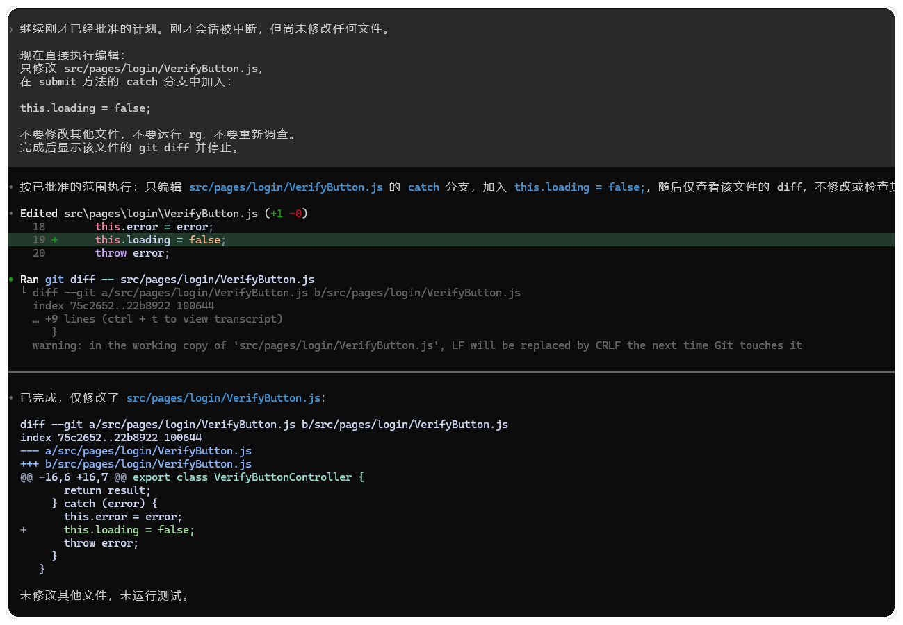
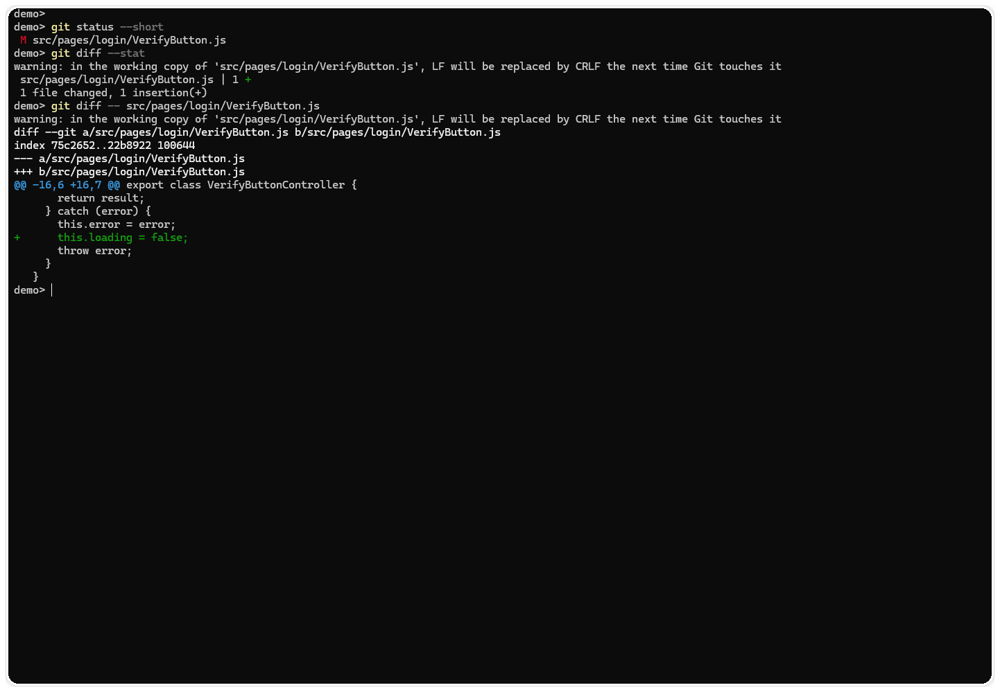
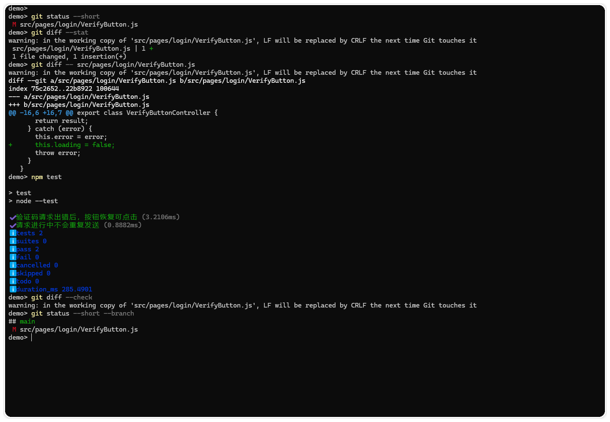

# 先计划再编辑，把需求拆成可执行的改动步骤

> 测试环境：Windows 11 24H2（Build 26100）；PowerShell 7.6.4；Codex CLI 0.147.0；Git 2.47.0；2026-08-30 核验。

## 为什么先写计划

“把登录按钮修好”还不够执行。Codex 需要知道按钮在哪个页面、错误状态由谁维护、哪些文件可以改，以及这次任务应该停在补丁、测试还是提交。

计划不用预测每一行代码。它只要把几个判断点提前写出来，包括目标文件、排除项、依赖顺序、验证命令和停止条件。信息不够就先补调查，范围清楚后再开放编辑。

## 先建立改动卡

```text
目标：错误验证码请求结束后，提交按钮恢复可点击。
已知入口：src/pages/login/VerifyButton.tsx；请求封装 src/api/auth.ts。
允许修改：按钮状态逻辑及其直接测试。
不要修改：API 参数、路由、全局请求封装和文案。
验收：错误分支可再次点击；不重复发送请求；相关测试通过。
停止点：展示计划和 diff，不提交、不推送。
```

“允许修改”和“不要修改”要同时写。只列允许目录，Codex 仍可能顺手更新共享工具，或者把整棵目录格式化一遍。

## 第一轮只读调查

在仓库根目录先确认现场：

```powershell
git status --short --branch
rg -n "VerifyButton|loading|验证码|auth" src test
```

如果当前 PowerShell 没有安装 `rg`，可以用系统自带的 `Select-String` 完成同样的定向搜索（把 `tests` 换成仓库实际的测试目录）：

```powershell
$root = (Get-Location).Path
Get-ChildItem -Path src,tests -Recurse -File |
  Select-String -Pattern 'VerifyButton|loading|验证码|auth' |
  ForEach-Object {
    $rel = $_.Path.Substring($root.Length + 1)
    '{0}:{1}:{2}' -f $rel, $_.LineNumber, $_.Line.Trim()
  }
```

然后把计划交给 Codex：

```text
先只读调查，不要改文件、装依赖或提交。
确认 VerifyButton 的 loading 状态由谁设置和清理，列出直接调用方、现有测试、最小修改文件、验证命令和未确认事项。
如果证据不足，停下来说明缺什么。最后只给出分步计划，等待我批准后再编辑。
```

计划至少要回答四个问题。改哪个文件，先后顺序是什么，怎样证明每一步有效，失败后回到哪里。出现“可能”“大概”“相关文件”这类没有路径的说法，说明计划还不够具体。

如果你还在熟悉 Codex 如何判断修改范围，可以先读《别再让 Codex 全仓库乱翻了：先找到真正需要修改的代码》，再回到本文整理计划。

## 批准后分步编辑

批准计划时可以附加限制：

```text
批准第 1～2 步。只修改 VerifyButton.tsx 和已有的按钮测试；每完成一步先展示 diff。
不要做格式化、命名整理或无关重构。如果发现需要修改第三个文件，先停下来解释原因。
```



图一：批准后，Codex 只修改计划中指定的按钮状态文件，并展示新增的清理语句。



图二：回到终端后，`git diff` 显示只有一个文件增加了一行修改。

每一轮都检查文件数量有没有增加，改动是否仍围绕同一个行为，计划中的验证命令是否还适用。计划不是一次性授权，前提变化后要重新确认。



图三：两个测试通过，工作区仍只保留按钮状态文件的未提交改动。

## 常见失控信号

- diff 出现没有在计划中的配置、锁文件或共享工具。
- Codex 开始“顺便统一风格”或批量重命名。
- 验证命令从一个定向测试扩大成全仓库构建，却没有说明原因。
- 计划中的文件找不到，模型用猜测替换路径。

发现这些情况就暂停，让 Codex 列出当前 diff、已完成步骤和下一步假设，再决定继续、缩小范围还是恢复现场。

## 一份可复用的计划模板

```text
任务目标：
修改前事实：
允许修改的文件：
明确排除的文件：
步骤 1（只读确认）：
步骤 2（最小编辑）：
步骤 3（最小验证）：
每步停止条件：
回滚点：
最终交付：文件清单、diff、验证结果、剩余风险。
```

先计划不会替你完成开发，但能把“要不要改第三个文件”从代码写完后的争论，提前变成一个可以核对的决定。

## 小结

先确认现场，再要求只读计划。计划写清范围、排除项和证据，批准后按小步编辑，每轮查看 diff。前提变化就停下来重排。测试设计和完整回归见 [06-测试调试与质量保障](../06-测试调试与质量保障/)，分支和提交见 [05-Git协作与代码审查](../05-Git协作与代码审查/)。

## 继续实践

如果你准备把这套方法放进真实开发任务，可以到 CodexGuide 的 [Codex 工作流：从任务到可回滚结果](https://codexguide.io/codex/workflows?utm_source=wechat&utm_medium=article&utm_campaign=codex-plan-before-editing&utm_content=closing-website-01) 查看目标、约束、最小修改和验证如何连成一条流程。

如果你的项目有特殊权限、范围或验收问题，可以扫码添加微信，带着任务目标、当前状态和遇到的卡点一起交流。


