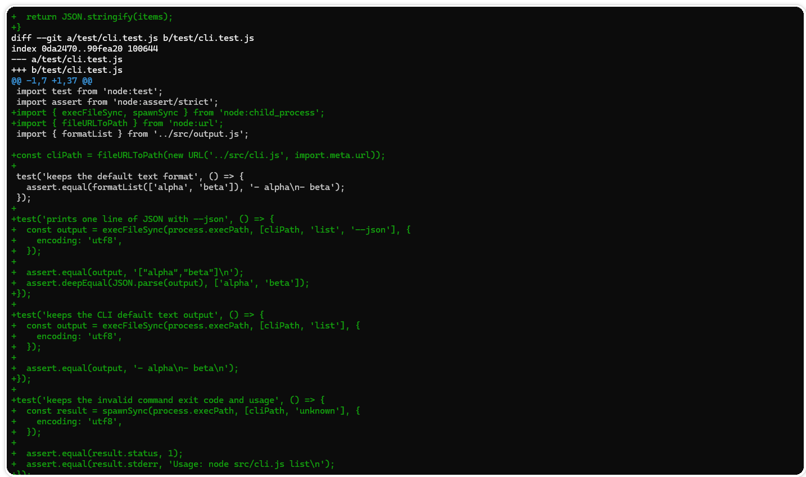
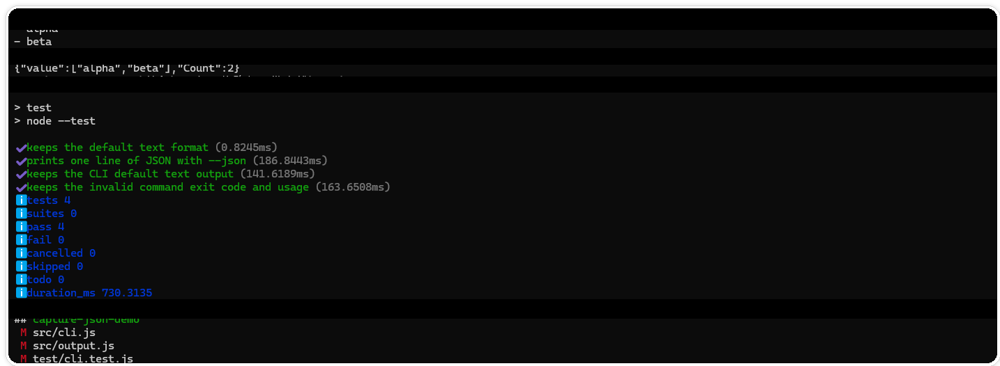

# CLI 增加 `--json`：如何做出一个最小可交付补丁

> 测试环境：Windows 11 24H2（Build 26100）；PowerShell 7.6.4；Codex CLI 0.147.0；Git 2.47.0；2026-08-31 核验。

## 先把“小功能”说小

示例需求很具体：给命令行工具增加 `--json`，让脚本可以读取结果。它不涉及新的配置文件、彩色主题、日志系统，也不改参数名称。边界越清楚，Codex 越不需要替你做产品决策。

修改前先记录默认输出、参数解析入口、结果对象、已有命令和测试。用 `git status --short --branch` 确认现场，再让 Codex 做只读调查。

如果你还在摸索怎样把需求写成可执行的任务，可以先读《别再对 Codex 许愿：一张任务单让它少走弯路》，再回来看下面的补丁步骤。

## 任务提示词

```text
在现有 CLI 中增加 --json 输出模式。
目标：默认文本输出保持完全不变；传入 --json 时输出一行合法 JSON。
范围：只改参数解析、输出适配和直接测试；不要改业务计算、默认参数和退出码。
先调查入口和现有输出，给出最小文件计划，等待确认后再编辑。
完成后运行已有 CLI 测试和一条手工命令，报告 diff 与未覆盖风险。
```

这个任务把行为拆成两个可比较的分支：旧分支不能变，新分支必须满足 JSON 语法。验收条件是可执行的，Codex 不必猜“看起来像 JSON”是什么意思。

## 按依赖顺序改

第一步处理参数解析，把 `json` 布尔值传到输出层；第二步新增一个小 formatter，把结果对象序列化；第三步补直接测试。不要一上来重写整个 `main`。

每一步完成后，都看一眼差异：

```powershell
git diff --stat
git diff -- src/cli.js src/output.js test/cli.test.js
```

如果 diff 出现 README、锁文件或与输出无关的组件，先停下来。小功能的价值就在于可以很快读完全部改动。



图一：测试代码围绕 JSON 分支、默认输出和无效命令退出码展开。

## 验收两条路径

自动检查覆盖默认输出和 `--json` 分支。手工检查只需要一条真实命令：

```powershell
tool list --json | ConvertFrom-Json
```

再运行默认命令，对比修改前保存的样例输出。不要只验证新路径，兼容旧行为更容易被忽略。

```powershell
node src/cli.js list
node src/cli.js list --json | ConvertFrom-Json | ConvertTo-Json -Compress
npm test
git status --short --branch
```

默认路径仍输出两行文本；JSON 路径输出一行合法数组；测试应全部通过。最后确认工作区只包含预期的三个文件，再进入交付说明。



图二：默认输出保持不变，JSON 管道解析成功，4 个测试全部通过。

## 交付说明模板

```text
已修改：src/cli.js、src/output.js、test/cli.test.js。
保持不变：默认文本格式、退出码、业务计算。
已验证：默认命令、--json 命令、JSON 解析。
未验证：大数据量输出和下游脚本兼容性。
```

最小补丁的标准不在文件数量，而在行为边界是否清楚、每个改动是否有理由、验证结果能否复现。测试设计和完整回归可以继续看 [Codex 工作流：从任务到可回滚结果](https://codexguide.io/codex/workflows?utm_source=wechat&utm_medium=article&utm_campaign=codex-small-feature-patch&utm_content=closing-website-01)。

如果你在具体项目里遇到范围、测试或兼容性问题，可以扫码添加微信，带上命令输出和 diff 一起交流。


