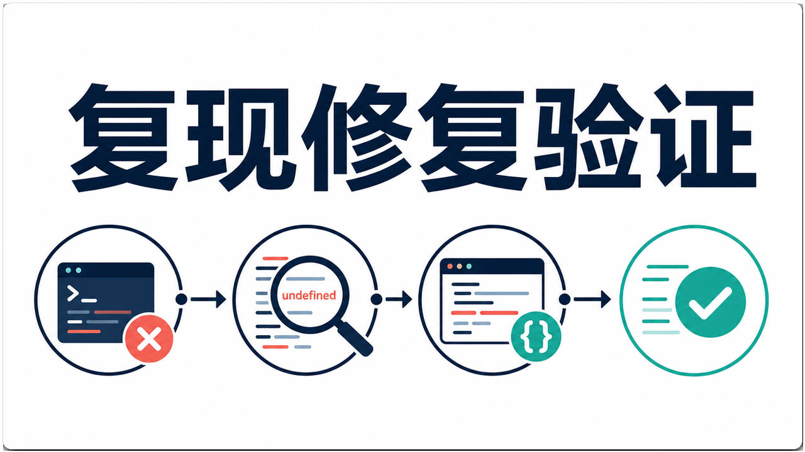
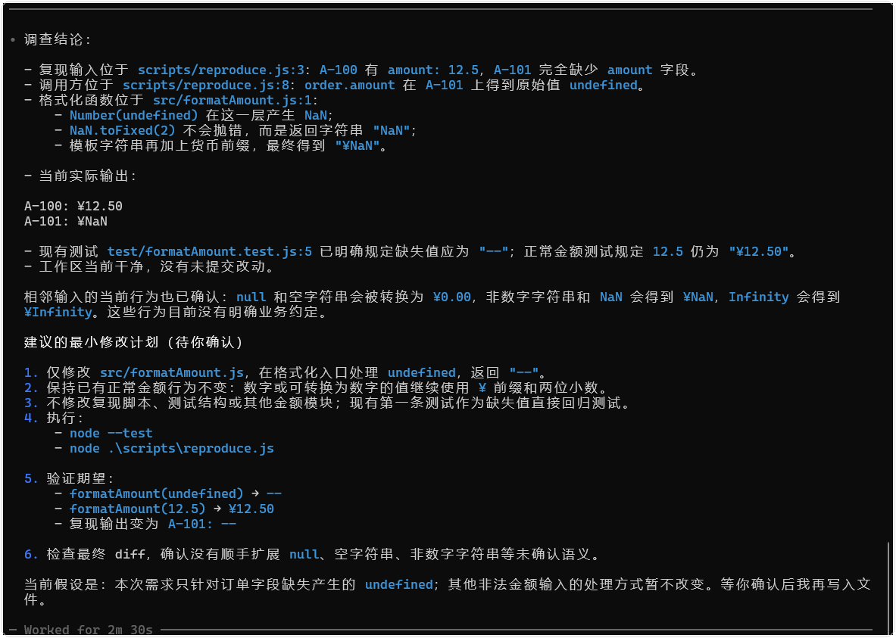
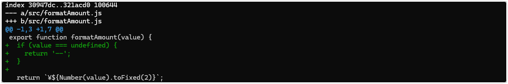
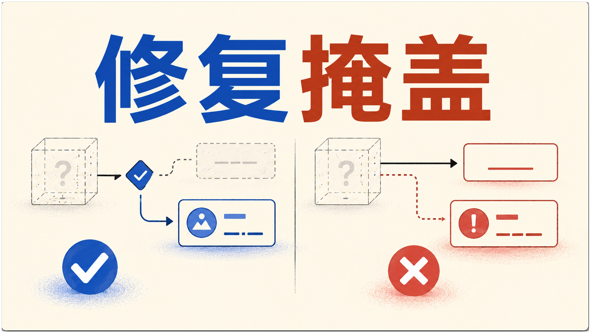
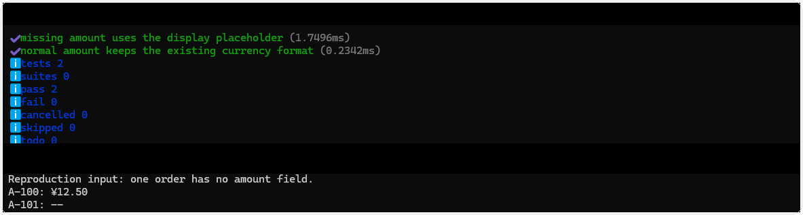

# Codex 修复可复现 Bug：让补丁只解决当前问题

> 测试环境 Windows 11 24H2（Build 26100）；PowerShell 7.6.4；Codex CLI 0.147.0；Git 2.47.0；2026-08-30 核验。

## 先固定现象

示例问题是订单列表偶尔显示 `NaN`。复现输入包括一个缺少金额字段的订单，期望界面显示占位符，实际结果是 `NaN`。没有复现步骤前，不要让 Codex 直接“修金额格式化”。

如果你想先看完整的任务分工，可以浏览 CodexGuide 的[工作流页面](https://codexguide.io/codex/workflows)，再回到这里收窄修复范围。

先保存现场。

```powershell
git status --short --branch
rg -n "formatAmount|NaN|订单金额" src test
```


图一  缺失金额的订单输出 `¥NaN`，正常金额仍显示为 `¥12.50`。

## 先问根因，再写补丁

```text
请调查订单金额显示 NaN 的问题，先不要改文件。
用给定复现输入追踪原始值、格式化函数和调用方，说明 NaN 在哪一层产生。
列出最小修改文件、应保持不变的输入输出、直接回归测试和无法确认的假设。
不要顺手重构金额模块。
```

如果后端没有返回金额字段，格式化函数拿到的就是 `undefined`。这时直接执行 `Number(value).toFixed(2)` 会得到 `NaN`。补丁只处理这个边界，正常金额仍按现有规则格式化。根因和修复位置必须对应。



图二  从稳定复现开始，经过根因定位和最小修改，最后用定向测试确认结果。



图三  `undefined` 在格式化入口转成 `NaN`，修复只处理缺失值并保留正常金额格式。

## 最小修复的形状

要求 Codex 按这个顺序工作。

1. 在现有格式化函数入口处理缺失值，保留正常数字和已有货币格式。
2. 增加一个缺失值测试和一个正常金额测试。
3. 用原始复现输入运行定向测试和手工命令。

每一步后看 diff。若出现 API 参数改名、页面重排或全局类型整理，说明补丁已经偏离问题。



图四  差异集中在 `src/formatAmount.js` 的缺失值分支，测试文件和其他模块保持不变。

## 区分修复与掩盖

把 `NaN` 替换成空字符串可能让截图好看，却会把数据异常藏起来。先确认产品约定。缺失金额是显示 `--`、0，还是阻止订单进入列表。显示层只能执行已确认的约定，不能替业务决定默认值。



图五  真正的修复明确处理缺失值并保留异常线索，表面掩盖只是把错误输出藏起来。

## 交付检查

```text
复现输入：金额字段缺失的订单。
根因：格式化入口未处理缺失字段带来的 undefined。
修改：金额格式化函数 + 直接回归测试。
保持：正常金额格式、接口参数、订单排序。
验证：缺失值、正常值、原始列表命令。
未覆盖：后端返回非数字字符串的情况。
```



图六  缺失值测试与正常金额测试均通过，复现输出变为 `A-101: --`，`A-100` 的格式保持不变。

日志、调用栈和完整回归方法放在 [06-测试调试与质量保障](../06-测试调试与质量保障/)。本篇的重点是让一个可复现问题对应一个可审查补丁。

## 继续实践

如果你准备把这套排查方法放进真实项目，可以到 CodexGuide 的[验证流程](https://codexguide.io/codex/validation)，继续练习如何把 diff、测试和最终状态整理成可复查的证据。
