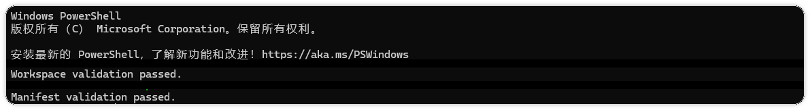

# Codex 多文件改动：接口、类型和界面如何保持同步

> 测试环境：Windows 11 24H2（Build 26100）；PowerShell 7.6.4；Codex CLI 0.147.0；Git 2.47.0；2026-08-30 核验。

接口、共享类型和界面一起变化时，最容易漏掉的是契约。后端已经返回新字段，类型文件还没更新，组件只能靠猜；类型更新了，旧数据又可能在运行时变成 `undefined`。这类问题通常要改四个文件，排查却不能按文件名挨个改。

本文用一个订单列表需求说明做法。接口增加可选的 `displayName`，列表优先显示它，旧订单没有这个字段时继续显示 `orderId`。数据库、路由、排序和点击行为都留在范围外。

如果你还在熟悉如何把需求写成可执行约束，可以先看《别再对 Codex 许愿：一张任务单让它少走弯路》，再回到这个跨文件例子。

## 先把接口变化写成矩阵

动手前先把数据从哪里来、经过哪些层、最后由谁消费写出来。下面这张表就是本次改动的边界。

| 文件/层 | 作用 | 本次动作 | 保持不变 |
|---|---|---|---|
| `server/orders.ts` | 组装响应 | 增加可选字段 | 查询条件和状态码 |
| `shared/order.ts` | 类型契约 | `displayName?: string` | 现有字段类型 |
| `web/OrderRow.tsx` | 展示数据 | 有名称显示名称，否则回退订单号 | 排序和点击行为 |
| `test/orders.spec.ts` | 直接验证 | 覆盖有字段和无字段两例 | 既有 API 断言 |

矩阵里同时写“本次动作”和“保持不变”。只写要改什么，Codex 仍可能顺手改路由或把所有订单字段改成必填。表格还会提醒你检查生产调用方，避免只改类型声明，忘了读取数据的组件。

## 先确认数据形状

“增加一个字段”这句话还不够具体。要先确认字段出现在哪一层，值可以缺失到什么程度，以及空字符串是否和缺失值有不同含义。

这次示例把 `displayName` 定义成可选字符串。后端有名称时返回字符串，没有名称时省略字段，旧订单仍只返回 `orderId`。如果接口实际返回 `displayName: null`，类型就应该写成 `displayName?: string | null`，组件也要采用同一套判断。不要让后端、类型和前端各自猜一种写法。

还要检查列表接口和详情接口是否共用同一个响应类型。若列表只需要名称，详情却还没有这个字段，可以先保持两份 DTO 的边界，不能为了省一个类型文件把详情响应也改掉。接口文档、序列化代码和测试样例最好使用同一份字段示例，读者看到的契约才是完整的。

可以让 Codex 先输出一份数据流摘要，确认它没有把“接口字段”误当成“数据库字段”。摘要只需要回答四件事。

- 响应由哪个函数组装。
- 共享类型从哪里被导入。
- 哪些组件读取这个字段。
- 缺失、为空和为 `null` 时分别应该显示什么。

如果这四件事中有一件没有证据，就先停在调查阶段。跨文件任务的成本通常不在写代码，而在修正一个错误假设后重新检查所有消费者。

## 按数据流安排改动顺序

这次应按 `server → shared type → web → test` 推进。先确认响应到底在哪里组装，再把字段写进共享类型，接着处理界面回退，最后用测试固定两种数据形状。顺序反过来，测试很容易围绕一个尚未确定的接口打转。

可以把下面这段任务直接交给 Codex。

```text
请为订单响应增加可选 displayName，并在列表中展示。先只读确认响应组装、共享类型、列表组件和直接测试的路径。按 server → shared type → web → test 的顺序改动；displayName 缺失时回退 orderId；不要改数据库、路由、排序和点击行为。每一步完成后展示 git diff --name-only；发现实际 DTO 或调用方与假设不一致时停下来报告，不要扩大范围。
```

先让它报告真实入口和计划，再批准编辑。第一轮只改响应和类型，第二轮处理组件，第三轮补测试。每轮结束都看 `git diff --name-only`，文件集合一旦超出矩阵，就回到计划重新判断。

如果仓库使用自动生成类型，顺序要稍微调整。先确认生成文件的来源和生成命令，再修改源 DTO 或接口描述，最后运行生成步骤。生成文件通常不应该手工编辑，锁文件和格式化结果也不应因为一次字段增加而被顺手重写。把生成文件是否纳入提交写在计划里，避免 Codex 一边改源文件，一边留下没有来源的手工补丁。

跨层核对时，可以按同一个字段名向下追踪。

```text
displayName
  server/orders.ts       响应是否真的写入
  shared/order.ts        类型是否允许缺失
  web/OrderRow.tsx       读取后是否有回退
  test/orders.spec.ts    有值和缺失值是否都断言
```

这份小清单能防住一种常见遗漏。类型文件已经声明了字段，组件也编译通过，但后端响应组装函数从未赋值。静态检查会放行，页面却永远走回退分支。反过来，后端返回了字段，类型却仍然没有声明，调用方可能被迫使用类型断言，问题会被推迟到运行时。

## 类型变了，调用方要跟着收紧

`displayName?: string` 表示旧订单仍然合法。组件不要直接渲染可能为空的字段，而要明确写出回退规则，例如 `order.displayName ?? order.orderId`。这里的回退是产品约定，不能为了让编译通过随手改成 `any`，也不能把缺失名称显示成空白后就当作完成。

回退规则要在界面和测试里使用同一份表达。假设订单名称为空字符串时也要回退，那么 `??` 就不够了，需要先把空白判断写清楚，再决定使用 `||`、辅助函数还是后端清洗。这个选择不能藏在一行难读的表达式里，任务说明和测试名称都应该让后来的人看懂产品约定。

如果同一个字段被多个列表组件读取，先列出调用方，再决定是否抽一个格式化函数。只有当回退规则完全一致时才适合共享；一个页面需要显示“未命名”，另一个页面需要显示订单号，就应该保留各自的展示策略。共享函数的价值是减少重复判断，不是把不同产品语义压成一个默认值。

如果调查发现后端实际返回的是另一份 DTO，先停下来指出真实类型来源。不要同时保留两套接口，也不要把共享类型改宽来掩盖不一致。确认 DTO 后，再决定是调整类型入口，还是让响应组装层遵守现有契约。

## 验证要覆盖两种返回

跨文件修改至少要验证有名称和无名称两条路径。直接测试检查接口字段和回退结果，类型检查负责发现遗漏的调用方，手工数据则确认界面真的显示了预期文本。

```powershell
# 按项目已有脚本替换下面两个命令
npm test -- orders
npm run typecheck
```

验证结束后再看工作区状态，确认没有生成文件或计划外改动。初始化阶段的两个结构校验结果如下，代码测试仍应在实际项目中单独执行。



图一  PowerShell 初始化工作区后，工作区校验和素材清单校验均通过。

测试用例可以按数据形状分成四个检查点。接口返回名称时，响应应包含字符串，列表显示名称；接口省略名称时，响应仍能通过类型检查，列表显示 `orderId`；如果项目允许 `null`，还要单独覆盖 `null`；最后确认既有字段和排序结果没有变化。测试不一定要写成四个文件，关键是每个断言都对应一个约定。

手工验证和自动测试也要分工。自动测试适合锁定字段类型、回退文本和参数边界，手工检查适合确认真实页面没有出现空白行、重复请求或布局跳动。若接口通过网络层做了字段转换，最好再加一次接近真实响应的测试，避免只测本地构造对象。

类型检查通过也不代表所有消费者都安全。检查结果只说明当前编译入口能接受这份类型，未被编译的脚本、旧版页面和其他服务仍可能依赖旧响应。交付说明里把这些消费者列出来，至少写明已经检查过的调用方和仍未覆盖的入口。

## 交付说明写清楚边界

交付时把契约变化、兼容策略和验证证据放在一起，接手的人不用重新翻完整 diff。

```text
修改文件：server/orders.ts、shared/order.ts、web/OrderRow.tsx、test/orders.spec.ts。
契约变化：响应增加可选 displayName，缺失时由界面回退 orderId。
保持不变：查询条件、状态码、排序、点击行为和其他字段类型。
已验证：有 displayName、无 displayName、API 直接测试、类型检查。
未验证：其他订单消费者和大数据量列表的性能。
当前状态：工作区有未提交改动；未提交、未推送。
```

“未验证”要写具体对象。只写“已完成”无法告诉别人哪些调用方还需要人工确认，也不能证明兼容策略真的覆盖了旧数据。

如果验证中途失败，先把失败归类，再决定下一步。字段没有出现在响应里，优先回到组装函数；类型报错集中在旧组件，先确认它是否真的消费同一份 DTO；测试只在缺失值场景失败，则检查回退约定和空值判断。不要一看到红色输出就把类型改宽，类型变宽只会让错误更晚出现。

当 diff 里出现计划外文件时，可以先用下面的命令把范围列出来，再逐个判断是否属于生成物或必要变更。

```powershell
git diff --name-only
git status --short
```

临时文件可以清理，必要变更要回到矩阵补上原因。没有理由的文件不要留在补丁里，也不要用一次全仓库格式化来“顺便整理”。跨文件任务的交付标准是每个文件都能解释，验证结果也能对应到具体行为。

## 什么时候应该停下来

- 计划中的文件路径和实际仓库不一致时，先报告入口，不要猜路径。
- diff 出现数据库、路由、锁文件或无关组件时，先缩小范围。
- 类型检查失败但根因不明时，保留失败输出，先定位数据形状和调用方。

如果你准备把这套方法放进真实开发任务，可以继续看 [CodexGuide 验证流程](https://codexguide.io/codex/validation)，按 diff、测试和最终状态逐项核对。
