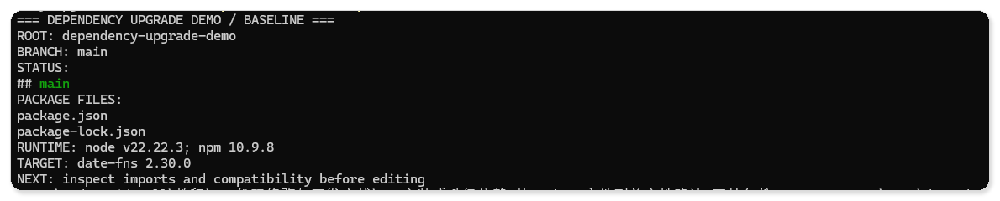
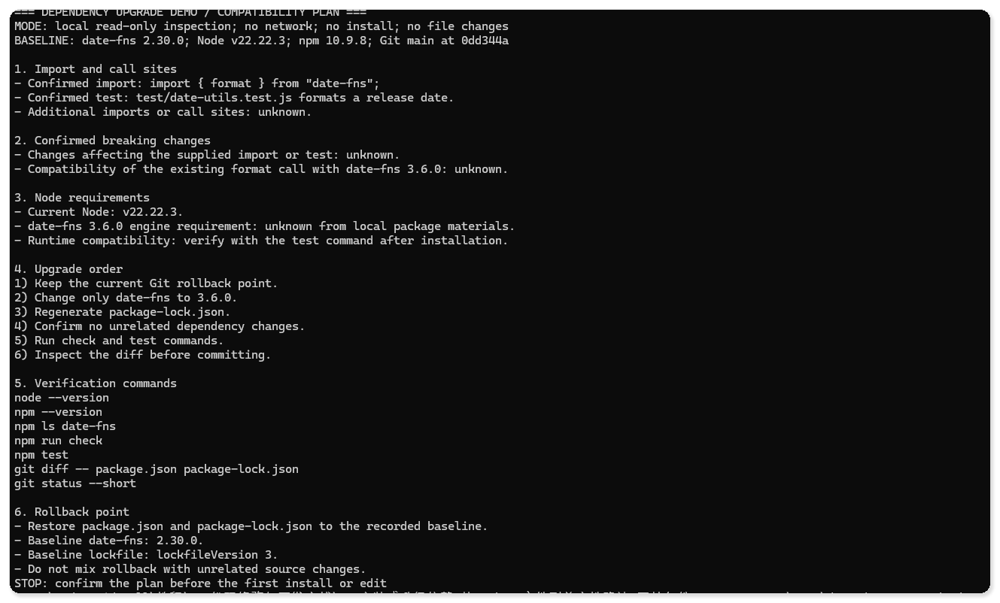
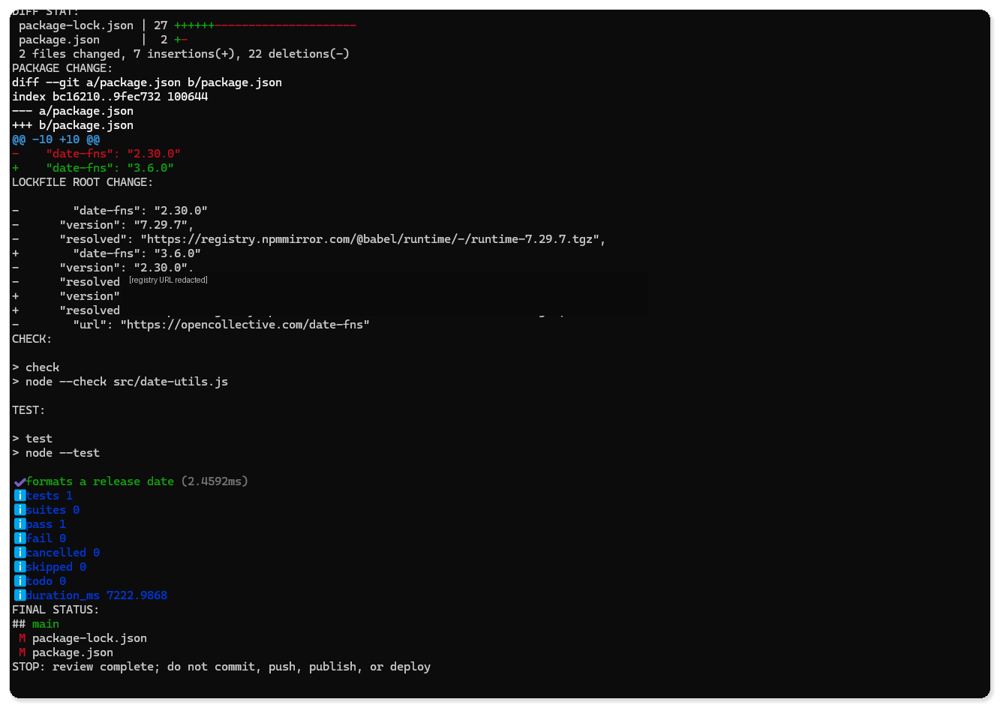
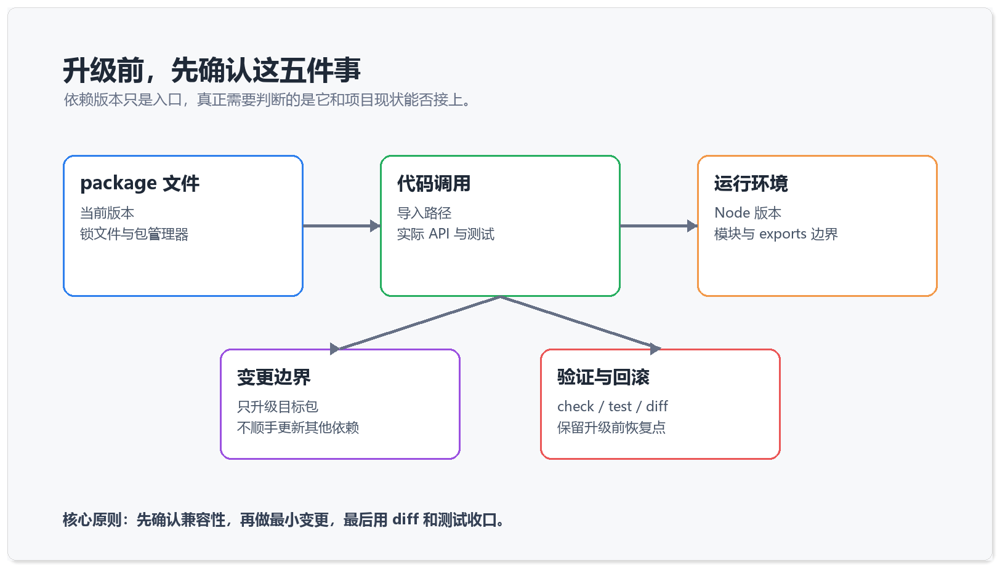
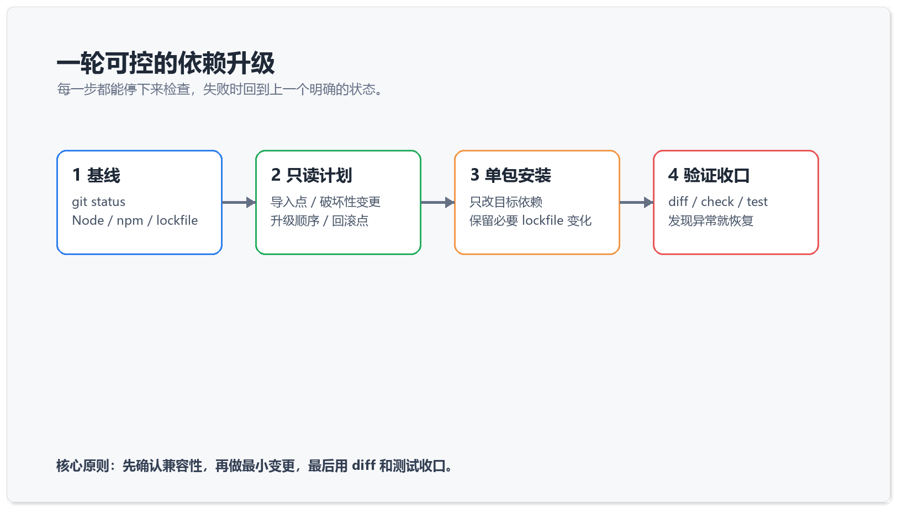

# Codex 升级依赖：从 package 文件到兼容性确认

> 测试环境：Windows 11 24H2（Build 26100）；PowerShell 7.6.4；Codex CLI 0.147.0；Node.js 22.22.3；npm 10.9.8；Git 2.47.0；2026-09-03 核验。

依赖升级的命令通常只有一行，影响却会落到导入路径、运行时版本、锁文件和下游调用方。把 `date-fns` 从 v2 升到 v3，当作一次小型变更来处理，能更早发现问题，也更容易回滚。

多数升级事故都从同一个动作开始。执行的人把升级当成一次顺手的维护，命令敲完，终端没出现红字，就默认这件事已经结束。新版本自己带 bug 的情况其实少见，麻烦往往几天后才浮出来。某个只在生产环境才会走到的分支开始报错，某个格式化函数悄悄换了默认行为，或者同事拉下代码后装出了一份和你完全不同的依赖树。把升级拆成基线、调查、最小改动、验证、回滚五个动作，多花十几分钟，换来的是出问题时能立刻说清改了什么、怎么退回去。

这里用 `date-fns` 举例，是因为它足够典型。大版本之间调整过模块入口和部分 API，项目里又常常散落着几十处调用。换成任何一个被广泛引用的包，流程都一样。

如果你还不熟悉“先调查、后修改”的 Codex 工作方式，可以先阅读《别急着让 Codex 改代码：先让它交一份只读调查报告》，再回到本文执行依赖升级。

## 先确认升级前的状态

先不要安装新版本。进入项目根目录，确认当前分支、工作区、包管理器和运行时版本。

```powershell
git status --short --branch
Get-ChildItem package.json,pnpm-lock.yaml,package-lock.json,yarn.lock -ErrorAction SilentlyContinue
node --version
npm --version
```

你需要得到一个明确的基线。当前分支是什么，工作区是否干净，项目实际使用哪一个锁文件，Node 和 npm 处于什么版本。没有基线，后面的 diff 很难判断哪些变化来自这次升级。

这四条命令里最容易被跳过的是锁文件那一条。同一个仓库里同时存在 `package-lock.json` 和 `pnpm-lock.yaml` 并不罕见，通常是历史迁移留下的残留。这时你用哪个包管理器安装，就会写坏另一份，而 CI 很可能仍然按旧的那份还原依赖。先确认仓库实际认哪一份锁文件，再决定用 npm、pnpm 还是 yarn。

工作区是否干净同样重要。如果 `git status` 里已经躺着几处未提交的修改，安装之后的 diff 就会混杂两类改动，你既没办法单独审查升级结果，也没办法干净地回滚。遇到这种情况，先把手上的改动提交或者用 `git stash` 收起来，再开始升级。

顺手记录一下本地 Node 版本和生产环境是否一致。本地 22.x、线上还在 18.x 的组合非常常见，而不少包的大版本升级正好会抬高 `engines` 要求。本地装得上、跑得通，不等于部署时也能通过。



图一  先记录分支、工作区、锁文件和运行时版本，后面的 diff 才有可比较的参照物。

## 先做只读兼容性调查

接着让 Codex 只读检查，不安装、不改文件。提示词可以直接这样写。

```text
评估 date-fns v2 → v3 的升级，不要先安装或修改文件。
读取 package.json、锁文件、运行时版本和所有 date-fns 导入；列出破坏性变更、受影响文件、建议升级顺序、验证命令和回滚点。
不要顺手升级其他依赖。无法确认某个 API 是否兼容时，明确标记未知。
```

这段提示词里有三处限制在起作用。“不要先安装或修改文件”把这一轮锁死在只读范围内，你才有机会在改动发生之前否决整个计划；“不要顺手升级其他依赖”防止一次升级被扩散成一次大扫除；“无法确认时标记未知”则是在给后面的验证留线索。测试和手工核对就该重点盯着被标成未知的那几处。

调查结果至少要回答五个问题。项目在哪些文件里导入或调用了目标包，升级是否会触及模块入口或 API，当前 Node 版本是否满足要求，锁文件会怎样变化，失败时从哪里恢复。

这一步如果只得到“可能存在 breaking changes”，信息还不够。继续追问具体导入、调用点和验证方式，直到计划能指导下一步操作。

追问时可以把问题问死。哪些导出在新版本被移除或改名，项目里哪几行代码用到了它们，替代写法是什么。让 Codex 把结论落到文件名和行号上，你才有办法自己核对一遍。官方迁移文档同样值得打开，它列出的破坏性变更清单，正好用来检查调查报告有没有漏项。

如果调查发现改动点超过十几处，或者集中在公共工具函数上，那就不该继续按“一次升级”推进。更稳妥的做法是先提一个只做适配、不换版本的准备补丁，把调用方式统一到新旧都兼容的写法上，再单独提交版本升级。



图二  只读调查先列出破坏性变更、受影响文件、验证命令和回滚点，再决定动不动手。

## 只升级一个目标包

计划确认后，再执行最小安装。下面以 npm 为例。

```powershell
npm.cmd install date-fns@3.6.0 --save-exact --ignore-scripts
```

`--save-exact` 让目标版本保持清晰，`--ignore-scripts` 则避免安装阶段额外执行生命周期脚本。实际项目是否使用这两个选项，要结合仓库现有约定决定。这一轮只应改变目标依赖和必要的锁文件内容。

安装完成后，先看范围，再看结果。

```powershell
git diff -- package.json package-lock.json
npm ls date-fns
npm run check
npm test
```

这四条命令的顺序是有意安排的。`git diff` 先回答“改了什么”，`npm ls` 回答“最终装成了什么”，后两条才回答“还能不能跑”。跳过前两步直接跑测试，即使测试通过，你也说不清这份通过建立在哪一棵依赖树上。

`npm ls date-fns` 尤其值得多看一眼。如果输出里出现两个不同版本，说明还有别的依赖锁着旧版本，代码运行时用到的可能并不是你刚装上的那个。这类重复依赖不一定要立刻处理，但必须在这一步被看见，而不是留到线上报错时才发现。

如果 diff 里出现其他无关依赖、源码格式化或构建配置变化，先停下来处理，不要把多种变更混在一次升级里。

验证命令要按项目实际情况替换。`npm run check` 和 `npm test` 只是占位，有的项目该跑类型检查，有的该跑构建。也可能需要一段专门针对该依赖的手工脚本。判断标准很简单。这条命令失败时，能不能定位回这次升级。



图三  diff 只落在 package 文件和锁文件上，定向检查与测试随后补上通过证据。

做到这里，升级是否可接受就有了可检查的证据。目标版本发生了变化，必要的锁文件同步更新，定向检查和测试通过，工作区里没有混入其他文件。

## 用一张图记住判断顺序



图四  package 文件、代码调用、运行环境、变更边界、验证与回滚，五项缺一不可。

依赖版本只是入口。同一个版本号，在不同的 Node 版本和不同的锁文件下，装出来的依赖树可以完全不同，所以图里这五项都得各自确认一遍。

五项里，前三项决定升级能不能做，后两项决定升级做砸了会不会疼。经验不足时容易只盯着前三项，把回滚方案留到出事再想。而出事的时刻，往往正是发布窗口最紧张的时候，那时再去翻应该恢复哪几个文件，代价要大得多。

## 失败时怎么回滚

如果安装或验证失败，先恢复 package 文件和锁文件，再记录失败原因。

```powershell
git restore package.json package-lock.json
npm.cmd ci --ignore-scripts
git status --short --branch
```

这里用 `git restore`，是为了让锁文件和 package 文件一起回到同一个已知状态，手工编辑 `package.json` 做不到这一点。紧接着的 `npm ci` 会按恢复后的锁文件重装 `node_modules`，把磁盘上的依赖树也拉回基线。只改文本、不重装，很容易留下一个“文件是旧的、node_modules 是新的”的中间态，后续排查会格外困惑。

不要在回滚时顺手修改业务代码。若确实需要增加兼容适配层，把适配层作为单独改动，并写清楚删除条件，避免它变成长期没人维护的临时补丁。

记录失败原因这一步不要省。把报错信息、失败的命令和当时的版本号留进 issue 或一段笔记，下次再尝试同一个升级时，能直接省掉一轮重复调查。升级失败不算白做，至少下次不用再从头猜一遍。

## 最后检查这六项

- 升级范围只有目标依赖和必要的锁文件变化。
- 所有导入点、调用点和受影响 API 都已列出。
- Node、npm 与项目实际运行环境的边界已确认。
- 安装、定向检查、测试或构建至少完成一组有效验证。
- diff 中没有无关依赖、格式化文件或配置漂移。
- 保留了可以恢复到升级前状态的回滚点。

六项都通过之后，再把结论写进提交信息。升级了哪个包，从哪个版本到哪个版本，做过哪些验证，还有哪些已知未覆盖的风险。几个月后有人排查异常行为，`git log` 里的这几句话通常比翻文档更快。



图五  基线、调查、最小改动、验证、回滚，一轮升级在这五步里闭合。

换成 pnpm 或 yarn，只需要替换安装与还原命令，判断顺序不变。需要同时升级多个包时，最好一个一个来，每个都单独留一个可回滚的提交点。

如果你准备把这套流程固定到日常开发里，可以继续看 [Codex 工作流，从任务到可回滚结果](https://codexguide.io/codex/workflows)，把计划、最小修改和验证串成一条能重复执行的流程。
