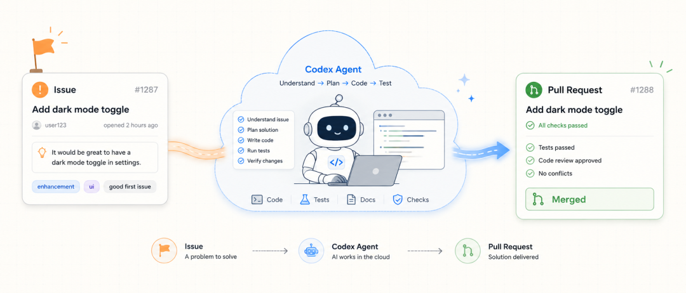
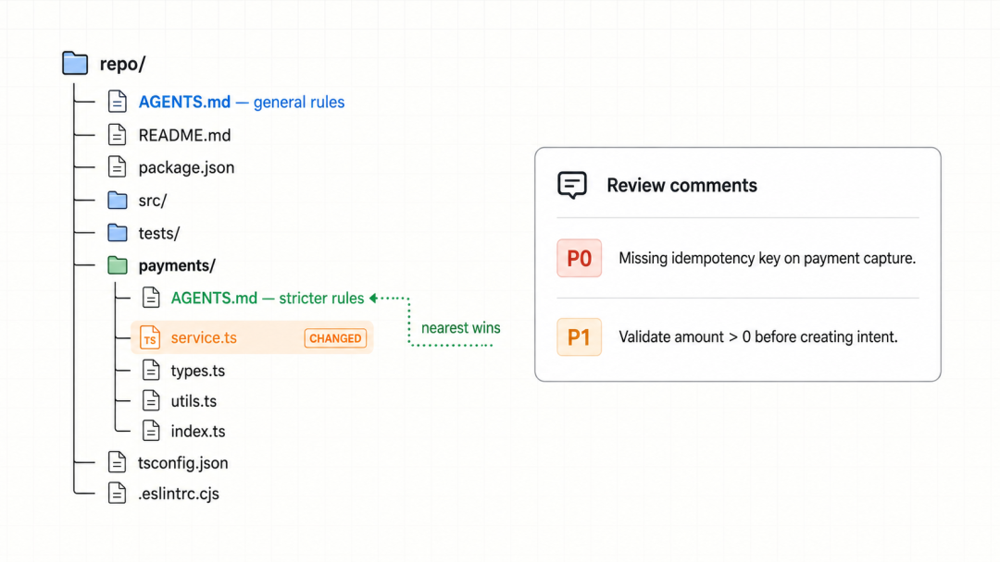

# Codex 处理 GitHub Issue 并创建 Pull Request

> 难度　进阶
>
> 类型　GitHub 协作与代码审查

这篇教程写给已经使用 GitHub Issue 和 Pull Request 管理开发任务的读者。你需要先把目标仓库连接到 Codex cloud，并且拥有查看代码、创建分支和提交 Pull Request 所需的权限。

完整流程从一条可执行的 Issue 开始。Codex 在云环境中完成代码任务，人检查改动后创建 Pull Request，再通过 `@codex review` 请求一次针对严重问题的代码审查。最后是否合并仍由仓库维护者决定。



> 原稿流程示意图，非 GitHub 或 Codex 产品界面。图中的合并状态只表示工作流终点，不代表 Codex 会自动合并。

## 开始前准备仓库

Codex 需要能够访问目标 GitHub 仓库。先在 Codex cloud 中连接 GitHub 账号或组织，为仓库创建环境，并确认初始化步骤能够安装依赖、运行项目和执行测试。

代码审查还需要单独启用。

1. 打开 [Codex code review 设置](https://chatgpt.com/codex/settings/code-review)。
2. 为目标仓库打开 Code review。
3. 准备一个小型 Pull Request 测试手动审查。
4. 确认流程稳定后，再决定是否启用 Automatic reviews。

自动审查需要连接仓库，并且配置者拥有相应的 GitHub push 或 admin 权限。


> 原稿配置示意图。实际开关名称和位置以 Codex 当前设置页为准。

## 把 Issue 写成可执行任务

Issue 至少要让执行者看懂问题、范围和验收方式。只有一句“增加深色模式”通常会留下很多产品和技术选择，Codex 也无法知道哪些文件不能改。

可以按下面的结构整理。

```md
## 目标

在设置页增加深色模式开关，并记住用户选择。

## 范围

- 只修改前端主题和设置页。
- 不调整账号接口和数据库。

## 验收

- 开关可以在浅色和深色之间切换。
- 刷新页面后保持上一次选择。
- 现有前端测试通过。

## 限制

- 不新增 UI 组件库。
- 不修改其他页面的布局结构。
```

Issue 中可以继续附上报错、截图、相关文件和已有讨论。涉及密钥、生产数据或内部地址时，不要把敏感内容写进公开 Issue。

## 从 Issue 启动 Codex 云任务

OpenAI 当前文档明确支持 Codex cloud 读取连接仓库并在隔离环境中执行任务。具体入口会随 Codex 产品界面变化，稳妥做法是在 Codex 中创建云任务，把 Issue 链接作为上下文，并补充仓库、目标分支和完成条件。

```text
请处理这个 GitHub Issue。

仓库已连接到 Codex cloud。先读取 Issue、仓库 AGENTS.md 和相关测试，说明准备修改的范围。完成后运行现有测试并给出 diff 摘要。不要合并，也不要修改 Issue 范围外的文件。

Issue URL
https://github.com/OWNER/REPO/issues/1287
```

不要把“在 GitHub Issue 评论中输入 `@codex`”当成所有账号都具备的固定入口。OpenAI 官方文档对 `@codex review` 的明确说明针对 Pull Request 评论。Issue 阶段是否出现额外入口，要以当前工作区和已安装集成为准。

## 检查云任务结果

云任务在独立环境中运行，可以同时处理多个彼此独立的任务。隔离环境减少本地工作被占用的情况，仍然需要为每个任务设置清楚的仓库、分支和验证要求。


> 原稿示意图。并行任务是否可用以及并发额度取决于账号和工作区设置。

任务完成后先看改动摘要和 diff，再核对测试结果。下面几项不能省略。

- 修改是否仍在 Issue 约定范围内。
- 依赖、配置和生成文件是否有意外变化。
- 测试命令是否真的运行，退出状态是否成功。
- 新增行为是否有对应测试或人工验收方法。
- 日志和提交中是否出现凭据、个人信息或内部地址。

发现方向不对时，在同一个任务中给出具体反馈，让 Codex 修正后重新验证。不要因为摘要看起来合理就直接创建 Pull Request。

## 创建 Pull Request

改动通过人工检查后，再让 Codex 创建 Pull Request，或者把分支交给维护者自行创建。Pull Request 描述应保留 Issue 链接、修改范围、验证结果和未解决风险。

```md
## 改动

- 增加主题切换开关。
- 使用现有本地存储工具保存选择。

## 验证

- 前端测试已通过。
- 已人工检查刷新后的主题状态。

## 关联 Issue

Closes #1287
```

GitHub 的 Pull Request 页面会集中展示讨论、提交、Checks 和文件差异。维护者应当在这里检查自动测试、分支保护和必要审批，不要把 Codex review 当成唯一门禁。

## 在 Pull Request 中触发 Codex review

在已经启用 Code review 的仓库中，向 Pull Request 发表评论。

```text
@codex review
```

Codex 会先用眼睛表情回应，随后发布标准 GitHub code review。官方文档说明，这类 GitHub review 只报告 P0 和 P1 问题，用来减少低优先级风格意见带来的噪声。

需要临时关注某类风险时，可以把范围写在同一条评论里。

```text
@codex review for issues in the database migration
```

## 把团队审查规则写进 AGENTS.md

Codex review 会查找适用于改动文件的 `AGENTS.md`。仓库级规则放在根目录，某个服务的特殊规则可以放进更靠近代码的子目录。

```md
## Code Review Rules

### Payment safety

- Flag payment capture without an idempotency key.
- Flag amount validation that happens after an external charge.
- Leave formatting and lint checks to CI.
```

规则要描述会造成后果的行为，并写清安全路径或允许的例外。格式化、Lint 等确定性检查继续交给 CI。



> 原稿示意图。Codex 会同时采用覆盖改动文件的根级规则和更具体的目录规则。

## 根据审查意见继续修复

Codex 发布 review 后，可以在同一个 Pull Request 中要求它修复具体问题。

```text
@codex fix the P1 issue
```

Codex 会以当前 Pull Request 作为上下文启动云任务。它具备分支写入权限时，可以把修复推回该分支。CI 失败也可以使用明确指令继续处理。

```text
@codex fix the CI failures
```

修复提交仍然要经过 diff、测试和审批。新增提交可能改变原来的审查结论，重要修改应当重新请求 review。

## Codex 和维护者各自负责什么

Codex 可以读取 Issue 和仓库上下文、修改代码、运行测试、准备 Pull Request、审查 P0/P1 问题，并在有权限时推送修复。维护者负责配置环境和权限、定义审查规则、核对改动与测试，并执行最终合并。


> 原稿示意图。分支保护、必需审批和人工合并仍按仓库规则执行。

## 上线前检查

- Codex cloud 已连接正确仓库，环境初始化可以复现。
- Issue 写清目标、范围、限制和验收条件。
- 云任务没有访问任务之外的仓库和凭据。
- Pull Request 描述包含真实验证结果和剩余风险。
- `@codex review` 已返回结果，P0/P1 问题已经处理或记录。
- CI、分支保护和必要人工审批全部满足。
- 最终合并由有权限的维护者执行。

## 参考资料

- [OpenAI Codex cloud](https://developers.openai.com/codex/cloud)
- [OpenAI 在 GitHub 中使用 Codex review](https://developers.openai.com/codex/third-party/github)
- [OpenAI Codex code review](https://developers.openai.com/codex/code-review)
- [GitHub Issues](https://docs.github.com/en/issues/tracking-your-work-with-issues/using-issues/creating-an-issue)
- [GitHub Pull requests](https://docs.github.com/en/pull-requests/collaborating-with-pull-requests/proposing-changes-to-your-work-with-pull-requests/about-pull-requests)
- [原始公众号文章](https://mp.weixin.qq.com/s?__biz=MzAwMDg5MTAyMw==&mid=2247521409&idx=1&sn=f787a786c39e53f2e69ea1f320dbf3ae&chksm=9bad188b7b0e52fdf576c0a84d551d2b411151d3c0c1f0ce842f74363f85f351cd34d42fc602#rd)

本文根据 2026 年 8 月 18 日可访问的 OpenAI 与 GitHub 官方文档核对。Codex cloud、代码审查开关和 GitHub 权限可能随工作区配置变化。
