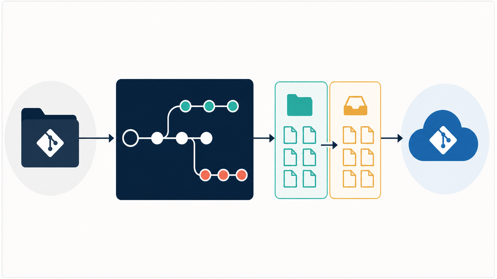
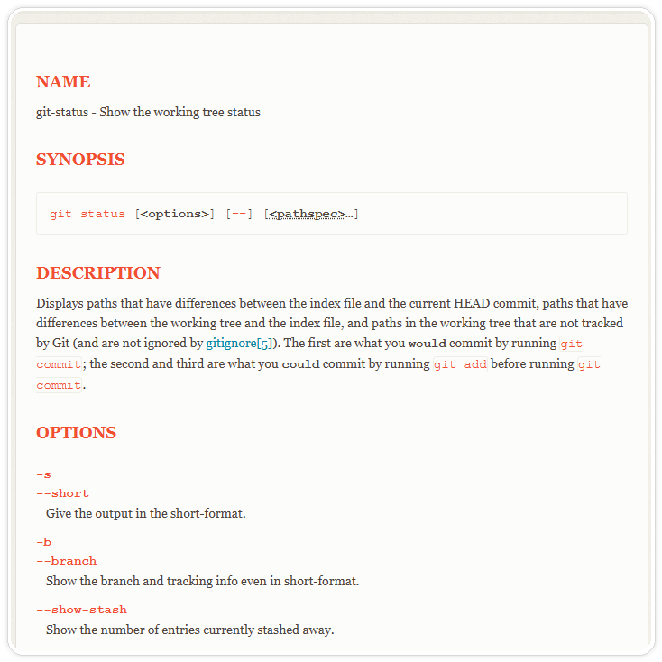
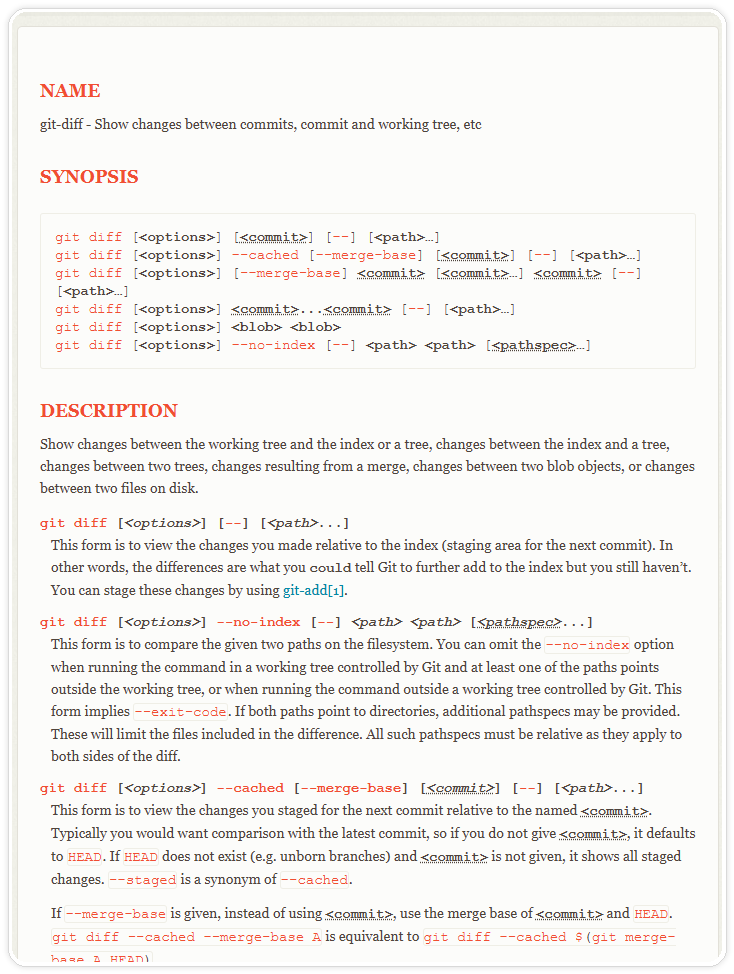
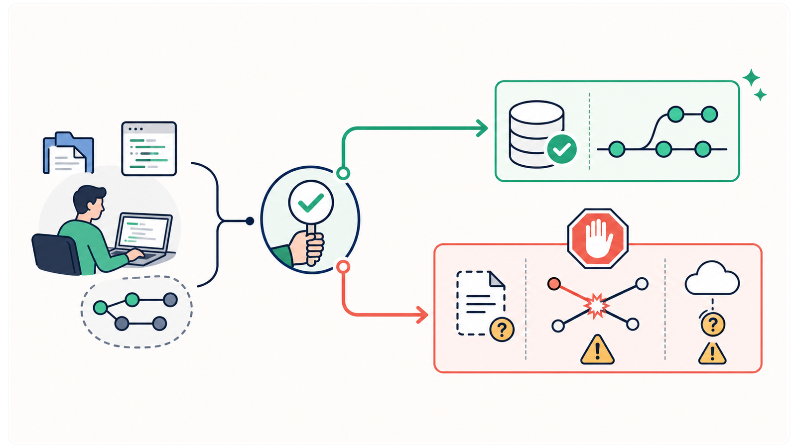
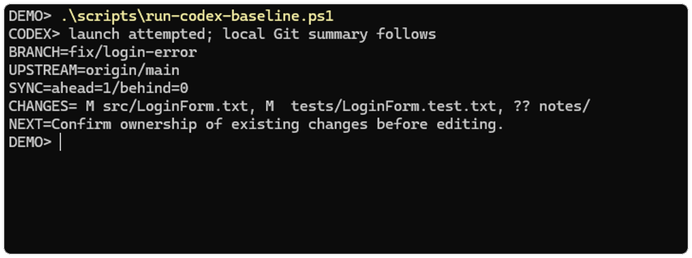

# 别急着让 Codex 改代码：先检查 Git 仓库、分支和脏工作区

> 难度：基础
>
> 类型：实操

> 测试环境：Windows build 26100；Codex CLI 0.147.0；Git 2.47.0.windows.2；2026-08-31 核验。

## 先把现场看清楚

让 Codex 改代码前，先确认四件事：当前目录是不是目标仓库，当前分支是什么，工作区已经有哪些改动，目标分支和远程地址是否正确。

这四项没确认，就不要编辑、暂存、提交、拉取或清理文件。很多返工并非代码写错，而是改错了目录、分支，或把同事的半成品一起提交。



<p align="center">图一：先确认仓库、分支、改动和远程关系。</p>

如果还不熟悉只读检查，可以先看《别急着让 Codex 改代码：先让它交一份只读调查报告》。分支隔离和 Worktree、提交和 PR 证据，分别在后续文章展开。

## 第一步：确认目录和远程

在 PowerShell 中运行：

```powershell
Get-Location
git rev-parse --show-toplevel
git rev-parse --is-inside-work-tree
```

第一条是终端当前路径，第二条返回 Git 根目录，第三条应为 `true`。第二条报错时，当前目录不是 Git 工作区，不要凭文件夹名称猜测。

再确认远程：

```powershell
git remote -v
git remote get-url origin
```

核对协议、组织名和仓库名。存在多个远程时，先确认哪个是镜像、哪个允许推送，不要临时改地址。

## 第二步：确认分支和脏工作区

```powershell
git branch --show-current
git status --short --branch
git branch -vv
```

`status --short --branch` 会显示当前分支、跟踪关系以及 ahead/behind；`branch -vv` 可补充各本地分支跟踪的远程分支。

如果状态行没有显示远程分支，先不要把“没有提示”当成“已经同步”。可以只读确认跟踪目标和提交数量：

```powershell
git rev-parse --abbrev-ref --symbolic-full-name '@{upstream}'
git rev-list --left-right --count 'HEAD...@{upstream}'
```

第二条通常返回两个数字，左边是本地领先的提交数，右边是落后的提交数。没有 upstream 时命令会报错，这本身就是需要确认的现场，不要马上执行 `git pull`。



<p align="center">图二：`status` 同时呈现分支跟踪信息和文件状态。</p>

示例：

```text
## fix/login-error...origin/main [ahead 1, behind 2]
 M src/components/LoginForm.tsx
M  tests/login-form.test.tsx
?? notes/repro.txt
```

它表示当前分支与远程分叉；实现文件只在工作区改过，测试文件已暂存，说明文件未被 Git 跟踪。此时先确认改动归属和目标基线，再决定是否拉取或推送。

### `status --short` 两列怎么读


<p align="center">图三：同一文件的改动可能在工作区、暂存区，或同时出现在两边。</p>

每行前两列分别是暂存区（Index）和工作区（Worktree）：

```text
 M file.ts       # 只改了工作区
M  file.ts       # 已暂存，工作区没有继续改
MM file.ts       # 暂存后又改了一次
?? file.ts       # 未跟踪文件
D  file.ts       # 暂存了删除
```

不要只看 `git diff`。它默认显示未暂存改动；暂存区要看 `git diff --cached`：

```powershell
git diff --stat
git diff --cached --stat
git diff --name-only
git diff --cached --name-only
git ls-files --others --exclude-standard
```

最后一条只列出未跟踪文件，不会删除它们。日志、截图和临时脚本都可能是有效证据。

## 第三步：检查差异和历史

```powershell
git diff --check
git diff
git diff --cached
git log -n 8 --oneline --decorate --graph
```

`git diff --check` 能发现空白错误和冲突标记，但不能证明业务正确。`git log` 用来确认最近提交是否与任务有关，不要只凭文件名推断意图。



<p align="center">图四：`git diff` 和 `git diff --cached` 对应不同的比较范围。</p>

需要追踪代码来源时再用：

```powershell
git blame -L 40,75 -- src/components/LoginForm.tsx
```

`blame` 是回到上下文的工具，不是责任追究工具。

## 第四步：留下基线记录

把任务开始前的现场记录下来，后续才能区分“原有改动”和“本次改动”：

```text
仓库根目录：<脱敏路径>
当前分支：<branch>
跟踪远程：<origin/branch>
未暂存：<文件列表>
已暂存：<文件列表>
未跟踪：<文件列表>
同步关系：<ahead/behind 或未知>
不属于本次任务：<文件列表>
```

文章、Issue 和截图中不要出现令牌、客户数据、私有仓库地址或完整本机路径。对外分享时只保留必要的目录信息。

## 给 Codex 的第一条提示词

```text
先只读检查当前 Git 仓库，不要修改、暂存、提交、推送、拉取、切换分支或清理文件。

请返回：
1. 仓库根目录、当前分支和跟踪的远程分支；
2. 工作区、暂存区、未跟踪文件列表；
3. 相对远程或目标分支的 ahead/behind；
4. 最近 8 次提交中与任务可能相关的记录，并区分事实与推断。

若发现未提交改动、merge/rebase/cherry-pick 正在进行，或目标分支不明确，先停止并说明风险，不要自行整理现场。
```

拿终端输出逐项核对。即使 Codex 说“工作区干净”，也要确认它没有漏掉暂存区和未跟踪文件。

### 在哪里启动 Codex

确认目录后，在同一个 PowerShell 窗口输入：

```powershell
codex
```

看到 Codex 交互界面后，先粘贴上面的只读提示词。若提示找不到命令，先运行 `codex --version` 判断 CLI 是否已安装；不要为了启动它而切换到另一个项目目录。只读检查结束后，再由人决定是否允许进入编辑阶段。

## 什么时候继续，什么时候暂停

| 现场 | 决定 |
|---|---|
| 工作区干净，分支和远程正确 | 进入任务分析，确认是否创建功能分支 |
| 有改动且明确属于本次任务 | 记录基线后继续，确认是否需要拆分 |
| 有改动但归属不明 | 停止编辑，询问拥有者 |
| 分支错误或远程不明 | 停止切换、拉取和推送，先确认目标 |
| 正在 merge/rebase/cherry-pick | 先完成或中止现有流程 |
| 出现未知 `??` 文件 | 保留并调查来源及敏感信息 |



<p align="center">图五：现场确认后，再决定继续编辑还是暂停确认。</p>

`git reset --hard`、`git clean -fd`、覆盖式检出和无条件强推都可能破坏恢复线索。知道命令，不等于有权删除现场。

## 一个离线练习

配套演示仓库 `git-baseline-demo` 已准备本地 `origin/main`、`fix/login-error` 和刻意保留的脏工作区。进入仓库运行：

```powershell
Set-Location -LiteralPath '.\git-baseline-demo'
.\scripts\run-codex-baseline.ps1
```



<p align="center">图六：只读启动后，一次查看分支、远程、同步关系和三类改动。</p>

脚本先尝试启动 Codex，再由本地 Git 生成摘要，不修改提交，也不依赖网络。练习时检查：哪些文件只在工作区、哪些已暂存、哪个文件未跟踪、当前分支能否直接推送、哪些事项必须由人确认。不要在真实项目里照抄制造脏改动。

看到 `CODEX>` 启动提示并不等于 Codex 已经理解任务；真正可信的是随后列出的 Git 根目录、分支、远程和文件状态。若启动超时或模型没有返回，仍可先读本地摘要，再把缺失项补充给 Codex，不能据此跳过人工核对。

## 常见误区与最小清单

- `git status` 为空，不代表分支已同步或远程正确。
- 只看 `git diff`，会漏掉已暂存内容。
- `??` 文件不一定是垃圾，先确认来源。
- 冲突解决包含业务取舍，不能让 Codex 自动选择 `ours` 或 `theirs`。

开始编辑前，至少确认：目录和 Git 根目录一致；分支、目标分支和远程已核对；工作区、暂存区、未跟踪文件已分别检查；基线已记录；没有正在进行的 Git 流程。

## 参考资料

- [Git status documentation](https://git-scm.com/docs/git-status)
- [Git diff documentation](https://git-scm.com/docs/git-diff)
- [Git branch documentation](https://git-scm.com/docs/git-branch)

## 继续实践

如果准备把这套检查流程接进日常任务，可以到 [CodexGuide「进阶教程」](https://codexguide.io/advanced?utm_source=wechat&utm_medium=article&utm_campaign=git-collaboration-baseline&utm_content=closing-website-01) 继续看 Git 协作、项目规则与验证方法。

如果仓库还涉及权限、代理或团队约定等问题，可以扫码添加微信，带上脱敏后的 `git status`、分支关系和错误信息交流。


