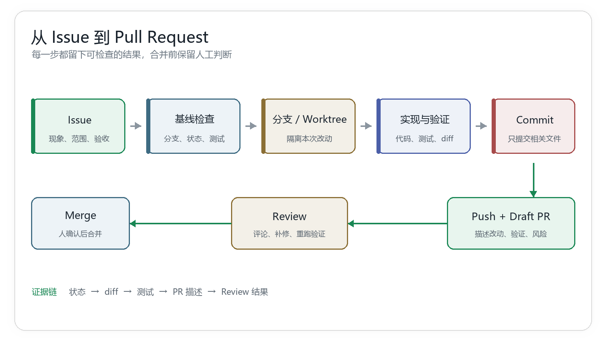
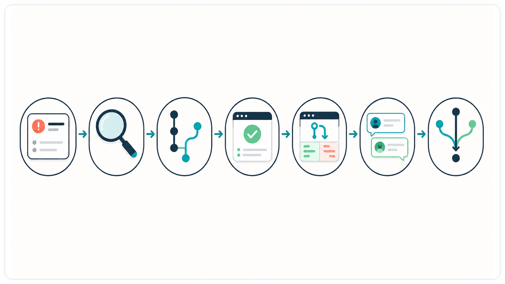
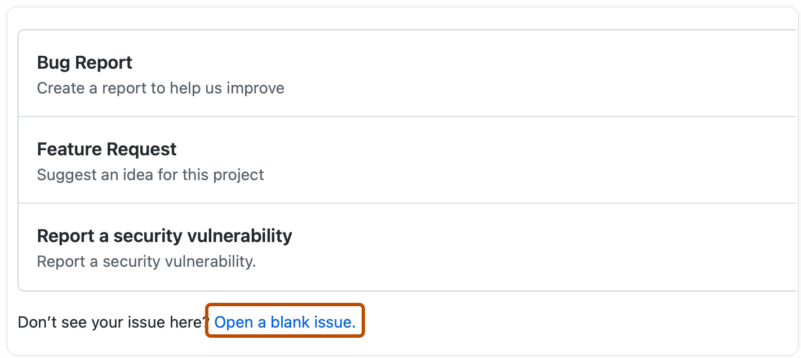
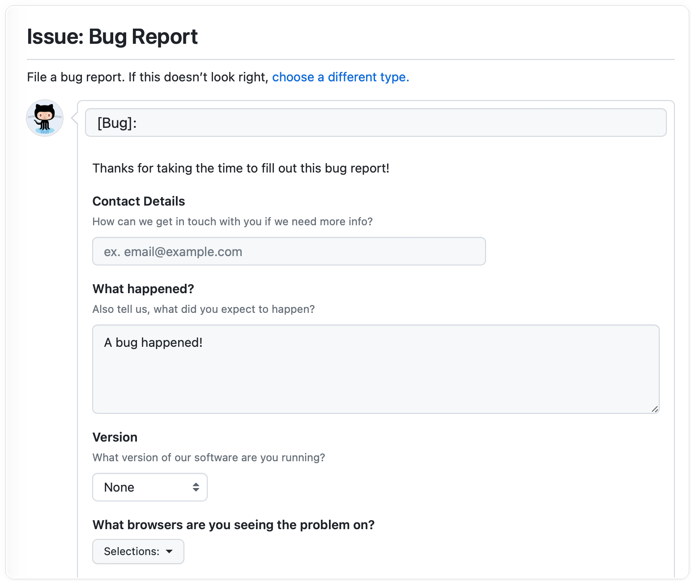
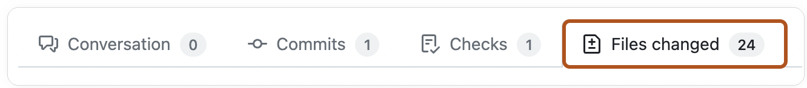
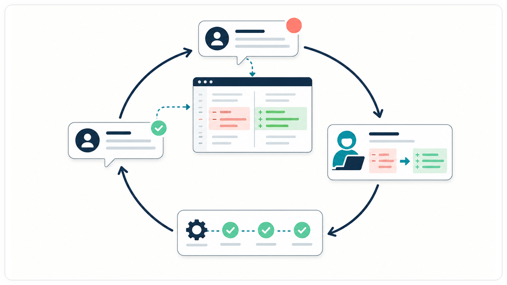
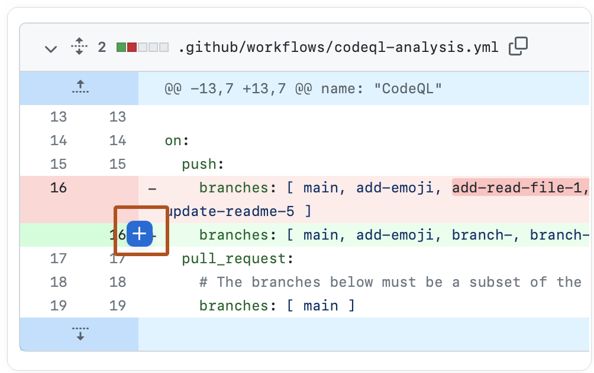
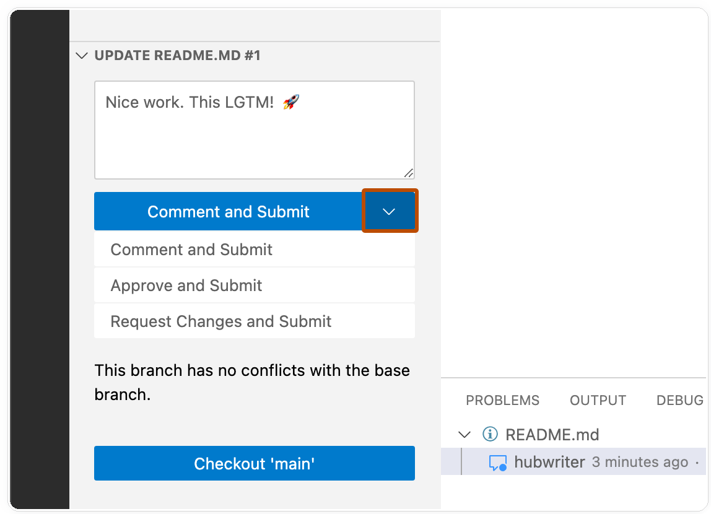
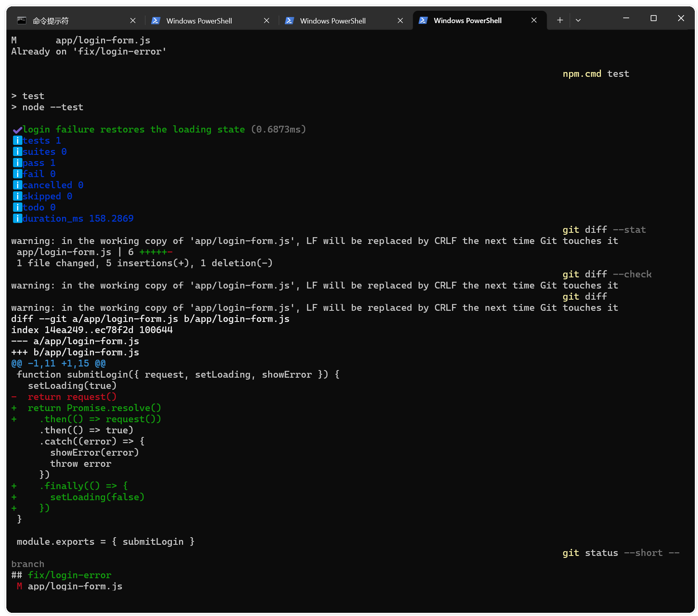

# 从 Issue 到 Pull Request，一次完整的团队协作闭环

> 难度：进阶
>
> 类型：流程实操

> 测试环境：Windows 11；PowerShell 7.6.4；Git 2.47.0.windows.2；命令于 2026-09-04 在本地演示仓库核验。

一条 Issue 交到开发者手里，最后应该留下什么？至少要有一条能追溯的路径，需求写清楚，工作从正确基线开始，改动在独立分支里完成，测试和 diff 有证据，Pull Request 能让别人快速看懂，Review 意见有回应，合并动作有人确认。

这篇文章用一个登录失败状态没有清理的小 Bug 贯穿全程。示例里的文件名和命令可以替换成自己的项目，但每一步的检查目的都可以保留。

如果你还在练习怎样把需求交给 Codex，可以先看《别再对 Codex 许愿：一张任务单让它少走弯路》，再回到这里处理 Git 协作部分。



图一：状态、diff、测试和 Review 结果共同组成交付证据。

Issue、调查、分支、测试、PR、Review 和合并共同组成一条可以回查的证据链。下面这张概念图把它们压缩成一条从问题到合并的路径，后文的每一步都应该能回到其中一个节点。



图二：每个协作节点都应留下可回查的状态、改动或验证结果。

## 先把 Issue 写成可以验收的任务

一条可执行的 Issue 不需要很长，但要让接手的人知道发生了什么、怎样复现、改到哪里算完成。下面这份示例已经足够启动调查。

```text
标题：登录失败后按钮一直处于提交状态

现象：输入错误密码并提交后，登录按钮持续显示加载状态。
复现：打开 /login，输入错误密码，提交表单。
预期：保留输入内容，显示现有错误提示，按钮恢复可点击。
范围：只检查登录表单、请求失败处理和对应测试，不改认证接口。
验收：失败路径测试通过，聚焦测试和 lint 通过，diff 没有无关文件。
```



图三：已有模板无法覆盖场景时，可以从空白 Issue 开始。

如果仓库使用结构化 Issue Form，可以把标题、现象、版本和运行环境拆成固定字段，减少关键信息遗漏。



图四：结构化表单把复现所需的信息拆成可填写字段。

这里的范围很重要。登录页的样式、认证接口、错误文案和依赖升级都可以另开任务。把它们放在同一条 Issue 里，Review 时就很难判断某个变化是否必要。

Issue 还可以补充三类信息。

- 已知的错误日志或截图，先清除邮箱、Token、私有路径和客户数据。
- 基线状态，例如当前分支、已有失败测试和项目启动命令。
- 不能改变的约束，例如兼容的浏览器、接口格式或数据库版本。

## 先检查基线，再创建工作分支

开始编辑前，先确认当前目录和 Git 状态。下面的 `$repo` 只是示例路径。

```powershell
$repo = "D:\path\to\your-repo"
Set-Location -LiteralPath $repo

git rev-parse --show-toplevel
git remote -v
git branch --show-current
git status --short --branch
git log -1 --oneline
```

如果 `git status --short --branch` 显示未提交改动，先确认这些改动是否属于当前 Issue。归属不明时不要直接暂存，更不要用 `git reset --hard` 或 `git clean -fd` 清理现场。

工作区干净、远程和目标分支已经核对后，再从最新目标分支创建任务分支。

```powershell
git switch main
git pull --ff-only origin main
git switch -c fix/login-error
git status --short --branch
```

预期结果是最后一行显示 `fix/login-error`，工作区没有多余改动。团队需要同时处理多个任务时，可以为每个任务建立独立 Worktree。

```powershell
git worktree add ..\worktree-login-error -b fix/login-error origin/main
git -C ..\worktree-login-error status --short --branch
git worktree list
```

分支解决提交历史的分流，Worktree 解决文件目录的并行。当前目录已有未提交修改时，Worktree 通常比反复暂存和切换更容易保持边界。不要让两个目录同时绑定同一条正在使用的分支。

## 让 Codex 先调查，再进入修改

Issue 描述清楚后，不要立刻要求 Codex 修改所有可能相关的文件。先让它找出表单入口、请求调用、失败分支和已有测试。

```text
请根据当前 Issue 先做只读调查，不要修改文件。

请返回：
1. 登录表单入口和请求调用位置。
2. 失败状态在哪里设置，成功和失败时分别怎样清理。
3. 已有测试文件，以及最小回归测试应该覆盖什么。
4. 计划修改的文件和不应触碰的文件。
5. 基线验证命令、修改后验证命令和已知风险。

如果发现当前工作区已有不属于本 Issue 的改动，先停下并说明，不要暂存、提交、切换分支或清理文件。
```

调查结果要能回到代码和测试文件。Codex 说“可能是状态没有重置”只是线索，真正的判断需要通过调用链和失败路径确认。调查中发现根因属于另一个模块时，更新 Issue 范围或另开任务，不要为了保持原计划硬改当前文件。

## 实现时只保留一个主题

确认计划后，再让 Codex 执行修改。提示词可以把目标、文件边界和停止条件写在一起。

```text
根据刚才确认的调查结果实现登录失败状态修复。

要求：
- 只修改登录表单和对应回归测试。
- 保持认证接口、成功路径和现有错误文案不变。
- 不顺手格式化其他文件，不升级依赖，不重构无关组件。
- 完成后先查看 git diff --stat、git diff --check 和完整 diff。
- 运行聚焦测试和项目 lint，分别说明成功、失败或未运行的命令。
- 只汇总结果，不提交、不推送、不合并。
```

修改完成后先看范围，再看内容。

```powershell
git status --short
git diff --stat
git diff --check
git diff
```

`git diff --stat` 适合快速判断文件数量和改动规模，完整 `git diff` 用来检查删除、配置变化、错误处理和测试是否真的对应 Issue。两者都不能代替测试。

## 验证要对应完成条件

Issue 里的验收条件要逐条落到命令或人工检查上。登录失败示例可以这样执行。

```powershell
npm run test -- login
npm run lint
git diff --check
```

如果项目使用其他包管理器或测试框架，替换成仓库中已经存在的命令。不要为了让 PR 看起来完整而填写没有运行过的测试。

建议在本地记录一份简短结果。

```text
聚焦测试：通过，覆盖错误密码后的按钮状态。
lint：通过。
git diff --check：通过。
人工检查：错误提示保留，按钮恢复可点击，输入内容未被清空。
未覆盖：真实认证服务超时场景。
```

“未覆盖”不是失败记录，它告诉 Review 者验证边界在哪里。若基线测试在修改前就已经失败，也要把原始失败和本次结果分开写。

## 提交、推送，再开 Draft PR

确认改动只属于当前 Issue 后，选择性暂存文件。小任务不建议直接使用 `git add .`，因为工作区里可能有旧修改、临时文件或不应提交的配置。

```powershell
git add src\components\LoginForm.tsx tests\login-form.test.tsx
git diff --cached --stat
git diff --cached --check
git commit -m "fix(auth): restore login button after failure"
git push -u origin fix/login-error
```

提交信息回答“这次提交改变了什么”。如果一个任务需要多个提交，每个提交仍然应该能单独解释，避免把格式化、重命名和功能修复混成一团。

推送后创建 Draft PR。Draft 状态适合在正式请求 Review 前完成一次自检，尤其适用于需要补测试、整理提交或确认部署影响的任务。

进入 PR 后，先从 `Files changed` 查看实际文件范围，再核对改动是否仍然对应 Issue。



图五：Files changed 是检查 PR 文件范围的入口。

PR 描述至少包含这些内容。

```markdown
## 改了什么
修复登录请求失败后按钮状态没有恢复的问题，并补充回归测试。

## 为什么改
失败分支没有清理提交状态，用户无法再次尝试登录。

## 如何验证
- `npm run test -- login`
- `npm run lint`
- `git diff --check`
- 手动检查错误提示、按钮状态和输入内容

## 风险与回滚
未改变认证接口和成功路径。如需回滚，撤销本 PR 的提交。

## 未覆盖
没有覆盖真实认证服务超时场景。
```

开 PR 前再核对一次。

- 基础分支是预期的目标分支。
- 标题、Issue、分支名和提交主题一致。
- 文件列表没有混入格式化、截图、依赖升级或私人配置。
- 描述里没有声称未执行的测试。
- 需要部署、迁移或权限变更时，风险和回滚方式已经写出。

## Review 不是一次性批改

Review 意见回来后，先按影响范围处理。阻断合并的问题要优先修复，建议性意见可以结合项目规则和当前范围决定是否采纳。每条意见都应该有回应，回应可以是追加提交、解释原因或明确记录后续 Issue。

行内评论应尽量贴近具体 diff 行，这样评论、修复提交和后续验证更容易相互对应。

Review 意见回来后，通常会经过“定位问题、追加修改、重新验证、再次审查”这一轮反馈。把它看成循环，而不是一次性批改，能避免修复提交脱离原评论，也能让每次复查都有新的证据。



图六：Review 意见通过修改提交和验证结果回到下一轮审查。



图七：行内评论把 Review 意见绑定到具体改动位置。

如果评论指出失败分支仍然没有覆盖，先修改测试，再重新运行聚焦测试和 lint。

```powershell
git add tests\login-form.test.tsx
git commit -m "test(auth): cover login failure state"
git push
```

如果 Review 意见改变了功能范围，暂停追加代码，先更新 PR 描述或 Issue。范围扩大后，新的文件、测试和风险都要重新检查。不要用一句“已处理”代替证据，也不要把不同意见压进连续的无意义提交里。

需要让 Codex 协助复查时，可以在 PR 上给它一条只读任务。

```text
请只读检查这个 Pull Request。

重点关注：
- 改动是否覆盖 Issue 的预期行为。
- 失败路径和边界条件是否有测试。
- 是否修改了不属于任务范围的文件。
- 是否引入权限、数据泄露、兼容性或回滚风险。
- PR 描述中的测试结果是否能从实际输出得到证明。

请按阻断问题、一般问题、未覆盖项分组。不要直接修改、提交、推送或合并。
```

Codex 的 Review 结果仍然需要人核对。自动化工具可以减少漏看，不能替团队决定业务行为、风险接受和合并时机。

## 合并前再走一遍门禁

当代码、测试和 Review 意见都处理完，再把 Draft PR 转为 Ready for review，等待必需的审批和 CI 检查。合并前至少确认下面几项。

提交 Review 时，要明确这是普通评论、批准，还是要求修改；三种动作对应不同的协作信号。



图八：提交 Review 前明确选择 Comment、Approve 或 Request changes。



图九：聚焦测试通过，diff 显示失败路径补上 finally 状态清理。

- 必需的 Review 已通过，没有未解释的阻断意见。
- CI 使用的是当前 PR 的最新提交，并且必需检查通过。
- PR 与目标分支的差异仍然只覆盖当前 Issue。
- 数据库迁移、配置变化、发布步骤和回滚方式有人确认。
- Issue 的验收条件已经逐条对应到测试或人工检查。

合并按钮应该由有权限的人确认。合并后再关闭 Issue，或让平台根据关联语法自动关闭，但要检查关联是否准确。需要保留审计线索时，不要在合并前删除 PR 的 Review 讨论和验证记录。

## 一份可以直接复制的任务模板

```text
任务目标：

问题现象：

复现步骤：

预期行为：

相关文件或入口：

修改范围：

明确不修改：

完成条件：

基线命令：

验证命令：

风险与回滚：

请先只读调查并给出计划，不要修改文件。确认计划后再执行。完成后返回修改文件、测试输出、未覆盖项和剩余风险，不要自行提交、推送或合并。
```

这份模板的价值不在格式本身，而在于它把“做什么”和“怎样算完成”分开写。团队使用 Issue 模板时，可以把固定字段放进平台表单，把每个任务特有的范围和验收条件留给提交者填写。

## 常见失误

### 直接在 main 上修改

这会让未完成代码和稳定分支混在一起，也让 Review 缺少清晰的对比基线。先检查状态，再创建分支或 Worktree。

### 把 `git add .` 当成提交前的默认动作

它可能把旧改动、生成文件、截图、密钥和本地配置一起加入暂存区。先看状态，再按文件或交互式方式暂存。

### 测试通过就跳过 diff

测试只回答它覆盖的行为是否正常。无关文件、配置变化、删除内容和不必要的重构，仍然需要人工查看。

### Review 之后直接改本地，不更新 PR

PR 上的讨论必须和代码状态保持一致。修复后推送新提交，让 CI 和 Review 针对最新提交重新运行。

### 让 Codex 自行合并

代码正确只是合并条件的一部分。权限、发布窗口、迁移风险和回滚责任仍然需要人确认。

## 验收清单

- [ ] Issue 写清现象、复现、预期、范围和验收条件。
- [ ] 已确认仓库、远程、当前分支和任务开始前的 Git 状态。
- [ ] 分支或 Worktree 从正确的目标基线创建。
- [ ] Codex 先完成只读调查，再进入修改。
- [ ] 修改范围与 Issue 一致，没有混入无关重构。
- [ ] 聚焦测试、lint 和 diff 检查有真实结果。
- [ ] 提交和 PR 描述能说明改动、动机、验证、风险和回滚。
- [ ] Review 意见逐条处理，最新提交已重新验证。
- [ ] 合并前的审批、CI、发布和回滚事项由人确认。

## 与其他章节的关系

第 08 节演示 GitHub 插件的具体操作，本文只讲通用的 Issue 到 PR 工作方法。第 05 篇展开提交和 PR 描述，第 06、07 篇分别讲 Review 和反馈处理，第 11 篇用一个 Bug 修复案例复盘这条流程。

## 参考资料

- [Git status documentation](https://git-scm.com/docs/git-status)
- [Git worktree documentation](https://git-scm.com/docs/git-worktree)
- [GitHub Pull requests](https://docs.github.com/en/pull-requests)
- [GitHub Reviewing proposed changes](https://docs.github.com/en/pull-requests/how-tos/review-pull-requests/reviewing-proposed-changes-in-a-pull-request)
- [Atlassian Feature Branch Workflow](https://www.atlassian.com/git/tutorials/comparing-workflows/feature-branch-workflow)

## 继续实践

如果你准备把这套流程接进自己的项目，可以到 [CodexGuide Git 协作与代码审查专题](https://codexguide.io/advanced?utm_source=wechat&utm_medium=article&utm_campaign=issue-to-pull-request&utm_content=closing-website-01) 继续查看分支隔离、提交组织和 Review 方法。

如果你的情况涉及分支冲突、权限审批、CI 失败或回滚判断，可以扫码添加微信，带上脱敏后的 Issue、`git status`、PR 描述和验证输出一起交流。


