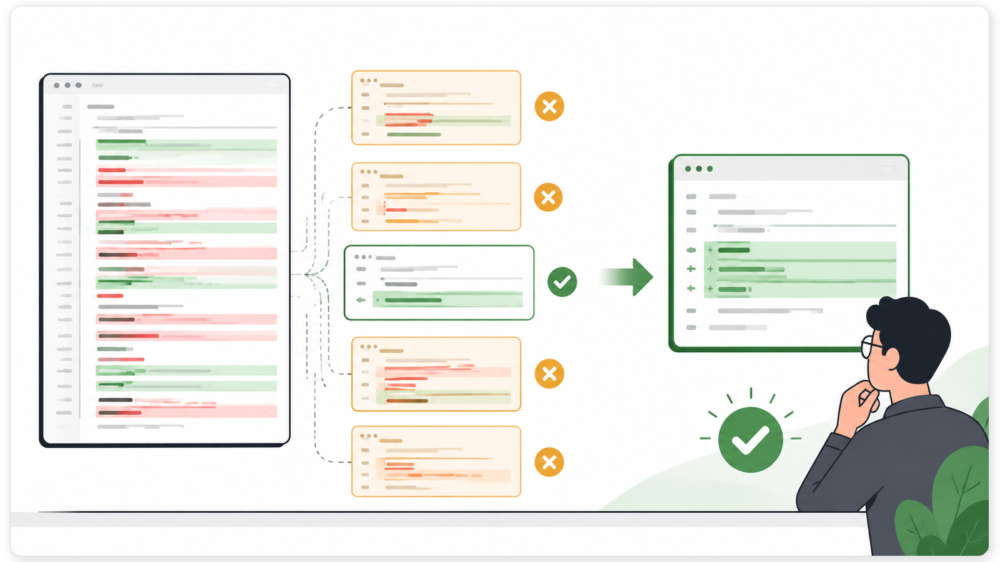
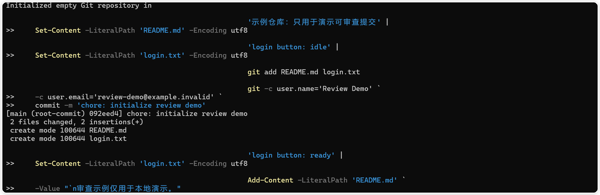
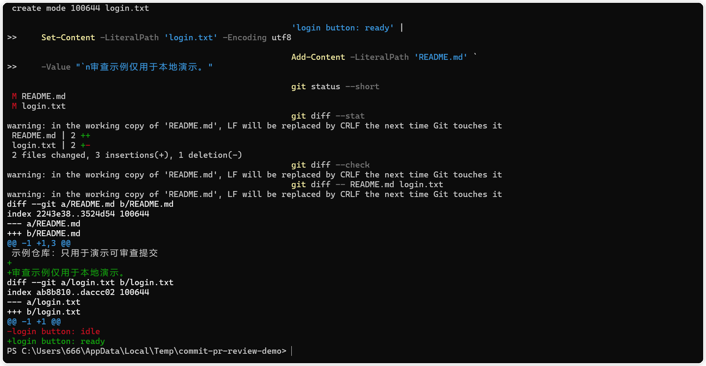
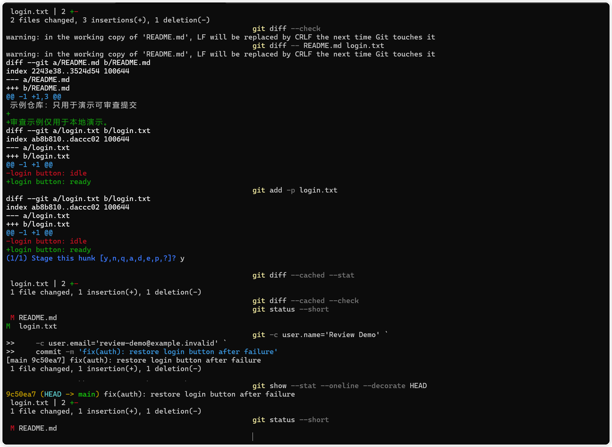
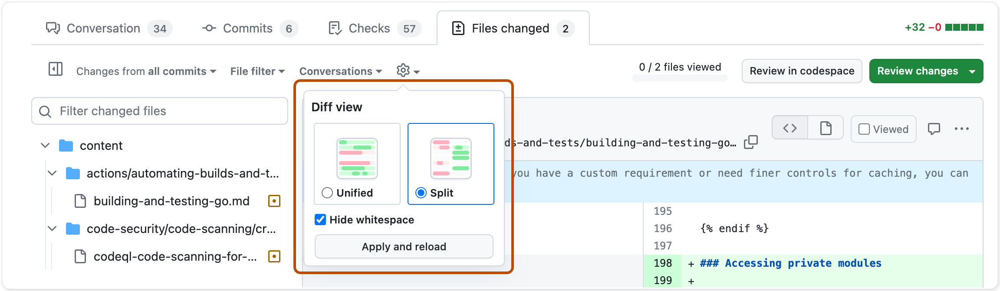

# Commit 不只写“改了什么”：一份可复核的 PR 审查方法

> 难度：进阶
>
> 类型：方法与模板
>
> 测试环境：Windows 10 Pro 24H2（build 26100.4652）；Codex CLI 0.147.0；Git 2.47.0.windows.2；2026-09-04 核验。

代码审查最容易卡在三件事上。审查者看不出改动范围，提交信息没有说明动机，验证结果又只剩一句“测试通过”。可复核的提交和 PR，需要把行为、证据和风险分别写清楚。

## 先把一个行为变化独立出来

好的提交标题还有一个实际好处。审查者在提交列表里就能判断应该先看哪一个变化，出问题时也更容易定位回滚对象。`fix`、`feat`、`docs`、`test`、`refactor` 这类前缀可以帮助检索，括号里的范围要具体到模块或行为，正文则补充原因和验证边界。标题不必写完整实现过程，完整过程留给 diff 和 PR。

提交信息先写行为，再写范围。`fix(auth): restore login button after failure` 能让人看出这是登录失败后的按钮状态修复。`update files` 只能说明文件被动过，无法帮助审查者判断提交目的。



图一 只把与当前行为有关的差异放进提交，无关修改继续留在工作区。

提交前先看工作区的全部变化。

```powershell
git status --short
git diff --stat
git diff --check
git diff -- README.md login.txt
```

`git diff --stat` 告诉你变化量，`git diff --check` 检查空白错误，最后一条命令把注意力收窄到正在判断的文件。假设登录按钮和 README 同时发生变化，就不要顺手把两件事合在一起。

```powershell
git add -p login.txt
```

输入 `y` 接受当前 hunk，输入 `n` 保留它，输入 `q` 退出。一个 hunk 混有两个主题时，可输入 `s` 尝试拆分。每一块都要问一句，它是否属于这次行为变化。



图二 初始化示例仓库后，`README.md` 和 `login.txt` 都有未提交变化。

暂存后再看一次范围。

```powershell
git diff --cached --stat
git diff --cached --check
git status --short
```

理想结果是，暂存区只包含当前提交需要的文件，其他修改仍显示为未暂存。保留无关改动并不影响提交，反而让范围更容易回看。



图三 `git diff --check` 没有报错，完整 diff 展示了两个文件的具体变化。

## 提交之后留下证据

这里要分清两个结果。提交历史回答“哪些改动已经进入版本库”，工作区状态回答“哪些改动还没有进入版本库”。两者都干净并不自动表示代码正确，两者有差异也不代表操作失败。审查者需要把提交内容、未提交内容和验证命令放在一起看，才能判断这次提交是否真的只解决一个问题。

如果一个 hunk 同时包含功能修改和格式化修改，优先拆成两个提交，或者先撤销无关格式变化。格式化会扩大 diff，增加审查者需要阅读的行数，也会让回滚时的影响范围变得模糊。提交越小，验证结果越容易对应到具体行为。

提交信息应该描述一个可以单独验证的动作。

```powershell
git -c user.name='Review Demo' `
    -c user.email='review-demo@example.invalid' `
    commit -m 'fix(auth): restore login button after failure'

git show --stat --oneline --decorate HEAD
git status --short
```



图四 提交后用 `git show` 和最终状态确认提交只包含 `login.txt`，README 的修改仍未进入提交。

`git show` 用来核对刚写入的提交，最后的 `git status --short` 用来确认无关修改还在工作区。发现范围不对时先停下来检查，别用新的大提交盖住问题。

## PR 描述写给审查者

PR 描述不需要写成周报。下面这五个字段足以让审查者知道改了什么、为什么改、怎样验证，以及风险落在哪里。

```markdown
## 改了什么
- 修复错误登录后的按钮状态。

## 为什么改
- 请求失败分支没有清理提交状态。

## 如何验证
- git diff --check
- 本地示例仓库检查提交范围。

## 风险与回滚
- 未改变认证接口。需要撤销时，回滚本次提交。

## 待确认
- 未覆盖真实网络超时场景。
```


图五 PR 描述把改动、动机、验证、风险和待确认项分开记录。

“如何验证”只写实际执行过的命令和结果。没有运行过的测试放进“待确认”，不要把计划写成通过。风险说明也要落到动作上，例如认证接口未变，主要影响登录失败后的界面状态；回滚时撤销本次提交，再重跑失败场景和空白检查。

还要把“没有失败”和“已经证明正确”分开。命令没有输出错误，只能说明这条检查没有发现问题；它不代表其他场景自动通过。若验证受环境、权限或测试数据限制，应直接写明限制，并给出下一步需要补做的场景。这样的记录比一句“全部通过”更有用，也更方便后续审查者接手。

## 按文件检查 PR

验证证据至少要能回答三个问题。命令检查了什么，结果是否和预期一致，哪些场景仍然没有覆盖。`git diff --check` 只能说明差异中没有检测到空白错误，不能证明登录流程正确。一次本地示例仓库的提交范围检查，也不能代替真实网络超时、权限失败或浏览器状态的测试。把证据边界写出来，审查者才知道下一步该补哪一项。

若验证命令有重要输出，可以在 PR 中贴出关键几行，并保留完整日志的存放位置。日志里要删掉令牌、Cookie、邮箱、内网地址和客户数据。截图适合说明某个界面或命令状态，不能代替测试报告，也不能把一张成功截图扩大解释成所有场景都通过。

进入 PR 的 `Files changed`，按文件查看 diff。GitHub 支持切换 Unified 和 Split 视图，也可以隐藏空白差异。改动较多时先排除格式噪声，再看行为变化。



图六 在 `Files changed` 中选择 Unified 或 Split，并按需要隐藏空白差异。

看完一个文件后勾选 `Viewed`，让后续审查者知道哪些范围已经检查。提交意见时，打开 `Review changes`，选择 Comment、Approve 或 Request changes，并写清文件、位置、触发条件和可能后果。

如果让 Codex 检查 PR 文本，可以使用只读提示。

```text
请只读检查下面这份 PR 描述。
判断它是否说明了改动范围、动机、验证命令、未验证部分和回滚方式。
缺少信息时直接列出问题，不要替我补写不存在的测试结果。
```

它能检查文字是否完整，不能证明测试已经执行，也不能替你判断缺少上下文的业务风险。

## 发出前的验收

审查者可以按一条固定顺序阅读。先看提交标题和文件列表，确认范围；再看每个文件的 diff，确认行为；随后对照验证命令，检查结果是否覆盖改动；最后回到风险和回滚，判断是否需要补测或暂停合并。这个顺序能避免先被一段漂亮的 PR 描述带着走。

风险也要写到受影响的层级。界面状态变化，说明用户会在哪个失败分支看到异常；配置变化，说明旧配置是否还能启动；数据库变化，说明迁移是否向后兼容，以及回滚前需要保留什么数据。回滚动作要能执行，最好写出要撤销的提交、需要重跑的验证和需要观察的指标。

常见的模糊写法包括“影响较小”“已充分测试”“按计划完成”。这些句子没有告诉审查者影响在哪里、测试覆盖到哪里、计划是否真的执行。改成文件、命令、场景和结果，PR 才能承担审查记录的作用。

- 每个提交都有清楚的行为目的。
- 暂存区只包含当前主题的改动。
- `git diff --check` 和 `git diff --cached --check` 没有空白错误。
- PR 描述写明改动、动机、验证、风险、回滚和待确认项。
- 没有执行的测试没有被写成通过。
- 截图和日志没有账号、令牌、私有路径或客户数据。

这份清单只能减少遗漏，不能替代对 diff 的正确性、安全性和维护成本判断。

把完整验收方法放进实际开发任务时，可以继续看[《修改后如何验证：从 diff 到回归检查》](https://codexguide.io/codex/validation?utm_source=wechat&utm_medium=article&utm_campaign=reviewable-commit-pr&utm_content=closing-website-01)，按改动范围、测试结果和最终状态逐项核对。

如果你对提交范围、PR 描述或审查证据有具体问题，可以扫码添加微信，带上脱敏后的命令输出或 PR 文本一起交流。


## 参考资料

- [GitHub 关于 Pull Request 审查](https://docs.github.com/en/pull-requests/collaborating-with-pull-requests/reviewing-changes-in-pull-requests/about-pull-request-reviews)
- [GitHub 审查 Pull Request 的改动](https://docs.github.com/en/pull-requests/how-tos/review-pull-requests/reviewing-proposed-changes-in-a-pull-request)
- [Conventional Commits 规范](https://www.conventionalcommits.org/)
