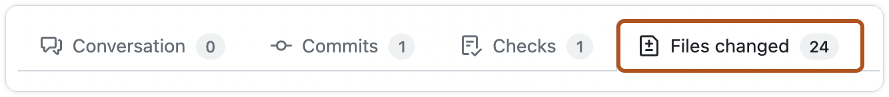
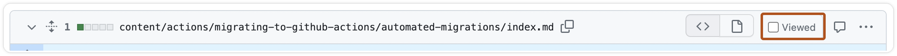
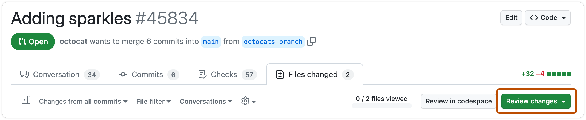
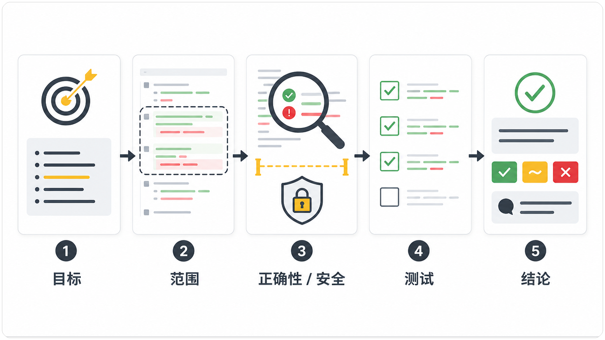
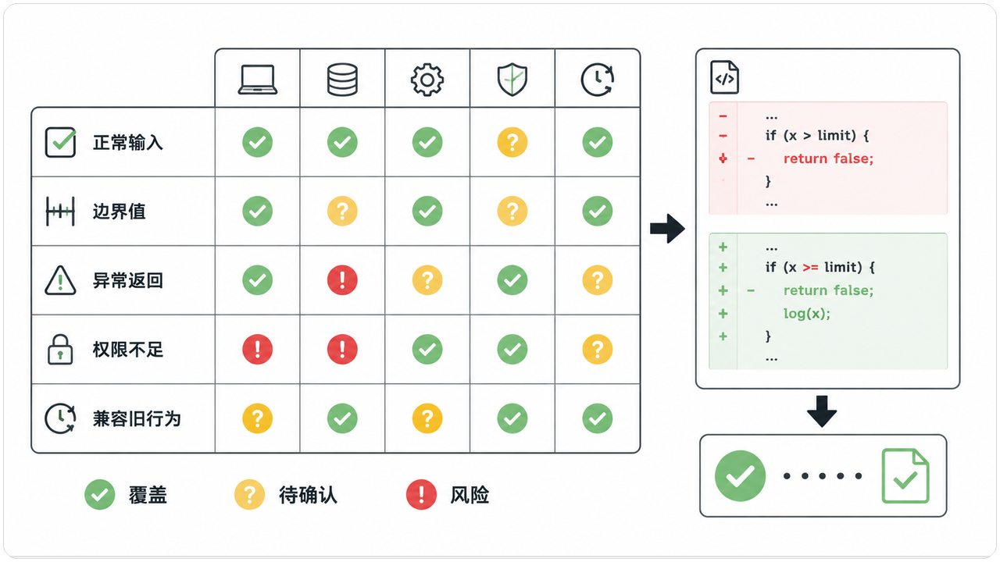

# 如何做一次高质量 Code Review：正确性、安全、测试与可维护性

> 难度：进阶
>
> 类型：实操

## 先理解目标，再看代码

一次 Review 应该从 PR 要解决的问题开始，而不是从某一行代码开始。先打开关联的 Issue、设计说明和测试结果，确认这次改动要解决什么，哪些行为必须保持不变。

GitHub 的 Review 页面会把 Conversation、Commits、Checks 和 Files changed 分开。审查代码时，先进入 `Files changed`，确认这次变更实际涉及哪些文件。



图一  GitHub Pull Request 中的 `Files changed` 标签。

如果你想把目标、差异和测试证据放进同一套检查顺序，可以继续看 [CodexGuide 验证流程](https://codexguide.io/codex/validation?utm_source=wechat&utm_medium=article&utm_campaign=code-review-quality&utm_content=contextual-validation-01)，再回到下面逐项审查。

## 推荐顺序

1. 先看 PR 摘要和关联 Issue，确认目标与范围。
2. 看文件列表和 diff 统计，检查改动是否已经超出任务边界。
3. 按文件检查输入、状态变化、异常路径和权限边界。
4. 对照测试，找出新增行为没有覆盖的分支。
5. 最后看命名、重复代码和维护成本。

这个顺序能把 Review 从“代码看起来顺不顺眼”拉回到“改动是否解决了问题，并且没有引入新的风险”。

逐文件查看时，完成一个文件后可以标记 `Viewed`，这样能保留审查进度，也能减少重复查看。



图二  GitHub Review 中用于标记文件已查看的 `Viewed` 选项。

## 给 Codex 的只读 Review 提示词

```text
请只读审查当前变更，不要修改文件。
只报告由本次改动引入，且可以复现或定位的问题。
按 P0、P1、P2 排序，重点检查正确性、安全、数据损坏、兼容性和测试缺口。
每个问题给出文件、行号、触发条件、影响和建议验证方式。
如果没有高优先级问题，明确写“未发现可确认的高优先级问题”，不要为了凑数量添加风格意见。
```

提交审查结论时，Review 页面会提供 `Approve`、`Request changes` 和 `Comment` 等选项。选择哪一种，应该取决于问题是否阻断合并，而不是评论数量。



图三  GitHub Pull Request 中提交审查结论的 `Review changes` 按钮。

把这五步放在同一条线上，Review 就有了固定的检查路径。先确认改动要解决什么，再判断范围和风险，最后用测试证据支撑结论。



图四  高质量 Code Review 的五步检查顺序。

提示词里的“只读”很重要。Review 和修复是两种不同的工作。先保留审查结果，再决定哪些问题需要处理，能避免新一轮修改把原来的问题覆盖掉。

## 先审正确性，再谈代码风格

正确性检查要回答的不是“这段代码写得像不像规范答案”，而是“它在真实输入下会不会得到正确结果”。可以先沿着主流程走一遍：输入从哪里来，经过哪些转换，状态在哪里改变，最后返回什么。遇到条件分支时，不要只看当前分支里的语句，还要追问另一个分支是否仍然成立。

一个常见问题是边界条件被悄悄改了。例如原来的判断是“大于等于”，修改后变成“大于”；代码表面上只差一个字符，实际可能让刚好达到上限的用户被拒绝。审查这类改动时，应当把旧行为和新行为并排比较，至少列出一个低于边界、一个等于边界、一个超过边界的输入，再确认返回值、错误信息和副作用是否符合预期。

## 安全检查要看边界

安全审查不只是搜索密码、Token 或危险函数。更重要的是确认“谁可以做什么，以及输入经过谁的控制”。对于新增接口或权限判断，可以逐项问：身份是否已经校验，资源是否属于当前用户，角色判断是否发生在数据读取之前，错误响应是否泄露了不该暴露的信息。

输入处理也要结合数据流来看。用户输入是否直接进入查询、命令、文件路径、模板或日志；经过的校验是白名单还是只排除了几个特殊字符；校验后的值是否在后续步骤又被拼接或转换。只在入口处看见一个 `validate`，并不能证明整个链路是安全的。

权限不足、过期会话和跨租户访问应当单独检查。一个接口在管理员账号下通过，不代表普通用户也会得到正确结果；一个页面隐藏了按钮，也不代表后端拒绝了直接请求。Review 评论最好指出具体触发条件和影响，例如“普通成员可以构造请求读取其他项目的记录”，比“这里注意权限”更容易被修复和验证。

## 测试要跟着分支走

测试检查可以按五类输入展开：正常输入验证主要流程，边界值验证条件判断，异常返回验证失败处理，权限不足验证访问控制，兼容旧行为验证已有调用方没有被破坏。图五的矩阵适合用来做最后一轮对照：每新增一个分支，就在对应行留下测试证据；如果某个格子仍然是空白，就把它标成风险，而不是默认当作通过。

测试名称也应该能说明行为。`test_update` 只能告诉你有一个测试失败，`test_rejects_duplicate_request_after_timeout` 则能直接提示它在保护什么。审查测试时，除了看断言是否通过，还要看断言是否足够具体：只断言 HTTP 状态码，可能漏掉响应体中的错误类型；只断言返回数量，可能漏掉返回了不属于当前用户的数据。

不要把“CI 通过”当成完整结论。CI 只能说明已经配置的检查通过，不能证明没有遗漏场景。对于高风险变更，还应确认测试运行的是新代码、数据库迁移已经执行、关键配置与生产环境一致，以及失败时是否有可观察的日志或告警。必要时补一条最小复现命令，让别人能够在本地或隔离环境重跑。

## 评论要能指导修复

高质量评论通常包含四个部分：位置、触发条件、影响和建议验证方式。位置让作者能快速找到代码，触发条件说明问题什么时候出现，影响帮助团队判断优先级，验证方式则把讨论带回可执行的证据。评论不必写成长篇分析，但不能只留下“建议优化”“这里有风险”这样的结论。

例如，与其写“需要处理空值”，不如写：“当 `items` 为空数组时，这里的索引访问会抛出异常，导致批处理任务整批失败。请补充空数组用例，并确认没有待处理项时接口仍返回成功状态。”这条评论既指出了行为，也给出了修复后的验收标准。

如果只是命名、格式或个人偏好，尽量不要和阻断问题混在一起。可以标记为非阻断建议，也可以留到作者整理代码时处理。Review 的价值不在于评论越多越好，而在于让真正影响正确性、安全和交付风险的问题先被看见。

## 人要做的判断

Codex 可以帮助定位差异和缺口，但业务优先级、历史兼容、线上数据，以及团队是否接受某项风险，仍然需要项目负责人判断。

`Approve` 也不等于代码完美。它表示当前证据足以支持合并，剩余风险已经被识别，并且有人愿意承担这个决定。

## 验收清单

- [ ] Review 结论能回到 Issue 的目标。
- [ ] 每条评论都能指出行为和影响。
- [ ] 没有把纯格式建议伪装成阻断问题。
- [ ] 高风险修改有对应测试或人工验证。

Review 做完以后，至少应该能回答四个问题。改了什么，为什么要改，怎样证明它有效，还有哪些情况没有覆盖。回答不出来时，问题通常不在评论数量，而在验证证据还不够。

测试也要跟着变更走。新增了一个分支，就要检查对应的正常输入、边界值、异常返回和权限场景；矩阵里出现空白或风险标记时，Review 结论不能只写“测试通过”。



图五  用测试覆盖矩阵检查新增行为和风险分支。

## 参考资料

- [GitHub Reviewing proposed changes](https://docs.github.com/en/pull-requests/how-tos/review-pull-requests/reviewing-proposed-changes)
- [GitLab Code review guidelines](https://docs.gitlab.com/development/code_review/)

## 继续实践

如果你准备把 Git 协作、代码差异和 Review 规则放进一套日常流程，可以到 [CodexGuide Git 协作与代码审查专题](https://codexguide.io/advanced?utm_source=wechat&utm_medium=article&utm_campaign=code-review-quality&utm_content=closing-website-01) 继续查看相关教程。

如果你在实际 Review 中遇到权限边界、测试缺口或评论难以落地的问题，可以扫码添加微信，带上 PR 目标、变更范围和已经运行的验证结果一起交流。


