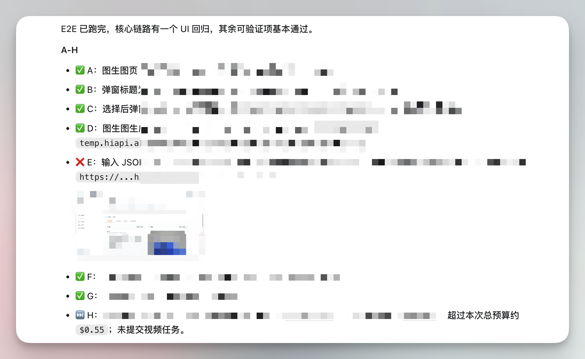
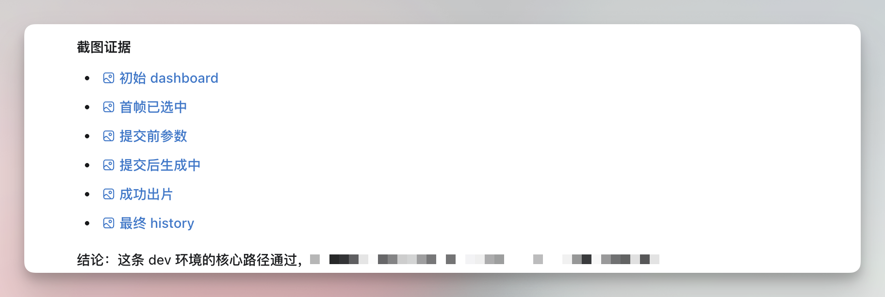

# Codex 做上线前端到端验收

最近不停在上一些小功能，就需要验收。

验收时有几个麻烦点。它涉及登录态、数据、扣费、历史记录等。只看代码或者只跑单元测试都不够，最后一定要有人在真实环境里过一遍完整流程。

可以把测试用例交给 Codex，让它通过浏览器扩展控制已有登录态，直接完成端到端验收。

## 为什么适合交给 Codex 验收

以前做这种验收，麻烦在于点击过程中要不断判断状态。

比如页面上的入口有没有出现，弹窗或表单里的数据能不能正常选择，选择后的状态有没有回填，点击提交以后有没有前端校验错误，异步任务最终有没有结果，余额有没有变化，历史记录有没有新增。

这些事情连在一起就很容易漏。验收过程里还要截图、记录余额、记录错误文案，最好能把每一步结论都留下。

Codex 做这类任务有一个很舒服的点，它可以按测试用例一步一步执行，同时把过程可视化地反馈出来。哪一步通过了，哪一步有问题，它会直接标出来。需要证据时，它也会把截图保存下来。

这张图里能看到，A 到 H 每个断言都有状态。有些通过，有些失败，另一些因为预算或条件跳过。对我来说，这比口头说"我测过了"可靠很多，因为它保留了过程。

## Codex 浏览器登录态的优势

Codex 通过 Chrome 插件接管浏览器。

自动化测试也可以处理登录态，但通常需要维护测试账号、登录脚本和状态文件。在研发阶段的人工终验里，我更需要直接使用当前浏览器里已经登录好的账号，让 Codex 接管现有页面继续操作。

这对很多真实产品场景很方便。比如后台权限已经配置好，账号已经在某个分组里，或者页面状态和环境刚刚调好。让 Codex 直接接管这个浏览器，会比重新写一套登录和准备脚本省很多时间。

Codex 适合上线前后的人肉终验、一次性排查、扣费路径和复杂后台状态验证；稳定、可重复的批量回归仍应由项目现有的自动化测试负责。

## 测试用例越具体，Codex 执行越稳

这次让我感受最明显的一点是，测试用例要写得足够具体。

不要只写"测试这个功能是否可用"，这句话太宽了。更好的写法是把每一步拆清楚，写明打开哪个 URL、点击哪个入口、选择什么测试数据、表单里填什么，以及失败时要记录哪些信息。

当流程写清楚以后，Codex 执行起来就很像一个耐心的验收同事。它不会只看页面有没有报错，而是会按断言逐项收集证据。

在一次带扣费的异步任务验收里，它会先记录初始余额，按测试用例选择素材和参数，确认页面预估费用，提交后检查有没有前端校验错误，再等待任务结果。任务完成后，它还会回到 dashboard 和 history 页确认扣费与产物记录。

最后的报告里，它不仅说"通过了"，还列出了每张截图证据，包括初始状态、关键输入、提交前参数、生成过程、成功结果和最终历史记录。以后有人要追查这个功能是否真的验过，直接看这些证据就行。

## 这类验收应该怎么分工

Codex 更适合放在验收阶段。尤其是需要真实浏览器、真实登录态、真实环境和真实产物时，它可以操作页面，并记录每一步。

中间最重要的交接物是一份清楚的测试用例。里面最好包含测试环境、账号或登录方式、初始状态、每一步操作和断言，以及预算、失败证据和禁止动作。

## 一个可复用的小结论

Codex 可以放在研发流程的不同位置，写代码和验收功能是两类任务。

实现功能是一件事，验证功能又是另一件事。

这次的体验让我觉得，端到端验收很适合交给能控制浏览器、保留上下文并截图取证的 Codex。前提是测试用例要写清楚，尤其是涉及登录态、扣费、权限、历史数据和异步任务的路径。

这套分工适合需要真实登录态和真实产物的验收任务。
