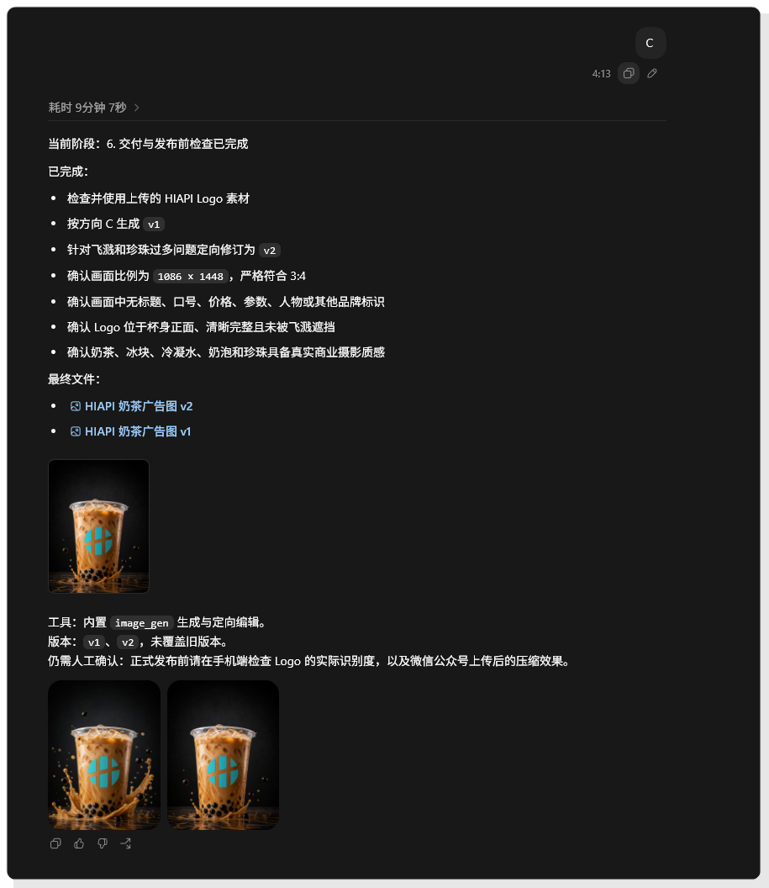
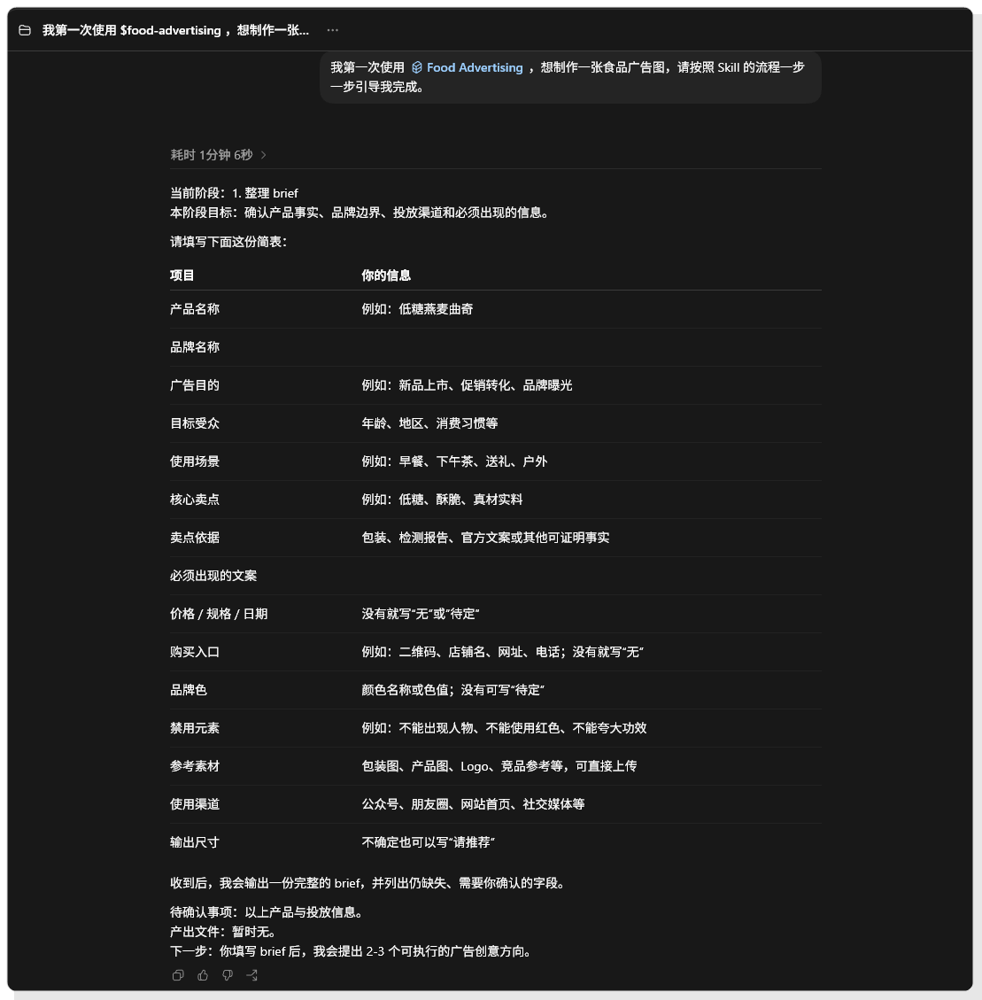
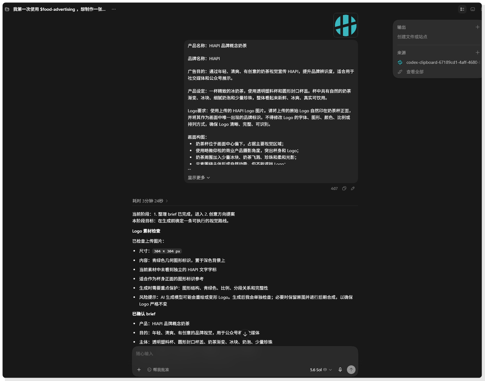
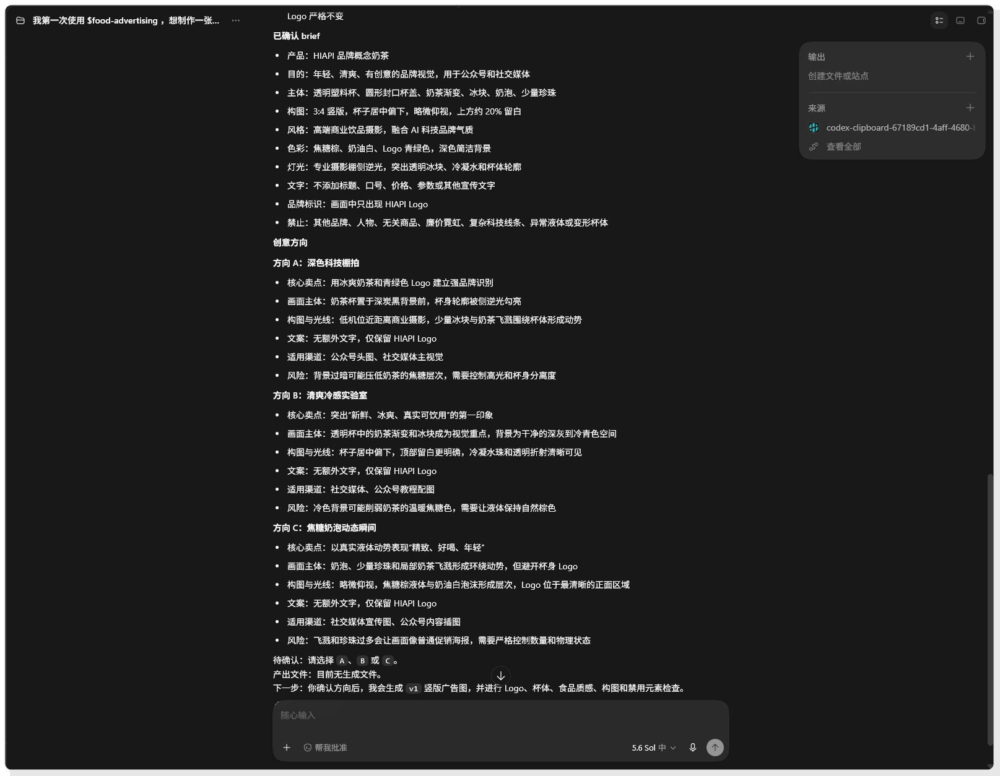
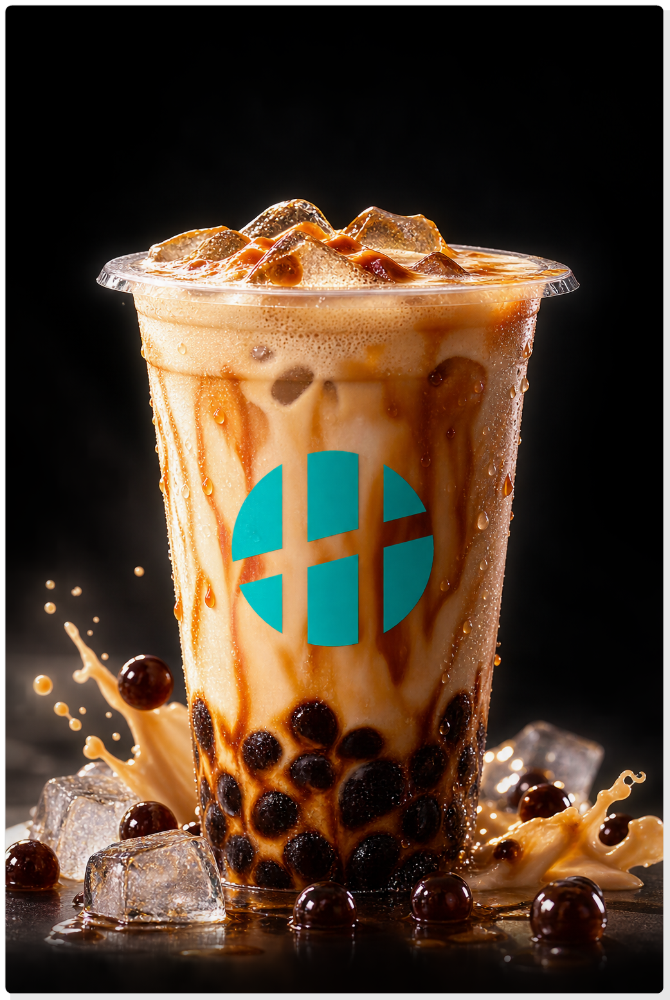

# 用一个 Skill 做出可发布的食物广告

这次实战从一杯还没有名字的概念奶茶开始。我想先把广告图做出来，再回头看这件事能不能整理成一套下次还用得上的 Skill。

下面写到的产品信息、画面要求和版本记录，都来自这次对话。广告文章最怕把猜出来的内容写得像真的，所以不确定的信息就不替品牌做决定。

## 先看结果

目前拿到的是一张 3 比 4 竖版奶茶广告图。透明杯、圆形封口盖、冰块和少量珍珠都在，背景压得比较暗，杯子放在中间偏下的位置，HIAPI Logo 也还认得出来。

*图一｜HIAPI 奶茶广告生成结果*

这张图由 image_gen 生成，先做 v1，再按检查结果改到 v2。v2 是 1086 × 1448，比例为 3 比 4。最后还要在实际阅读页面看一遍，确认平台压缩后 Logo 不糊，杯口和边缘也没有被裁掉。

## 先把一句话说清楚

我没有一上来就说“帮我做一张好看的奶茶广告”。先让 food-advertising Skill 把 brief 问清楚，这一步有点慢，却省掉了后面反复猜的时间。

*图二｜用 Skill 先整理广告 brief*

看起来像填表，其实是在拦住广告里最容易出错的地方。产品名、品牌名、投放渠道、卖点依据、必须出现的文案和禁止元素要分开写。价格、规格、日期还没确认，就先写成待定，别让模型替人做决定。

这次 brief 后来补成了下面这些内容。

| 项目 | 已确认内容 |
| --- | --- |
| 产品 | HIAPI 品牌概念奶茶 |
| 广告目的 | 做一张年轻、清爽、有创意的品牌视觉，用于内容平台和社交媒体 |
| 画面主体 | 透明塑料杯、圆形封口杯盖、奶茶渐变、冰块、奶泡、少量珍珠 |
| 构图 | 3 比 4 竖版，杯子居中偏下，略微俯视，上方留出约 20% 空间 |
| 风格 | 高端商业饮品摄影，带一点 AI 科技品牌气质 |
| 色彩 | 焦糖棕、奶油白、青绿色 Logo、深色简洁背景 |
| 文字 | 不添加标题、口号、价格、参数或其他宣传文字 |
| 禁止事项 | 不出现其他品牌、人物、无关商品、廉价塑料感和复杂科技线条 |

我后来一直盯着 Logo 看。图里的字少，杯子和 Logo 就得自己撑住画面。模型可以把杯子做得很像，Logo 却可能在下一张图里变形，所以它必须单独验。

## 第二步，把判断写进 Skill

一条提示词能做出一张图，换个产品就未必了。所以我把这次用到的流程、参考模板和检查清单整理进 food-advertising Skill，方便下次从同一个起点开始。它的顺序很简单，先读 brief 和品牌素材，提炼主卖点，再确定主体、构图、光线、色彩和文字层级，最后按发布渠道检查，把需要人工确认的地方记下来。

## 第三步，先让模型提出方向

brief 确认后，Skill 给了三个方向。截图里每个方向都写了卖点、主体、光线、适用渠道和风险。这样看起来比较费字，却比“科技感”“清爽感”这种风格标签好选得多。

*图三｜Skill 提出的三个广告创意方向*

三个方向分别偏向深色科技棚拍、清爽冷感实验室和焦糖奶泡动态瞬间。最后我选了方向 C。飞溅和珍珠能让静态图有一点动作，放在文章首图里也不至于太安静。

这个方向也有麻烦。飞溅和珍珠一多，画面很快就像海报特效，奶茶反倒退到后面。提示里得写清数量和状态，只说“更有冲击力”基本等于没说。

*图四｜方向 C 的 brief 和画面约束*

截图里的约束后来都放进了生成提示。杯子要在清晰的正面区域，Logo 不能被奶泡和飞溅挡住，背景留暗，画面不放标题、价格和参数。比起“高级一点”“更有质感”，这种话更能让结果往正确的方向走。

## 一次生成六张候选

方向确定以后，才开始生成。HIAPI 调用三个模型，每个模型出两张，一共六张。画布统一用 3 比 4 竖版，原始 HIAPI Logo 作为参考图上传。

*图五｜HIAPI 调用多个模型生成候选图*

六张图放在一起，差异就很明显了。GPT Image 2 的奶茶质感、冰块和冷凝水比较自然，v2 的飞溅和珍珠却多了些。Seedream 5.0 Pro 的 Logo 几何形状保持得更好，v2 的构图也更干净。Nano Banana 2 两版的 Logo 都错了，还带出额外文字和错误颜色，我不会拿它们直接发。

*图六｜多个模型的候选图和自检结论*

自检最后推荐 Seedream 5.0 Pro v2。判断时看的是 Logo、构图、奶茶质感和禁用元素，单看哪张图最漂亮不够。后面还得人工看一遍，尤其是 Logo 是否原样、珍珠有没有过量、飞溅有没有挡住杯身。

这次还做了一轮模型接力。Nano Banana 2 的原始图片背景和杯子状态不错，Logo 却出了问题。于是我拿 Seedream 5.0 Pro v2 里正确的 Logo 当参考，让 Nano Banana 2 只修 Logo 和错误文字，保留原来的背景、光线和构图。

*图七｜Nano Banana 2 修复 Logo 后的版本*

修复后的两张图都是 1086 × 1448，错误图形、错误颜色和多出来的文字已经去掉，杯身只留下青绿色分段 Logo。

这也正是我觉得 HIAPI 好用的地方。用 HIAPI 可以对比多个模型，如果某个模型的背景不错但是有瑕疵，可以用另一个模型弥补。一个模型把背景做得好，另一个模型把 Logo 修得准，合起来往往比强求一个模型一次完成更省事。前提是每次只改明确的问题，别让修图模型顺手把整张图也换掉。

*图八｜HIAPI 奶茶广告成品图*

## 第四步，从 v1 改到 v2

候选图先过一轮自检，再进入 v1 到 v2 的修改。问题还是飞溅和珍珠。它们一多，杯身上的 Logo 就容易被挡，视线也会从奶茶滑到四周的装饰上。

第二版只动必要的地方。飞溅和珍珠减下来，杯子、冰块、奶泡、渐变色和青绿色 Logo 保留，再看一遍 3 比 4 画布里的主体位置。

*图九｜方向 C 的生成与交付检查记录*

我最后按这几项检查。

- 使用了上传的 HIAPI Logo 素材
- 画布为 1086 × 1448，比例为 3 比 4
- 画面没有标题、口号、价格、参数、人物或其他品牌标识
- Logo 位于杯身正面，主体细节没有被飞溅遮挡
- 奶茶、冰块、冷凝水和珍珠保留了商业摄影质感

这次 Skill 更像一张检查单。选哪张图，Logo 能不能发，最后还是我自己看。这样挺好，至少不会只凭第一眼的感觉交稿。

## 这次实战留下的经验

我现在更愿意把 Skill 理解成一张工作单。它提醒我先问什么、比较什么、哪一步要停下来人工看。下次换成别的食物，至少不用从一句“做得好看点”重新开始。

模型负责把画面方向摊开，产品事实和品牌边界还是得由人确认。图片生成完也不等于可以发布，手机端的 Logo、渠道裁切和最后那点细节，都要有人亲自看。
