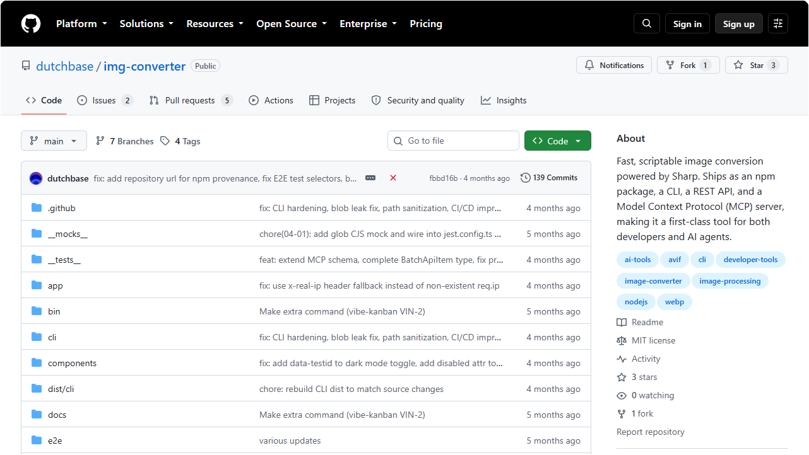
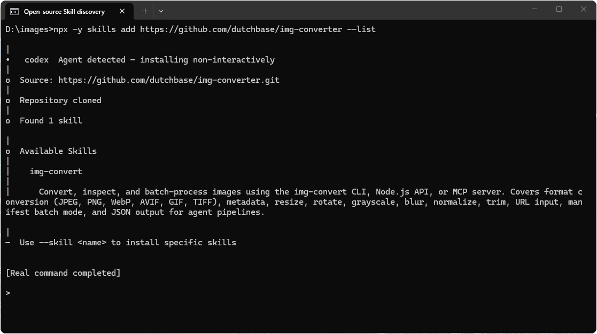
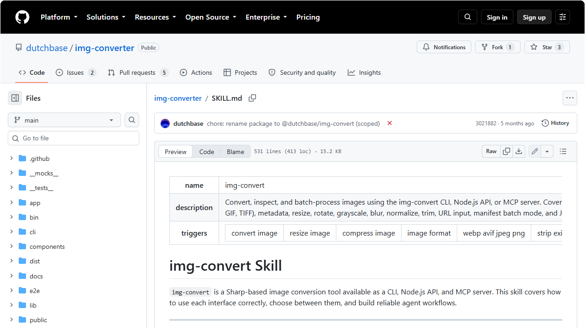
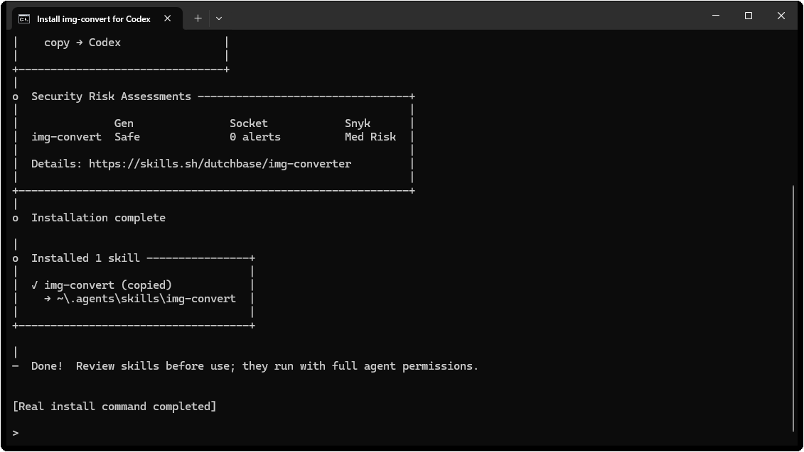
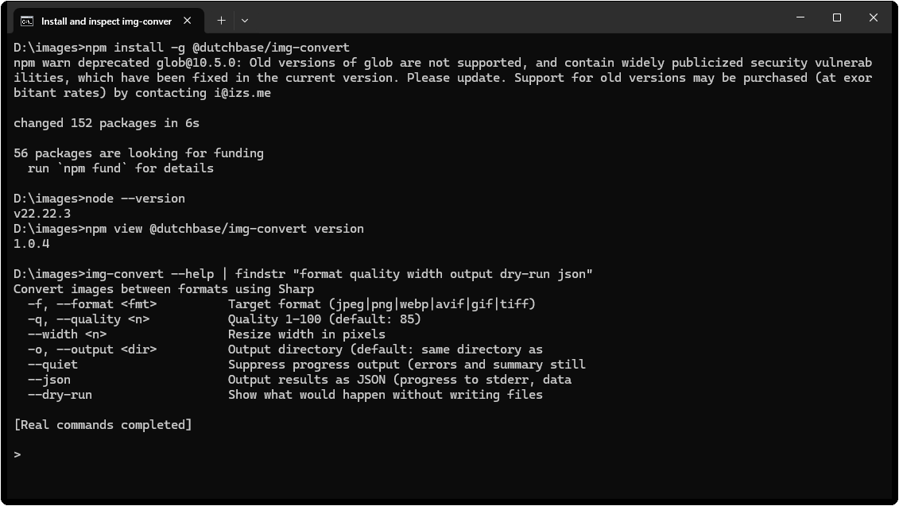
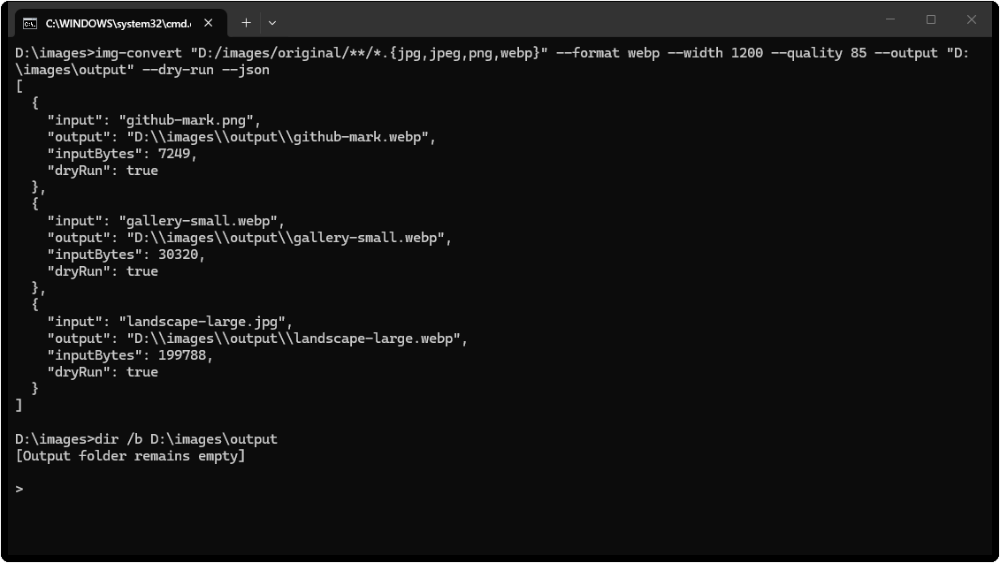
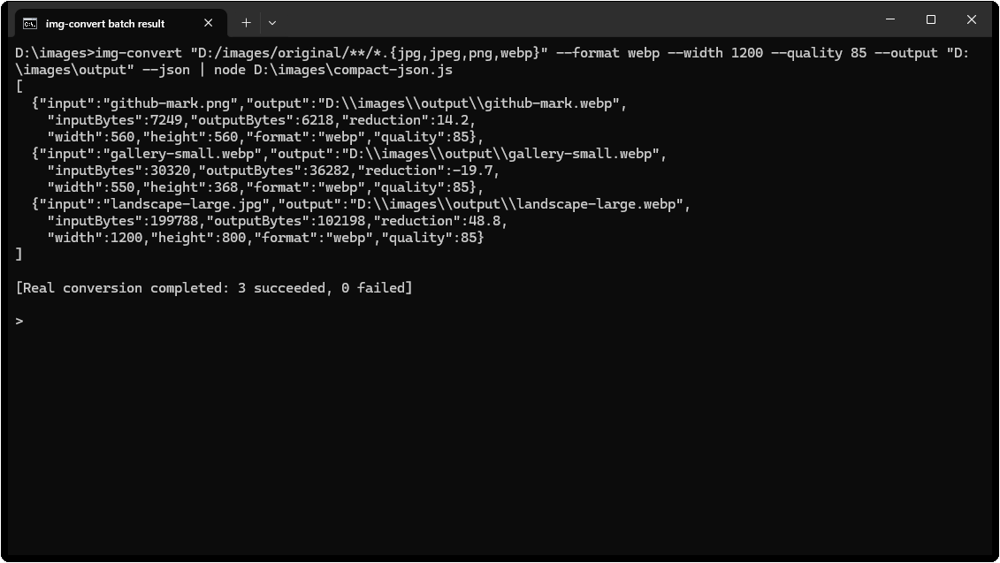

# 用 Codex 批量压缩图片并转换为 WebP

文章配图经常需要限制宽度、转换格式和控制文件大小。`img-convert` Skill 可以让 Codex 按固定规则检查图片，再调用命令行工具批量处理。

本文使用 [dutchbase/img-converter](https://github.com/dutchbase/img-converter) 提供的 `img-convert` Skill，把指定目录中的图片限制在 1200px 宽，转换成质量 85 的 WebP，并写入独立输出目录。

> 本次实测环境为 Windows 11 24H2、Node.js 22.22.3 和 img-convert 1.0.4，测试完成于 2026-08-17。

## 查看 Skill 的能力和来源

`img-convert` 基于 Sharp，仓库使用 MIT 许可证。项目提供命令行工具、Node.js API、MCP 服务和 `SKILL.md`。本文使用 Codex Skill 配合 CLI 完成批量处理。

它支持读取 JPEG、PNG、WebP、AVIF、GIF 和 TIFF，也能调整尺寸、压缩质量、旋转、裁边和读取图片信息。批量任务可以传入 glob 路径，也可以使用 JSON 清单。



> 图片来源：[dutchbase/img-converter](https://github.com/dutchbase/img-converter)。

安装前先读取仓库，确认其中包含 `img-convert` Skill。

```powershell
npx -y skills add https://github.com/dutchbase/img-converter --list
```

命令应显示名为 `img-convert` 的 Skill。仓库中的 [SKILL.md](https://github.com/dutchbase/img-converter/blob/main/SKILL.md) 是实际执行说明。



> 图片来源：CodexGuide 实测。



> 图片来源：[dutchbase/img-converter SKILL.md](https://github.com/dutchbase/img-converter/blob/main/SKILL.md)。

## 安装 Skill 和命令行工具

先把 Skill 安装到 Codex 的全局技能目录。

```powershell
npx -y skills add https://github.com/dutchbase/img-converter `
  --skill img-convert `
  --agent codex `
  --global `
  --yes
```

Skill 负责告诉 Codex 怎样使用工具，不会自动安装 `img-convert` 命令。还要安装仓库发布的 npm 包。

```powershell
npm install -g @dutchbase/img-convert
```

本次安装成功，npm 同时提示依赖的 `glob@10.5.0` 已弃用。这个警告没有阻止本文测试。生产目录或自动化流水线使用前，应重新检查包版本、依赖审计结果和仓库更新情况。第一次运行时，先用可恢复的图片副本测试。

工具要求 Node.js 18 或更高版本。安装完成后检查命令是否可用。

```powershell
node --version
img-convert --help
img-convert info --help
img-convert batch --help
```



> 图片来源：CodexGuide 实测。



> 图片来源：CodexGuide 实测。

## 说明处理规则

本次实测使用下面这组参数。

| 项目 | 设置 |
|---|---|
| 输入 | 指定目录中的 JPG、JPEG、PNG 和 WebP |
| 输出目录 | 新建 `output` 目录 |
| 最大宽度 | 1200px |
| 输出格式 | WebP |
| 图片质量 | 85 |
| 原文件 | 保留，不覆盖、不删除 |

`img-convert` 默认保持宽高比，也不会放大小图。宽度超过 1200px 的图片会等比缩小，小于 1200px 的图片保持原尺寸。

输出目录应与原图目录分开。命令参数即使写错，原文件仍能保留。

## 先用 dry-run 预演

假设原图位于 `D:\images\original`，先运行 `--dry-run` 查看将要处理的文件。

```powershell
img-convert "D:/images/original/**/*.{jpg,jpeg,png,webp}" `
  --format webp `
  --width 1200 `
  --quality 85 `
  --output "D:\images\output" `
  --dry-run `
  --json
```

glob 路径放在引号中，让 `img-convert` 展开文件列表。Windows 下的 glob 使用正斜杠 `/`。反斜杠可能被当成转义符，导致工具找不到图片。

预演完成后检查文件数量和输出目录，也要确认不同格式的同名文件不会写成同一个 `.webp`。



> 图片来源：CodexGuide 实测。

## 确认后执行批量转换

预演结果正确后，去掉 `--dry-run`。

```powershell
img-convert "D:/images/original/**/*.{jpg,jpeg,png,webp}" `
  --format webp `
  --width 1200 `
  --quality 85 `
  --output "D:\images\output" `
  --json
```

`--json` 返回每张图片的输入大小、输出大小、压缩比例、尺寸和保存路径。截图中的 `compact-json.js` 只调整真实 JSON 的换行，字段和值没有改动。三张图片全部转换成功，失败数为 0。



> 图片来源：CodexGuide 实测。

不同图片需要不同尺寸或格式时，可以让 Codex 先生成 JSON 清单，再运行批处理。

```powershell
img-convert batch jobs.json --json
```

统一转换使用 glob 即可，不必先做清单。

## 让 Codex 调用 Skill

安装后重启 Codex，再提交下面的任务。

```text
使用 img-convert Skill，先检查 D:\images\original 中会被处理的 JPG、JPEG、PNG 和 WebP 图片。
把宽度限制为 1200px，保持比例，不放大小图，统一转成质量 85 的 WebP，输出到 D:\images\output。
保留所有原文件。先 dry-run 并汇报文件数量和命名冲突，确认没有问题后再执行，最后给出处理成功数、失败数和总压缩比例。
```

这段任务要求 Codex 先检查和预演，再执行并汇报结果。Skill 也会提醒 Codex 读取陌生图片的信息，留意透明通道和动画图片。

## 核对三张公开测试图片

测试集包含一张 1800×1200 JPG、一张 560×560 PNG 和一张 550×368 WebP。大图等比缩到 1200×800，两张小图保持原尺寸，说明 `--width 1200` 没有放大小图。

统一转换为 WebP 后，每张图片的体积变化不同。JPG 减少 48.8%，PNG 减少 14.2%，原本已经压缩过的 WebP 重新编码后增加 19.7%。批量任务结束后要检查负压缩率，不能只看成功数量。

| 项目 | 处理前 | 处理后 |
|---|---|---|
| 图片数量 | 3 | 3 |
| 总文件大小 | 237,357 字节 | 144,698 字节 |
| 最大宽度 | 1800px | 1200px |
| 文件格式 | JPG、PNG、WebP | WebP |
| 失败数量 | - | 0 |

总大小减少 92,659 字节，整体压缩率约 39.0%。原图目录没有被覆盖，三个 WebP 都写入独立的 `output` 目录。


> 图片来源：CodexGuide 实测。

## 完成后检查

- 原图数量、名称和内容没有变化。
- 输出图片都位于独立目录。
- 横图和竖图保持原始比例，小图没有被放大。
- 透明区域正常，动画图片没有意外丢帧。
- 同名输入不会覆盖同一个 WebP 文件。
- 失败文件和原因已经单独列出。

## 参考资料

- [dutchbase/img-converter](https://github.com/dutchbase/img-converter)
- [img-convert SKILL.md](https://github.com/dutchbase/img-converter/blob/main/SKILL.md)
- [@dutchbase/img-convert](https://www.npmjs.com/package/@dutchbase/img-convert)
- [MIT License](https://github.com/dutchbase/img-converter/blob/main/LICENSE)
