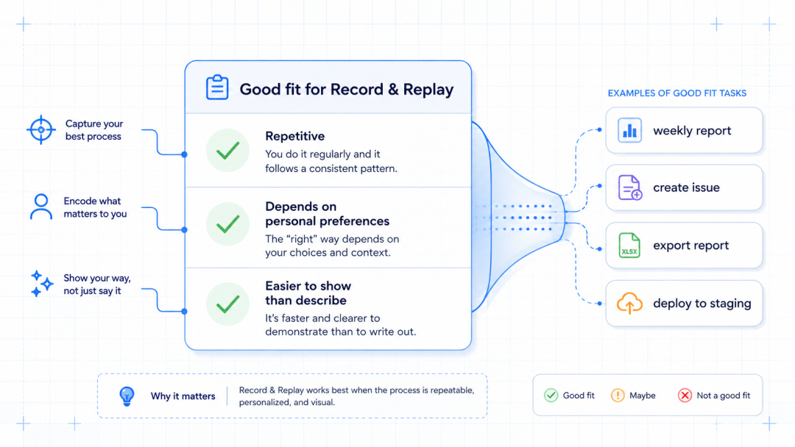
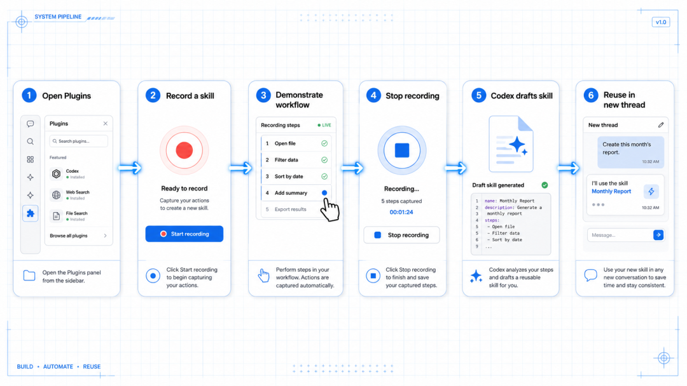
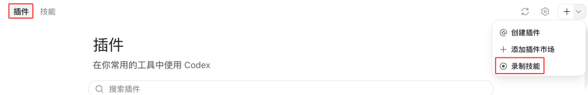
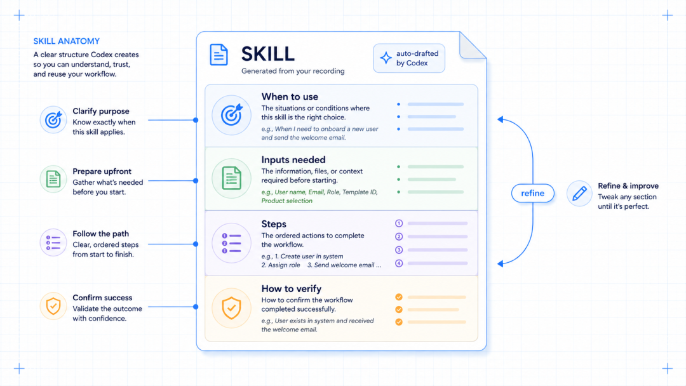
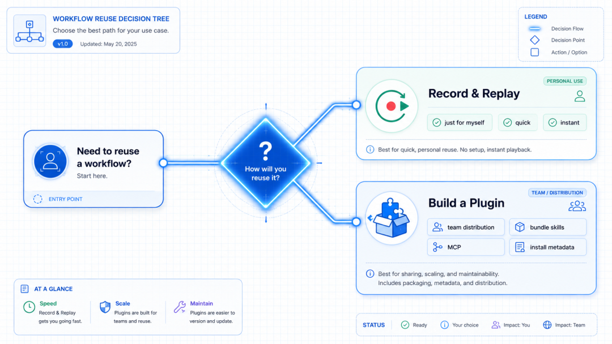

# Codex 用 Record & Replay 生成可复用 Skill

> 难度：进阶
>
> 类型：Skill 创建与复用

## 这篇文章适合谁

如果你有一套重复做、步骤稳定、但很难完整写成说明的桌面流程，可以用 Record & Replay 让 Codex 观察一次操作，再生成一个可复用的 Skill。

它适合周报、创建规范化 Issue、导出固定报表和发布测试环境等工作。录制前要先准备好脱敏数据，别在录制过程中输入密码、Token 或客户信息。

## 使用前的条件

Record & Replay 当前只在 macOS 提供，初期不对欧洲经济区、英国和瑞士开放。Computer Use 也必须可用并已启用；组织用 `requirements.toml` 关闭 `computer_use` 时，这两个入口都会消失。

它面向个人快速复用。需要团队分发、捆绑多个 Skill、接入 MCP 或管理安装元数据时，应当把流程整理成独立 Plugin。

## 录制一次工作流

在 Codex App 中打开 Plugins，找到 Record & Replay，按提示开始录制。Codex 会先给出一段建议提示词，你可以补充这次任务的目标、每次会变化的输入和成功标准。

开始录制后，把流程完整做一遍。步骤要短而完整，完成后立刻从菜单栏或悬浮窗停止录制，也可以告诉 Codex 已经做完。录制会持续到你停止，顺手做的无关动作也可能进入它的观察范围。

## 检查 Codex 生成的 Skill

停止后，Codex 会根据记录起草 Skill。一个能复用的 Skill 至少要写清四件事：什么时候使用，需要哪些输入，按什么步骤操作，怎样验证结果。

录制本身看不出你的隐含偏好，例如字段默认值、命名规则和某个判断点。打开草稿后，把这些内容补进去，再检查它是否把一次性的内容误写成固定步骤。

## 在新任务中复用

开一个新会话，让 Codex 使用刚生成的 Skill，并把本次变化的值说清楚，例如上传的文件、Issue 标题或报表日期。Codex 会把 Skill 当作上下文，结合当前可用的 Computer Use、浏览器操作和插件完成任务。

## 什么时候改成 Plugin

Record & Replay 适合个人快速得到一个可用草稿。需要多人安装、版本管理、多个 Skill 协同或打包 MCP 服务时，应该按 Plugin 的结构重新整理。两者可以衔接，前者用于探索流程，后者用于长期维护。

## 参考资料

- [Record & Replay](https://developers.openai.com/codex/record-and-replay)
- [Agent Skills](https://developers.openai.com/codex/skills)
- [Build plugins](https://developers.openai.com/codex/build-plugins)
